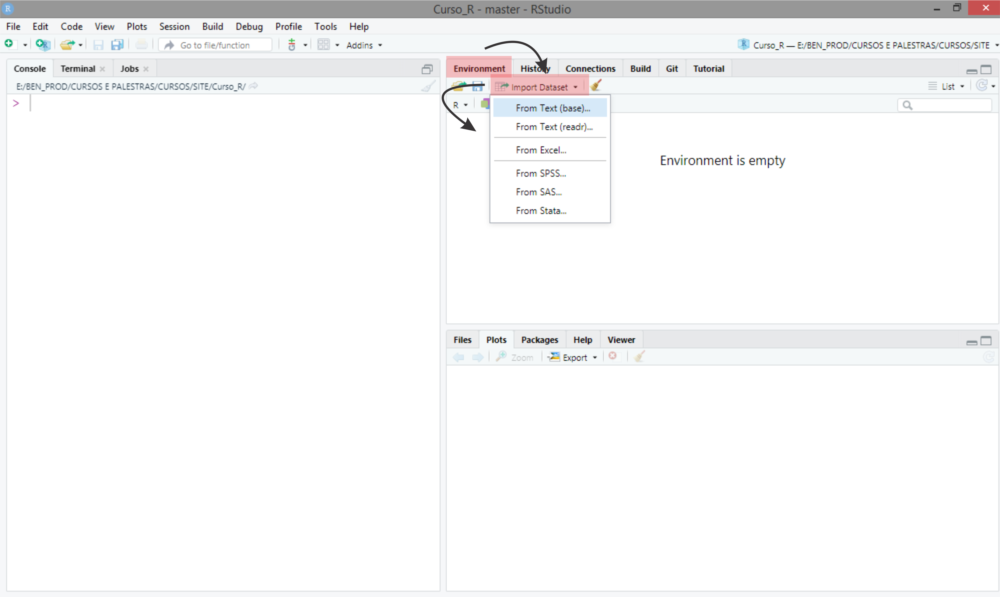

# <i class="fas fa-database"></i> Importando dados {#impexpdata}

<!-- Depois inserir a exportacao de dados -->

<iframe width="560" height="315" src="https://www.youtube.com/embed/HQN9-yfu3sQ" frameborder="0" allow="accelerometer; autoplay; clipboard-write; encrypted-media; gyroscope; picture-in-picture" allowfullscreen></iframe>

A importação/exportação de dados era algo que em poucas linhas conseguíamos explicar sobre o ambiente `R`, no sentido de análise de dados. Entretanto, observando o terceiro princípio do R, afirmado por @chambers2016:

<blockquote>
<p>
- **Princípio da Interface**: Interfaces para outros programas são parte do `R`
</p>
</blockquote>

Hoje é uma realidade a interação que o ambiente `R` tem com outras interfaces (programas, linguagens, etc.). A facilidade em utilizar outras linguagens dentro do ambiente `R` torna assim mais complexo a importação/exportação de dados, uma vez que o objetivo do `R`, apesar do *R Core Team* ainda limitar a sua definição como o ambiente para a computação estatística, a ferramenta se tornou tão versátil, que hoje torna humilde essa definição. Para mais detalhes acesse o manual [R Data Import/Export](https://cran.r-project.org/doc/manuals/r-release/R-data.html). Um outro fator e tema atual é a era dos grandes bancos de dados (*Big Data*), do qual se tem um grande conjunto de variáveis e necessitamos fazer a importação por APIs, por exemplo, ou outras vias. Temas como esses, abordaremos no módulo [Programação em R (Nível Avançado)](navancado.html){target="_blank"}.

Nesse momento, limitaremos esse assunto ao objetivo de termos um conjunto de dados em arquivos de texto (extensões do tipo *.txt*, *.csv*, *xls*), formato binário (*.xls* ou *.xlsx*) ou digitados manualmente pelo teclado do computador. Assim, a primeira forma de como os dados estão dispostos, precisaremos importá-los e armazená-los em um quadro de dados (*data frame*), para que esteja disponível na área de trabalho (ambiente global) do `R`, e dessa forma, possamos utilizá-lo. Ao final do tratamento dos dados, podemos exportar essas informações para arquivos externos, e daí também, usaremos os arquivos de textos e o formato binário (*.xls*), mensionados anteriormente.

## Preparação dos dados

A primeira coisa que devemos entender quando desejamos construir o arquivo de dados, é entender que sempre organizaremos as variáveis em colunas, com os seus valores em linhas, Figura \@ref(fig:bdados). Sempre a primeira linha das colunas representarar o nome das variáveis. Esse é outro ponto importante, pois devemos ter a noção que alguma linguagem irá ler esse banco de dados. Assim, quanto mais caracteres diferentes do padrão ASCII, mais difícil será a leitura desses dados. Assim, sugerimos alguns padrões:

- Evitem símbolos fora do padrão alfanumérico;
- Evitem mistura de letras minúsculas com letras maiúsculas. Isso facilitará o acesso a essas variáveis. Contudo, lembre-se do padrão de nomes sintéticos permissíveis do [R](http://bendeivide.github.io/cursor/);
- Lembre-se que o banco de dados será utilizado para que um programa faça a sua leitura, portanto, deixe a formatação da apresentação dos dados para arquivos específico. Sendo assim, evitem comentários nesses arquivos, ou qualquer outro tipo de informação que não seja o banco de dados;
- Evitem palavras longas, por exemplo, `segundavariavel` (má escolha), `segvar` (boa escolha), `seg_var` (boa escolha);
- Evitem palavras compostas com espaço entre elas. Para isso use o símbolo `_`, por exemplo, `var 2` (má escolha), `var2` (boa escolha), `var_2` (boa escolha);

```{r bdados, fig.cap = "Modelo estrutural de um banco de dados.", fig.height= 9, fig.width=16, fig.align='center'}
knitr::include_graphics("images/banco_dados.png")
```

## Importando dados

A função primária responável pela importação de dados é a função `scan()`. Por exemplo, funções como `read.table()`, `read.csv()` e `read.delim()`, usam a função `scan()` em seu algoritmo.

A primeira ideia sobre importação de dados pode ser inserindo-os pelo teclado no próprio ambiente [R](http://r-project.org/). Para isso, usaremos a função `scan()`. Vejamos,

```{r echo=TRUE, prompt=TRUE}
# Criando e inserido os elementos do objeto dados
x <- scan()
```

Após executado essa linha de comando, aparecerá no console `1:` que significa, digitar o primeiro valor do objeto `x`, e depois clicar em *ENTER*. Depois `2:`, que significa digitar o segundo valor, e clicar em *ENTER*. Depois de inserido todos os valores necessários, aperte a tecla *ENTER* duas vezes no console, para sair da função `scan()`.

O mais tradicional é usar programa para criação de banco de dados e deixá-lo pronto para o `R` lê-lo. O tipo de arquivo de texto que melhor controla a separação de variáveis é com a extensão *.csv*, uma vez que separamos as variáveis por ";", é o padrão. O arquivo de texto com extensão *.txt*, geralmente usa espaços. Isso acaba gerando problema de leitura no [R](http://r-project.org/), porque muitos usuários usam nomes de variáveis muito grandes, palavras compostas, de forma a desalinhar as colunas das variáveis. Daí, como a separação das variáveis é por meio de espaços, acaba gerando problema de leitura. Uma outra forma, é fazer importação de dados gerados pelo próprio [R](http://r-project.org/), extensão *.RData*.

Temos a opção de usar um editor de banco de dados para essas extensões por meio de programas como MS Excel, Libre Office, dentre outros. Estes exportam arquivos binários  do tipo *.xls*, *.xlsx*, dentre outros. Uma sugestão para diminuir complicações, é exportar os bancos de dados para arquivos de texto sitados acima, que também é possível ser exportado por esses programas. Isso evita a necessidade de ser instalado mais pacotes e dor de cabeça. Porém, para quem ainda deseja enfrentar, sugerimos a leitura do pacote [readr](https://readr.tidyverse.org/){target="_blank"}, como exemplo, porém existem diversos outros pacotes para este mesmo fim.

Uma vez que o banco de dados está pronto, a leitura destes pode ser feita por alguns caminhos. Mostraremos o mais trivial que é o botão *Import Dataset*, terceiro quadrante, aba *Environment*, na IDE do [RStudio](http://rstudio.org/){target="_blank"}. Veja na Figura \@ref(fig:impexpdados).

```{r impexpdados, fig.cap = "Usando o RStudio para importar dados.", fig.height= 9, fig.width=16, fig.align='center'}

```

Posteriormente, indique o arquivo para leitura. Aparece algumas opções de tipo de arquivo. Em nosso caso, usaremos a opção *From Text (base)*, que significa realizar a leitura para os tipos de arquivo *.txt* ou *.csv*. Daí os passos seguintes são:

1. Escolher o arquivo para leitura dos dados;

```{r impexpdados2, fig.cap = "Usando o RStudio para importar dados.", fig.height= 9, fig.width=16, fig.align='center'}
knitr::include_graphics("images/imp-exp2.png")
```

2. Configurar a leitura do banco de dados. Uma prévia pode ser vista no quadro *Data Frame*. Se for visualizado, algum problema, isso significa que deve ser informado opções adicionais como separador de variáveis (*Separator*), símbolo para casas decimais (*Decimal*), dentre outras opções. Por fim, digitar o nome associado ao objeto (*Name*) que será criado do tipo quadro de dados (*data frame*), e clicar no botão *Import*;

```{r impexpdados3, fig.cap = "Usando o RStudio para importar dados.", fig.height= 9, fig.width=16, fig.align='center'}
knitr::include_graphics("images/imp-exp3.png")
```

3. Uma vez inserido, o RStudio apresenta a linha de comando utilizada para importar os dados no console (2º quadrante), o conjunto de dados (1º quadrante), e a ligação entre o nome e o objeto no ambiente global (3º quadrante).

```{r impexpdados4, fig.cap = "Usando o RStudio para importar dados.", fig.height= 9, fig.width=16, fig.align='center'}
knitr::include_graphics("images/imp-exp4.png")
```

A outra forma é utilizar linhas de comando. Para isso utilizaremos a função `read.table()`. Antes de importarmos o banco de dados, algo interessante é inserir o arquivo de dados no diretório de trabalho no ambiente `r rlink`. Para verificar o ambiente de trabalho use a função `getwd()`. Para alterar o local do ambiente de trabalho use `setwd()`. Se esse procedimento não for realizado, o usuário deve informar na função `read.table()`, o local exato do arquivo de texto.

Vamos usar como diretório o local `C:\cursor`. Lembre-se que no `r rlink`, **a barra deve ser invertida**. Vamos inserir nesse diretório três arquivos *alfafa.txt*, *datast1980.txt* e *producao.csv*.

Os três conjuntos de dados são:

- *alfafa.txt*

```{r echo=FALSE, prompt=TRUE}
knitr::kable(read.table("E:/BEN_PROD/CURSOS_PALESTRAS/CURSOS/SITE/Curso_R/dados/alfafa.txt", header = T), align = 'c')
```

- *datast1980.txt*

```{r echo=FALSE, prompt=TRUE}
knitr::kable(read.table("E:/BEN_PROD/CURSOS_PALESTRAS/CURSOS/SITE/Curso_R/dados/datast1980.txt", header = T, dec = ","), align = 'c')
```

- *producao.csv*

```{r echo=FALSE, prompt=TRUE}
knitr::kable(read.table("E:/BEN_PROD/CURSOS_PALESTRAS/CURSOS/SITE/Curso_R/dados/producao.csv", header = T, sep = ";"), align = 'c')
```

Vejamos as linhas de comando para importar os dados.

```{r include=FALSE}

```


```{r echo = TRUE, eval=FALSE, prompt=TRUE}
# Diretorio
getwd()

# Mudadando para o diretorio de interesse
setwd("C:/cursor")

# Verificando os arquivos no diretorio de trabalho
list.files()

# Importando os dados apontando para o diretorio do arquivo
dados1 <- read.table(file = "C:/cursor/alfafa.txt", header = TRUE)

# Considerando que o arquivo esta no diretorio de
# trabalho, isto eh, getwd()
dados2 <- read.table("alfafa.txt", header = TRUE)

# Importando os dados com decimais com ',' apontando para o diretorio do arquivo
dados3 <- read.table(file = "C:/cursor/dadost1980.txt", header = TRUE, dec = ",")

# Considerando que o arquivo esta no diretorio de
# trabalho, isto eh, getwd()
dados4 <- read.table(file = "dadost1980.txt", header = TRUE, dec = ",")

# Importando os dados com decimais ',', e separados por ';' apontando para o diretorio do arquivo
dados5 <- read.table(file = "C:/cursor/producao.csv", header = TRUE, dec = ",", sep = ";")

# Considerando que o arquivo esta no diretorio de
# trabalho, isto eh, getwd()
dados6 <- read.table(file = "producao.csv", header = TRUE, dec = ",", sep = ";")

# Importando da internet
dados7 <- read.table(file = "https://bendeivide.github.io/cursor/dados/alfafa.txt", header = TRUE)
```

Na última linha de comando, mostramos que também é possível importar dados de arquivos de texto da internet, e claro considerando que o usuário está com acesso a internet no momento da importação. E um recurso interessante que pode ser feito, principalmente para este caso, é salvar o banco de dados em um arquivo de dados no `.RData`. Dessa forma, todos os dados, inclusive os importados da internet serão agora armazenados nesse tipo de arquivo, e não precisaremos, nesse caso, de acesso a internet. Para salvar, usamos a função `save()`. Para carregar os dados e armazená-lo no ambiente global, usamos a função `load()`. Vejamos,

```{r echo=TRUE, eval=FALSE, prompt=TRUE}
# Diretorio
getwd()

# Verificando os arquivos do diretorio de trabalho
list.files()

# Importando os dados da internet
dados7 <- read.table(file = "https://bendeivide.github.io/cursor/dados/alfafa.txt", header = TRUE)

# Salvando em '.RData'
save(dados7, file = "alfafa.RData")

# Carregando '.RData' para o ambiente global
load("alfafa.RData")
```

Percebemos que as extensões *.txt* e *.csv* são idênticos, exceto pela estrutura de como os dados estão dispostos. Para comprovar isso, o usuário manualmente poderá mudar a entensão de um arquivo do tipo *.csv* para um arquivo *.txt* e observar em um bloco de notas.

Até esse momento do curso, usamos as funções no `r rlink` sem apresentar os argumentos dessas funções dentro dos parênteses. Isso porque quando inserimos os valores dos argumentos na posição correta destes, não precisaremos inserir o nome dos argumentos. Por exemplo, já usamos anteriormente a função `mean()` que calcula a média de um conjunto de valores, por exemplo, `valores <- 1:10`. Temos como primeiro argumento para essa função o `x` que representa um objeto `r rlink` que recebe os valores para o cálculo. Assim, como sabemos que `x` é o primeiro argumento dessa função, podemos omitir o seu nome e calcular a média por `mean(valores)`, que é o mesmo que `mean(x = valores)`. Para mais detalhes, `?mean()`. Para mais detalhes sobre a função `read.table()`, use `?read.table()`.


<!-- Acrescentar depois a diferenciação entre .RData ou .rda e .rds -->

<!-- https://stackoverflow.com/questions/21370132/r-data-formats-rdata-rda-rds-etc -->

<!-- > x <- 1:5 -->
<!-- > save(x, file="x.Rda") -->
<!-- > saveRDS(x, file="x.Rds") -->
<!-- > rm(x) -->

<!-- ## ASSIGN USING readRDS -->
<!-- > new_x1 <- readRDS("x.Rds") -->
<!-- > new_x1 -->
<!-- [1] 1 2 3 4 5 -->

<!-- ## 'ASSIGN' USING load -- note the result -->
<!-- > new_x2 <- load("x.Rda") -->
<!-- loading in to  <environment: R_GlobalEnv>  -->
<!-- > new_x2 -->
<!-- [1] "x" -->
<!-- # NOTE: `load()` simply returns the name of the objects loaded. Not the values.  -->
<!-- > x -->
<!-- [1] 1 2 3 4 5 -->


<!-- Inserir ao final uma ilustração com entrada e saída de dados -->
