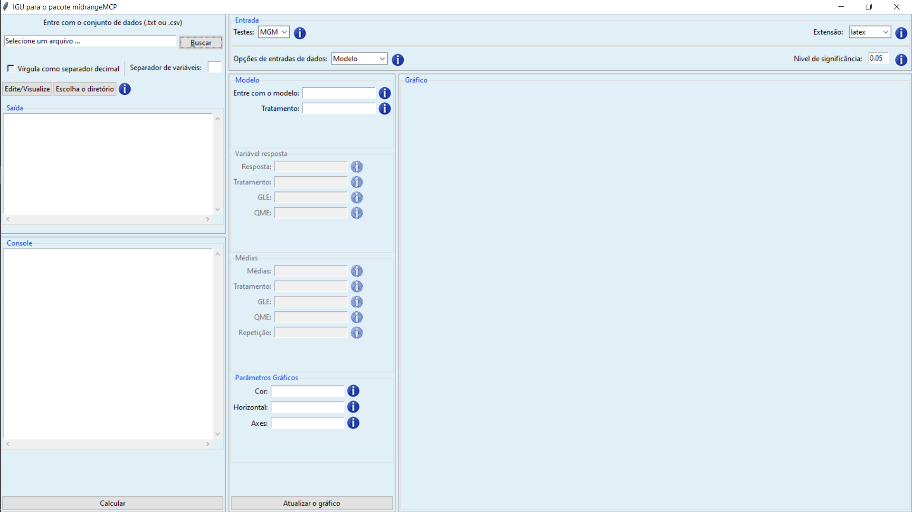

# <i class="fas fa-cubes"></i> Pacotes {#pacotes}

<iframe width="560" height="315" src="https://www.youtube.com/embed/ImIj8iBo6CQ" frameborder="0" allow="accelerometer; autoplay; clipboard-write; encrypted-media; gyroscope; picture-in-picture" allowfullscreen></iframe>

O pacote em `r rlink` é um diretório de arquivos necessários para carregar um código de funções, dados, documentações de ajuda, testes, etc. O próprio `r rlink` em sua instalação, contém 30 pacotes, que dizemos que são as funções mínimas para a utilização da linguagem. Nesse diretório não há apenas códigos em `r rlink`, mas um pacote fonte (do inglês, *source package*), contendo os arquivos mencionados acima, ou um arquivo compactado, de extensão *.tar.gz* do pacote fonte, ou um pacote instalado, resultado da função `R CMD INSTALL`, que será visto no módulo [Programação em R (Nível Avançado)](navancado.html). Isso acontece no SO *Linux*. Para as plataformas *Windows* e *Macintosh*, existem também os pacotes binários ou compactados com a extensão *.zip* ou *.tar.gz*. 

Um pacote, portanto é a unidade básica para o compartilhamento de um código. Atualmente, até 11/03/2021, [o número de pacotes disponíveis é 17.295](https://cran.r-project.org/web/packages/){target="_blank"}, e isso no `r cran`, isto é, na *Comprehenive R Archive Network*, o repositório oficial de pacotes no `r rlink`. Qualquer usuário pode publicar um pacote e disponibilizá-lo sob o `r cran`. Para isso, uma série de testes iniciais são realizados para verificar se não há problemas. Significa também se um pacote está disponível no `r cran` ele funcionará nas três plataformas mais usadas em sistema operacional, *SO Linux* ou sitemas *Unix*, *SO Windows* e *SO Macintosh*. Há outros repositórios que podem ser disponibilizados os pacotes, como por exemplo, no [GitHub](http://github.com/){target="_blank"}. Porém, não há a garantia de que possa estar funcionando corretamento em seu sistema operacional, como os pacotes disponíveis no `r cran`.

Para uma instalação mais rápida no `r cran`, há [espelhos disponíveis](https://cran.r-project.org/mirrors.html){target="_blank"} no Brasil, do qual o primeiro foi desenvolvido e está funcionando até hoje na UFPR.

Contudo, uma coisa deve ficar claro, que erroneamente, alguns usuários chamam pacote de biblioteca. Nas documentações do `r rlink`, biblioteca é o diretório onde os pacotes são instalados, também chamados de diretório de biblioteca ou diretório de arvores. O outro sentido de biblioteca é o de biblioteca compartilhada (dinâmica ou estática), que armazenam código compilado que se vinculam aos pacotes, por exemplo, no Windows são as DLLs.

A estrutura básica de um pacote é apresentada na Figura \@ref(fig:esqpack).

```{r esqpack, fig.cap = "Esqueleto básico de um pacote.", fig.height=16, fig.width=9, fig.align='center'}
knitr::include_graphics("images/esqueleto.png")
```

Vejamos as ideias básicas desses subdiretórios e arquivos,

- **DESCRIPTION**: Esse é um arquivo de texto, contendo informações básicas como o título do pacote, versão, licença, descrição, nome dos autores, e o mantenedor do pacote, isto é, para quando um pacote estiver com problema ou o `r cran` entre em contato, será para este último. Esses as informações obrigatórias que devem ter nesse arquivo.
- **NAMESPACE**: Esse arquivo embora tenha tenha muita semelhança com a linguagem `r rlink`, o seu conteúdo, se destina a importação e exportação de funções no pacote. Será nesse arquivo, que diremos quais os pacotes que ele depende, isto é, as funções, e quais as funções exportadas, visíveis, que devem ser apresentadas aos usuários.
- **R/**: Esse subdiretório apresenta os *scripts* com as funções em `r rlink`. é o cérebro do pacote.
- **man/**: Esse subdiretório apresenta os arquivos de ajuda, com extensão *.Rd*. Isso significa, que uma vez instalado o pacote no `r rlink`, o acesso aos manuais de ajuda do referido pacote, estarão disponíveis, graças a esses arquivos.

## Instalação de um pacote {#instpac}

A instalação de um pacote via `r cran` pode ser feito pela função `install.packages(pkgs = "nome_pacote")`. Por exemplo, vamos tentar instalar o pacote [midrangeMCP](https://cran.r-project.org/package=midrangeMCP), da seguinte forma:

```{r echo=TRUE, eval=FALSE}
install.packages("midrangeMCP")
```

Pode ser que nesse processo, dependendo de onde o usuário esteja executando essa linha de comando, interface do `r rlink` ou `r rstudio`, que seja solicitado o espelho por onde deseja fazer a instalação. Isso é apenas um atalho para ter um acesso mais rápido na instalação do pacote. A sugestão é escolher um espelho de seu país de origem. 

Uma forma simples de se ter detalhes do pacote na internet, tais como, baixar o pacote fonte ou o pacote binário do [midrangeMCP](https://bendeivide.github.io/midrangeMCP/), por exemplo, é sempre usar essa url: <http://cran.r-project.org/package=midrangeMCP>. Para qualquer outro pacote, basta mudar o nome do pacote na url, e assim, estaremos na página do repositório do pacote. O pacote fonte, como falado anteriormente, é compactado com extensão `.tar.gz`, no caso, [midrangeMCP_3.1.1.tar.gz](https://cran.r-project.org/src/contrib/midrangeMCP_3.1.1.tar.gz). O pacote binário tem a compactação zipada, [midrangeMCP_3.1.1.tar.zip](https://cran.r-project.org/bin/windows/contrib/4.1/midrangeMCP_3.1.1.zip) para o Windows e [midrangeMCP_3.1.1.tgz](https://cran.r-project.org/bin/macosx/contrib/4.0/midrangeMCP_3.1.1.tgz) para o Macintosh. O acesso aos arquivos do pacote mencionados no esqueleto  são disponíveis no pacote fonte. 

Uma outra forma possível de instalação é baixar o arquivo do pacote fonte para o seu computador e instalá-lo,

```{r echo=TRUE, eval=FALSE, prompt=TRUE}
install.packages(pkgs = "./midrangeMCP.tar.gz", repos = NULL, type = "source")
```

Consideramos que o arquivo do pacote esteja no diretório de trabalho do usuário. Caso contrário, deve ser informado o local onde pacote se encontra no computador. Para o Window ou Macintosh, é possível instalar também, a partir dos pacotes binários.

Muitos dos desenvolvedores, estão disponibilizando seus projetos de pacotes, principalmente no `r github`, inclusive com manuals de ajuda com maiores detalhes. Pode ser possível instalar esses pacotes por esse repositório. Precisamos inicialmente do pacote [devtools](https://devtools.r-lib.org/), e posteriormente a instalação do pacote. Segue,

```{r echo=TRUE, eval=FALSE}
install.packages("devtools")
install_github("bendeivide/midrangeMCP")
```

Contudo, devemos dar a preferência pela instalação via `r cran`. Por lá, teremos a garantia que os pacotes estão estáveis para a utilização nas referidas plataformas mencionadas acima.

Alguns pacotes, por falta de manutenção, seja por atualizações do `r rlink` ou por qualquer outro motivo, podem se tornar incompatíveis para utilização sobre alguns dos três sistemas operacionais básicos (SO Windows, Unix e SO Mac) exigidos pelo `r rlink`. Dessa forma, se as correções não forem feitas, estes pacotes e tornam órfãos, ou seja, desativados sob o `r cran`. O primeiros pacotes sob o `r cran`, por exemplo, não tinham o arquivo *NAMESPACE*, que hoje é exigido. Qualquer tentativa de instalação desses pacotes nessas situações, não serão bem sucedidas. Dessa forma, fizemos uma vídeo-aula, como tentativa de recuperar os pacotes desativados. Porém, deixemos claro que nem sempre é possível a instalação de pacotes desativados.

<iframe width="560" height="315" src="https://www.youtube.com/embed/FKItT65gphM" frameborder="0" allow="accelerometer; autoplay; clipboard-write; encrypted-media; gyroscope; picture-in-picture" allowfullscreen></iframe>

## Objetivos de um pacote {#objpac}

A ideia de um pacote para um usuário `r rlink` deve representar como uma ferramenta para otimizar suas atividades do dia-a-dia na utilização da linguagem. Suponha que o usuário seja um cientista de dados, e todos os dias ele carrega uma sequência de *scripts*, via `source`, para disponibilizar suas funções no ambiente global. Isso acaba gerando processos repetitivos de trabalho desnecessários.

Ao invés, o cientista de dados pode desenvolver um pacote, e esse pacote conter todas as funções necessárias para as suas análises. De uma vez, o pacote instalado e anexado no caminho de busca, todas as suas funções estarão disponíveis para utilização. Portanto, o entendimento disso, permite uma maior eficiência de trabalho.

Outro ponto é que a experiência contida em um pacote pode ser propagada mais facilmente para outros usuários, mostrando que o conhecimento é uma liberdade necessária. Tanto pelo `r cran`, quanto por outras plataformas, o pacote pode ser disponibilizado. 

## Utilizar as funções de um pacote {#funcpac}

Uma vez instalado o pacote, precisamos carregar e anexá-lo, para que possamos utilizar os recursos disponíveis no pacote, como funções, dados, etc. Isso significa, disponibilizar na memória e inseri-lo no caminho de busca, respectivamente. Para fazer essas duas ações ao mesmo tempo, use a função `library()` ou `require()`. A primeira função se for utilizada sem argumento algum, retorna todos os pacotes instalados na bibioteca de pacotes do `r rlink`. Vejamos o exemplo do pacote [midrangeMCP](https://bendeivide.github.io/midrangeMCP/),

```{r echo=TRUE, eval=TRUE}
# Carregando e anexando o pacote midrangeMCP
library(midrangeMCP)

# Usando a função MRtest() desse pacote
#-----
# Dados simulados de um experimento em DIC (Delineamento Inteiramente Casualizado)

# Variavel resposta
rv <- c(100.08, 105.66, 97.64, 100.11, 102.60, 121.29, 100.80,
        99.11, 104.43, 122.18, 119.49, 124.37, 123.19, 134.16,
        125.67, 128.88, 148.07, 134.27, 151.53, 127.31)

# Tratamento
treat <- factor(rep(LETTERS[1:5], each = 4))

# Anava
res     <- anova(aov(rv~treat))
DFerror <- res$Df[2]
MSerror <- res$`Mean Sq`[2]

# Aplicando testes
results <- midrangeMCP::MRtest(y = rv,
                  trt = treat,
                  dferror = DFerror,
                  mserror = MSerror,
                  alpha = 0.05,
                  main = "PCMs",
                  MCP = c("all"))
```

```{r echo=FALSE}
# Carregando e anexando o pacote midrangeMCP
library(midrangeMCP)

# Usando a função MRtest() desse pacote
#-----
# Dados simulados de um experimento em DIC (Delineamento Inteiramente Casualizado)

# Variavel resposta
rv <- c(100.08, 105.66, 97.64, 100.11, 102.60, 121.29, 100.80,
        99.11, 104.43, 122.18, 119.49, 124.37, 123.19, 134.16,
        125.67, 128.88, 148.07, 134.27, 151.53, 127.31)

# Tratamento
treat <- factor(rep(LETTERS[1:5], each = 4))

# Anava
res     <- anova(aov(rv~treat))
DFerror <- res$Df[2]
MSerror <- res$`Mean Sq`[2]

# Aplicando testes
results <- midrangeMCP::MRtest(y = rv,
                  trt = treat,
                  dferror = DFerror,
                  mserror = MSerror,
                  alpha = 0.05,
                  main = "PCMs",
                  MCP = c("all"))
```


```{r echo=TRUE, eval=TRUE}
midrangeMCP::MRbarplot(results)
```

## Carregando e anexando um pacote {#attachpac}

<iframe width="560" height="315" src="https://www.youtube.com/embed/ImIj8iBo6CQ" frameborder="0" allow="accelerometer; autoplay; clipboard-write; encrypted-media; gyroscope; picture-in-picture" allowfullscreen></iframe>

Anteriormente, falamos que usamos a função `library()` ou `require()` para carregar e anexar um pacote para utilizar suas funções, após a instalação. Carregar um pacote significa disponibilizar na memória ativa. Para acessar uma função de um pacote após ter sido carregado, usamos o operador `::`, isto é, `nome_pacote::nome_função`. Isto significa, que será chamado a função necessária sem anexar o pacote no [caminho de busca](#search_path). Estudaremos a seguir um pouco mais sobre caminho de busca. Para esse momento, entenda que é um caminho hierarquizado de ambientes, isto é, objetos que armazenam, em forma de lista, nomes associados a objetos. A função para ver o caminho de busca é `search()`. Em nosso caso, temos:

```{r echo=FALSE}
detach("package:midrangeMCP", unload = TRUE)
```

```{r echo=TRUE}
# Caminho de busca
search()

# Carregando e chamando uma função de um pacote
midrangeMCP::MRwrite(results, extension = "latex")

# Verificando novamente o caminho de busca
search()
```

Com as linhas de comando apresentadas anteriormente, percebemos ao executar a função `MRwrite()` do pacote [midrangeMCP](https://bendeivide.github.io/midrangeMCP/), usando `::` que o caminho de busca não foi alterado. Isso significa que o pacote não foi anexado, apenas carregado, ou seja, se o usuário desejar usar alguma função do pacote [midrangeMCP](https://bendeivide.github.io/midrangeMCP/) digitando apenas o nome no console, não será possível, porque o pacote não está anexado ao caminho de busca. 

Vejamos uma outra situação,

```{r echo=FALSE}
if (any(search() == "package:midrangeMCP")) {
  detach("package:midrangeMCP", unload = TRUE)
}
```

```{r echo=TRUE, prompt=TRUE}
# Caminho de busca
search()

# Carregando e anexando um pacote
library(midrangeMCP)

# Verificando novamente o caminho de busca
search()

# Chamando uma funcao do pacote
# guimidrangeMCP()
```

Com o uso da função `library()`, percebemos que o caminho de busca foi alterado, porque agora temos o ambiente de pacote `package:midrangeMCP`. Isso significa que agora poderemos acessar os objetos desse pacote apenas digitando o nome associado a eles. Por fim, a última linha foi comentada, porque é uma interface gráfica ao usuário para o pacote, o que chamamos de *GUI* (do inglês, *Graphical User Interface*), mas que pode ser visualizado na Figura \@ref(fig:guimidrangeMCP).

```{r guimidrangeMCP, fig.cap = "Interface para o pacote [midrangeMCP](https://bendeivide.github.io/midrangeMCP/).", out.width = "80%", fig.align='center'}

```

## *NAMESPACE* de um pacote {#namespac}

<iframe width="560" height="315" src="https://www.youtube.com/embed/U-75Un1Sr94" frameborder="0" allow="accelerometer; autoplay; clipboard-write; encrypted-media; gyroscope; picture-in-picture" allowfullscreen></iframe>

No início da seção sobre pacotes, falamos sobre o esqueleto de um pacote, isto é, os componentes básicos de um pacote. Um dos arquivos é o *NAMESPACE*. Esse arquivo é respondsável pela exportação e importação de funções. As funções exportadas de um pacote, por meio desse arquivo, são aquelas visíveis após a anexação do pacote ao caminho de busca, ou por meio do operador `::`. As funções importadas são aquelas utilizadas de outros pacotes. 

As funções ditas internas do pacote, são aquelas não mencionadas no *NAMESPACE*. Em muitas situações, precisamos de funções internas necessárias para a finalidade do pacote, que muitas vezes não é objetivo final para disponibilidade dos usuários, mas códigos intermediários para a boa funcionabilidade do pacote. Dessa forma, uma boa escolha para que não haja conflitos em nomes associados a objetos no ambiente de trabalho, é a decisão de não exportá-los.

Porém, quando se cria um pacote, por exemplo, pelo RStudio, o padrão no *NAMESPACE* é o comando:

```
exportPattern("^[^\\.]")
```
que significa que todas as funções no pacote serão exportadas que não iniciam por um ponto ("."). Como toda função em um pacote precisa de um arquivo de ajuda (*.Rd*), todas as funções deverão ter esses tipos arquivos inseridos no subdiretório *man/*. 

Os primeiros pacotes submetidos ao CRAN na primeiras versões do `r rlink`, não tinha o arquivo *NAMESPACE*. Por isso que quando tentamos instalar pacotes órfãs antigos, um dos erros é a falta desse arquivo.

Mais detalhes sobre o desenvolvimento de pacotes será abordado no módulo [Programação em R (Nível Avançado)](navancado.html).

## Usando os operadores `::` e `:::` {#carpac}

<iframe width="560" height="315" src="https://www.youtube.com/embed/gm6YA-heLJ8" frameborder="0" allow="accelerometer; autoplay; clipboard-write; encrypted-media; gyroscope; picture-in-picture" allowfullscreen></iframe>

Como falamos anteriormente, para chamarmos uma função sem a necessidade de anexar o pacote, usamos o operador `::`. Comentamos também, que algumas funções não eram exportadas pelo *NAMESPACE* de um pacote. Contudo, se desejarmos visualizar ou executá-las, poderemos utilizar o operador `:::`. Vejamos um exemplo,

```{r, echo=TRUE, prompt=TRUE}
# Instale o pacote SMR
# install.packages(SMR) # Descomente a linha de comando para instalar
# Carregando e chamando funcoes exportadas do pacote SMR
SMR::pSMR(q = 2, size = 10, df = 3)
# Carregando e chamando funcoes nao exportadas ao pacote
SMR:::GaussLegendre(size = 4)
```

As funções internas dos pacotes devem ser utilizadas com muita cautela, uma vez que são funções que podem passar por atualizações, mudanças. Isso porque, como não são funções exportadas, alguns pacotes podem passar por atualizações, e desse modo, estas funções também podem ser atualizadas ou até mesmo alteradas.

Outro ponto interessante é que não se recomenda a utilização de importação de funções internas de outros pacotes no desenvolvimento de pacotes, uma vez que são funções que podem passar por mudanças drásticas, e portanto, gerar problemas nas rotinas. Se uma função em um pacote não foi exportada, é porque o desenvolvedor tem um bom motivo para tal situação. As funções exportadas são de fato a essência do objetivo de um pacote, e por isso que elas são exportadas.


## Ambientes e Caminho de busca {#search_path}


Na seção sobre [funções](#funcoes), discutimos dois pontos interessantes sobre objetos, que é a atribuição e o escopo. E esses dois pontos estão intimamente relacionados ao objeto ambiente, de modo `"environment"`. O ambiente é um objeto que armazena, em forma de lista, as ligações dos nomes associados aos objetos. Porém, existem diferenças entre o objeto lista do objeto ambiente, com quatro exceções (@hadley2019):

- Cada nome deve ser único;
- Os nomes em um ambiente não são ordenados;
- Um ambiente tem um pai ou também chamado de ambiente superior;
- Ambientes não são copiados quando modificados.

Muitas dessas definições são complexas para esse momento. E uma profundidade sobre o assunto, será abordada no módulo [Programação em R (Nível Intermediário)](nintermediario.html). Contudo, introduziremos algumas características importante os objetos ambiente.

O ambiente de trabalho do `r rlink` é conhecido como ambiente global, pois é onde todo o processo de interação da linguagem ocorre. Existe um nome específico associado a esse objeto, que é `.GlobalEnv`, ou também pode ser acessado pela função `globalenv()`. Para sabermos quais os nomes que existem nesse ambiente, usamos a função `ls()`, isto é,

```{r}
if (length(ls()) != 0) rm(list = ls())
```

```{r, echo=TRUE, prompt=TRUE}
# Nomes no ambiente global
ls()
```


Quando o resultado da função é `character(0)`, significa que não existem nomes criados no ambiente global. O ambiente corrente de trabalho é informado pela função `environment()`, isto é,

```{r, echo=TRUE, prompt=TRUE, error=TRUE}
# Comparando os ambientes
identical(environment(), .GlobalEnv)

# Forma errada de comparar ambientes (Erro...)
environment() == .GlobalEnv
```
A segunda forma é equivocada, porque os ambientes não são vetores. Assim, como também não podemos utilizar o sistema de indexação, isto é,

```{r echo=TRUE, prompt=TRUE, error=TRUE}
# Criando objetos no ambiente global
b <- 2; a <- "Ben"; x <- TRUE
# Verificando os nomes no ambiente global
ls()

# Acessando o objeto "a"
.GlobalEnv$a
.GlobalEnv[["a"]]

# Acessando o primeiro nome (Erro...)
.GlobalEnv[[1]]

```

```{r}
# Links
rlink <- "[R](http://r-project.org/){target='_blank'}"
rstudio <- "[RStudio](http://rstudio.org/){target='_blank'}"
cran <- "[CRAN](http://cran.r-project.org/){target='_blank'}"
github <- "[GitHub](http://github.com/){target='_blank'}"
```


A última linha de comando retorna um erro, porque os nomes em ambientes não são ordenados, ao invés, devemos chamar os resultados por meio de `$` ou .

Poderemos criar um ambiente pela função `new.env()`, e inserir ligações dentre dele, como apresentado a seguir.

```{r}
if (length(ls()) != 0) rm(list = ls())
```

```{r, echo=TRUE, prompt=TRUE}
# Criando objetos no ambiente global
b <- 2; a <- "Ben"; x <- TRUE
# Verificando os nomes no ambiente global
ls()
# Criando um objeto ambiente no ambiente global
amb1 <- new.env()
# Inserindo nomes nesse no ambiente "amb1"
amb1$d <- 3; amb1$e <- "FALSE"
# Verificando nomes no ambiente global
ls()
# Verificando nomes no ambiente "amb1"
ls(envir = amb1)
```

```{r}
# Links
rlink <- "[R](http://r-project.org/){target='_blank'}"
rstudio <- "[RStudio](http://rstudio.org/){target='_blank'}"
cran <- "[CRAN](http://cran.r-project.org/){target='_blank'}"
github <- "[GitHub](http://github.com/){target='_blank'}"
```


Todo ambiente tem um ambiente pai ou ambiente superior. Quando um nome não é encontrado no ambiente corrente, o `r rlink` procurará no ambiente pai. Para saber, use `parent.env()`, isto é,

```{r, echo=TRUE, prompt=TRUE}
parent.env(amb1)
```

O único ambiente que não tem pai é o ambiente vazio, objeto `emptyenv()`, que pode ser observado pela linha de comando:

```{r, echo=TRUE, prompt=TRUE, error=TRUE}
parent.env(emptyenv())
```

## A superatribuição `<<-` {#superatr}

A atribuição (`<-`) é uma função que associa um nome a um objeto no ambiente corrente. Quando usamos o `r rlink`, quase sempre esse ambiente é o ambiente global. A superatribuição (`<<-`) cria um nome e o associa a um objeto no ambiente pai do ambiente de onde essa associação está sendo criada. Vejamos,

```{r, echo=TRUE, prompt=TRUE, error=TRUE}
# Criando o objeto x e o imprimindo
x <- 0; x
# Criando uma funcao com a superatribuicao
f1 <-  function() {
  # Obj2
  x <- 1
  # Modificando x do ambiente global
  x <<- 2
  # Imprimindo o ambiente de execucao
  env <- environment()
  # Imprimindo o Obj2
  res <- list(x = x, "Ambiente de execução" = env, "Ambiente Pai" = parent.env(env))
  # Retornando a lista
  return(res)
}
# Imprimindo f1
f1()
# Imprimindo x
x
# Imprimindo o ambiente envolvente de f1
environment(f1)
# Imprimindo os nomes do ambiente global
ls()
```

Esse caso é interessante porque vemos dois nomes associados a objetos em ambientes diferentes. Alguns ambientes são criados pela função `function()`, são os chamados ambientes funcionais. Um deles é o ambiente envolvente, já comentado na seção sobre [funções](#esc_lexico). O ambiente envolvente da função `f1` é o ambiente global. Já no corpo da função `f1`, um outro ambiente surge quando a função é chamada, é o ambiente de execução. Toda vez que a função é chamada, cria-se um novo ambiente de execução. Observemos os identificadores, em `Ambiente de execução`, quando executamos a função mais de uma vez,

```{r, echo=TRUE, prompt=TRUE}
f1()$`Ambiente de execução`
f1()$`Ambiente de execução`
f1()$`Ambiente de execução`
```

O ambiente pai do ambiente de execução, é o ambiente envolvente de `f1`, que nesse caso é o ambiente global. Assim, observe que o ocorre quando executamos o comando de superatribuição. O nome `x` no ambiente global passou a está associado ao valor 2, porque foi alterado por `<<-`, mas o nome `x` continuou associado ao valor 1, porque a função `f1()` retornou o valor 1. Isso mostra que a superatribuição não cria um objeto no ambiente atual, mas em um ambiente pai se não existe ou altera o nome existente. Vejamos o complemento dessa afirmação no próximo exemplo.

```{r}
if (length(ls()) != 0) rm(list = ls())
```

```{r, echo=TRUE, prompt=TRUE}
# Verificando os nomes no ambiente global
ls()

# Criando uma funcao
f2 <-  function() {
  x <<- 2
}
# Executando f2
f2()
# Verificando novamente os nomes no ambiente global
ls()
# Verificando o valor de x
x
```

```{r}
# Links
rlink <- "[R](http://r-project.org/){target='_blank'}"
rstudio <- "[RStudio](http://rstudio.org/){target='_blank'}"
cran <- "[CRAN](http://cran.r-project.org/){target='_blank'}"
github <- "[GitHub](http://github.com/){target='_blank'}"
```

Com a superatribuição executada dentro de `f2()` e como no ambiente pai não eistia o nome `x`, este foi criado e associado ao valor `2`. Um próximo exemplo, consideramos um ambiente envolvente que não seja o ambiente global. Vejamos,

```{r, echo=TRUE, prompt=TRUE}
# Funcao contador
contador <- function() {
  i <- 0
  env1 <- environment()
  aux <- function() {
    # do something useful, then ...
    i <<- i + 1
    env2 <- environment()
    res2 <- list(i = i, `AmbExec_aux` = env2, `AmbExec_contador` = env1)
    return(res2)
  }
}
# Chamada de funcao
contador1 <- contador()
contador1()
contador1()
contador1()

# Chamada de funcao
contador2 <- contador()
contador2()
```

Quando uma função `function()` é criada dentro de outra função `function()` o ambiente de execução da função superior, `contador()`, é o ambiente envolvente da função interna, `aux()`. Dessa forma, o ambiente de execução de `contador()` não será mais efêmero, isto é, não será apagado após a execução, como pode ser visto em `contador1()`. Observamos que executamos `contador1()` três vezes. O nome `i` foi atualizado, devido a superatribuição, a cada chamada da mesma função. Ao passo que, quando realizamos uma nova chamada de `contador()`, por meio de `contador2()`, o resultado de `i` retora o valor `1`, porque um novo ambiente de execução para `contador()` foi criado, como pode ser observado.

Os demais ambiente funcionais e exemplos, serão descritos no módulo [Programação em R (Nível Intermediário)](nintermediario.html).

Por fim, uma última forma do `r rlink` encontrar os nomes é pelo **caminho de busca**, que além dos ambientes criados e o ambiente global, existem os ambientes de pacotes. Toda vez que um pacote é anexado ao caminho de busca, o ambiente de pacote anexado será sempre o pai do ambiente global. Vejamos,

```{r}
library(SMR)
library(midrangeMCP)
detach("package:SMR", unload = TRUE)
detach("package:midrangeMCP", unload = TRUE)
```

```{r, echo=TRUE, prompt=TRUE}
# Caminho de busca
search()
# Anexando o pacote SMR
library(SMR)
# Verificando o caminho de busca
search()
# Carregando o pacote midrangeMCP
library(midrangeMCP)
# Verificando o caminho de busca
search()
```

A lista dos ambientes no caminho de busca segue a ordem hierárquica dos ambientes, de modo que o ambiente global será sempre o ambiente de trabalho, isto é, o ambiente corrente. Não foi apresentado nessa lista, o ambiente vazio, `emptyenv()`. Mas, poderemos utilizar o pacote [rlang](https://rlang.r-lib.org/) para isso.

```{r echo=TRUE, prompt=TRUE}
# Criando um ambiente
amb2 <- new.env()
# Verificando seus parentais
rlang::env_parents(env = amb2, last = emptyenv())
```

Dessa forma, é caminho de busca que o `r rlink` procurará pelos nomes. Isso significa, que se o ambiente envolvente de uma função, por exemplo, for o ambiente vazio, o `r rlink` procurará pelas funções básicas no pacote *base* e não será encontrado, pois nesse ambiente não há nomes e nem ambientes parentais. Por isso, que o `r rlink` depende do escopo léxico para tudo. Vejamos,

```{r echo=TRUE, prompt=TRUE, error=TRUE}
# Criando uma funcao
f3 <- function() x + 1

# Modificando o ambiente envolvente de f3
environment(f3) <- emptyenv()

# Dependencias externas da funcao f3
codetools::findGlobals(f3)

# Chamando a funcao f3
f3()
```

Isso não ocorre quando definimos o ambiente envolvente de `f3()` como sendo o ambiente global, porque quando a função buscar pelo operador de soma neste ambiente e não encontrar, `f3()` seguirá até o ambiente `package:base`, para encontrar o operador "`+`".

Por isso, que usar a função `attach()` para anexar objetos do tipo quadro de dados (*data frames*), por exemplo, pode se tornar um problema em um código, quando temos nomes iguais para objetos diferentes. Para isso, apresentamos o código a seguir.

```{r echo=TRUE, prompt=TRUE, error=TRUE}
# objeto quadro de dados
dados <- data.frame(sd = 1:3, var = (1:3)^2)
# Caminho de busca
search()
# anexando "dados" ao caminho de busca
attach(dados)
# Verificando novamente o caminho de busca
search()
# Imprimindo sd
sd
# Desanexando "dados"
detach(dados)
# Imprimindo sd
sd
```

Quando criamos o objeto `dados`, uma de suas colunas estava nomeada por `sd`, que também é o nome de uma função do pacote *stats*, que representa a variância. Porém, quando anexamos o objeto `dados` no caminho de busca, um novo ambiente é criado, como pai do ambiente global e com mesmo nome do objeto, e os elementos do objeto dados são copiados para esse ambiente. Assim, o nome `sd` foi procurado e não encontrado, seguindo a busca para o próximo ambiente que foi `dados`, e daí foi encontrado. Percebemos que também existe esse nome no ambiente do pacote *stats*, que é do tipo função. Entretanto, como o primeiro objeto encontrado associado a esse nome estava no ambiente dados, ele é retornado. Nesses casos, se usarmos a superatribuição, a alteração ocorrerá apenas na cópia dos elementos no ambiente anexado, e não nos elementos do objeto original. Caso haja a atribuição, o nome será criado no ambiente global.

Isso pode acabar se tornando um problema se muitos objetos forem anexados. Por isso, é preferível o uso da indexação ou `$` para acessar os elementos de uma lista ou quadro de dados, evitando assim, conflitos na procura de nomes.

Desse mesmo modo, poderíamos pensar que esses mesmo conflitos poderiam surgir dentro de um pacote. Porém, graças ao *NAMESPACE*, isso não ocorre, sendo um dos assuntos abordados nos próximos módulos.
