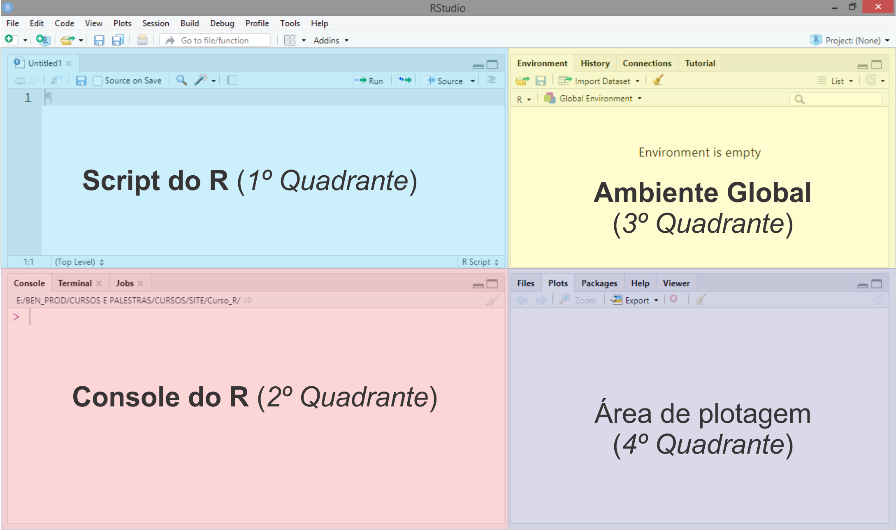

```{r setup, include=FALSE}
knitr::opts_chunk$set(echo = FALSE)
```

## Informações Gerais

- As instalações do R e RStudio  serão específicas para o SO Windows;
- Para mais SO, acesse: [Instalação do R e do RStudio](http://bendeivide.github.io/cursor/index.html#installrrstudio);

## Passos para a instalação

- Instalação do `R`: [https://cran.r-project.org/bin/windows/base/](https://cran.r-project.org/bin/windows/base/)
- Instalação do RStudio: [https://rstudio.com/products/rstudio/download/#download](https://rstudio.com/products/rstudio/download/#download)


## Interface do `R`

<center>
{width="80%"}
</center>

## Interface do RStudio

<center>
{width="80%"}
</center>
