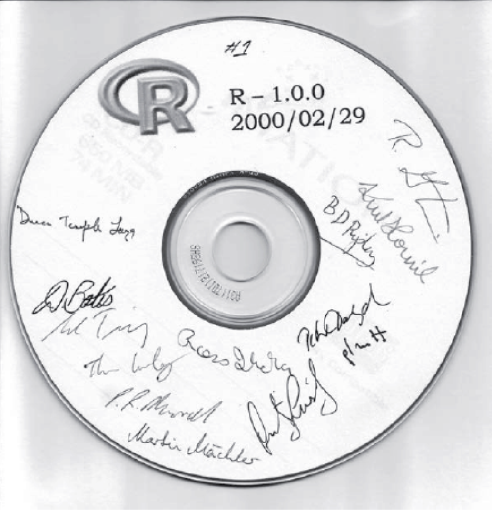

```{r setup, include=FALSE}
knitr::opts_chunk$set(echo = FALSE)
```

## Criadores do `R`

<center>
{width="40%"}
</center>

- Em 1991, nasce o projeto da criação do `R`;
- Os Professores da Universidade de Auckland, Nova Zelândia, Robert Gentleman e Ross Ihaka, buscam uma alternativa a linguagem `S` para análises estatísticas;
- Como alternativa a linguagem `S`, eles se baseiam na semântica de outra linguagem, `Scheme`;
- Em 1993, o projeto é lançado e em 1995, o como Software livre;
- Em 1997 é criado o *R Core Team*;
- Em 1997, mas precisamente em 23 de abril, o CRAN (Comprehensive R Archive Network) foi ofialmente lançado;

## Versão 1.0.0 do `R`

```{r rversao1.0, fig.cap = "Disco comapcto com a versão 1.0.0 do `R`, dado aos membros do *R Core Team*, retirado do livro Extending `R` [@chambers2016]", out.width = "30%", fig.align='center'}

```

## O que é o `R`?

- O `R` é uma linguagem e ambiente de computação estatística e gráficos (<http://r-project.org/about>), (...)
  - Baseado no dialeto `S` e semântica `Scheme` ([Escopo Léxico](https://bendeivide.github.io/cursor/scripts/script03.txt));
  - Sintaxe simples e intuitiva;
  - Está disponível como Software livre sob os termos da licença GNU, em forma de código fonte;
  - Linguagem interpretada: `S`, `C`, `C++` e `FORTRAN`;
    - Análises estatísticas: `S` e o próprio `R`;
    - Computação intensiva: `C`, `C++` e `FORTRAN`;
    - Duvidou? Segue o código fonte: <https://cran.r-project.org/sources.html>
  
- O termo "ambiente" é preferível a software, pois:
  - Ambiente: Sistema totalmente planejado e coerente;
  - Software: Incremento de ferramentas muito específicas e inflexíveis;
  
## Referências
