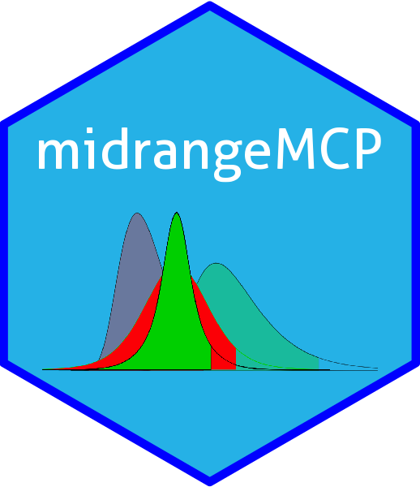

```{r setup, include=FALSE}
knitr::opts_chunk$set(echo = FALSE)
# Anexando pacotes
library(magrittr)
# Links
rlink <- "[R](http://r-project.org/){target='_blank'}"
rstudio <- "[RStudio](http://rstudio.org/){target='_blank'}"
cran <- "[CRAN](http://cran.r-project.org/){target='_blank'}"
github <- "[GitHub](http://github.com/){target='_blank'}"
```

## Pacote `r rlink`

<center>
{width="80%"}
<center/>

## Perguntas básicas

- **Quantidade?** [17.295](https://cran.r-project.org/web/packages/){target="_blank"} (11/03/2021)
- **Tipos?**: *.tar.gz*, *.zip*, etc...
- **Onde?**  [CRAN](https://cran.r-project.org/mirrors.html){target="_blank"}, [GitHub](http://github.com/){target="_blank"}, etc...
- **Instalar?** `install.packages()`, atalhos do *RStudio*
- **Usar?** `library()`, `require()`, `::`, `:::`
- **Publicar?**: Sim ou Não!
  

## Esqueleto de um pacote

```{r esqpack, fig.cap = "Esqueleto básico de um pacote.", fig.height=16, fig.width=9, fig.align='center'}
knitr::include_graphics("esqueleto.png")
```

## Instalação

:::: {style="display: flex"}

::: {}


{width="70%"}

:::

::: {}

- Instalação (CRAN)
```{r echo=TRUE, eval=FALSE, }
options(width = 30)
install.packages("midrangeMCP")
```
- Pacote fonte (Local)
```{r echo=TRUE, eval=FALSE, prompt=TRUE}
options(width = 30)
install.packages(pkgs = "./midrangeMCP.tar.gz", 
repos = NULL, type = "source")
```
- `r github`

```{r echo=TRUE, eval=FALSE, prompt=TRUE}
install.packages("devtools")
install_github("bendeivide/midrangeMCP")
```
:::

::::


## Instalação
- [Pacotes desativados](https://youtu.be/FKItT65gphM){target="_blank"}

- Diretório sob o `r cran`:

   <http://cran.r-project.org/package=midrangeMCP>


## Objetivos de um pacote

- Compartilhamento de código;
- Otimizar suas atividades;
- Propagar conhecimento.

## Usando as funções de um pacote

```{r echo=TRUE, eval=FALSE, prompt=TRUE}
# Carregando e anexando o pacote midrangeMCP
library(midrangeMCP)

# Usandos as fucoes diretamente
MRbarplot()
```

```{r echo=TRUE, eval=FALSE, prompt=TRUE}
midrangeMCP::MRbarplot()
```


## Bons estudos!


<center>
[{height=500 width=500}](http://youtube.com/bendeivide){target="_blank"}
</center>

