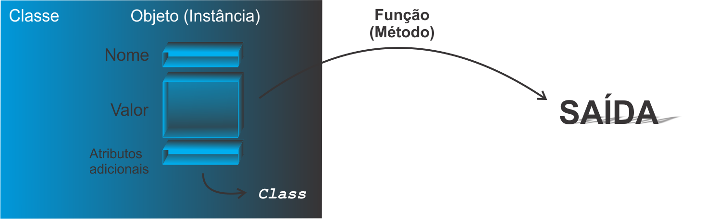

```{r setup, include=FALSE}
knitr::opts_chunk$set(echo = FALSE)
```

<!--
YAML:
date: "`r format(Sys.time(), '%d %B, %Y')`"
=====
APRESENTACAO:

Inserir nas secoes:
{data-background=boards.jpg data-background-size=cover}
-->


## Selo DC

<center>
[{height=300 width=300}](https://bendeivide.github.io/dc/){target="_blank"}
</center>

## Paradigmas da programação

- Forma de como programar um algoritmo;
- Dentre eles, POO (Programação orientada a objetos);

## Bases da POO

- Classe
- Objeto
- Método

**OBS.:** No `R`, essas ideias são um pouco diferentes de outras linguagens!

<center>
{height= width="100%"}
</center>

## Ideias das bases da POO em nosso dia a dia

<center>
{height= width="40%"}
</center>

## Nem tudo é orientado a objetos no R

No R, temos:

- Objetos POO (Objetos para POO)
- Objetos base (Objetos sem POO)

Diferenciação: atributo `class`

```{r echo=TRUE, include=TRUE}
# Objeto "data.frame"
objPOO <- data.frame(a = 1, b = "1", c = TRUE)
# Objeto "data.frame" eh um objeto POO?
is.object(objPOO)

# Vetor de comprimento 10
objBASE <- 1:10
# O vetor eh um objeto POO?
is.object(objBASE)
```

## Bons estudos!

<center>
[{height=500 width=500}](https://bendeivide.github.io/courses/cursor/){target="_blank"}
</center>
