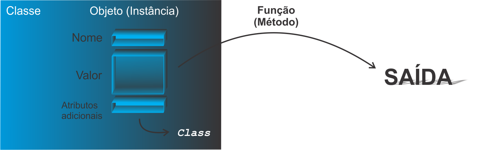

```{r setup, include=FALSE}
knitr::opts_chunk$set(echo = FALSE)
```

<!--
YAML:
date: "`r format(Sys.time(), '%d %B, %Y')`"
=====
APRESENTACAO:

Inserir nas secoes:
{data-background=boards.jpg data-background-size=cover}
-->


## Selo DC

<center>
[{height=300 width=300}](https://bendeivide.github.io/dc/){target="_blank"}
</center>

## Revisando (POO)

- Classe
- Objeto
- Método

```{r echo=TRUE, include=TRUE}
.S3PrimitiveGenerics
# Outras funcoes primitivas
(outros_obj_S3_primitivos <- c("[", "[[", "$", "[<-", "[[<-", "$<-"))
# Outras funcoes internas nao primitivas
(outros_obj_S3_primitivos <- c("unlist", "cbind", "rbind", "as.vector"))
```


**OBS.:** No `R`, essas ideias são um pouco diferentes de outras linguagens!

<center>
{height= width="100%"}
</center>

## Tipos de Sistemas POO

Segundo @chambers2016:

- **POO encapsulada**: os métodos são encapsulado em suas classes, isto é, os objetos nesse estilo de programação contém os seus comportamentos;
- **POO funcional**: os métodos pertencem as funções, das quais serão aplicadas aos objetos de determinada classe.

<center>
{height= width="100%"}
</center>

## Exemplos de sistemas

- Base do `R`: **S3**, **S4**, **CR**
- CRAN: R6 **R6** (pacote [R6](https://r6.r-lib.org/)), [R.oo](https://github.com/HenrikBengtsson/R.oo), [proto](https://github.com/hadley/proto), dentre outros.

OBS.: Módulo Intermediário - **S3**

## Bons estudos!

<center>
[{height=500 width=500}](https://bendeivide.github.io/courses/cursor/){target="_blank"}
</center>

## Referências
