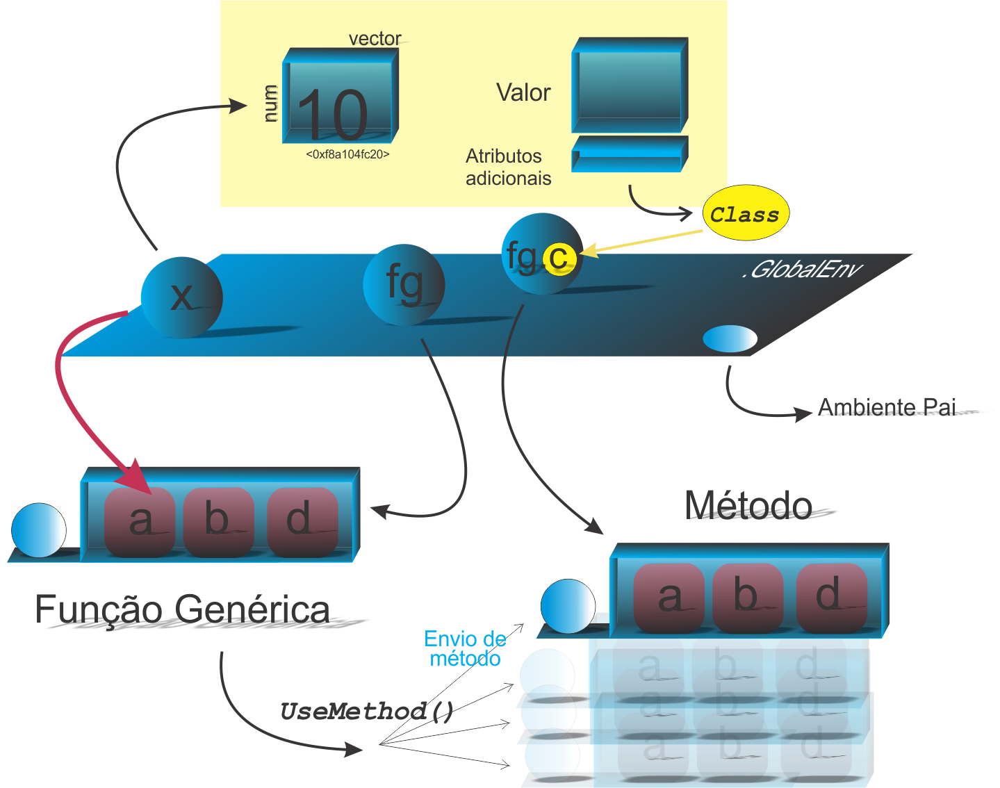

```{r setup, include=FALSE}
knitr::opts_chunk$set(echo = FALSE)
# Links
rlink <- "[R](http://r-project.org/){target='_blank'}"
rstudio <- "[RStudio](http://rstudio.org/){target='_blank'}"
cran <- "[CRAN](http://cran.r-project.org/){target='_blank'}"
github <- "[GitHub](http://github.com/){target='_blank'}"
```


<!--
YAML:
date: "`r format(Sys.time(), '%d %B, %Y')`"
=====
APRESENTACAO:

Inserir nas secoes:
{data-background=boards.jpg data-background-size=cover}
-->


## Selo DC

<center>
[{height=300 width=300}](https://bendeivide.github.io/dc/){target="_blank"}
</center>

## Revisando 

<center>
{height= width="80%"}
</center>

## A ideia de classe em POO no R (Sistema S3)

- Os usários de outras linguagens (`Java`, `C++`, `Python`) podem ficar confusos com a ideia de classe no sistema S3
- Simplesmente, sua definição é o atributo `class` em um objeto. Pronto, criado a instância dessa classe

## Criando o atributo *class* aos objetos

```{r echo=TRUE, include=TRUE}
# Objeto
(x <- 1:10)

# Inserindo atributos em um objeto (1ª Forma)
attr(x,"dim") <- c(2, 5) # 1º Atributo 'dim'
attr(x,"class") <- "ben" # 2º Atributo 'ben'
attr(x,"nada") <- "1"  # 3º Atributo 'nada'

# Visualizar os atributos em x
attributes(x)
```

## Criando o atributo *class* aos objetos

```{r echo=TRUE, include=TRUE}
# Eliminando um determinado atributo ('nada')
attr(x,"nada") <- NULL # Remove atribuindo 'NULL'

# Visualizar os atributos em x, sem o atributo 'nada'
attributes(x)

# Eliminar todos os atributos
attributes(x) <- NULL

# Visualizando x sem atributos
attributes(x)
```

## Criando o atributo *class* aos objetos

```{r echo=TRUE, include=TRUE}
# Inserindo os atributos todos de uma vez
mostattributes(x) <- list(dim = c(2, 5), class = "ben", nada = "1")

# Verificando se um objeto apresenta determinado atributo, por exemplo, class='nada'
inherits(x, "nada")

# Outra forma de inserir mais de um atributo
(x <- structure(1:10, dim = c(2, 5), class = "ben", nada = "1"))
```

## Criando o atributo *class* aos objetos

```{r echo=TRUE, include=TRUE}
# Casos especificos, podem ter funcoes proprias
# para inserir atributos, por exemplo, 'class'
attr(x,"class") <- NULL; attributes(x) # removendo o atributo 'class'
class(x) <- "ben"; attributes(x)
```

## Nomes para as classes

- Evitar ponto (".") no nome das classes
- Em pacotes, usem a classe como o nome do pacote
- seguir as regras básicas de nomes no `r rlink` (Módulo Básico)


## Características do atributo *Class*

- Pode ser um vetor de caracteres 

```{r echo=TRUE, include=TRUE}
# Objeto e sua classe
x <- ordered(1:5)
class(x)
# Observando os atributos do objeto
attributes(x)
```
- responsável pelo mecanismos de herança

## A função *class()* não é a melhor escolha

- Uso da função `class()`

```{r echo=TRUE, include=TRUE}
# Objeto e sua classe
y <- array(1:3, c(2,4))
class(y)
# Observando os atributos do objeto
attributes(y)
```

**OBS.:** Observe que não há o atributo `class` no objeto `y`.

<center>
:::: {.nota}
**IMPORTANTE!**

Dizemos que esses objetos apresentam **classes implícitas**!
::::
</center>


## Melhor escolha para verificar as classes e classes implícitas

- usando `sloop::s3_class()` e `.class2()`
```{r echo=TRUE, include=TRUE}
y <- array(1:3, c(2,4))
sloop::s3_class(y)
.class2(y)
```

## Classes implícitas

Segundo @hadley2019, a **classe implícita**, obtida de objetos base, apresenta um vetor de três conjuntos de caracteres (*strings*):

- `array` ou `matrix`, se o objeto tiver dimensão;
- resultado de `typeof`, com algumas variações;
- `numeric`, se os valores forem `integer` (inteiro) ou `double` (real).

<center>
:::: {.nota}
**IMPORTANTE!**

A importância disso é o **despacho de método**!
::::
</center>

## Entendimento básico sobre o despacho ou envio de método

```{r echo=TRUE, include=TRUE}
y <- array(1:3, c(2,4))
# Imprimindo o despacho do objeto associado a 'y'
sloop::s3_dispatch(print(y))
```

## A função *class* pode enganar o despacho

```{r echo=TRUE, include=TRUE}
# Objeto com classe implícita (sem atributo 'class')
w <- 1
# Imprimindo class
class(w)
# Verificando o despacho em 'print'
sloop::s3_dispatch(print(w))
```

## Pseudoclasse *generic.default*

```{r echo=TRUE, include=TRUE}
# Imprimindo o despacho do objeto associado a 'y'
sloop::s3_dispatch(print(y))
```


## Bons estudos!

<center>
[{height=500 width=500}](https://bendeivide.github.io/courses/cursor/){target="_blank"}
</center>

## Referências

