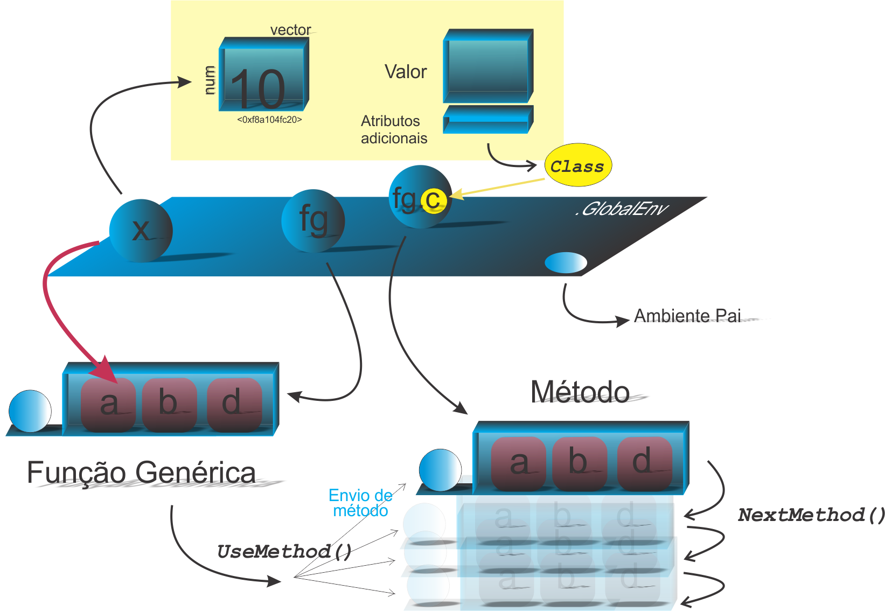

```{r setup, include=FALSE}
knitr::opts_chunk$set(echo = FALSE)
# Links
rlink <- "[R](http://r-project.org/){target='_blank'}"
rstudio <- "[RStudio](http://rstudio.org/){target='_blank'}"
cran <- "[CRAN](http://cran.r-project.org/){target='_blank'}"
github <- "[GitHub](http://github.com/){target='_blank'}"
```


<!--
YAML:
date: "`r format(Sys.time(), '%d %B, %Y')`"
=====
APRESENTACAO:

Inserir nas secoes:
{data-background=boards.jpg data-background-size=cover}
-->


## Selo DC

<center>
[{height=300 width=300}](https://bendeivide.github.io/dc/){target="_blank"}
</center>

## POO: Sistema S3

<center>
{height= width="80%"}
</center>

## Ideia inicial do mecanismo de herança

```{r echo=TRUE, include=TRUE}
# Generico
fgenerica <- function(x, ...) UseMethod("fgenerica")
# Metodo 1
fgenerica.clas1 <- function(x, z = faux(), ...) {
  x <- 3;  y <- 5
  NextMethod(generic = .Generic, object = x, y, z)
  cat("Passei pelo metodo 1")
}
# Metodo 2
fgenerica.clas2 <- function(x, y, ...) {
  cat("Chegando no metodo 2, consigo imprimir x:", x, "e y:", y, "\n")
  cat("Existe classe em x? ", print(attr(x, "class")), "\n")
}
############
# Instancia (Objeto)
x <- structure(2, class = c("clas1", "clas2"))
# Despacho:
sloop::s3_dispatch(fgenerica(x))
```

## Exemplo prático do mecanismo de herança

- Construtor
- Subclasses e superclasses
- classes públicas e privadas

```{r echo=TRUE, include=TRUE}
# Construtor
new_intparord <- function(x, ..., inteiro = FALSE, ordenado = FALSE) {
  stopifnot(is.numeric(x))
  classe = c("par", "ordenado", "inteiro")
  if (inteiro) {
    classe <- c("inteiro")
  }
  if (ordenado) {
    classe = c("ordenado", "inteiro")
  }
  structure(x, class = classe)
}
```

## Exemplo prático do mecanismo de herança

```{r echo=TRUE, include=TRUE}
# Método inteiro para o generico print
print.par <- function(x, ...) {
  NextMethod(.Generic, x = x[!as.logical(trunc(x) %% 2)])
}
# Método ordenado para o generico print
print.ordenado <- function(x, ...) {
  NextMethod(.Generic, x = sort(x))
}
# Método inteiro para o generico print
print.inteiro <- function(x, ...) {
  attributes(x) <- NULL
  print(as.integer(x))
  invisible(x)
}
```

## Exemplo prático do mecanismo de herança

```{r echo=TRUE, include=TRUE}
# Objeto com a classe desejada
x <- new_intparord(x = 10:1); x
# Despacho
sloop::s3_dispatch(print(x))
```

## Bons estudos!

<center>
[{height=500 width=500}](https://bendeivide.github.io/courses/cursor/){target="_blank"}
</center>
