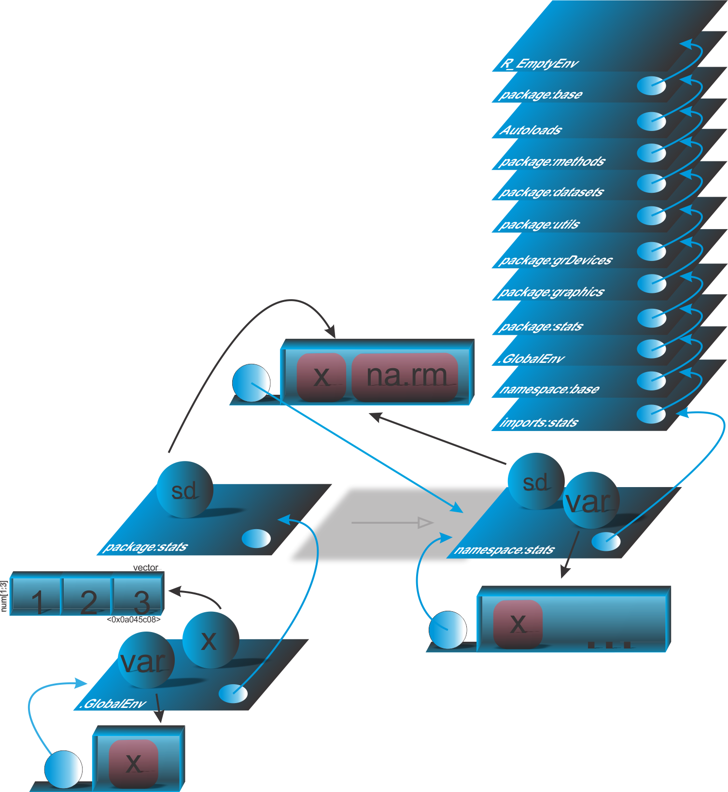

```{r setup, include=FALSE}
knitr::opts_chunk$set(echo = FALSE)
# Links
rlink <- "[R](http://r-project.org/){target='_blank'}"
rstudio <- "[RStudio](http://rstudio.org/){target='_blank'}"
cran <- "[CRAN](http://cran.r-project.org/){target='_blank'}"
github <- "[GitHub](http://github.com/){target='_blank'}"
```


<!--
YAML:
date: "`r format(Sys.time(), '%d %B, %Y')`"
=====
APRESENTACAO:

Inserir nas secoes:
{data-background=boards.jpg data-background-size=cover}
-->


## Selo DC

<center>
[{height=300 width=300}](https://bendeivide.github.io/dc/){target="_blank"}
</center>

## Introdução 

- Ambiente de pacote
- Arquivo *NAMESPACE*
  - Ambiente *namesmace:package*
  - Ambiente *imports:package*

## Ambiente de pacote e pai do ambiente global

```{r echo=TRUE, include=TRUE}
# Caminho de busca
search()
# Anexando o pacote 'parallel'
library(parallel)
# Verificando novamente o caminho de busca
search()
```

## Ambiente *namespace*

```{r echo=TRUE, include=TRUE, collapse=TRUE}
y <- 2
aux <- function() {
  return(y)
}
aux()
# Testando a funcao sd(x)
x <- 1:3 # o resultado de sd(x) de ser 1!
var <- "Nada"
# Verificando a funcao 'sd()' internamente
sd
```

## Ambiente *namespace*

```{r echo=TRUE, include=TRUE, collapse=TRUE}
# Testando sd(x)
sd(x)
# Agora veja uma outa situacao:
x <- c(1, 2, 3)
# Funcao 'var' que criamos, que nao calcula variancia de dados
var <- function(x) return("Nada")
# Funcao que depende de 'var' do pacote stats, e calcula a variancia 
aux2 <- function(x) {
  vari <- var(x)
  return(vari)
}
aux2(x)
```

## Ilustração

<center>
{width="60%"}
</center>


## Bons estudos!

<center>
[{height=500 width=500}](https://bendeivide.github.io/courses/cursor/){target="_blank"}
</center>
