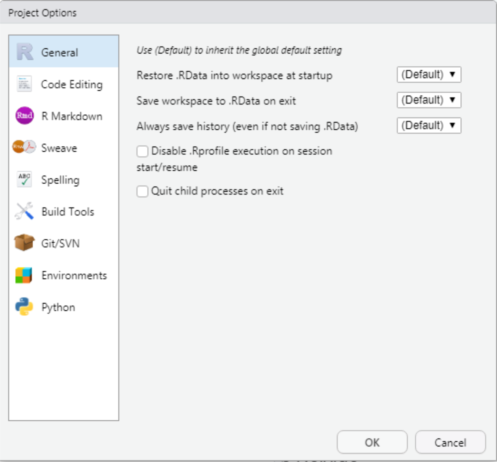

```{r setup, include=FALSE}
knitr::opts_chunk$set(echo = FALSE)
# Links
rlink <- "[R](http://r-project.org/){target='_blank'}"
rstudio <- "[RStudio](http://rstudio.org/){target='_blank'}"
cran <- "[CRAN](http://cran.r-project.org/){target='_blank'}"
github <- "[GitHub](http://github.com/){target='_blank'}"
```


<!--
YAML:
date: "`r format(Sys.time(), '%d %B, %Y')`"
=====
APRESENTACAO:

Inserir nas secoes:
{data-background=boards.jpg data-background-size=cover}
-->


## Selo DC

<center>
[{height=300 width=300}](https://bendeivide.github.io/dc/){target="_blank"}
</center>

## Introdução

- Os Projetos RStudio facilitam:
  - divisão de trabalho;
  - cada um com seu próprio diretório de trabalho (Esses projetos são associados ao diretório de trabalho do `r rlink`);
  - cada um com seu próprio espaço de trabalho;
  - cada um com seu próprio histórico;
  - cada um com seus próprios documentos de origem.
  
## Como criar um projeto RStudio

<center>
{width="100%"}
</center>

## Como criar um projeto RStudio

- Em um novo diretório (1)
- Em um diretório já existente com o código `r rlink` (2)
- Ao clonar um repositório git (3)
<center>
{width="80%"}
</center>

## Após a criação de um projeto

<center>
**Arquivo .Rproj**

{width="20%"}
</center>

<center>
**Arquivo .Rproj.user (oculto)**

{width="20%"}
</center>

## Detalhes sobre *.Rproj* e *.Rproj.user*

- `.Rproj`:
  - Diversas confirgurações para `.RData`, `.Rhistory`, dentre outros;
- `.Rproj.user`:
  - Arquivos temporários do projeto (documentos de origem, estado de janela, etc)
  - Caso exista os arquivos `.Rbuildignore` e `.gitignore`, o diretório é adicionado automaticamente.

## Carregamento do projeto

<center>
{width="100%"}
</center>

## Após o carregamento do projeto

- Uma nova sessão `r rlink` é iniciada;
- o arquivo `.RData` é carregado, se houver;
- o arquivo `.Rhistory` é carregado, se houver, no painel do *RStudio History*;
- o diretório do projeto é definido como o diretório de trabalho;
- os documentos de origem editados anteriormente são carregados nas guias do editor;
- as configurações do RStudio, como abas, dentre outras, são restauradas oara onde estavam da última vez que o projeto foi fechado.

## Opções do projeto

<center>
{width="80%"}
</center>

## Opções do projeto

<center>
{width="70%"}
</center>

## Encerramento do projeto

Após encerrar o projeto:

- `.RData` /`.Rhistory` são gravados no diretório do projeto, se foram configuradas para tal;
- a lista de documentos de código aberto é salva;
- As configurações do RStudio são salvas;
- Por fim, a sesão `r rlink` é encerrada.

  
## Bons estudos!

<center>
[{height=500 width=500}](https://bendeivide.github.io/courses/cursor/){target="_blank"}
</center>
