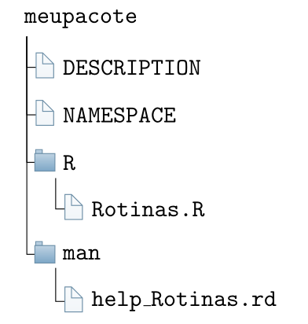
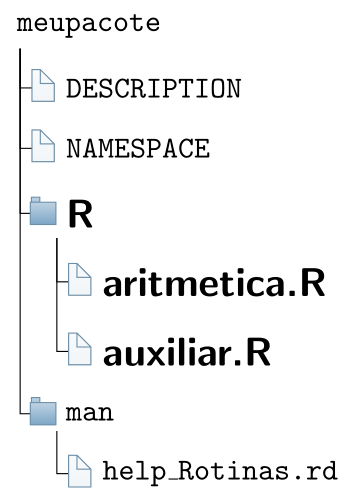
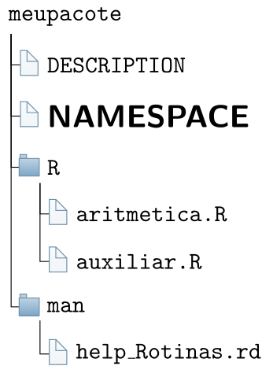
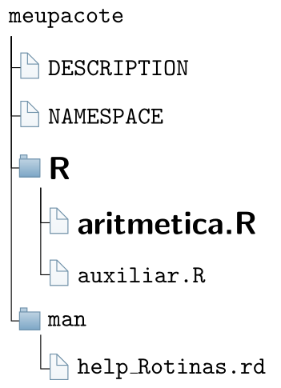
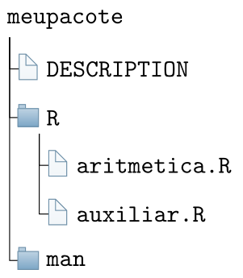

```{r setup, include=FALSE}
knitr::opts_chunk$set(echo = FALSE)
# Links
rlink <- "[R](http://r-project.org/){target='_blank'}"
rstudio <- "[RStudio](http://rstudio.org/){target='_blank'}"
cran <- "[CRAN](http://cran.r-project.org/){target='_blank'}"
github <- "[GitHub](http://github.com/){target='_blank'}"
```


<!--
YAML:
date: "`r format(Sys.time(), '%d %B, %Y')`"
=====
APRESENTACAO:

Inserir nas secoes:
{data-background=boards.jpg data-background-size=cover}
-->


## Selo DC

<center>
[{height=300 width=300}](https://bendeivide.github.io/dc/){target="_blank"}
</center>


## Introdução

- Um pacote `r rlink` representa uma estrutura de arquivos e subdiretórios, dos quais armazenam códigos em `r rlink`, para que estes possam ser:
  - Otimizados;
  - Compartilhados;
  - submetidos ao CRAN;
  - etc;
- Toda a base nativa de funções do `r rlink`, é desenvolvida dentro pacotes, bem como todas as outras funções;
- No `r rlink`, o conceito de *biblioteca* não é o mesmo que *pacote*;

## O que é necessário para desenvolver pacotes `r rlink`

- O ambiente `r rlink` instalado;
  - Pacote [devtools](https://devtools.r-lib.org/) (Kit de ferramentas);
  - Pacote [roxygen2](https://roxygen2.r-lib.org/) (Documentação `r rlink`)
- [RStudio](https://www.rstudio.com/products/rstudio/download/) (opcional);
- [Rtools](https://cran.r-project.org/bin/windows/Rtools/) (SO Windows);
- $\LaTeX$ (ou alternativamente, instalar o pacote [tinytex](https://yihui.org/tinytex/)):
  - Windows: <https://miktex.org/download>
  - Ubuntu (Linux): `sudo apt-get install texlive-full`
  - MACOS: <http://tug.org/mactex/>
  
## Conhecendo a estrutura básica de um pacote

<center>

</center>

## Criando o pacote pelo RStudio

<iframe width="560" height="315" src="https://www.youtube.com/embed/aq4OL8IDRJ0" title="YouTube video player" frameborder="0" allow="accelerometer; autoplay; clipboard-write; encrypted-media; gyroscope; picture-in-picture" allowfullscreen></iframe>

## R/aritmetica.R

```{r echo=TRUE, include=TRUE, eval=FALSE}
# Operacoes basicas da matematica
aritmetica <- function (a, b, op) {
           # op: divisi, multi, soma, subtra
           if (op == "divisi") x <- divisi(a, b)
           if (op == "multi") x <- multi(a,b)
           if (op == "soma") x <- soma(a,b)
           if (op == "subtra") x <- subtra(a,b)
           return(x)
         }
```

## R/auxiliar.R

```{r echo=TRUE, include=TRUE, eval=FALSE}
soma <- function (a, b) { # Soma
          calculo <- a + b
          return(calculo)}
subtra <- function (a, b) { #Subtracao
            calculo <- a - b
            return(calculo)}
multi <- function (a, b) { # Multiplicacao
           calculo <- a * b
           return(calculo)}
divisi <- function (a, b) { # Divisao
            calculo <- a / b
            return(calculo)}
```

## Local para inserir *aritmetica.R* e *auxiliar.R*

<center>

</center>

## Editando o arquivo *DESCRIPTION*

<center>

</center>

## Editando o arquivo *DESCRIPTION*

```
Package: meupacote
Type: Package
Title: Funcoes Aritmeticas Basicas
Version: 1.0
Date: 2021-10-18
Author: Ben Deivide
Maintainer: Ben Deivide <ben.deivide@ufsj.edu.br>
Description: Este pacote realiza operacoes aritmeticas basicas utilizando dois numeros.
License: GPL (>= 2)
Encoding: UTF-8
RoxygenNote: 7.1.2
```

## Abrindo o arquivo *NAMESPACE*

```
exportPattern("^[[:alpha:]]+")
```

- __IMPORTANTE:__ O que nós vamos fazer é deletar o arquivo *NAMESPACE*;
- Vamos deixar para que o pacote [roxygen2](https://roxygen2.r-lib.org/) gere-o;

## Configurando o *roxygen2* no RStudio

<iframe width="560" height="315" src="https://www.youtube.com/embed/Nw8ZBlmy3Yw" title="YouTube video player" frameborder="0" allow="accelerometer; autoplay; clipboard-write; encrypted-media; gyroscope; picture-in-picture" allowfullscreen></iframe>

## Criando a documentação do pacote

<iframe width="560" height="315" src="https://www.youtube.com/embed/YcPRWE6oD1E" title="YouTube video player" frameborder="0" allow="accelerometer; autoplay; clipboard-write; encrypted-media; gyroscope; picture-in-picture" allowfullscreen></iframe>

## Documentação básica do pacote

```
\name{meupacote-package}
\alias{meupacote-package}
\alias{meupacote}
\docType{package}
\name{aritmetica}
\alias{aritmetica}
\title{Operacoes Matematicas Basicas}
\description{
O pacote resolve operacoes como: soma, subtracao, divisao e multiplicacao.
}
\usage{
aritmetica(a, b, op)
}
```

## Documentação básica do pacote (continuação...)

```
\arguments{
\item{a}{primeiro numero}
\item{b}{segundo numero}
\item{op}{operacao matematica}
}
\details{
A função \code{aritmetica} realiza as quatro operacoes basicas. A opcoes para o argumento
\code{op} sao "soma", "divisi", "multi", "subtra"
}
\examples{
aritmetica(8, 4, op = "divisi")
}
```

## Documentação de um pacote usando o pacote *roxygen2*

```{r echo=TRUE, include=TRUE, eval=FALSE}
#' Operacoes Matematicas Basicas
#'
#' \code{aritmetica} resolve operacoes como: soma, subtracao, divisao e multiplicacao.
#' @param a primeiro numero
#' @param b segundo numero
#' @param op operacao matematica
#' @return A função \code{aritmetica} realiza as quatro operacoes basicas. As opcoes 
#' para o argumento \code{op} sao "soma", "divisi", "multi", "subtra"
#' @examples
#' # Loading package
#' library(meupacote)
#' aritmetica(8, 4, op = "divisi")
# @import "nomes de pacotes importados"
# @importFrom "Pacotes" "funcoes"
#' @export
aritmetica <- function (a, b, op) {
           # op: divisi, multi, soma, subtra
           if (op == "divisi") x <- divisi(a, b)
           if (op == "multi") x <- multi(a,b)
           if (op == "soma") x <- soma(a,b)
           if (op == "subtra") x <- subtra(a,b)
           return(x)}
```

## Atualizando o arquivo *R/aritmetica.R*

<center>

</center>

## Organizando os arquivos do pacote

- Antes de compilarmos o pacote, vamos excluir o arquivo *NAMESPACE*, e todos os arquivos `Man/~.Rd`
- O diretório do pacote ficará assim:

<center>

</center>

## Atualizando o pacote com o *roxygen2*

<iframe width="560" height="315" src="https://www.youtube.com/embed/c7C9nSCGoPQ" title="YouTube video player" frameborder="0" allow="accelerometer; autoplay; clipboard-write; encrypted-media; gyroscope; picture-in-picture" allowfullscreen></iframe>

## Checando o pacote

<iframe width="560" height="315" src="https://www.youtube.com/embed/pv98iNiOgqg" title="YouTube video player" frameborder="0" allow="accelerometer; autoplay; clipboard-write; encrypted-media; gyroscope; picture-in-picture" allowfullscreen></iframe>

## Submissão do pacote ao CRAN

- Onde enviar: <https://cran.r-project.org/submit.html>

<iframe width="560" height="315" src="https://www.youtube.com/embed/ou20KCmxSZ0" title="YouTube video player" frameborder="0" allow="accelerometer; autoplay; clipboard-write; encrypted-media; gyroscope; picture-in-picture" allowfullscreen></iframe>

## Bons estudos!

<center>
[{height=500 width=500}](https://bendeivide.github.io/courses/cursor/){target="_blank"}
</center>
