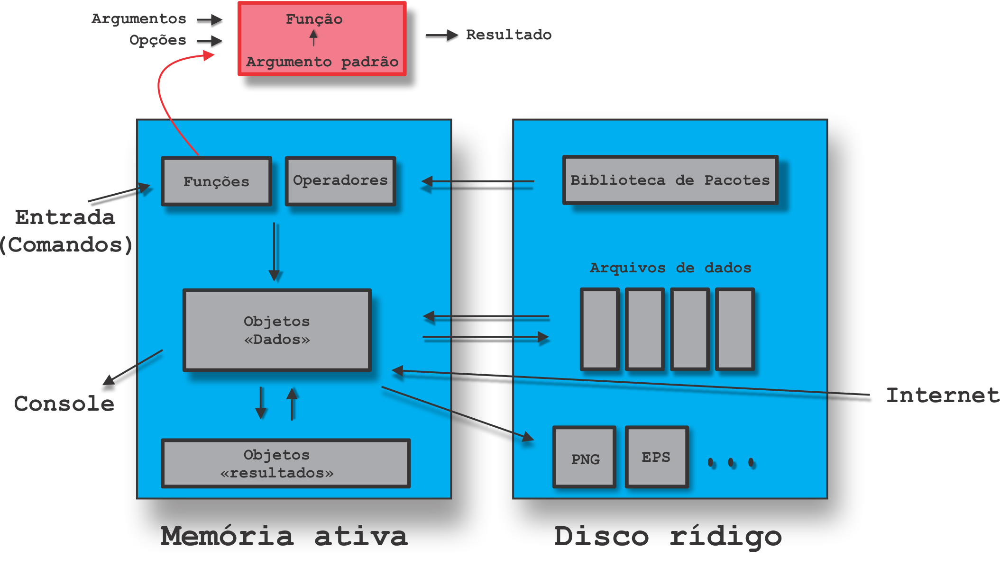

```{r setup, include=FALSE}
knitr::opts_chunk$set(echo = FALSE)
```

## Três princípios do R

Segundo @chambers2016, o `R` tem três princípios:

- Tudo que existe em `R` é um objeto;
- Tudo que acontece no `R` é uma chamada de função;
- Interfaces para outros programas são parte do `R`.

## Esquema de como o R trabalha

Esquema adaptado de @paradis2005, como o `R` trabalha:

```{r rworks, fig.cap = "Esquema de como o `R` funciona.", out.width="70%", fig.align='center'}

```

## Bons estudos!

<center>
[{height=500 width=500}](http://youtube.com/bendeivide){target="_blank"}
</center>

## Referências


