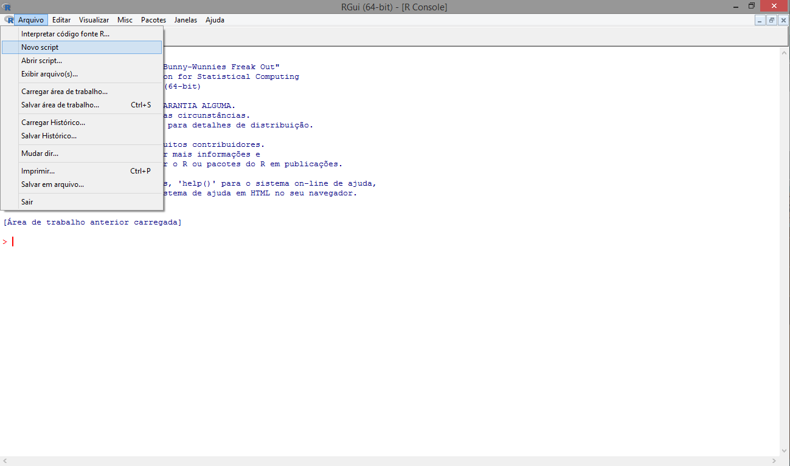
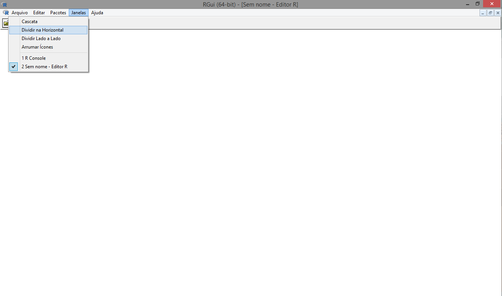
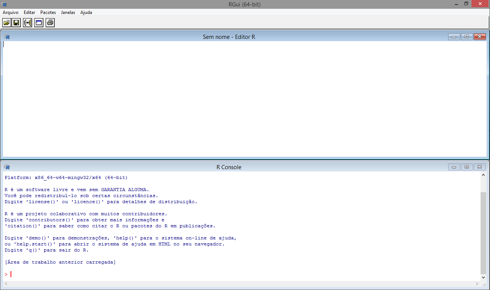
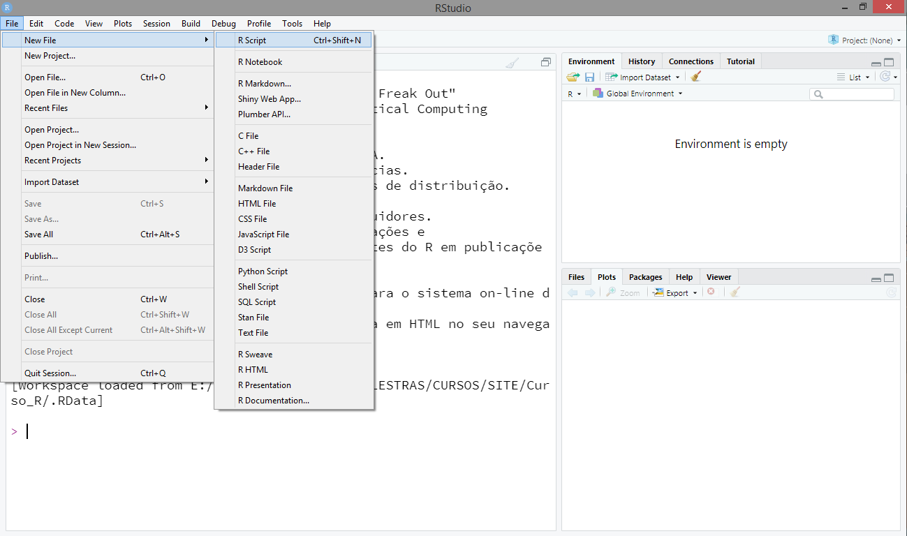
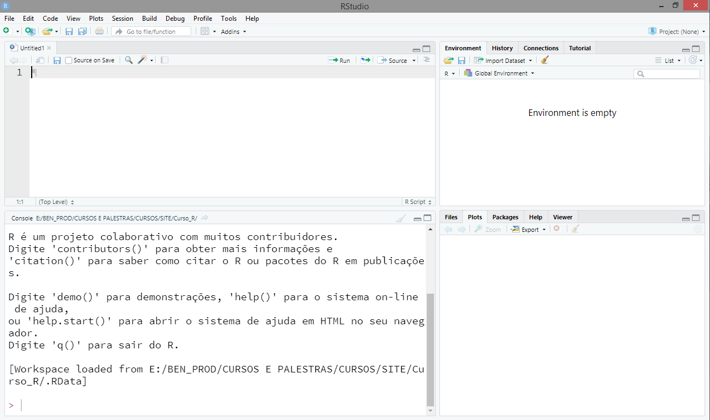

```{r setup, include=FALSE}
knitr::opts_chunk$set(echo = FALSE)
```

## R

```{r, out.width = "100%", fig.align='center'}

```

## R

```{r, out.width = "100%", fig.align='center'}

```

## R

```{r, out.width = "100%", fig.align='center'}

```


## RStudio

```{r, out.width = "100%", fig.align='center'}

```

## RStudio

```{r, out.width = "100%", fig.align='center'}

```

## Diretório de trabalho

- Saber o diretório de trabalho: `getwd()`
- Mudar o diretório de trabalho: `setwd()`

## Carregando comandos de outros `Scripts`

- Usaremos a função `source()`

## Bons estudos!

<center>
[{height=500 width=500}](http://youtube.com/bendeivide){target="_blank"}
</center>


