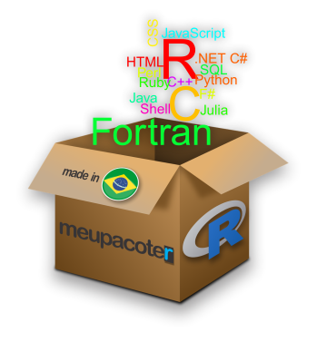

```{r setup, include=FALSE}
knitr::opts_chunk$set(echo = FALSE)
# Anexando pacotes
library(magrittr)
# Links
rlink <- "[R](http://r-project.org/){target='_blank'}"
rstudio <- "[RStudio](http://rstudio.org/){target='_blank'}"
cran <- "[CRAN](http://cran.r-project.org/){target='_blank'}"
```

## Introdução

<blockquote>
<p>
- **Princípio da Interface**: Interfaces para outros programas são parte do `R`,
</p>
</blockquote>

<center>

<center/>

## Implementação em `Python`

- Pacote
```{r, echo=TRUE, eval=FALSE, prompt=TRUE}
# Pacote
install.packages(reticulate)
```
- `add.py`
```{python, echo = TRUE, eval = FALSE}
def add(x, y):
  return x + y
```
- `r-python.R`
```{r echo=TRUE, prompt=TRUE}
# Carregando o script add.py
reticulate::source_python('add.py') 
# Chamando a funcao add
add(5, 10)
```

## Implemento em `C++`

- Pacote
```{r, echo=TRUE, eval=FALSE, prompt=TRUE}
install.packages(Rcpp)
```

- `add.cpp`
```{Rcpp, echo=TRUE, eval=FALSE}
#include <Rcpp.h>
using namespace Rcpp;

// [[Rcpp::export]]
int add(int x, int y) {
  return x + y;
}
```
- `add.cpp`
```{r, echo=TRUE, prompt=TRUE, warning=FALSE}
Rcpp::sourceCpp("add.cpp") # Carregando o script add.cpp
add(5, 10) # Chamando a funcao add
```

## Implemento em `Tcl/tk`

## Implementação em TclTk {.smaller}

- Pacote `tcltk`

<iframe width="560" height="315" src="https://www.youtube.com/embed/u1AQoCEfOF0" frameborder="0" allow="accelerometer; autoplay; clipboard-write; encrypted-media; gyroscope; picture-in-picture" allowfullscreen></iframe>

## Bons estudos!


<center>
[{height=500 width=500}](http://youtube.com/bendeivide){target="_blank"}
</center>


