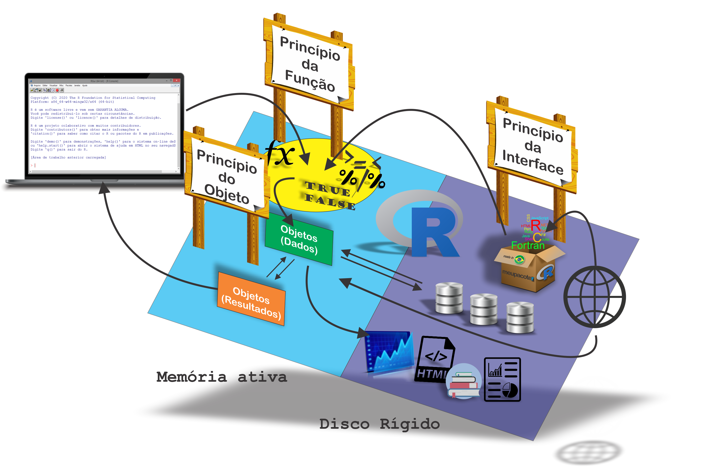

```{r setup, include=FALSE}
knitr::opts_chunk$set(echo = FALSE)
# Anexando pacotes
library(magrittr)
# Links
rlink <- "[R](http://r-project.org/){target='_blank'}"
rstudio <- "[RStudio](http://rstudio.org/){target='_blank'}"
cran <- "[CRAN](http://cran.r-project.org/){target='_blank'}"
```

## Introdução

{width="80%"}

## Pontos para o próximo módulo

- Aprofundamento sobre os objetos, associando-os com a tipagem da linguagem *C*;
- Cópias de objetos;
- Aprofundamento sobre Ambientes;
- Programação Orientada a objetos, bem como estudo de Métodos e Classes;
- Programação Funcional:
  - Evitando loops;
  - Eficiência;
  - Programando em baixo nível;
  - Programação defensiva;
- Introdução a Criação de Pacotes;
- Gráficos;
- Criação de documentos estáticas e dinâmicas;

## Bons estudos!


<center>
[{height=500 width=500}](http://youtube.com/bendeivide){target="_blank"}
</center>


