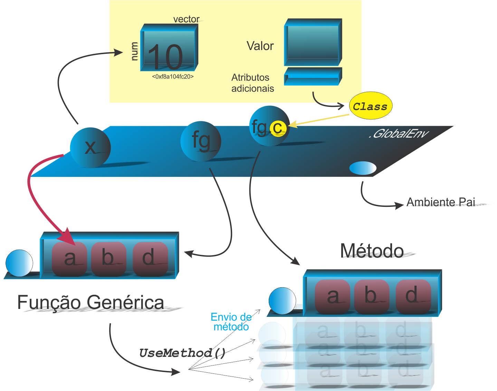

```{r setup, include=FALSE}
knitr::opts_chunk$set(echo = FALSE)
```

<!--
YAML:
date: "`r format(Sys.time(), '%d %B, %Y')`"
=====
APRESENTACAO:

Inserir nas secoes:
{data-background=boards.jpg data-background-size=cover}
-->


## Selo DC

<center>
[{height=300 width=300}](https://bendeivide.github.io/dc/){target="_blank"}
</center>

## Revisando Tipos de Sistemas POO

Segundo @chambers2016:

- **POO encapsulada**: os métodos são encapsulado em suas classes, isto é, os objetos nesse estilo de programação contém os seus comportamentos;
- **POO funcional**: os métodos pertencem as funções, das quais serão aplicadas aos objetos de determinada classe.

<center>
{height= width="100%"}
</center>


## Sistema S3

- Função Genérica: `fgenerica()`
- classe: `classe`
- Objeto de uma classe (Primeiro argumento da Função genérica)
- Método: `fgenerica.classe()`

## Ilustração

<center>
{height= width="80%"}
</center>
## Aplicação

```{r echo=TRUE, include=TRUE, collapse=TRUE}
# Funcao generica
quem <- function(x) UseMethod("quem")
## Metodos
quem.eh <- function(x) print("Sou eu!")
quem.default <- function(x) print("??")
# Aplicacao:
pessoa <- "ben" # objeto sem atributo 'class'
quem(pessoa) # Aplicando o metodo S3
#--------
class(pessoa) <- "eh"
quem(pessoa)
#---------
quem(unclass(pessoa)) # unclass omite o atributo 'class' ao objeto
#---------
class(pessoa) <- "outro" # Mudando o atributo 'class'
quem(pessoa)
```


## Bons estudos!

<center>
[{height=500 width=500}](https://bendeivide.github.io/courses/cursor/){target="_blank"}
</center>

## Referências
