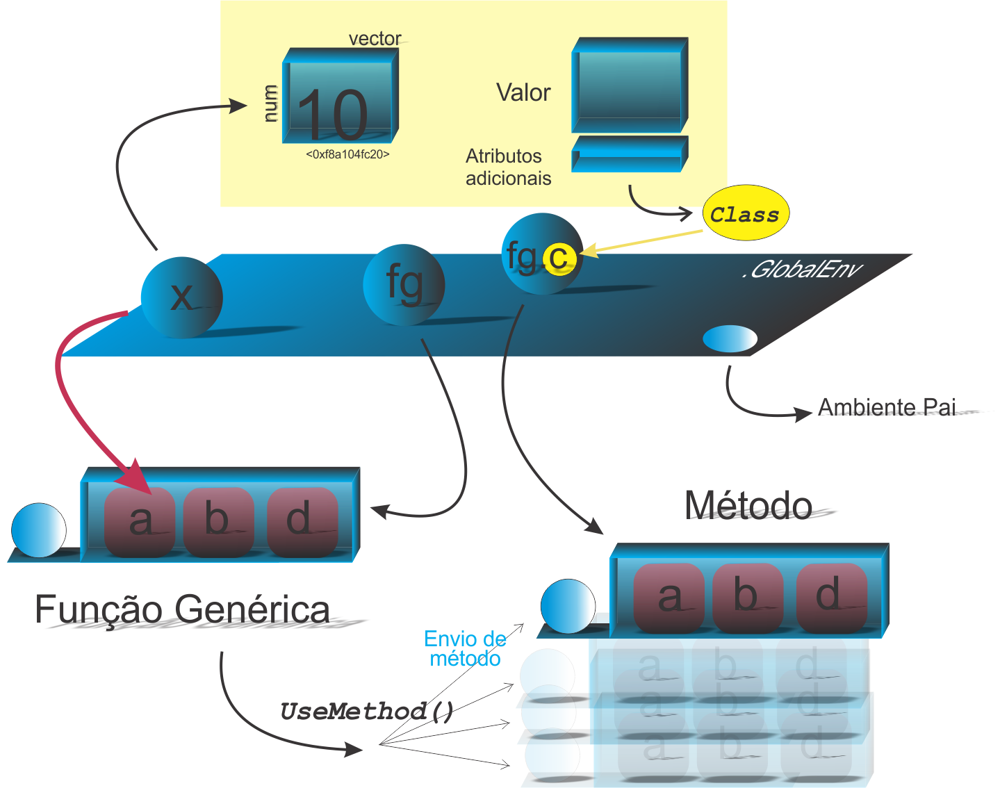

```{r setup, include=FALSE}
knitr::opts_chunk$set(echo = FALSE)
# Links
rlink <- "[R](http://r-project.org/){target='_blank'}"
rstudio <- "[RStudio](http://rstudio.org/){target='_blank'}"
cran <- "[CRAN](http://cran.r-project.org/){target='_blank'}"
github <- "[GitHub](http://github.com/){target='_blank'}"
```


<!--
YAML:
date: "`r format(Sys.time(), '%d %B, %Y')`"
=====
APRESENTACAO:

Inserir nas secoes:
{data-background=boards.jpg data-background-size=cover}
-->


## Selo DC

<center>
[{height=300 width=300}](https://bendeivide.github.io/dc/){target="_blank"}
</center>

## POO: Sistema S3

<center>
{height= width="80%"}
</center>

## Ideia básica internamente ao *UseMethod()*

```{r echo=TRUE, include=TRUE}
## Primeiro argumento do generico
x <- 1:10
## Ideia sobre os potenciais metodos (UseMethod)
paste0("generic", ".", c(class(x), "default"))
```

## Verificando o despacho

```{r echo=TRUE, include=TRUE}
# Instalar o pacote 'sloop', se nao tiver!
# Objeto de classe 'data.frame'
x <- data.frame() 
# Despacho (envio) do generico 'print'
sloop::s3_dispatch(print(x))
```

## Saída da chamada *s3_dispactch()*

O resultado da chamada `sloop::s3_dispatch()` pode apresentar três símbolos antes dos potenciais nomes de métodos:

- `=>`: este símbolo indica que a função genérica  despachou no referido método;
- `*`: este símbolo indica que  este método existe, mas a função genérica  não despachou nele;
- `->`: indica o método herdado;

## Aplicação

```{r echo=TRUE, include=TRUE}
# Funcao generica
quem_sou_eu <- function(x, ...) UseMethod("quem_sou_eu")
# Metodo numero natural
quem_sou_eu.numero_natural <- function(x, ...){
  message("Eu sou um numero natural")
  NextMethod("quem_sou_eu")
}
# Metodo numerico
quem_sou_eu.numerico <- function(x, ...) message("Eu sou numerico")
# Objeto
x <- 1:10
# Classe
class(x) <- c("numero_complexo","numero_natural","numerico")
# Despacho
sloop::s3_dispatch(quem_sou_eu(x))
```

## Funções primitivas genéricas

```{r echo=TRUE, include=TRUE}
# Eh primitiva generica?
sloop::is_s3_generic("cbind")
# Onde ocorre o despacho?
sloop::s3_dispatch(cbind(1:10))
```

## Genéricas de grupo

```{r echo=TRUE, include=TRUE}
# Objeto de classe factor
x <- factor(1:5)
# Verificando o despacho de sqrt() do grupo 'Math'
sloop::s3_dispatch(sqrt(x))
# Verificando o metodo Math.factor()
Math.factor
```

## Bons estudos!

<center>
[{height=500 width=500}](https://bendeivide.github.io/courses/cursor/){target="_blank"}
</center>
