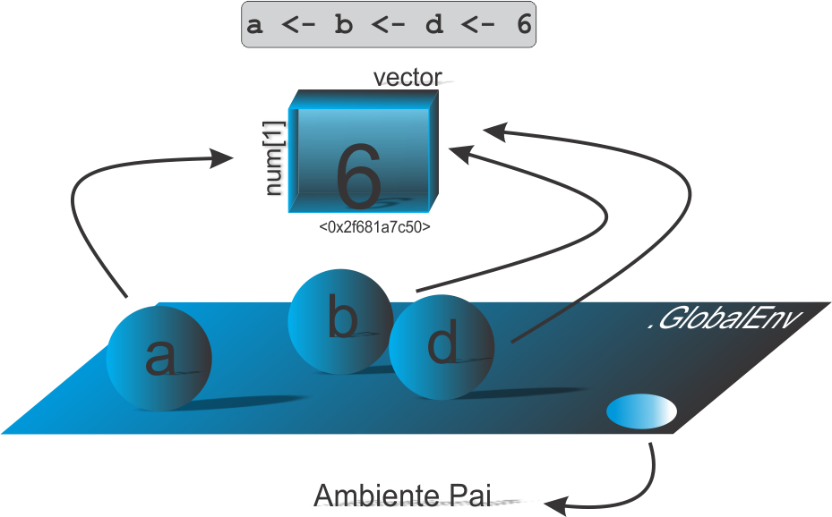
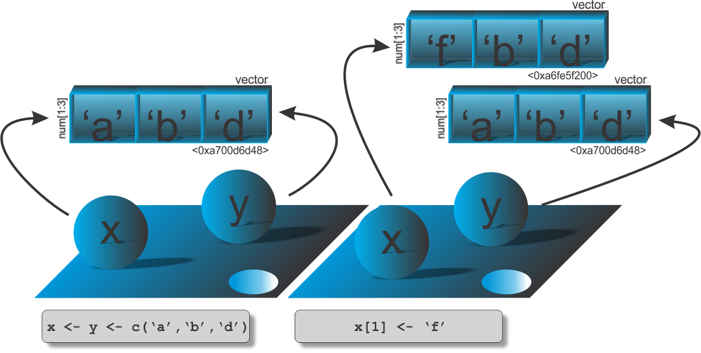

```{r setup, include=FALSE}
knitr::opts_chunk$set(echo = FALSE)
# Links
rlink <- "[R](http://r-project.org/){target='_blank'}"
rstudio <- "[RStudio](http://rstudio.org/){target='_blank'}"
cran <- "[CRAN](http://cran.r-project.org/){target='_blank'}"
github <- "[GitHub](http://github.com/){target='_blank'}"
```


<!--
YAML:
date: "`r format(Sys.time(), '%d %B, %Y')`"
=====
APRESENTACAO:

Inserir nas secoes:
{data-background=boards.jpg data-background-size=cover}
-->


## Selo DC

<center>
[{height=300 width=300}](https://bendeivide.github.io/dc/){target="_blank"}
</center>

## Tudo é um objeto

<center>

</center>

## Vinculação compartilhada

<center>
{width="80%"}
</center>

## Vinculação compartilhada

```{r echo=TRUE, include=TRUE}
# Exemplo 1
a <- b <- d <- 6
# identificador de memoria
lobstr::obj_addr(a)
lobstr::obj_addr(b)
lobstr::obj_addr(d)
```

## Cópia e modificação no local de um vetor

<center>
{width="80%"}
</center>

## Cópia e modificação no local de um vetor

```{r echo=TRUE, include=TRUE, collapse=TRUE}
# Vetor numerico de comprimento 3
w <- rnorm(3); w
# Acionando a funcao 'tracemem()' e imprimindo o id de memoria
cat(tracemem(w), "\n")
# Vinculacao de outro nome e copia
z <- w; z[2] <- 10
# Desativando o rastreamento
untracemem(w)
# Modificando novamente o obj z
z[1] <- 100; z
# Identificador de memoria
lobstr::obj_addr(z)
```

## Contagem de referência

```{r echo=TRUE, include=TRUE, eval=FALSE, collapse=TRUE}
# Vetor
w <- rnorm(3)
# Inspecao
.Internal(inspect(w))
## @0x00000000060b2488 14 REALSXP g0c3 [REF(1)] (len=3, tl=0) -0.398,0.206,3.375
# Vinculacao de outro nome e copia
z <- w
# Inspecao
.Internal(inspect(z))
## @0x00000000060b2488 14 REALSXP g0c3 [REF(2)] (len=3, tl=0) -0.398,0.206,3.375
.Internal(inspect(w))
## @0x00000000060b2488 14 REALSXP g0c3 [REF(2)] (len=3, tl=0) -0.398,0.206,3.375
z[2] <- 10
# Inspecao
.Internal(inspect(z))
## @0x00000000060b22a8 14 REALSXP g0c3 [REF(1)] (len=3, tl=0) -0.398,10,3.375
.Internal(inspect(w))
## @0x00000000060b2488 14 REALSXP g0c3 [REF(1)] (len=3, tl=0) -0.398,0.206,3.375
```

## Contagem de referência

```{r echo=TRUE, include=TRUE, eval=FALSE, collapse=TRUE}
z[2] <- 10
# Inspecao
.Internal(inspect(z))
## @0x00000000060b22a8 14 REALSXP g0c3 [REF(1)] (len=3, tl=0) -0.398,10,3.375
.Internal(inspect(w))
## @0x00000000060b2488 14 REALSXP g0c3 [REF(1)] (len=3, tl=0) -0.398,0.206,3.375
# Modificando novamente o obj z
z[1] <- 100; z
## [1] 100.00000  10.00000   3.37503
# Inspecao
.Internal(inspect(z))
## @0x00000000060b22a8 14 REALSXP g0c3 [REF(1)] (len=3, tl=0) 100,10,3.375
.Internal(inspect(w))
## @0x00000000060b2488 14 REALSXP g0c3 [REF(1)] (len=3, tl=0) -0.398,0.206,3.375
```


## Bons estudos!

<center>
[{height=500 width=500}](https://bendeivide.github.io/courses/cursor/){target="_blank"}
</center>
