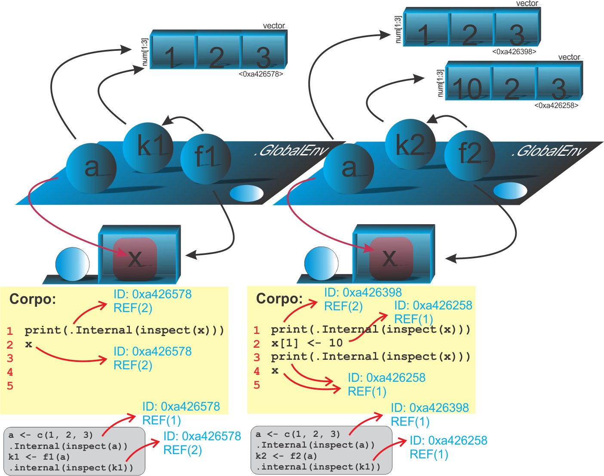

```{r setup, include=FALSE}
knitr::opts_chunk$set(echo = FALSE)
# Links
rlink <- "[R](http://r-project.org/){target='_blank'}"
rstudio <- "[RStudio](http://rstudio.org/){target='_blank'}"
cran <- "[CRAN](http://cran.r-project.org/){target='_blank'}"
github <- "[GitHub](http://github.com/){target='_blank'}"
```


<!--
YAML:
date: "`r format(Sys.time(), '%d %B, %Y')`"
=====
APRESENTACAO:

Inserir nas secoes:
{data-background=boards.jpg data-background-size=cover}
-->


## Selo DC

<center>
[{height=300 width=300}](https://bendeivide.github.io/dc/){target="_blank"}
</center>

## Cópia, e modificação no local em funções

<center>
{width="70%"}
</center>

## Inspecionando os objetos

```{r echo=TRUE, include=TRUE, eval=FALSE}
f1 <- function(x) {
  print(.Internal(inspect(x)))
  x
}
f2 <- function(x) {
  print(.Internal(inspect(x)))
  x[1] <- 10
  print(.Internal(inspect(x)))
  x
} 
```

## Inspecionando os objetos

```{r echo=TRUE, include=TRUE, eval=FALSE}
# Caso 1
a <- c(1, 2, 3)
.Internal(inspect(a))
## @0x000000000a426578 14 REALSXP g0c3 [REF(1)] (len=3, tl=0) 1,2,3
k1 <- f1(a)
## @0x000000000a426578 14 REALSXP g0c3 [REF(2)] (len=3, tl=0) 1,2,3
## [1] 1 2 3
.Internal(inspect(k1))
## @0x000000000a426578 14 REALSXP g0c3 [REF(2)] (len=3, tl=0) 1,2,3
# Caso 2
a <- c(1, 2, 3)
.Internal(inspect(a))
## @0x000000000a426398 14 REALSXP g0c3 [REF(1)] (len=3, tl=0) 1,2,3
k2 <- f2(a)
## @0x000000000a426398 14 REALSXP g0c3 [REF(2)] (len=3, tl=0) 1,2,3
## [1] 1 2 3
## @0x000000000a426258 14 REALSXP g0c3 [REF(1)] (len=3, tl=0) 10,2,3
## [1] 10  2  3
.Internal(inspect(k2))
## @0x000000000a426258 14 REALSXP g0c3 [REF(1)] (len=3, tl=0) 10,2,3
```

## Bons estudos!

<center>
[{height=500 width=500}](https://bendeivide.github.io/courses/cursor/){target="_blank"}
</center>
