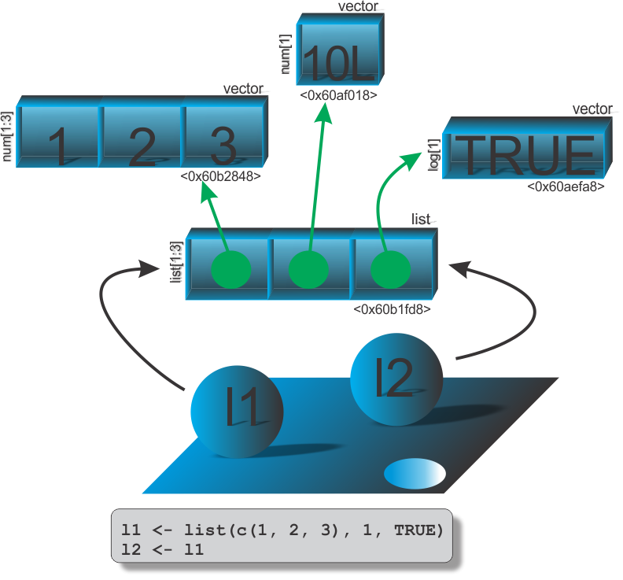

```{r setup, include=FALSE}
knitr::opts_chunk$set(echo = FALSE)
# Links
rlink <- "[R](http://r-project.org/){target='_blank'}"
rstudio <- "[RStudio](http://rstudio.org/){target='_blank'}"
cran <- "[CRAN](http://cran.r-project.org/){target='_blank'}"
github <- "[GitHub](http://github.com/){target='_blank'}"
```


<!--
YAML:
date: "`r format(Sys.time(), '%d %B, %Y')`"
=====
APRESENTACAO:

Inserir nas secoes:
{data-background=boards.jpg data-background-size=cover}
-->


## Selo DC

<center>
[{height=300 width=300}](https://bendeivide.github.io/dc/){target="_blank"}
</center>

## Introdução

- Seguirá as mesmas ideias como visto em vetores;
- Contagem de referência: `REF(#)` 
    - `# = 1` ocorrerá modificação no local;
    - `# > 1` ocorrerá cópia na modificação.

## Relembrando a estrutura de uma lista 

<center>
{width="70%"}
</center>


## Cópia, e modificação no local am listas

```{r echo=TRUE, include=TRUE, eval=FALSE, collapse=TRUE}
# Objeto lista
l1 <- list(c(1, 2, 3), 10L, TRUE)
# Inspecao do objeto
.Internal(inspect(l1))
## @0x00000000060b27f8 19 VECSXP g0c3 [REF(1)] (len=3, tl=0)
##  @0x00000000060b2848 14 REALSXP g0c3 [REF(1)] (len=3, tl=0) 1,2,3
##  @0x00000000060af018 13 INTSXP g0c1 [REF(3)] (len=1, tl=0) 10
##  @0x00000000060aefa8 10 LGLSXP g0c1 [REF(3)] (len=1, tl=0) 1
# Associacao de outro nome l2 ao obj lista
l2 <- l1
# Inspecao
.Internal(inspect(l2))
## @0x00000000060b27f8 19 VECSXP g0c3 [REF(2)] (len=3, tl=0)
##  @0x00000000060b2848 14 REALSXP g0c3 [REF(1)] (len=3, tl=0) 1,2,3
##  @0x00000000060af018 13 INTSXP g0c1 [REF(3)] (len=1, tl=0) 10
##  @0x00000000060aefa8 10 LGLSXP g0c1 [REF(3)] (len=1, tl=0) 1
# Alterando l2
l2[[3]] <- 5
# Inspecao
.Internal(inspect(l2))
## @0x00000000064fc860 19 VECSXP g0c3 [REF(1)] (len=3, tl=0)
##  @0x00000000060b2848 14 REALSXP g0c3 [REF(2)] (len=3, tl=0) 1,2,3
##  @0x00000000060af018 13 INTSXP g0c1 [REF(4)] (len=1, tl=0) 10
##  @0x0000000007fc77e0 14 REALSXP g0c1 [REF(3)] (len=1, tl=0) 5
```

## Ilustração

<center>
{width="70%"}
</center>

## Bons estudos!

<center>
[{height=500 width=500}](https://bendeivide.github.io/courses/cursor/){target="_blank"}
</center>
