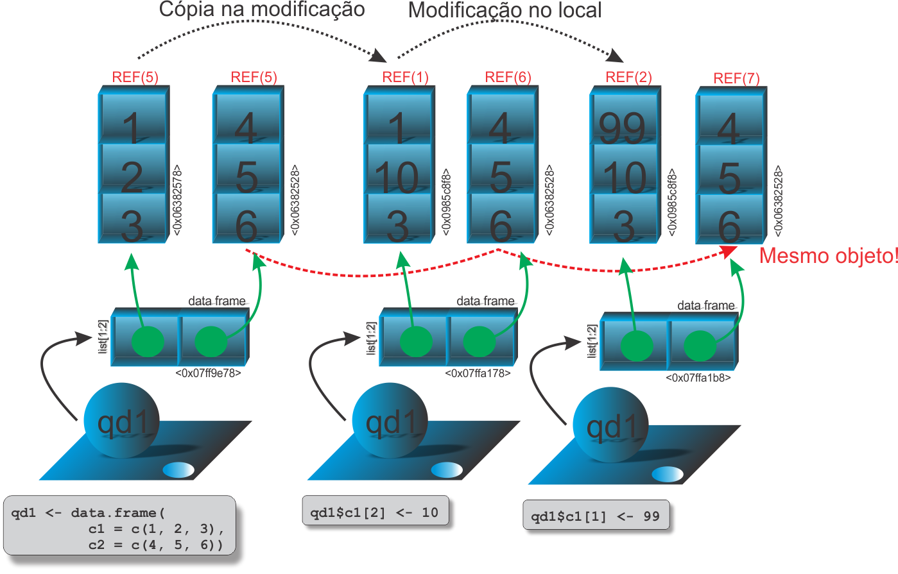

```{r setup, include=FALSE}
knitr::opts_chunk$set(echo = FALSE)
# Links
rlink <- "[R](http://r-project.org/){target='_blank'}"
rstudio <- "[RStudio](http://rstudio.org/){target='_blank'}"
cran <- "[CRAN](http://cran.r-project.org/){target='_blank'}"
github <- "[GitHub](http://github.com/){target='_blank'}"
```


<!--
YAML:
date: "`r format(Sys.time(), '%d %B, %Y')`"
=====
APRESENTACAO:

Inserir nas secoes:
{data-background=boards.jpg data-background-size=cover}
-->


## Selo DC

<center>
[{height=300 width=300}](https://bendeivide.github.io/dc/){target="_blank"}
</center>

## Introdução

- Um objeto quadro de dados (*data frame*) é um tipo de lista, com características especiais, como visto no [módulo básico](https://bendeivide.github.io/cursor/nbasico.html)
- A ideia de cópia e modificação no local é similar ao que ocorre com as listas, mas existe diferença;
- Alterar os valores de uma coluna, modifica apenas a coluna;
- Alterar os valores em linha, todo o objeto é copiado;

## Ilustração

<center>
{width="100%"}
</center>

## Código e inspeção

```{r echo=TRUE, include=TRUE, collapse=TRUE, eval=FALSE, collapse=TRUE}
qd1 <- data.frame(c1 = c(1, 2, 3), c2 = c(4, 5, 6)) 
# Inspecao
.Internal(inspect(qd1))
## @0x0000000007ff9e78 19 VECSXP g0c2 [OBJ,REF(1),ATT] (len=2, tl=0)
##  @0x0000000006382578 14 REALSXP g0c3 [REF(5)] (len=3, tl=0) 1,2,3
##  @0x0000000006382528 14 REALSXP g0c3 [REF(5)] (len=3, tl=0) 4,5,6
## ATTRIB:
## ...
# A primeira alteracao em copia
qd1$c1[2] <- 10
.Internal(inspect(qd1))
## @0x0000000007ffa178 19 VECSXP g0c2 [OBJ,REF(1),ATT] (len=2, tl=0)
##  @0x000000000985c8f8 14 REALSXP g0c3 [REF(1)] (len=3, tl=0) 1,10,3
##  @0x0000000006382528 14 REALSXP g0c3 [REF(6)] (len=3, tl=0) 4,5,6
## ATTRIB:
## ...
```

## Código e inspeção

```{r echo=TRUE, include=TRUE, collapse=TRUE, eval=FALSE, collapse=TRUE}
# Quando REF(1), a modificacao ocorre no local
qd1$c1[1] <- 99
.Internal(inspect(qd1))
## @0x0000000007ffa1b8 19 VECSXP g0c2 [OBJ,REF(1),ATT] (len=2, tl=0)
##  @0x000000000985c8f8 14 REALSXP g0c3 [REF(2)] (len=3, tl=0) 99,10,3
##  @0x0000000006382528 14 REALSXP g0c3 [REF(7)] (len=3, tl=0) 4,5,6
## ATTRIB:
## ...
# Porem, quando a alteracao ocorre em linha,
# sempre havera copia na modificacao
qd1[1,] <- c(00, 00)
.Internal(inspect(qd1))
## @0x0000000007c2f3c8 19 VECSXP g0c2 [OBJ,REF(1),ATT] (len=2, tl=0)
##  @0x00000000098c3550 14 REALSXP g0c3 [REF(1)] (len=3, tl=0) 0,10,3
##  @0x00000000098c3500 14 REALSXP g0c3 [REF(1)] (len=3, tl=0) 0,5,6
## ATTRIB:
## ...
```

## Código e inspeção

```{r echo=TRUE, include=TRUE, collapse=TRUE, eval=FALSE, collapse=TRUE}
# Porem, mesmo com REF(1) e alteracao em linha,
# havera copia na modificacao
qd1[2,] <- c(11, 11)
.Internal(inspect(qd1))
## @0x0000000007c0abe8 19 VECSXP g0c2 [OBJ,REF(1),ATT] (len=2, tl=0)
##  @0x00000000098c3230 14 REALSXP g0c3 [REF(1)] (len=3, tl=0) 0,11,3
##  @0x00000000098c31e0 14 REALSXP g0c3 [REF(1)] (len=3, tl=0) 0,11,6
## ATTRIB:
## ...
```

## Dois ou mais nomes associados ao objeto *data frame*

- Segue as mesmas ideias vistas anteriormente, isto é:
  - sempre o objeto *data frame* será copiado;
  - os elementos serão copiados ou modificados no local, seguindo as mesmas regras com alteração por coluna ou por linha


## Bons estudos!

<center>
[{height=500 width=500}](https://bendeivide.github.io/courses/cursor/){target="_blank"}
</center>
