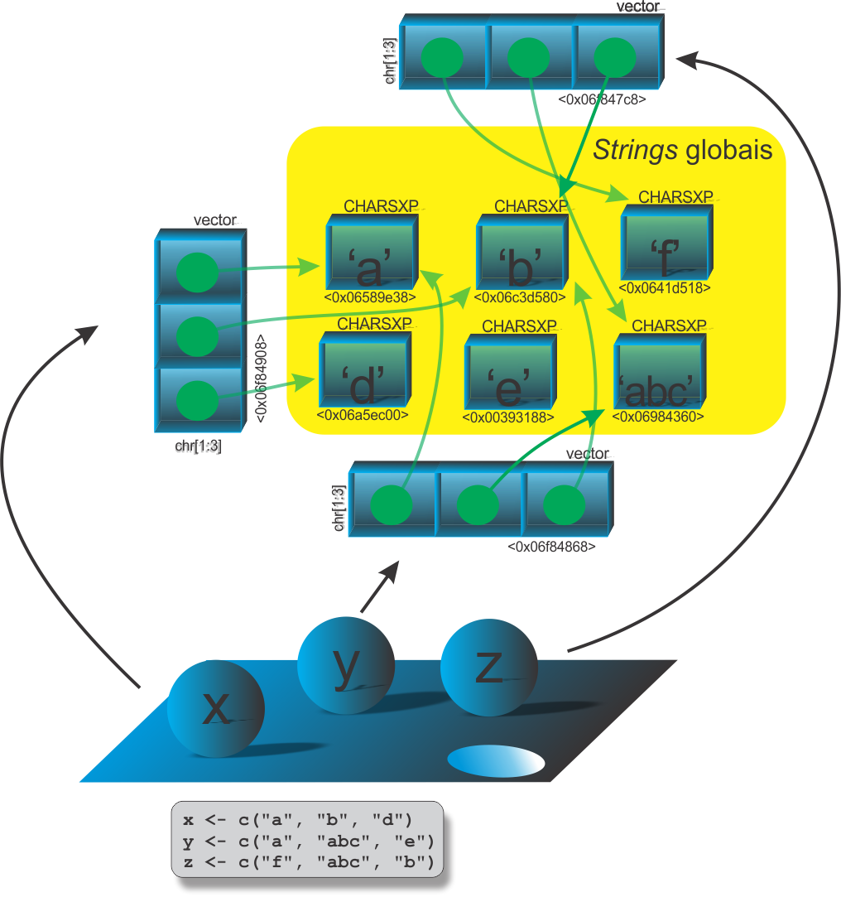

```{r setup, include=FALSE}
knitr::opts_chunk$set(echo = FALSE)
# Links
rlink <- "[R](http://r-project.org/){target='_blank'}"
rstudio <- "[RStudio](http://rstudio.org/){target='_blank'}"
cran <- "[CRAN](http://cran.r-project.org/){target='_blank'}"
github <- "[GitHub](http://github.com/){target='_blank'}"
```


<!--
YAML:
date: "`r format(Sys.time(), '%d %B, %Y')`"
=====
APRESENTACAO:

Inserir nas secoes:
{data-background=boards.jpg data-background-size=cover}
-->


## Selo DC

<center>
[{height=300 width=300}](https://bendeivide.github.io/dc/){target="_blank"}
</center>

## Revisando

<center>
{width="80%"}
</center>

## Realidade

<center>
{width="60%"}
</center>

## Código e inspeção

```{r echo=TRUE, include=TRUE, eval=FALSE, collapse=TRUE}
# Criamos tres objetos tipo 'character'
x <- c("a", "b", "d")
y <- c("a", "abc", "e")
z <- c("f", "abc", "b")
# Inspecionando os objetos
.Internal(inspect(x))
## @0x0000000006f84908 16 STRSXP g0c3 [REF(1)] (len=3, tl=0)
##  @0x0000000006589e38 09 CHARSXP g0c1 [MARK,REF(10),gp=0x61] [ASCII] [cached] "a"
##  @0x0000000006c3d580 09 CHARSXP g0c1 [MARK,REF(14),gp=0x60] [ASCII] [cached] "b"
##  @0x0000000006a5ec00 09 CHARSXP g0c1 [MARK,REF(5),gp=0x61] [ASCII] [cached] "d"
.Internal(inspect(y))
## @0x0000000006f84868 16 STRSXP g0c3 [REF(1)] (len=3, tl=0)
##  @0x0000000006589e38 09 CHARSXP g0c1 [MARK,REF(10),gp=0x61] [ASCII] [cached] "a"
##  @0x0000000006984360 09 CHARSXP g0c1 [REF(7),gp=0x60] [ASCII] [cached] "abc"
##  @0x0000000000393188 09 CHARSXP g0c1 [MARK,REF(5),gp=0x61] [ASCII] [cached] "e"
.Internal(inspect(z))
## @0x0000000006f847c8 16 STRSXP g0c3 [REF(1)] (len=3, tl=0)
##  @0x000000000641d518 09 CHARSXP g0c1 [MARK,REF(6),gp=0x61] [ASCII] [cached] "f"
##  @0x0000000006984360 09 CHARSXP g0c1 [REF(7),gp=0x60] [ASCII] [cached] "abc"
##  @0x0000000006c3d580 09 CHARSXP g0c1 [MARK,REF(14),gp=0x60] [ASCII] [cached] "b"
```

## Código e inspeção

```{r echo=TRUE, include=TRUE, eval=FALSE, collapse=TRUE}
# Se alterar apenas a 'string', ocorre apenas a mudanca do 
# apontamento com modificacao local
x[2] <- "f"
.Internal(inspect(x))
## @0x0000000006f84908 16 STRSXP g0c3 [REF(1)] (len=3, tl=0)
##  @0x0000000006589e38 09 CHARSXP g0c1 [MARK,REF(10),gp=0x61] [ASCII] [cached] "a"
##  @0x000000000641d518 09 CHARSXP g0c1 [MARK,REF(9),gp=0x61] [ASCII] [cached] "f"
##  @0x0000000006a5ec00 09 CHARSXP g0c1 [MARK,REF(5),gp=0x61] [ASCII] [cached] "d"
# Alterando os elementos, bem como sua dimensao, ocorrera a copia 
# do objeto STRSXP, porem os elementos continuam apontando para as suas 
# respectivas 'strings' globais
x[4] <- "f"
.Internal(inspect(x))
##@0x0000000006988190 16 STRSXP g0c3 [REF(1)] (len=4, tl=0)
##  @0x0000000006589e38 09 CHARSXP g0c1 [MARK,REF(11),gp=0x61] [ASCII] [cached] "a"
##  @0x000000000641d518 09 CHARSXP g0c1 [MARK,REF(13),gp=0x61] [ASCII] [cached] "f"
##  @0x0000000006a5ec00 09 CHARSXP g0c1 [MARK,REF(6),gp=0x61] [ASCII] [cached] "d"
##  @0x000000000641d518 09 CHARSXP g0c1 [MARK,REF(13),gp=0x61] [ASCII] [cached] "f"
```

## Bons estudos!

<center>
[{height=500 width=500}](https://bendeivide.github.io/courses/cursor/){target="_blank"}
</center>
