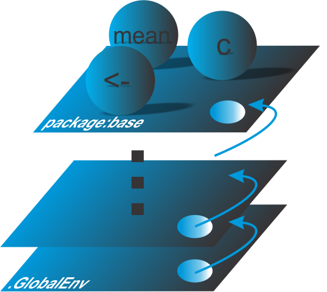
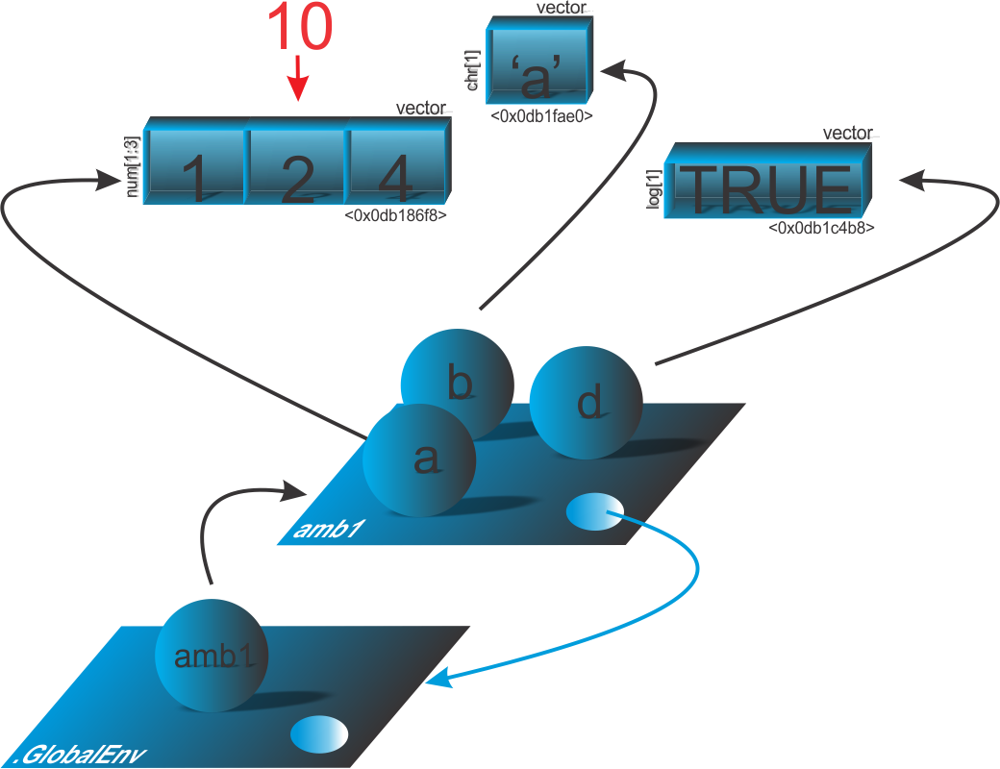

```{r setup, include=FALSE}
knitr::opts_chunk$set(echo = FALSE)
# Links
rlink <- "[R](http://r-project.org/){target='_blank'}"
rstudio <- "[RStudio](http://rstudio.org/){target='_blank'}"
cran <- "[CRAN](http://cran.r-project.org/){target='_blank'}"
github <- "[GitHub](http://github.com/){target='_blank'}"
```


<!--
YAML:
date: "`r format(Sys.time(), '%d %B, %Y')`"
=====
APRESENTACAO:

Inserir nas secoes:
{data-background=boards.jpg data-background-size=cover}
-->


## Selo DC

<center>
[{height=300 width=300}](https://bendeivide.github.io/dc/){target="_blank"}
</center>

## Introdução 

- Sugerimos uma revisão introdutória, no módulo básico, na seção [Ambientes e Caminho de busca](https://bendeivide.github.io/cursor/nbasico.html#search_path)
- Nessa introdução falaremos sobre: hierarquia, caminho de busca (caminho de pesquisa);
- Alguns objetos importantes em ambientes

## Caminho de busca

<center>
{width="40%"}
</center>

## Buscando os parentais de um ambiente

```{r echo=TRUE, include=TRUE}
# Ambiente
amb1 <- new.env()
# Verificando os seus parentais
rlang::env_parents(amb1, last = emptyenv())
```

## Ambiente *Autoloads*

```{r echo=TRUE, include=TRUE, collapse=TRUE}
# Promessa makeCluster
autoload("makeCluster", "parallel")
# Caminho de busca sem o pacote 'parallel'
search()
```

## Ambiente *Autoloads*

```{r echo=TRUE, include=TRUE, collapse=TRUE}
# Verificamos que 'makeCluster' esta como promessa
ls("Autoloads")
# Chamando a funcao
makeCluster
# Verificando novamente o Caminho de busca,
# agora com o pacote 'parallel'
search()
```

## Busca de objetos pelo caminho de busca

```{r echo=TRUE, include=TRUE}
x <- c(1, 2, 4)
mean(x)
```

<center>
{width="40%"}
</center>

## Mais características dos ambientes

- Pode se conter
- Semântica de referência
- Sem ocorrência de cópias

## Aplicação

```{r echo=TRUE, include=TRUE, eval=FALSE, collapse=TRUE}
# Ambiente
amb1 <- new.env(hash = FALSE)
# Inserindo objetos nesse ambiente
amb1$a <- c(1, 2, 4); amb1$b <- "a"; amb1$d <- TRUE
# Inspecao do objeto.
Internal(inspect(amb1))
## @0x000000000db22758 04 ENVSXP g0c0 [REF(1)] <0x000000000db22758>
## FRAME:
##  @0x000000000db213a8 02 LISTSXP g0c0 [REF(1)] 
##    TAG: @0x00000000078ebb28 01 SYMSXP g0c0 [MARK,REF(128)] "d"
##    @0x000000000db1fa38 10 LGLSXP g0c1 [REF(3)] (len=1, tl=0) 1
##    TAG: @0x000000000db1c4b8 01 SYMSXP g0c0 [REF(10)] "b"
##    @0x000000000db1fae0 16 STRSXP g0c1 [REF(3)] (len=1, tl=0)
##      @0x0000000006369e78 09 CHARSXP g0c1 [MARK,REF(14),gp=0x61] [ASCII] [cached] "a"
##    TAG: @0x0000000006483320 01 SYMSXP g0c0 [MARK,REF(60)] "a"
##    @0x000000000db186f8 14 REALSXP g0c3 [REF(1)] (len=3, tl=0) 1,2,4
ENCLOS:
##  @0x0000000005fda628 04 ENVSXP g0c0 [MARK,REF(65535),GL,gp=0x8000] <R_GlobalEnv>
```

## Aplicação

```{r echo=TRUE, include=TRUE, eval=FALSE, collapse=TRUE}
amb1$a[2] <- 10
.Internal(inspect(amb1))
## @0x000000000db22758 04 ENVSXP g0c0 [REF(1)] <0x000000000db22758>
## FRAME:
##  @0x000000000db213a8 02 LISTSXP g0c0 [REF(1)] 
##    TAG: @0x00000000078ebb28 01 SYMSXP g0c0 [MARK,REF(128)] "d"
##    @0x000000000db1fa38 10 LGLSXP g0c1 [REF(3)] (len=1, tl=0) 1
##    TAG: @0x000000000db1c4b8 01 SYMSXP g0c0 [REF(10)] "b"
##    @0x000000000db1fae0 16 STRSXP g0c1 [REF(3)] (len=1, tl=0)
##      @0x0000000006369e78 09 CHARSXP g0c1 [MARK,REF(16),gp=0x61] [ASCII] [cached] "a"
##    TAG: @0x0000000006483320 01 SYMSXP g0c0 [MARK,REF(62)] "a"
##    @0x000000000db186f8 14 REALSXP g0c3 [REF(1)] (len=3, tl=0) 1,10,4
## ENCLOS:
##  @0x0000000005fda628 04 ENVSXP g0c0 [MARK,REF(65535),GL,gp=0x8000] <R_GlobalEnv>
parent.env(amb1)
## <environment: R_GlobalEnv>
```

## Ilustração da aplicação

<center>
{width="70%"}
</center>

## Funções para trabalhar com ambientes

|Função| Objetivo|
|:----:|:-------:|
| `globalenv()` ou `.GlobalEnv` | Ambiente global|
| `baseenv()` | Ambiente do pacote *base*|
| `emptyenv()` | Ambiente vazio|
| `environment()` | Ambiente corrente|
|   `search()` | Lista o caminho de busca|
|    `new.env()` | Criando um ambiente|
|     `parent.env()` | Identificando o ambiente pai|
|     `parent.frame()` | Ambiente funcional de chamada|
|   `ls()` ou `ls.str()` | Descreve os objetos do ambiente|
|   `get()` | Acessa o(s) valor(es) dos objetos de um ambiente|
| `exists()` | Verificando a existência de um objeto em um ambiente|
| `identical()` | Verificando a equivalência de ambientes|

## Bons estudos!

<center>
[{height=500 width=500}](https://bendeivide.github.io/courses/cursor/){target="_blank"}
</center>
