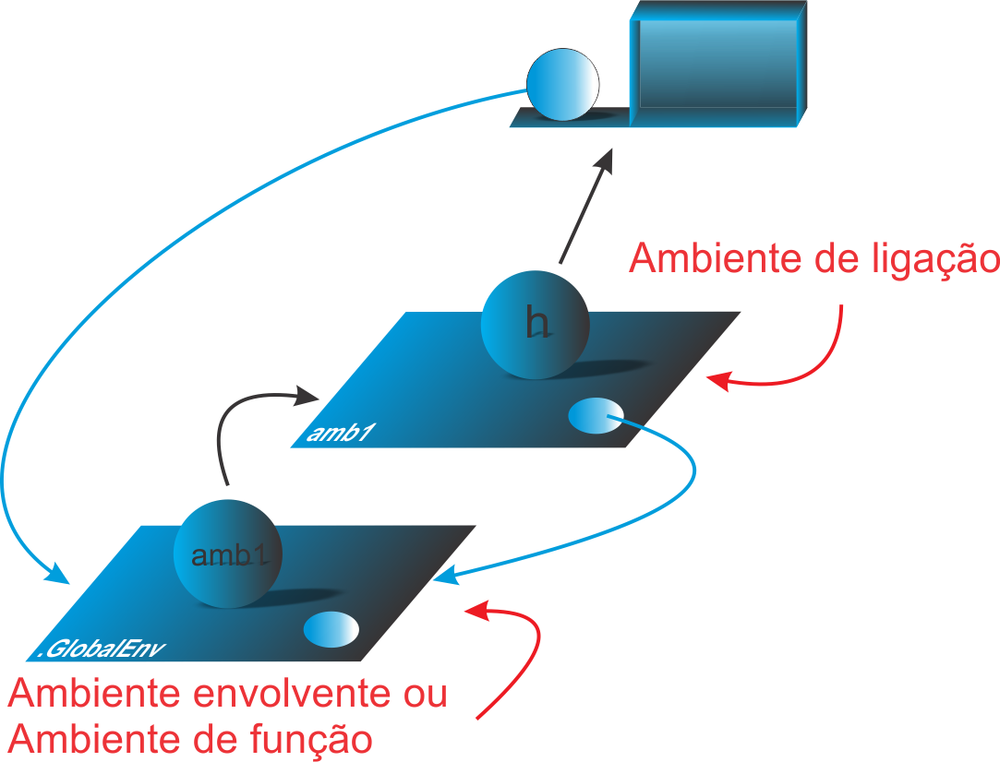
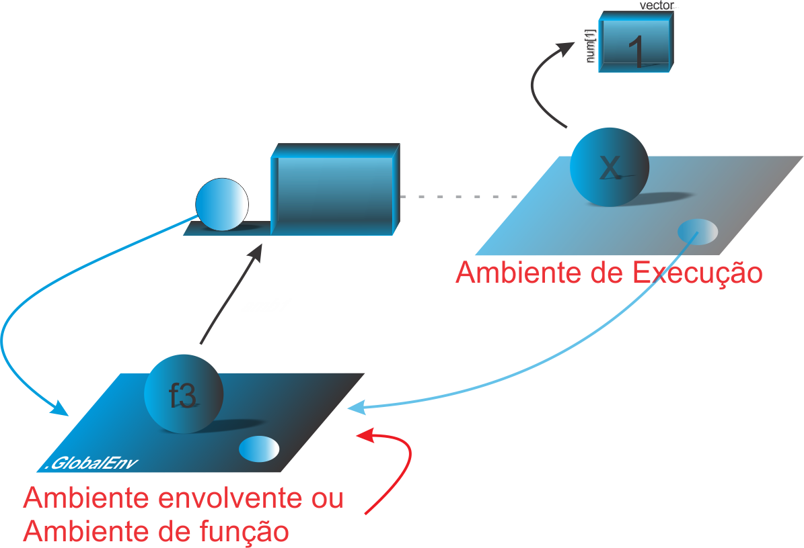

```{r setup, include=FALSE}
knitr::opts_chunk$set(echo = FALSE)
# Links
rlink <- "[R](http://r-project.org/){target='_blank'}"
rstudio <- "[RStudio](http://rstudio.org/){target='_blank'}"
cran <- "[CRAN](http://cran.r-project.org/){target='_blank'}"
github <- "[GitHub](http://github.com/){target='_blank'}"
```


<!--
YAML:
date: "`r format(Sys.time(), '%d %B, %Y')`"
=====
APRESENTACAO:

Inserir nas secoes:
{data-background=boards.jpg data-background-size=cover}
-->


## Selo DC

<center>
[{height=300 width=300}](https://bendeivide.github.io/dc/){target="_blank"}
</center>

## Introdução 

- Ambiente envolvente (ambiente de função)
- Ambiente de ligação
- Ambiente de execução
- Ambiente de chamada

## Ambiente envolvente e Ambiente de ligação

{width="70%"}

## Código

```{r echo=TRUE, include=TRUE, collapse=TRUE}
# Criando o ambiente 'amb1'
amb1 <- new.env()
# Objeto x em 'amb1'
amb1$x <- 1
# Objeto x no ambiente global
x <- 2
# Criando a funcao 'h' em 'amb1'
amb1$h <- function() x
# chamando a funcao h()
amb1$h()
# vericando o id de memoria de amb1
amb1 # ou .Internal(address(amb1))
# Ambiente envolvente de 'h'
environment(amb1$h)
```

## Ambiente de Execução (Exemplo 1)

```{r echo=TRUE, include=TRUE, collapse=TRUE}
# Criando a funcao f1
f1 <- function() 1
# Verificando o ambiente envolvente de f1
environment(f1)
# Criando uma funcao f
f <- function() {
  # ambiente de execucao
  cat("Ambiente de execucao de f: \n")
  print(environment())
  # Criando uma funcao f2
  f2 <- function() 2
  # Verificando o ambiente envolvente de f2
  cat("Ambiente envolvente de f2:\n")
  print(environment(f2))
}
f()
```

## Ambiente de execução (Exemplo 2)

{width="80%"}

## Ambiente de chamada e o escopo dinâmico

```{r echo=TRUE, include=TRUE, collapse=TRUE}
# Fabrica de funcoes
h <- function() {
  x <- 1
  function() {
    amb_envolvente <- get("x", environment())
    amb_chamada <- get("x", parent.frame())
    list(envolvente = amb_envolvente, chamada = amb_chamada)
  }
}
# Funcao g
g <- h()
# Definindo 'x' no ambiente global
x <- 20
# Chamada de g(), e verificando 'x' no ambiente de envolvente e de chamada
g()
```

## Bons estudos!

<center>
[{height=500 width=500}](https://bendeivide.github.io/courses/cursor/){target="_blank"}
</center>
