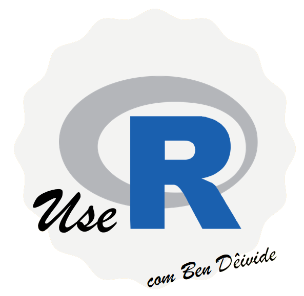

```{r setup, include=FALSE}
knitr::opts_chunk$set(echo = FALSE)

# Learn more about creating websites with Distill at:
# https://rstudio.github.io/distill/website.html

```


<!-- favicons
<link rel="icon" type="image/png" sizes="16x16" href="favicon-16x16.png">
<link rel="icon" type="image/png" sizes="32x32" href="favicon-32x32.png">
<link rel="apple-touch-icon" type="image/png" sizes="180x180" href="apple-touch-icon.png">
<link rel="apple-touch-icon" type="image/png" sizes="120x120" href="apple-touch-icon-120x120.png">
<link rel="apple-touch-icon" type="image/png" sizes="76x76" href="apple-touch-icon-76x76.png">
<link rel="apple-touch-icon" type="image/png" sizes="60x60" href="apple-touch-icon-60x60.png">
-->

# Sumário {#sumario}
- [<i class="fas fa-user"></i> Sobre o autor](#autor)
- [<i class="fas fa-sitemap"></i> Proposta do curso](#propcurso)
  - [Programação em R (Nível Básico)](index.html#basico)
  - [Programação em R (Nível Intermediário)](#intermediario)
  - [Programação em R (Nível Avançado)](#avancado)
  - [Referências do curso](#referencias)
  - [Onde encontrar nossos materiais](#buscarmateriais)
  - [Pacotes R utilizados para esse curso](#pacutilizados)
- [<i class="fas fa-download"></i> Instalação do R e do RStudio](#installrrstudio)
  - [SO Windows](#so-windows)
  - [SO Linux (Ubuntu)](#so-linux-ubuntu)
  - [SO MAC](#so-mac)

##

# <i class="fas fa-user"></i> Sobre o autor 

Natural da cidade de Pau dos Ferros/RN. Formado em Engenharia Agronômica pela Universidade Federal Rural do Semiárido (UFERSA), Mossoró/RN. Pós-Graduação (Mestrado e Doutorado)  e Pós-Doutorado em Estatística e Experimentação Agropecuária pela Universidade Federal de Lavras (UFLA), Lavras/MG. Atualmente estou como Professor de Estatística pela Universidade de São João Del-Rei (UFSJ), campus Alto Paraopeba, Ouro Branco/MG. Minhas linhas de pesquisas se concentram em Estatística e Probabilidade, Estatística Experimental, Estatística Computacional (linguagem R), densenvolvimento de pacotes R para análises de dados e ensino da Estatística. Mais detalhes, acesse [minha página](http://bendeivide.github.io/).

A motivação para estudar a linguagem `R` se deve a algumas fases experienciadas na vida acadêmica. A primeira foi a paixão pela Estatística. Estando no terceiro período do curso de Agronomia (UFERSA), concorri a tão sonhada monitoria de Estatística, orientada pelo Prof. [Janilson Pinheiro de Assis](https://sigaa.ufersa.edu.br/sigaa/public/docente/portal.jsf?siape=396304) (UFERSA). Nessa fase houve muitas conversas e conselhos para seguir em uma pós-graduação na área da Estatística. Se tornou amor quando fui impulsionado pelas leituras de apostilas e o encanto por um programa estatístico chamado [SISVAR](https://des.ufla.br/~danielff/programas/sisvar.html), do Prof. [Daniel Furtado Ferreira](https://des.ufla.br/~danielff/index.html) (UFLA), Figura \@ref(fig:danielff). Isso resultou em todo amadurecimento profissional durante o mestrado e doutorado sob a orientação do Prof. Daniel, e até hoje, estamos em constante processo de desenvolvimento de pesquisa, com o objetivo de propagar conhecimento.

```{r danielff, fig.cap = "Daniel Furtado na Serra da Bocaina (Lavras/MG).^[Fonte das fotos: Acervo pessoal de Daniel Furtado]", fig.height=3, fig.width=3, fig.align='center'}

```
Ainda durante a graduação, além de conhecer os materiais de Estatística do Professor Daniel, comecei a ler os materiais introdutórios em `R`, que costumeiramente, ele postava em sua página institucional. Mas o passo inicial para me guiar ao estudo do `R`, foi idealizado por uma apostila do Professor [Paulo Justiniano Ribeiro Júnior](http://www.leg.ufpr.br/~paulojus/) (UFPR), intitulada [Introdução ao Ambiente Estatístico R](http://www.leg.ufpr.br/~paulojus/embrapa/Rembrapa/). As primeiras leituras desse material, me trouxe um bom conhecimento inicial, sobre a linguagem `R`, ao mestrado na UFLA. 

Tudo isso me levou a essa outra grande paixão hoje que é estudar essa linguagem. Com o apoio inicial do Prof. Daniel Furtado, durante a pós-graduação, e agora na UFSJ, com os  alunos que trabalham comigo de iniciação científica, juntos com mais alguns outros parceiros de estrada, chegamos a publicação de alguns pacotes `R` sob o CRAN, segue em ordem de publicação, [SMR](http://cran.r-project.org/package=SMR), [midrangeMCP](http://cran.r-project.org/package=midrangeMCP), [TVMM](http://http://cran.r-project.org/package=TVMM), [cppcor](http://cran.r-project.org/package=cppcor), [MCPtests](http://cran.r-project.org/package=MCPtests). Para projetos futuros, temos os pacotes [statscience](http://bendeivide.github.io/statscience), [meupacoter](http://bendeivide.github.io/meupacoter), `leem` (Laboratório de Ensino à Estatística e Matemática) dentre outros ainda não disponíveis.

<!--
A minha motivação para estudar sobre a linguagem `R`:

- Falar sobre a graduação, monitoria de Estatística;
  - Falar sobre o entusiamos ao ler os materiais do Prof. Daniel e do Prof. Paulo Justiniano
-->

# <i class="fas fa-sitemap"></i> Proposta do curso 

O curso R não tem como objetivo principal de ensinar análise de dados. Mas sim, proporcionar a você um conhecimento sobre a linguagem R, de modo que consiga usufruir todos os recursos que ela possa lhe proporcionar.

Ainda como complemento, não queremos nesse material, convencê-lo a utilizar a linguagem `R`, pois a melhor linguagem é aquela que você domina. Contudo, pretendemos lhe mostrar que os recursos utilizados pelo R não estão mais limitados a própria análise de dados. Um exemplo é esse material, que nesse momento usufruo do `R` para repassar as minhas experiências sem ao menos ter o domínio sobre linguagens do tipo `HTML`, `CSS`, `JavaScript`, dentre outras, necessárias para uma boa criação de página web.

Dessa forma, propormos um entendimento sobre a sintaxe e semântica de como a linguagem `R` é desenvolvida. Com isso, você será capaz após esse curso, estudar um pouco mais sobre essa ciência que nos últimos anos vem ganhando mais evidência, que é a Estatística. Tudo isso devido ao grande volume de informações obtidos nessa era tecnológica. Juntamente com ela, o `R` se tornará uma poderosa ferramenta com o qual você poderá entender os padrões que estão por trás dos dados, que por sinal, é a moeda valiosa do momento, ou melhor, sempre foi!

Mas não só apenas análise de dados, aprenderemos também recursos diversos na área da computação, como programação defensiva, desenvolvimento de interfaces gráficas, paralelização. Ensinaremos também o desenvolvimento de materiais como artigos, livros, websites, blogs, dashboards. Por fim, chegaremos a maior cobiça de um programador `R`, [desenvolver seu próprio pacote `R`](https://bendeivide.github.io/meupacoter/).

<blockquote>
<p>
<em> Repararam que em muitos momentos utilizamos o artigo "o" para a linguagem `R`. Pois é, isso ocorre porque ela também é considerada um software. Daí, também podemos chamá-la de software `R`, ou preferivelmente, ambiente `R`. </em>
</p>
</blockquote>

O material curso R apresentará três módulos:

-   [Programação em `R` (Nível Básico)](nbasico.html)
-   [Programação em `R` (Nível Intermediário)](index.html)
-   [Programação em `R` (Nível Avançado)](index.html)

A seguir, explanaremos sobre cada um dos módulos.

## Programação em R (Nível Básico) {#basico}

O primeiro módulo compreenderá um breve **histórico** sobre a linguagem, o conhecimento da **sintaxe** e **semântica** da linguagem `R`, compreendendo as estruturas bases da linguagem, sobre o que é um **objeto** e como construir uma **função**, o entendimento sobre **fluxos de controle**. O que é um **pacote**, **carregar** e **anexar** um pacote, e quem são as pessoas que fazem parte da manutenção dessa linguagem, também serão assuntos desse primeiro módulo. **Caminhos de busca**, **ambientes** e *namespaces*, teremos noções básicas. Algo muito interessante, que pode mudar a sua vida como programação em `R` são as **boas práticas para a escrita de um código R**, tema também abordado nesse módulo.

Para acessar o material, segue: [Programação em `R` (Nível Básico)](nbasico.html).

## Programação em R (Nível Intermediário) {#intermediario}

Em contrução...

## Programação em R (Nível Avançado) {#avancado}

Em contrução...

## Referências dos curso {#referencias}

Citaremos alguns livros e materiais utilizados para o desenvolvimento desse curso, tais como:


 - [An Introduction to R](https://cran.r-project.org/doc/manuals/r-release/R-intro.html)
 - [R Language Definition](https://cran.r-project.org/doc/manuals/R-lang.html)
 - [R Internals](https://cran.r-project.org/doc/manuals/R-ints.html)
 - [R Data Import/Export](https://cran.r-project.org/doc/manuals/r-release/R-data.html)
 - [Advanced R](https://adv-r.hadley.nz/) [@hadley2019]
 - [Advanced R Solutions](http://advanced-r-solutions.rbind.io/) [@hadleyetal2021]
 - [R Packages](https://r-pkgs.org/index.html) [@hadley2015]
 - Extending R [@chambers2016]
 - Software for Data Analysis: Programming with R [@chambers2008]
 - R in a Nutshell [@adler2012]

## Onde encontrar os nossos materiais {#buscarmateriais}

Temos dedicado uma parte do nosso trabalho no desenvolvimento de materiais em R, dos quais podem ser encontrados em: [Ciencia e Progresso](http://benalana.blogspot.com/), [Github](http://github.com/bendeivide/) e [página pessoal](http://bendeivide.github.io/).


## Pacotes R utilizados para esse curso {#pacutilizados}

<iframe width="560" height="315" src="https://www.youtube.com/embed/YRSdoyfqp_g" frameborder="0" allow="accelerometer; autoplay; clipboard-write; encrypted-media; gyroscope; picture-in-picture" allowfullscreen></iframe>

Segue uma lista dos pacotes utilizados para o desenvolvimento do material desse curso:

| Pacote | Objetivo para o curso |
|:------:|:---------------------:|
| [lobstr](https://lobstr.r-lib.org/)  | Auxilia no estudo sobre a sintaxe do pacote |
| [codetools](https://cran.r-project.org/package=codetools/)| Auxilia no estudo sobre a sintaxe do pacote |
|[XR](https://cran.r-project.org/package=XR/) | Auxilia no estudo sobre a sintaxe do pacote |
| [rlang](https://rlang.r-lib.org/) | Auxilia no estudo sobre a sintaxe do pacote |
| [sloop](https://sloop.r-lib.org/) | Auxilia a compreender interativamente a programação orientada a objetos |
| [styler](https://styler.r-lib.org) | Auxilia no estilo de código |
| [formatR](https://yihui.org/formatr) | Auxilia no estilo de código |
| [distill](https://rstudio.github.io/distill/) | Criação da página|


# <i class="fas fa-download"></i> Instalação do R e do RStudio {#installrrstudio}


A seguir, apresentaremos as subseções para a instalação da linguagem `R` e do [RStudio](http://rstudio.org/). Em todo nosso curso utilizaremos o sistema operacional Windows. Contudo, se esse não é o seu sistema operacinal, não haverá problema no entendimento sobre o `R`. Assim, convencionaremos a todos a utilização do RStudio, uma vez que poderá ser instalado nas principais plataformas de sistema operacional. 

## SO Windows

Para a instalação do `R` e do [RStudio](http://rstudio.org/), como também do [rtools](https://cran.r-project.org/bin/windows/Rtools/), convidaremos para a seção [Instalação do R e do RStudio](nbasico.html#r-rstudio) do primeiro módulo desse curso, que é [Programação em R (nível básico)](nbasico.html).

<iframe width="560" height="315" src="https://www.youtube.com/embed/8_GrR3FLZJM" frameborder="0" allow="accelerometer; autoplay; clipboard-write; encrypted-media; gyroscope; picture-in-picture" allowfullscreen></iframe>

## SO Linux (Ubuntu)

Um vídeo produzido pelo nosso canal do [Youtube/Ben Dêivide](http://youtube.com/bendeivide), mostra falcilmente como realizar a instalação do R e o RStudio pelo Linux:
<iframe width="560" height="315" src="https://www.youtube.com/embed/Gei-gtBlMos" frameborder="0" allow="accelerometer; autoplay; clipboard-write; encrypted-media; gyroscope; picture-in-picture" allowfullscreen></iframe>

Uma outra opção pode ser um vídeo produzido pelo Canal [PPGC UFSC](https://www.youtube.com/channel/UCsAe4Io64jjFiMGa6oTXV7g) (Youtube), mostra falcilmente como realizar a instalação do R e o RStudio pelo Linux:
<iframe width="560" height="315" src="https://www.youtube.com/embed/4DlnNJ36mTc" frameborder="0" allow="accelerometer; autoplay; clipboard-write; encrypted-media; gyroscope; picture-in-picture" allowfullscreen></iframe>

## SO MAC

Um vídeo produzido pelo Canal [PPGC UFSC](https://www.youtube.com/channel/UCsAe4Io64jjFiMGa6oTXV7g) (Youtube), mostra falcilmente como realizar a instalação do R e o RStudio pelo MAC:

<iframe width="560" height="315" src="https://www.youtube.com/embed/rr54DqsJJjY" frameborder="0" allow="accelerometer; autoplay; clipboard-write; encrypted-media; gyroscope; picture-in-picture" allowfullscreen></iframe>


