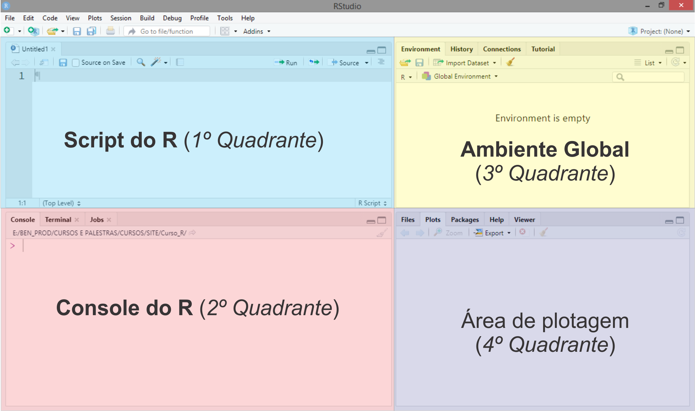

```{r setup, include=FALSE}
knitr::opts_chunk$set(echo = FALSE)
```

# Sumário 

- [<i class="fas fa-folder-open"></i> Materiais para este módulo](#materiais)
  - [Slides de Aulas](#slidesaulas)
  - [Scripts](#scripts)
  - [Scripts via Shiny](#shiny)
  
##

# <i class="fas fa-folder-open"></i> Materiais para este módulo {#materiais}


## Slides de Aulas {#slidesaulas}

 - Aula 00: [Apresentação do Curso](aulas/aula00.html)
 - Aula 01: [Instalação do R e do RStudio](aulas/aula01.html)
 - Aula 02: [Passos iniciais para a utilização do R e do RStudio]()
 - Aula 03: [História do R]()
 - Aula 04: [Como o R trabalha]()
 - Aula 05: [Símbolos e Comandos elementares]()
 - Aula 06: [Arquivos `.RData` e `.Rhistory`]()
 - Aula 07: [Criando e salvando um *Script*]()
 - Aula 08: [Exportando dados]()
 - Aula 09: [Objetos]()
 - Aula 10: [Vetores]()
 - Aula 11: [Matrizes]()
 - Aula 12: [*Arrays*]()
 - Aula 13: [*Data frames*]()
 - Aula 14: [*Lists*]()
 - Aula 15: [Funções]()
 - Aula 17: [Boas práticas de como escrever um código]()
 - Aula 17: [Como criar funções]()
 - Aula 18: [Controle de fluxos (*Loops*)]()
 - Aula 19: [Pacotes]()
 - Aula 20: [Carregando e Anexando pacotes]()
 - Aula 21: [Quando devemos utilizar os operadores `::` e `:::`]()
 - Aula 22: [*Namespace* de um pacote]()
 - Aula 23: [Ambientes e Caminhos de busca]()
 - Aula 24: [Interface com outras linguagens]()
 - Aula 25: [Considerações e Preparação para a Programação em R (Nível Intermediário)]()
 

## Scripts {#scripts}
 - Script 00: ~
 - Script 01: ~
 - Script 02:
 - Script 03:
 - Script 04:
 - Script 05:
 - Script 06:
 - Script 07:
 - Script 08:
 - Script 09:
 - Script 10:


## Scripts via  [Shiny](https://shiny.rstudio.com/) {#shiny}

Em construção...

# <i class="fas fa-book"></i> Apresentação do curso

O Curso `R` será todo aprensentado no formato online, sendo que as aulas terão vídeos como suporte, postados no canal [Youtube/Ben Dêivide](http://youtube.com/bendeivide) divulgados ao longo do material. Os vídeos serão bem objetivos de curta duração para que usem como suporte com o material escrito. Como complemento  desse material, disponibilizaremos os [*scripts*](#scripts) com os comandos utilizados em cada aula e sua versão em [*Shiny*](#shiny) para os que não quiserem realizar inicialmente a instalação do R e do RStudio, poderão utilizar uma versão *online* do material juntamente com a linguagem `R`.

# <i class="fas fa-download"></i> Instalação do R, RStudio e *Rtools* para o SO Windows {#r-rstudio-rtools}

A linguagem `R` é o objetivo principal desse curso. Assim, faremos inicialmente a sua instalação, uma vez que o RStudio é apenas uma GUI, e sem o `R`, não há sentido instalá-lo. Por fim, instalaremos um kit de ferramentas do `R` para o SO  Windows, o *Rtools*, uma vez que ao longo do curso precisaremos de muitos recursos nele, como por exemplo, desenvolvimento de pacotes.

Dessa forma, seguem os passos para a instalação:

- Instalação do `R`: [https://cran.r-project.org/bin/windows/base/](https://cran.r-project.org/bin/windows/base/)
- Instalação do RStudio: [https://rstudio.com/products/rstudio/download/#download](https://rstudio.com/products/rstudio/download/#download)
- Instalação do *Rtools*: [https://cran.r-project.org/bin/windows/Rtools/](https://cran.r-project.org/bin/windows/Rtools/)


# <i class="fab fa-r-project"></i> História do R

A linguagem `R` tem a sua primeira aparição científica publicada em 1996, com o artigo intitulado [*R: A Language for Data Analysis and Graphics*](https://doi.org/10.2307/1390807 ), cujos os autores são os desenvolvedores da linguagem, [George Ross Ihaka](https://www.stat.auckland.ac.nz/~ihaka/) e [Robert Clifford Gentleman](https://gist.github.com/colliand/d6d4ff42a9124ca38bed8d90136f70f5).

```{r criadoresr, fig.cap = "Criadores do R.^[Fonte das fotos: Robert Gentleman do site: https://biocasia2020.bioconductor.org/ e Ross Ihaka do site: https://www.stat.auckland.ac.nz/en/about/news-and-events-5/news/news-2017/2017/12/ross-ihaka-retires.html]", fig.height=4, fig.width=5, fig.align='center'}
knitr::include_graphics("images/criadores_r.png")
```

Durante a época em que estes professores trabalhavam na Universidade de Auckland, Nova Zelândia, desenvolvendo uma implementação alternativa da lingugagem `S`, desenvolvida por John Chambers, que comercialmente era o `S-PLUS`, nasceu em 1991, o projeto da linguagem `R`, em que em 1993 o projeto é divulgado e em 1995, o primeiro lançamento oficial, como software livre com a licença [GNU](http://gnu.org/). Devido a demanda de correções da linguagem estava acima da capacidade de atualização em tempo real, foi criado em 1997, um grupo central voluntário, responsável por essas atualizações, o conhecido *R Development Core Team*^[Fontes: https://cran.r-project.org/doc/html/interface98-paper/paper_2.html e https://www.r-project.org/contributors.html], que hoje está em 20 membros: Douglas Bates, John Chambers, Peter Delgaard, Robert Gentleman, Kurt Hornik, Ross Ihaka, Tomas kalibera, Michael Lawrence, Friedrich Leish, Uwe Ligges, Thomas Lumley, Martin Maechler, Martin Morgan, Paul Murrel, Martyn Plummer, Brian Ripley, Deepayan Sarkarm, Duncan Temple Lang, Luke Tierney e Simon Urbanek. 

Por fim, o CRAN (Comprehensive R Archive Network) foi oficialmente anunciado em 23 de abril de 1997^[Fonte: https://stat.ethz.ch/pipermail/r-announce/1997/000001.html]. O CRAN é um conjunto de sites (espelhos) que transportam material idêntico, com as contribuições do R de uma forma geral.

`R` é uma linguagem de programação e ambiente de *software* livre e código aberto (*open source*). Entendemos^[Fonte: https://www.gnu.org/philosophy/free-sw.html]:

- *Software* livre: *software* que respeita a liberdade e sendo de comunidade dos usuários, isto é, os usuários possuem a liberdade de executar, copiar, distribuir, estudar, mudar, melhorar o *software*. Ainda reforça que um *software* é livre se os seus usuários possuem quatro liberdades:
  1. Liberdade 0 - A liberdade de executar o programa como você desejar, para qualquer propósito;
  2. Liberdade 1 - A liberdade de estudar como o programa funciona, e adaptá-la as suas necessidades;
  3. Liberdade 2 - A liberdade de redistribuir cópias de modo que você possa ajudar outros;
  4. Liberdade 3 - A liberdade de distribuir cópias de suas versões modificadas a outros.
  
Algo que deve está claro é que um *software* livre não significa não comercial. Sem esse fim, o *software* livre não atingiria seus objetivos.

Agora perceba que, segundo Richard Stallman^[Fonte: https://www.gnu.org/philosophy/open-source-misses-the-point.html], a ideia de software livre faz campanha pela liberdade para os usuários da computação. Por outro lado, o código aberto valoriza principalmente a vantagem prática e não faz campanha por princípios. 

- Código aberto: Para Richard Stallman^[Fonte: https://www.gnu.org/philosophy/open-source-misses-the-point.html] código aberto apoia critérios um pouco mais flexíveis que os do software livre. Todos os códigos abertos de software livre lançados se qualificariam como código aberto. Quase todos os softwares de código aberto são software livre, mas há exceções, como algumas licenças de código aberto que são restritivas demais, de forma que elas não se qualificam como licenças livres. Nesse contexto, o autor cita muitas situações que diferenciam os dois termos. Vale a pena a leitura.

A linguagem `R` é uma combinação da linguagem `S` com a semântica de escopo léxico da linguagem `Scheme`. Dessa forma, a linguagem `R` se diferencia em dois aspectos principais^[https://cran.r-project.org/doc/html/interface98-paper/paper_1.html]: 

- **Gerenciamento de memória**: usando as próprias palavras de Ross Ihaka^[https://cran.r-project.org/doc/html/interface98-paper/paper_1.html], em R, alocamos uma quantidade fixa de memória na inicialização e a gerenciamos com um coletor de lixo dinâmico. Isso significa que há muito pouco crescimento de heap e, como resultado, há menos problemas de paginação do que os vistos em S.
- **Escopo**: na linguagem `R`, as funções acessam as variáveis criadas pelo no corpo da própria função, como também as variáveis contidas no ambiente que a função foi criada. No caso da linguagem `S`, isso não ocorre, assim, como por exemplo na linguagem `C`, em que as funções acessam apenas variáveis definidas globalmente. 

Vejamos alguns exemplos para entendimento (Se você ainda não está ambientado ao `R`, estude esse módulo primeiro, e depois reflita sobre esses exemplos):

- Exemplo 1: As funções têm acesso ao escopo em que foram criadas.

```{r ex1, echo=TRUE, comment=">", prompt=TRUE}
# Criando um nome "n" associado a um objeto 10 no escopo da função
n <- 10

# Criando um nome "funcao" associado a um objeto que é uma função
funcao <- function() {
  print(n)
}

# Imprimindo 'funcao'
funcao()
```
- Exemplo 2: As variáveis criadas ou alteradas dentro de uma função, permanecem na função.

```{r ex2, echo=TRUE, comment=">", prompt=TRUE}
# Criando um nome "n" associado a um objeto 10 no escopo da função
n <- 10

# Criando um nome "funcao" associado a um objeto que é uma função
funcao <- function() {
  # Imprimindo n
  print(n)
  # Criando um nome "n" associado a um objeto 15 no corpo da função
  n <- 15
  # Imprimindo n
  print(n)
}
# Imprimindo 'funcao'
funcao()
``` 

  - Exemplo 3: As variáveis dentro de uma função permanecem nelas, exceto no caso em que a atribuição ao escopo seja explicitamente solicitada.
  
```{r ex3, echo=TRUE, comment=">", prompt=TRUE}
# Criando um nome "n" associado a um objeto 10 no escopo da função
n <- 10

# Criando um nome "funcao" associado a um objeto que é uma função
funcao <- function() {
  # Imprimindo n
  print(n)
  # Criando um nome "n" associado a um objeto 15 no corpo da função
  n <<- 15
  # Imprimindo n
  print(n)
}
# Imprimindo 'funcao'
funcao()

# Observe que depois de usar a superatribuição ("<<-") dentro da função, 
#o nome "n" passou a estar associado ao número 15 e não mais ao número 10, observe
n
``` 

   - Exemplo 4: Por fim, embora a linguagem `R` tenha um escopo padrão, chamado ambiente global, os escopos de funções podem ser alterados.
   
```{r ex4, echo=TRUE, comment=">", prompt=TRUE}
# Criando um nome 'n' associado a um objeto 10 no escopo da função (ambiente global)
n <- 10
# Criando um nome 'funcao' associado a um objeto que é uma função criado no ambiete global
funcao <- function() {
  # Imprimindo n
  print(n)
}
# Imprimindo 'funcao' no ambiente global
funcao()
# Criando um novo ambiente
novo_ambiente <- new.env()
# Criando um nome "n" associado ao objeto 20 no ambiente  'novo_ambiente'
novo_ambiente$n <- 20
# Criando um objeto funcao no ambiente 'novo_ambiente'
environment(funcao) <- novo_ambiente
# Imprimindo 'funcao' no ambiente 'novo_ambiente'
funcao()
``` 

Como a linguagem `S` é também uma linguagem interpretada cuja base é a linguagem `FORTRAN`, a linguagem `R` tem como base as linguagens de baixo nível `C` e `FORTRAN` e a própria linguagem `R`. 

Embora o `R` tenha uma interface baseada em linhas de comando, existem muitas interfaces gráficas ao usuário com destaque ao [RStudio](http://rstudio.org), criado por Joseph J. Allaire, Figura \@ref(fig:jjallaire).

```{r jjallaire, fig.cap = "J. J. Allaire, o criador do RStudio^[Fonte da foto: https://rstudio.com/speakers/j.j.-allaire/].", out.width="80%", fig.align='center'}
knitr::include_graphics("images/jjallaire.jpg")
```

Essa interface tornou o *R* mais popular, pois além de produzir pacotes de grande utilização hoje como a família de pacotes `tidyverse`, `rmarkdown`, `shiny`, dentre outros, permite uma eficiente capacidade de trabalho de análise de utilização do `R`. Uma vez que o [RStudio](http://rstudio.org) facilita a utilização de muitos recursos por meio de botões, como por exemplo, a criação de um pacote R, a quem diga que para um iniciante em `R` que não inicie a linguagem por meio dela. Cremos, que o problema não é o [RStudio](http://rstudio.org), e sim, o caminho onde deseja chegar com a linguagem `R`.


No Brasil, o primeiro espelho do CRAN foi criado na UFPR, pelo grupo do Prof. Paulo Justiniano. Inclusive um dos primeiros materiais mais completos sobre a linguagem `R` produzidos no Brasil, foi dele, iniciado em 2005, intitulado [Introdução ao Ambiente Estatístico `R`](http://www.leg.ufpr.br/~paulojus/embrapa/Rembrapa/). Vale a pena assistirmos o evento a palestra: *R Releflões: um pouco de história e experiências com o R*, proferida pelo [Prof. Paulo Justiniano Ribeiro Júnior](http://www.leg.ufpr.br/~paulojus/), no *R Day - Encontro nacional de usuários do R*, ocorrido em 2018 em Curitiba/UFPR, do qual o vídeo está disponível no Canal (Youtube) [LEG UFPR](https://www.youtube.com/channel/UC3fBJBHhLNsylRw009I2GNw). 

<iframe width="560" height="315" src="https://www.youtube.com/embed/fnGvDEkjZy0" frameborder="0" allow="accelerometer; autoplay; clipboard-write; encrypted-media; gyroscope; picture-in-picture" allowfullscreen></iframe>

Para quem não sabe, o Prof. Paulo Justiniano (Figura \@ref(fig:paulojus)) e sua equipe trouxeram o primeiro espelho do R para o Brasil e foi o desenvolvedor de um dos 100 primeiros pacotes submetidos ao CRAN^[Comprehensive R Archive Network]. Devido a sua ida para XXX fazer o pós-doutorado, se deparou com o início dos estudos sobre o `R` fora do país. Não satisfeito, ao voltar para o Brasil, começa-se os estudos sobre o R....

```{r paulojus, fig.cap = "Foto de divulgação de Paulo Justiniano^[Fonte da foto: https://www.ufpr.br/portalufpr/noticias/disciplinas-transversais-para-programas-de-pos-graduacao-abrem-inscricoes-nesta-segunda-feira/] no *R Day*.", out.width = "50%"}
knitr::include_graphics("images/paulo_justiniano.jpeg")
```

<!--
Falar sobre a história do R e como caracterizá-la.

Caracterizações:

- Linguagem interpretada
- Linguagem ou programa
- linguagem de código livre
- objetivo principal: Computação estatística e gráficos

-->

# <i class="fas fa-terminal"></i> Sintaxe e semântica do `R`

## Símbolos e comando elementares

A primeira ideia que temos sobre a linguagem `R` é a linha de comando no `R`, que é simbolizada pelo prompt de comando "`>`". Este símbolo significa que o `R` está pronto para receber os comandos do usuário. O *prompt* de comando está localizado
Vejamos o console do `R` a seguir, que é o local que recebe as linhas de comando do usuário.

```{r promptr, fig.cap = "Console do R.", out.width = "80%", fig.align='center'}
knitr::include_graphics("images/promptr.png")
```

O [RStudio](http://rstudio.com) se apresenta como uma interface para facilitar a utilização do `R`, tendo por padrão quatro quadrantes, apresentados na Figura \@ref(fig:iderstudio).

```{r iderstudio, fig.cap = "Interface do RStudio.", out.width = "80%", fig.align='center'}

```


## Os três princípios do `R`

Iniciamos a discussão por uma afirmação de John McKinley Chambers, do qual afirmou que o `R` tem três princípios [@chambers2016]:

```{r chumbers, fig.cap = "John Chumbers^[Fonte da foto: Retirada de sua página pessoal, [https://statweb.stanford.edu/~jmc4/](https://statweb.stanford.edu/~jmc4/)], o criador da linguagem `S`.", out.width="50%", fig.align='center'}
knitr::include_graphics("images/john_chambers.jpg")
```

- Tudo que existe em `R` é um objeto;
- Tudo que acontece no `R` é uma chamada de função;
- Interfaces para outros programas são parte do `R`.

Para a construção e base dessas ideias, usaremos a convenção utilizada por @hadley2019, formalizando o entendimento por meio de diagramas. Definimos um objeto como uma estrutura de dados com características internas contendo informações necessárias para interpretar sua estrutura e conteúdo. Essas características são chamadas de atributos. 

Vejamos o seguinte código:

```{r primeiro_codigo, echo=TRUE, comment=">", prompt=TRUE}
x <- 10
```

Todo mundo que tem uma certa noção sobre a linguagem `R` afirmaria: "criei um objeto `x` que recebe o valor 10". Para @hadley2019 essa afirmação é imprecisa e pode levar um entendimento equivocado sobre o que acontece de fato. Para o mesmo autor, o correto é afirmar que o objeto `10` está se ligando a um nome. E de fato, o objeto não tem um nome, mas o nome tem um objeto. A símbolo que associa um objeto a um nome é o de atribuição, `<-`. Este símbolo poderá ser representado na direção da esquerda para à direita ou vice-versa, isto é,

```{r segundo_codigo, echo=TRUE, comment=">"}
x <- 10
10 -> x
```

As duas formas acima são possíveis

- 
