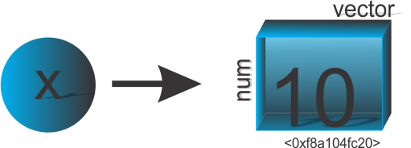
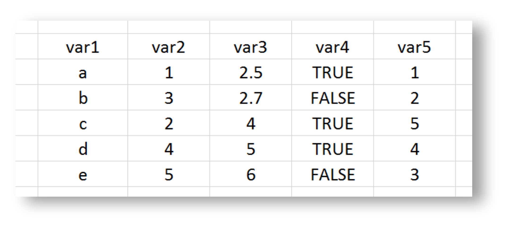

```{r setup, include=FALSE}
knitr::opts_chunk$set(echo = FALSE)
# Links
rlink <- "[R](http://r-project.org/){target='_blank'}"
rstudio <- "[RStudio](http://rstudio.org/){target='_blank'}"
```

# Sumário 

- [<i class="fas fa-folder-open"></i> Materiais para este módulo](#materiais)
  - [Slides de Aulas](#slidesaulas)
  - [Scripts](#scripts)
  - [Exercícios e Scripts via Shiny](#shiny)
- [<i class="fas fa-book"></i> Apresentação do curso](#apresentacao)
- [<i class="fas fa-download"></i> Instalação do R e RStudio para o SO Windows](#r-rstudio)
- [<i class="fas fa-wrench"></i> Como utilizar o R e o RStudio](#tools-r-rstudio)
- [<i class="fab fa-r-project"></i> História do R](#rhistory)
- [<i class="fas fa-briefcase"></i> Como o R trabalha](#rwork)
- [<i class="fas fa-terminal"></i> Comandos no R e Ambiente Global](#comandos-workspace)
- 
[<i class="fas fa-file"></i> Arquivos `.Rdata` e `.Rhistory`](#filesdata)
- [<i class="fas fa-save"></i> Criando e salvando um script](#savescript)
- [<i class="fas fa-arrow-circle-left"></i> Objetos](#objetos)
- [<i class="fas fa-dice-one"></i> Vetores](#vetores)
- [<i class="fas fa-dice-two"></i> Matrizes bidimensionais](#matrizes)
- [<i class="fas fa-dice-three"></i> Matrizes multidimencionais](#arrays)
- [<i class="fas fa-dice-four"></i> Listas de dados](#lists)
- [<i class="fas fa-dice-five"></i> Quadro de dados](#dataframes)
- [<i class="fas fa-database"></i> Importantdo/Exportando dados](#impexpdata)

##

# <i class="fas fa-folder-open"></i> Materiais para este módulo {#materiais}


## Slides de Aulas {#slidesaulas}

 - Aula 00: [Apresentação do Curso](aulas/aula00.html){target="_blank"}
 - Aula 01: [Instalação do R e do RStudio](aulas/aula01.html){target="_blank"}
 - Aula 02: [Passos iniciais para a utilização do R e do RStudio](aulas/aula02.html){target="_blank"}
 - Aula 03: [História do R](aulas/aula03.html){target="_blank"}
 - Aula 04: [Como o R trabalha](aulas/aula04.html){target="_blank"}
 - Aula 05: [Comandos no R e Ambiente Global](aulas/aula05.html){target="_blank"}
 - Aula 06: [Arquivos `.RData` e `.Rhistory`](aulas/aula06.html){target="_blank"}
 - Aula 07: [Criando e salvando um *Script*](aulas/aula07.html){target="_blank"}
 - Aula 08: [Objetos](aulas/aula08.html){target="_blank"}
 - Aula 09: [Vetores](aulas/aula09.html){target="_blank"}
 - Aula 10: [Matrizes](aulas/aula10.html){target="_blank"}
 - Aula 11: [*Arrays*](aulas/aula11.html){target="_blank"}
 - Aula 12: [*Lists*](aulas/aula12.html){target="_blank"}
 - Aula 13: [*Data frames*](aulas/aula13.html){target="_blank"}
 - Aula 14: [Importando/Exportando dados](index.html)
 - Aula 15: [Funções](index.html)
 - Aula 16: [Boas práticas de como escrever um código](index.html)
 - Aula 17: [Como criar funções](index.html)
 - Aula 18: [Controle de fluxos (*Loops*)](index.html)
 - Aula 19: [Pacotes](index.html)
 - Aula 20: [Carregando e Anexando pacotes](index.html)
 - Aula 21: [Quando devemos utilizar os operadores `::` e `:::`](index.html)
 - Aula 22: [*Namespace* de um pacote](index.html)
 - Aula 23: [Ambientes e Caminhos de busca](index.html)
 - Aula 24: [Interface com outras linguagens](index.html)
 - Aula 25: [Considerações e Preparação para a Programação em R (Nível Intermediário)](index.html)
 

## Scripts {#scripts}
 - Script 00: ~
 - Script 01: ~
 - Script 02: ~
 - [Script 03](scripts/script03.txt){target="_blank"}: [Escopo léxico](scripts/script03.R){target="_blank"}
 - Script 04: ~
 - [Script 05](scripts/script05.txt){target="_blank"}: [Comandos](scripts/script05.R){target="_blank"}
 - Script 06: ~
 - [Script 07](https://github.com/bendeivide/cursor/blob/master/scripts/aula07/Aula07-primeiro_script.R){target="_blank"}: [.RData e .Rhistory](https://github.com/bendeivide/cursor/blob/master/scripts/aula07/Aula07-primeiro_script.R){target="_blank"}
 - Script 08:
 - Script 09:
 - Script 10:
 - Script 11:
 - Script 12:
 - Script 13:


## Exercícios e Scripts via  [Shiny](https://shiny.rstudio.com/){target="_blank"} {#shiny}

[Curso R via Shiny]{target="_blank"}

# <i class="fas fa-book"></i> Apresentação do curso {#apresentacao}

<iframe width="560" height="315" src="https://www.youtube.com/embed/_JqtU3X101E" frameborder="0" allow="accelerometer; autoplay; clipboard-write; encrypted-media; gyroscope; picture-in-picture" allowfullscreen></iframe>

O Curso `R` será todo aprensentado no formato online, sendo que as aulas terão vídeos como suporte, postados no canal [Youtube/Ben Dêivide](http://youtube.com/bendeivide){target="_blank"} divulgados ao longo do material. Os vídeos serão bem objetivos de curta duração para que usem como suporte com o material escrito. Como complemento  desse material, disponibilizaremos os [*scripts*](#scripts) com os comandos utilizados em cada aula e sua versão em [*Shiny*](#shiny) para os que não quiserem realizar inicialmente a instalação do R e do RStudio, poderão utilizar uma versão *online* do material juntamente com a linguagem `R`.

<iframe width="560" height="315" src="https://www.youtube.com/embed/_JqtU3X101E" frameborder="0" allow="accelerometer; autoplay; clipboard-write; encrypted-media; gyroscope; picture-in-picture" allowfullscreen></iframe>

# <i class="fas fa-download"></i> Instalação do R e RStudio para o SO Windows {#r-rstudio}

<iframe width="560" height="315" src="https://www.youtube.com/embed/8_GrR3FLZJM" frameborder="0" allow="accelerometer; autoplay; clipboard-write; encrypted-media; gyroscope; picture-in-picture" allowfullscreen></iframe>

A linguagem `R` é o objetivo principal desse curso. Assim, faremos inicialmente a sua instalação, uma vez que o RStudio é apenas uma GUI, e sem o `R`, não há sentido instalá-lo. 

Dessa forma, seguem os passos para a instalação:

- Instalação do `R`: [https://cran.r-project.org/bin/windows/base/](https://cran.r-project.org/bin/windows/base/){target="_blank"}
- Instalação do [RStudio](http://rstudio.org/): [https://rstudio.com/products/rstudio/download/#download](https://rstudio.com/products/rstudio/download/#download){target="_blank"}

Justificamos a utilizamos do [RStudio](http://rstudio.org/){target="_blank"}, pela quantidade de recursos disponíveis e a diversidade de usuários `R`, que hoje o perfil não é apenas de um programador, mas um usuário que necessita de uma ferramenta estatística para análise de seus dados. Dessa forma, até por questão de praticidade, e de uso pessoal, não deixaremos de repassar o entendimento sobre a linguagem `R` com o uso do [RStudio](http://rstudio.org/).

# <i class="fas fa-wrench"></i> Como utilizar o [R](http://r-project.org/) e o [RStudio](http://rstudio.org/) {#tools-r-rstudio}

<iframe width="560" height="315" src="https://www.youtube.com/embed/x_9kRo2sges" frameborder="0" allow="accelerometer; autoplay; clipboard-write; encrypted-media; gyroscope; picture-in-picture" allowfullscreen></iframe>

A primeira ideia que temos sobre a linguagem `R` é a linha de comando no `R`, que é simbolizada pelo prompt de comando "`>`". Este símbolo significa que o `R` está pronto para receber os comandos do usuário. O *prompt* de comando está localizado no console do `R`.
Vejamos o console do `R` a seguir, que é o local que recebe as linhas de comando do usuário.

```{r promptr, fig.cap = "Console do R (Versão 4.0.3).", out.width = "80%", fig.align='center'}
knitr::include_graphics("images/promptr.png")
```

O `R` ao ser iniciado está pronto para ser inserido as linhas de comando desejadas. Uma forma simples de armazernar os seus comandos é por meio de um *script*, isto é, um arquivo de texto com extensão `.R`. Para criar basta ir em: `Arquivo > Novo script...`. Muitas outras informações iremos ver ao longo do curso.

O [RStudio](http://rstudio.com) se apresenta como uma interface para facilitar a utilização do `R`, tendo por padrão quatro quadrantes, apresentados na Figura \@ref(fig:iderstudio).

```{r iderstudio, fig.cap = "Interface do RStudio (Versão 1.4.1103).", out.width = "80%", fig.align='center'}
knitr::include_graphics("images/ide_rstudio.png")
```

Muitas coisas na interface do `R` podem se tornar problemas para os usuários, uma vez que janelas gráficas, janelas de scripts, dentre outras, se sobrepõe. Uma vantagem no RStudio foi essa divisão de quadrantes, que torna muito mais organizado as atividades realizadas no `R`. De um modo geral, diremos que o primeiro quadrante é responsável pela entrada de dados, comandos, isto é, o *input*. O segundo quadrante, que é o console do R, representa tanto entrada como saída de informações (*input*/*output*). Dependendo as atividades as abas podem aumentar. O terceiro quadrante representa informações básicas como objetos no ambiente global, a memória de comandos na aba *History*, dentre outras, e também representa entrada como saída de informações (*input*/*output*). Por fim, o quarto quadrante é responsável por representação gráficas, instalação de pacotes, renderização de páginas *web*.

# <i class="fab fa-r-project"></i> História do R {#rhistory}

<iframe width="560" height="315" src="https://www.youtube.com/embed/-plK308HcgU" frameborder="0" allow="accelerometer; autoplay; clipboard-write; encrypted-media; gyroscope; picture-in-picture" allowfullscreen></iframe>

A linguagem `R` tem a sua primeira aparição científica publicada em 1996, com o artigo intitulado [*R: A Language for Data Analysis and Graphics*](https://doi.org/10.2307/1390807 ), cujos os autores são os desenvolvedores da linguagem, [George Ross Ihaka](https://www.stat.auckland.ac.nz/~ihaka/) e [Robert Clifford Gentleman](https://gist.github.com/colliand/d6d4ff42a9124ca38bed8d90136f70f5).

```{r criadoresr, fig.cap = "Criadores do R.^[Fonte das fotos: Robert Gentleman do site: https://biocasia2020.bioconductor.org/ e Ross Ihaka do site: https://www.stat.auckland.ac.nz/en/about/news-and-events-5/news/news-2017/2017/12/ross-ihaka-retires.html]", fig.height=4, fig.width=5, fig.align='center'}
knitr::include_graphics("images/criadores_r.png")
```

Durante a época em que estes professores trabalhavam na Universidade de Auckland, Nova Zelândia, desenvolvendo uma implementação alternativa da lingugagem `S`, desenvolvida por John Chambers, que comercialmente era o `S-PLUS`, nasceu em 1991, o projeto da linguagem `R`, em que em 1993 o projeto é divulgado e em 1995, o primeiro lançamento oficial, como software livre com a licença [GNU](http://gnu.org/). Devido a demanda de correções da linguagem estava acima da capacidade de atualização em tempo real, foi criado em 1997, um grupo central voluntário, responsável por essas atualizações, o conhecido *R Development Core Team*^[Fontes: https://cran.r-project.org/doc/html/interface98-paper/paper_2.html e https://www.r-project.org/contributors.html], que hoje está em 20 membros: Douglas Bates, John Chambers, Peter Delgaard, Robert Gentleman, Kurt Hornik, Ross Ihaka, Tomas kalibera, Michael Lawrence, Friedrich Leish, Uwe Ligges, Thomas Lumley, Martin Maechler, Martin Morgan, Paul Murrel, Martyn Plummer, Brian Ripley, Deepayan Sarkarm, Duncan Temple Lang, Luke Tierney e Simon Urbanek. 

Por fim, o CRAN (Comprehensive R Archive Network) foi oficialmente anunciado em 23 de abril de 1997^[Fonte: https://stat.ethz.ch/pipermail/r-announce/1997/000001.html]. O CRAN é um conjunto de sites (espelhos) que transportam material idêntico, com as contribuições do R de uma forma geral.

`R` é uma linguagem de programação e ambiente de *software* livre e código aberto (*open source*). Entendemos^[Fonte: https://www.gnu.org/philosophy/free-sw.html]:

- *Software* livre: *software* que respeita a liberdade e sendo de comunidade dos usuários, isto é, os usuários possuem a liberdade de executar, copiar, distribuir, estudar, mudar, melhorar o *software*. Ainda reforça que um *software* é livre se os seus usuários possuem quatro liberdades:
  1. Liberdade 0 - A liberdade de executar o programa como você desejar, para qualquer propósito;
  2. Liberdade 1 - A liberdade de estudar como o programa funciona, e adaptá-la as suas necessidades;
  3. Liberdade 2 - A liberdade de redistribuir cópias de modo que você possa ajudar outros;
  4. Liberdade 3 - A liberdade de distribuir cópias de suas versões modificadas a outros.
  
Algo que deve está claro é que um *software* livre não significa não comercial. Sem esse fim, o *software* livre não atingiria seus objetivos.

Agora perceba que, segundo Richard Stallman^[Fonte: https://www.gnu.org/philosophy/open-source-misses-the-point.html], a ideia de software livre faz campanha pela liberdade para os usuários da computação. Por outro lado, o código aberto valoriza principalmente a vantagem prática e não faz campanha por princípios. 

- Código aberto: Para Richard Stallman^[Fonte: https://www.gnu.org/philosophy/open-source-misses-the-point.html] código aberto apoia critérios um pouco mais flexíveis que os do software livre. Todos os códigos abertos de software livre lançados se qualificariam como código aberto. Quase todos os softwares de código aberto são software livre, mas há exceções, como algumas licenças de código aberto que são restritivas demais, de forma que elas não se qualificam como licenças livres. Nesse contexto, o autor cita muitas situações que diferenciam os dois termos. Vale a pena a leitura.

A linguagem `R` é uma combinação da linguagem `S` com a semântica de escopo léxico da linguagem `Scheme`. Dessa forma, a linguagem `R` se diferencia em dois aspectos principais^[https://cran.r-project.org/doc/html/interface98-paper/paper_1.html]: 

- **Gerenciamento de memória**: usando as próprias palavras de Ross Ihaka^[https://cran.r-project.org/doc/html/interface98-paper/paper_1.html], em R, alocamos uma quantidade fixa de memória na inicialização e a gerenciamos com um coletor de lixo dinâmico. Isso significa que há muito pouco crescimento de heap e, como resultado, há menos problemas de paginação do que os vistos em S.
- **Escopo**: na linguagem `R`, as funções acessam as variáveis criadas pelo no corpo da própria função, como também as variáveis contidas no ambiente que a função foi criada. No caso da linguagem `S`, isso não ocorre, assim, como por exemplo na linguagem `C`, em que as funções acessam apenas variáveis definidas globalmente. 

Vejamos alguns exemplos para entendimento (Se você ainda não está ambientado ao `R`, estude esse módulo primeiro, e depois reflita sobre esses exemplos). Antes de executar as linhas de comando, instale o pacote `lobstr` como segue:

```{r, echo=TRUE, eval=FALSE}
# Instale o pacote lobstr
install.packages("lobstr")
```

- Exemplo 1: As funções têm acesso ao escopo em que foram criadas.

```{r ex1, echo=TRUE, , prompt=TRUE}
# Criando um nome "n" associado a um objeto 10 no escopo da funcao
n <- 10

# Criando um nome "funcao" associado a um objeto que eh uma funcao
funcao <- function() {
  print(n)
}

# Imprimindo 'funcao'
funcao()
```
- Exemplo 2: As variáveis criadas ou alteradas dentro de uma função, permanecem na função.

```{r ex2, echo=TRUE, , prompt=TRUE}
# Criando um nome "n" associado a um objeto 10 no escopo da funcao
n <- 10
lobstr::obj_addr(n) # Identificador do objeto

# Criando um nome "funcao" associado a um objeto que eh uma funcao
funcao <- function() {
  # Imprimindo n
  print(n)
  # Criando um nome "n" associado a um objeto 15 no corpo da funcao
  n <- 15
  # Imprimindo n
  print(n)
}
# Imprimindo 'funcao'
funcao()

# Imprimindo 'n'
n
lobstr::obj_addr(n) # Identificador do objeto
``` 

  - Exemplo 3: As variáveis dentro de uma função permanecem nelas, exceto no caso em que a atribuição ao escopo seja explicitamente solicitada.
  
```{r ex3, echo=TRUE, , prompt=TRUE}
# Criando um nome "n" associado a um objeto 10 no escopo da funcao
n <- 10
lobstr::obj_addr(n) # Identificador do objeto

# Criando um nome "funcao" associado a um objeto que eh uma funcao
funcao <- function() {
  # Imprimindo n
  print(n)
  # Criando um nome "n" associado a um objeto 15 no corpo da funcao
  n <<- 15
  # Imprimindo n
  print(n)
}
# Imprimindo 'funcao'
funcao()

# Observe que depois de usar a superatribuicao ("<<-") dentro da funcao,
#o nome "n" passou a estar associado ao numero 15 e nao mais ao numero 10, observe
n
lobstr::obj_addr(n) # Identificador do objeto
``` 

   - Exemplo 4: Por fim, embora a linguagem `R` tenha um escopo padrão, chamado ambiente global, os escopos de funções podem ser alterados.
   
```{r ex4, echo=TRUE, , prompt=TRUE}
# Criando um nome 'n' associado a um objeto 10 no escopo da funcao (ambiente global)
n <- 10
# Criando um nome 'funcao' associado a um objeto que eh uma função criado no ambiete global
funcao <- function() {
  # Imprimindo n
  print(n)
}
# Imprimindo 'funcao' no ambiente global
funcao()
# Criando um novo ambiente
novo_ambiente <- new.env()
# Criando um nome "n" associado ao objeto 20 no ambiente  'novo_ambiente'
novo_ambiente$n <- 20
# Criando um objeto funcao no ambiente 'novo_ambiente'
environment(funcao) <- novo_ambiente
# Imprimindo 'funcao' no ambiente 'novo_ambiente'
funcao()
``` 

Como a linguagem `S` é também uma linguagem interpretada cuja base é a linguagem `FORTRAN`, a linguagem `R` também é uma linguagem interpretada e baseada além da linguagem `S`, tem como base as linguagens de baixo nível `C` e `FORTRAN` e a própria linguagem `R`. 

Embora o `R` tenha uma interface baseada em linhas de comando, existem muitas interfaces gráficas ao usuário com destaque ao [RStudio](http://rstudio.org), criado por Joseph J. Allaire, Figura \@ref(fig:jjallaire).

```{r jjallaire, fig.cap = "J. J. Allaire, o criador do RStudio^[Fonte da foto: https://rstudio.com/speakers/j.j.-allaire/].", out.width="80%", fig.align='center'}
knitr::include_graphics("images/jjallaire.jpg")
```

Essa interface tornou o *R* mais popular, pois além de produzir pacotes de grande utilização hoje como a família de pacotes `tidyverse`, `rmarkdown`, `shiny`, dentre outros, permite uma eficiente capacidade de trabalho de análise de utilização do `R`. Uma vez que o [RStudio](http://rstudio.org) facilita a utilização de muitos recursos por meio de botões, como por exemplo, a criação de um pacote R, a quem diga que para um iniciante em `R` que não inicie a linguagem por meio dela. Cremos, que o problema não é o [RStudio](http://rstudio.org), e sim, o caminho onde deseja chegar com a linguagem `R`.


No Brasil, o primeiro espelho do CRAN foi criado na UFPR, pelo grupo do Prof. Paulo Justiniano. Inclusive um dos primeiros materiais mais completos sobre a linguagem `R` produzidos no Brasil, foi dele, iniciado em 2005, intitulado [Introdução ao Ambiente Estatístico `R`](http://www.leg.ufpr.br/~paulojus/embrapa/Rembrapa/). Vale a pena assistirmos o evento a palestra: *R Releflões: um pouco de história e experiências com o R*, proferida pelo [Prof. Paulo Justiniano Ribeiro Júnior](http://www.leg.ufpr.br/~paulojus/), no *R Day - Encontro nacional de usuários do R*, ocorrido em 2018 em Curitiba/UFPR, do qual o vídeo está disponível no Canal (Youtube) [LEG UFPR](https://www.youtube.com/channel/UC3fBJBHhLNsylRw009I2GNw). 

<iframe width="560" height="315" src="https://www.youtube.com/embed/fnGvDEkjZy0" frameborder="0" allow="accelerometer; autoplay; clipboard-write; encrypted-media; gyroscope; picture-in-picture" allowfullscreen></iframe>

Para quem não sabe, o Prof. Paulo Justiniano (Figura \@ref(fig:paulojus)) e sua equipe trouxeram o primeiro espelho do R para o Brasil e foi o desenvolvedor de um dos 100 primeiros pacotes submetidos ao CRAN^[Comprehensive R Archive Network]. Devido a sua ida para Lancaster/Inglaterra para fazer o doutorado, em 1997, se deparou com o início dos estudos sobre o `R` fora do país. Isso porque havia uma necessidade muito grande de um programa para ser utilizado nas plataforma UNIX. Nesse momento a linguagem `S` estava sendo uma saída para isso, porém, o uso de memória que a linguagem consumia nos computadores, na criação das rotinas, era muito grande (Claro que grande para aquela época!). Não satisfeito, ao voltar para o Brasil, em 2002, se depara com alguns usuários da linguagem `S`, porém, certo como mudança de cultura na utilização de linguagem `R`, passou a densevolver materiais didáticos da linguagem, para as disciplinas do departamento de Estatística (UFPR).

```{r paulojus, fig.cap = "Foto de divulgação de Paulo Justiniano^[Fonte da foto: https://www.ufpr.br/portalufpr/noticias/disciplinas-transversais-para-programas-de-pos-graduacao-abrem-inscricoes-nesta-segunda-feira/] no *R Day*.", out.width = "50%"}
knitr::include_graphics("images/paulo_justiniano.jpeg")
```


<!--
Falar sobre a história do R e como caracterizá-la.

Caracterizações:

- Linguagem interpretada
- Linguagem ou programa
- linguagem de código livre
- objetivo principal: Computação estatística e gráficos

-->

# <i class="fas fa-briefcase"></i> Como o R trabalha {#rwork}

<iframe width="560" height="315" src="https://www.youtube.com/embed/8RNFOfE3CmY" frameborder="0" allow="accelerometer; autoplay; clipboard-write; encrypted-media; gyroscope; picture-in-picture" allowfullscreen></iframe>

Iniciamos a discussão por uma afirmação de John McKinley Chambers, do qual afirmou que o `R` tem três princípios [@chambers2016]:

```{r chambers, fig.cap = "John Chambers^[Fonte da foto: Retirada de sua página pessoal, [https://statweb.stanford.edu/~jmc4/](https://statweb.stanford.edu/~jmc4/)], o criador da linguagem `S`.", fig.height= 5, fig.width=5, fig.align='center'}
knitr::include_graphics("images/john_chambers.jpg")
```

<blockquote>
<p>
- **Princípio do Objeto**: Tudo que existe em `R` é um objeto; 
- **Princípio da Função**: Tudo que acontece no `R` é uma chamada de função;
- **Princípio da Interface**: Interfaces para outros programas são parte do `R`.
</p>
</blockquote>


Ao longo de todo o curso, para os três módulos, iremos nos referir a esses princípios. Vamos inicialmente observar uma adaptação da ilustração feita por @paradis2005, mostrando como o `R` trabalha, Figura \@ref(fig:rworks).

```{r rworks, fig.cap = "Esquema de como o `R` funciona.", out.width="50%", fig.align='center'}
knitr::include_graphics("images/rworks.png")
```

Toda ação que acontece no `R` é uma chamada de função (Operadores e funções), que por sua vez é armazenada na forma de um objeto, e este se associa a um nome. A forma de execução de uma função é baseada em argumentos (dados, fórmulas, expressões, etc), que são entradas, ou argumentos padrões que já são pré-estabelecidos na criação da função. Esses tipos de argumentos podem ser modificados na execução da função. Por fim, a saída é o resultado, que é também um objeto, e pode ser usado como argumento de outras funções.

Na Figura \@ref(fig:rworks), observamos que todas as ações realizadas sobre os objetos ficam armazenadas na memória ativa do computador. Esses objetos são criados por comandos (teclado ou mouse) através de funções ou operadores (chamada de função), dos quais leem ou escrevem arquivo de dados do disco rígido, ou leem da própria internet. Por fim, o resultado desses objetos podem ser apresentados no console (memória ativa), exportados em formato de imagem, página web, etc. (disco rígido), ou até mesmo ser reaproveitado como argumento de outras funções, porque o resultado também é um objeto.

# <i class="fas fa-terminal"></i> Comandos no R e Ambiente Global {#comandos-workspace}

<iframe width="560" height="315" src="https://www.youtube.com/embed/JQlNBgDJUUc" frameborder="0" allow="accelerometer; autoplay; clipboard-write; encrypted-media; gyroscope; picture-in-picture" allowfullscreen></iframe>

## Console e *Prompt* de comando 

Como falado anteriormente, o `R` é uma linguagem baseada em linhas de comando, e as linhas de comando, são executadas uma de cada vez, no console. Assim que o prompt de comando está visível na tela do console, o `R` indica que o usuário está pronto para inserir as linhas de comando. O símbolo padrão do prompt de comando é "`>`", porém ele pode ser alterado. Para isso, use a linha de comando, por exemplo:

```{r promptdor, echo=TRUE, prompt=TRUE}
options(prompt = "R>")
# Toda vez que o console iniciar, começarar por 'R>'
10
```

O conjunto de símbolos que podem ser utilizados no `R` depende do sistema operacional e do país em que o `R` está sendo executado. Basicamente, todos os símbolos alfanuméricos podem ser utilizados, mas para evitar problemas quanto ao uso das letras aos nomes, opte pelos caracteres ASCII.

A escolha do nome associado a um objeto tem algumas regras:

- Deve consistir em letras, dígitos, `.` e `_`;
- Os nomes devem ser iniciado por uma letra ou um ponto não seguido de um número, isto é, Ex.: `.123`, `1n`, dentre outros;
- As letras maiúsculas se distinguem das letras minúsculas;
- Não pode inicia por `_` ou dígito, é retornado um erro no console caso isso ocorra;
- Não pode usar qualquer uma das palavras reservadas pela linguagem, isto é, `TRUE`, `FALSE`, `if`, `for`, dentre outras, que pode ser consultado usando o comando `?Reserved()`.

Um nome que não segue essas regras é chamado de um nome **não sintático**. Um comando que pode ser usado para converter nomes não sintatícos em nomes **sintáticos** é `make.names`.

```{r, eval=FALSE}
# Nome nao sintatico
.123 <- 50
## Error in 0.123 <- 50 : lado esquerdo da atribuicao inválida (do_set)

# Qual a sugestao de nome sintatico para '.123'?
make.names(.123)
[1] "X0.123"
```

Apesar dessas justificativas, algumas situações como as apresentadas nos exemplos anteriores são possíveis, ver @hadley2019 na [Seção 2.2.1](https://adv-r.hadley.nz/names-values.html#non-syntactic)

## Comandos elementares

Os **comandos elementares** podem ser divididos em **expressões** e **atribuições**. Por exemplo, podemos está interessados em resolver a seguinte expressão $10 + 15 = 25$. No console quando passamos pelo comando:

```{r echo=TRUE, eval=TRUE, prompt=TRUE}
10 + 15
```
O `R` avalia essa expressão internamente e imprime o resultado na tela, após apertar o botão *ENTER* do teclado. Esse fato é o que ocorre no segundo princípio mencionado por @chambers2016, tudo em `R` acontece por uma chamada de função. Na realidade o símbolo `+` é uma função interna do `R`, que chamamos de função primitiva, porque foi implementada em outra linguagem. Assim, essa é o resultado de três objetos ("`10`", "`+`", "`15`") que são avaliados internamente, do qual a função `+` é chamada, e em seguida o resuldo é impresso no console. 

Do mesmo modo, se houver algum problema em algum dos objetos o retorno da avaliação pode ser uma mensagem de erro. Um caso muito prático é quando utilizamos o separador de casas decimais para os números sendo a vírgula. Quando na realidade deve ser um ponto "`.`", respeitando o sistema internacional de medidas. A vírgula é utilizada para separar elementos, argumentos em uma função, etc. Vejamos o exemplo:

```{r echo=TRUE, eval=TRUE, error=TRUE}
10,5 + 15,5
```

Porém, tem que ficar claro que uma expressão é qualquer comando repassado no console. Este comando é avaliado e seu resultado impresso, há menos que explicitamente o usuário queira torná-lo invisível^[Basta usar a função `invisible(10 + 15)`, que a expressão é avaliada mas não impressa]. Caso algum elemento do comando não seja reconhecido pelo `R`, há um retorno de alguma mensagem em forma de "erro" ou "alerta", tentando indicar o possível problema. Todos esses processos ocorrem na memória ativa do computador, e uma vez o resultado impresso no console, o valor é perdido, há menos que você atribua essa expressão a um nome, que erroneamento usamos o termo: "criamos um objeto!". A atribuição dessa expressão será dada pela junção de dois símbolos "`<-`", falado mais a frente. Um comando em forma de atribuição também avalia a sua expressão, um nome se associa ao seu resultado, e o resultado será mostrado, se posteriormente, após a execução você digitar o "nome" atribuído a esse resultado. Vejamos um exemplo:

```{r echo=TRUE}
# Foi criado um objeto do tipo caractere e o nome "meu_nome" foi associado a ele
# O 'R' avalia essa expressão, mas não imprime no console!
meu_nome <- "Ben"

# Para imprimir o resultado da expressão, digitamos o nome "meu_nome" no console
# e apertamos o botão ENTER do teclado!
meu_nome
```

## Execução dos comandos

Quando inserimos um comando no console, executamos uma linha de comando por vez ou separados por ";" em uma mesma linha. Vejamos

```{r echo=TRUE}
# Uma linha de comando por vez
meu_nome <- "Ben" # Criamos e associamos um nome ao objeto
meu_nome # Imprimos o objeto

# Tudo em uma linha de comando
meu_nome <- "Ben"; meu_nome
```

Se um comando for muito grande e não couber em uma linha, ou caso deseje completar um comando em mais de uma linha, após a primeira linha haverá o símbolo "`+`" iniciando a linha seguinte ao invés do símbolo de prompt de comando ("`>`"), até que o comando esteja sintaticamente completo. Vejamos:

```{r echo=TRUE}
# Uma linha de comando em mais de uma linha
(10 + 10) /
  2
```

Por fim, todas linhas de comando quando iniciam pelo símbolo jogo da velha, "`#`"
indica um comentário e essa linha de comando não é avaliada pelo console, apenas impressa na tela. E ainda, as linhas de comandos no console são limitadas a aproximadamente 4095 bytes (não caracteres).

## Chamada e correção de comandos anteriores

Uma vez que um comando foi executado no console, esse comando por ser recuperado usando as teclas de setas para cima e para baixo do teclado, recuperando os comandos anteriorermente executados, e que os caracteres podem ser alterados usando as teclas esquerda e direita do teclado, removidas com o botão *Delete* ou *Backspace* do teclado, ou acrescentadas digitando os caracteres necessários. Uma outra forma de completar determinados comandos já existentes, como por exemplo, uma função que já existe nas bibliotecas de instalação do R, usando o botão *Tab* do teclado. O usuário começa digitando as iniciais, e para completar o nome aperta a tecla *Tab*. Posteriormente, basta completar a linha de comando e apertar *ENTER* para executá-la. Vejamos um exemplo a seguir.

<iframe width="560" height="315" src="https://www.youtube.com/embed/0MRPmVsPvk4" frameborder="0" allow="accelerometer; autoplay; clipboard-write; encrypted-media; gyroscope; picture-in-picture" allowfullscreen></iframe>

Usando esses recursos no [RStudio](http://rstudio.org/) são mais dinâmicos e vão mais além. Por exemplo,
quando usamos um objeto do tipo função, estes apresentam o que chamamos de argumento(s) dentro do parêntese de uma função, do qual são elementos necessários, para que a função seja executada corretamente. Nesse caso, ao inseri o nome dessas funções no console, usando o RStudio, ao iniciá-la com a abertura do parêntese, abre-se uma janela informano todos os argumentos possíveis dessa função. Isso torna muito dinâmico escrever linhas de comando, porque não precisaremos estar lembrando do nome dos argumentos de uma função, mas apenas entender o objetivo dessa função. Vejamos um exemplo a seguir.

<iframe width="560" height="315" src="https://www.youtube.com/embed/KL3WAB_GFNI" frameborder="0" allow="accelerometer; autoplay; clipboard-write; encrypted-media; gyroscope; picture-in-picture" allowfullscreen></iframe>

## Ambiente Global (ou área de trabalho, *Workspace*)

Quando usamos um comando de atribuição no console, o `R` armazena o nome associado ao objeto criado na área de trabalho (*Workspace*), que nós chamamos de Ambiente Global. Teremos uma seção introdutória na seção [Ambientes e caminhos de busca](#env-searchpath), mas entendamos inicialmente que o objetivo de um ambiente é associar um conjunto de nomes a um conjunto de valores. Por exemplo:

```{r echo=TRUE}
# Nomes criados no ambiente 
x <- 10 - 6; y <- 10 + 4; w <- "Maria Isabel"
# Verificando o nomes contidos no ambiente global
ls()
```

Observe que todos os objetos criados até o momento estão listados, e o que é mais surpreendente é que ambientes podem conter outros ambientes e até mesmo se conter. Observe o objeto `meu_nome` é um ambiente e está contido no Ambiente global. Será sempre dessa forma que recuperaremos um objeto criado no console do R. Caso contrário, se no console esse comando não for de atribuição esse objeto é perdido.

# <i class="fas fa-file"></i> Arquivos `.Rdata` e `.Rhistory` {#filesdata}

<iframe width="560" height="315" src="https://www.youtube.com/embed/-fFVgTzsoxQ" frameborder="0" allow="accelerometer; autoplay; clipboard-write; encrypted-media; gyroscope; picture-in-picture" allowfullscreen></iframe>

Ao final do que falamos até agora, todo o processo ao inserir linhas de comando do console, e desejarmos finalizar os trabalhos do ambiente `R`, dois arquivos são criados, sob a instrução do usuário em querer aceitar ou não, um *.RData* e outro *.Rhistory*, cujas finalidades são:

- *.RData*: salvar todos os objetos criados que estão atualmente disponíveis;
- *.Rhistory*: salvar todas as linhas de comandos inseridas no console.

Ao iniciar o `R` no mesmo diretório onde esses arquivos foram salvos, é carregado toda a sua área de trabalho anteriomente, bem como o histórico das linhas de comando utilizadas anteriormente.

# <i class="fas fa-save"></i> Criando e salvando um script {#savescript}

<iframe width="560" height="315" src="https://www.youtube.com/embed/ETreeG5HK60" frameborder="0" allow="accelerometer; autoplay; clipboard-write; encrypted-media; gyroscope; picture-in-picture" allowfullscreen></iframe>

A melhor forma de armazenarmos nossas linhas de código inseridas no console é criando um *Script*. Este é um arquivo de texto com a extensão "`.R`". Uma vez criada, poderemos ao final salvar o arquivo e guardá-lo para utilizar futuramente.

No `R`, ao ser iniciado poderemos ir no menu em `Arquivo > Novo script...`. Posteriormente, pode ser inserido as linhas de comando, executadas no console pela tecla de atalho `F5`. As janelas do `Script` e console possivelmente ficarão sobrepostas. Para uma melhor utilização, estas janelas podem ficar lado a lado, configurando-as no menu em `Janelas > Dividir na horizontal (ou Dividir lado a lado)`.

No RStudio, poderemos criar um *Script* no menu em `File > New File > R Script`, ou diretamente no ícone abaixo da opção `File` no menu, cujo o símbolo é um arquivo com o símbolo "+" em verde, que é o ícone do `New File`, e escolher `R Script`. Esse arquivo abrirá no primeiro quadrante na interface do RStudio.

Para salvar, devemos clicar no botão com o símbolo de disquete (R/RStudio), escolher o nome do arquivo e o diretório onde o arquivo será armazenado no seu computador. Algumas ressalvas devem ser feitas:

- Escolha sempre um nome sem caracteres especiais, com acentos, etc.;
- Escolha sempre um nome curto ou abreviado, que identifique a finalidade das linhas de comando escritas;
- Evite espaços se o nome do arquivo for composto. Para isso, use o símbolo *underline* "`_`";
- Quando escrever um código, evite também escrever caracteres especiais, exceto em casos de necessidade, como imprimir um texto na tela, títulos na criação de gráficos, dentre outras. Nos referimos especificamente, nos comentários do código.

Um ponto bem interessante é o diretório. Quando criamos um *Script* a primeira vez, e trabalhamos nele a pós a criação, muitos erros podem ser encontrados de início. Um problema clássico é a importação de dados. O usuário tem um conjunto de de dados e deseja fazer a importação para o `R`, porém, mesmo com todos os comandos corretos, o console retorna um erro, informando que não existe esse arquivo que contém os dados para serem informados. Isso é devido ao diretório de trabalho atual. Para verificar qual o diretório que está trabalhando no momento, use a linha de comando:

```{r echo=TRUE, eval=FALSE}
getwd()
```

Para alterar o diretório de trabalho, o usuário deve usar a seguinte função `setwd("Aqui, deve ser apontado para o local desejado!")`. Supomos que salvamos o nosso *Script* tem sido em `C:\meus_scripts_r`. Assim, usamos a função `setwd` e ao apontarmos o local, as barras devem ser inseridas de modo invertido, isto é, `setwd("C:/meu_scripts_r")`, além de estar entre aspas.

No RStudio, isso pode ser feito em `Session > Set Working Directory > To Source File Location`. Isso levará ao diretório corrente do *Script*. Se desejar escolher outro diretório, vá em `Session > Set Working Directory > Choose Directory...`. Porém, uma vez criado um `Script`, e utilizado novamente, se o usuário estiver abrindo o RStudio também naquele primeiro momento, por padrão, o diretório de trabalho corrente será o mesmo do diretório do `Script`. Isso acaba otimizando o trabalho.

Devemos estar atentos também, quando trabalhamos utilizando `Scripts` ou arquivos de banco de dados, em locais diferentes do diretório corrente. Um outro recurso interessante é a função `source()`, que tem o objetivo de executar todas as linhas de comando de um `Script` sem precisar abri-lo. Isso pode ser útil, quando criamos funções para as nossas atividades, porém elas não se encontram no `Script` de trabalho para o momento. Assim, podemos criar um `Script` auxiliar que armazenas todas as funções criadas para as análises desejadas, e no `Script` corrente, poderemos chamá-las sem precisar abri o `Script` auxiliar. Todos os objetos passam a estar disponíveis no ambiente global.


<!--
- setwd() / getwd()
- source()
-->

Por fim, algo de muita importância para um programador, **comente suas linhas de comando**. Mas faça isso a partir do primeiro dia em que você criou o seu primeiro *Script*. Isso criará um hábito, uma vez que o arquivo não está sendo criado apenas para um momento, mas para futuras consultas. E quando voltamos a *Scripts* com muitas linhas de comando, principalmente depois de algum tempo, e sem comentários, possivelmente você passará alguns instantes para tentar entender o que foi escrito.

Outra coisa importante, é a **boa prática de escrita de um código**, e o RStudio nos proporciona algumas ferramentas interessantes. Mas isso será visto mais a frente.


# <i class="fas fa-arrow-circle-left"></i> Objetos {#objetos}

<iframe width="560" height="315" src="https://www.youtube.com/embed/6t9h9zgWyTE" frameborder="0" allow="accelerometer; autoplay; clipboard-write; encrypted-media; gyroscope; picture-in-picture" allowfullscreen></iframe>

Definimos um objeto como uma entidade no ambiente `R` com características internas contendo informações necessárias para interpretar sua estrutura e conteúdo. Essas características são chamadas de **atributos**.  Vamos entender o termo estrutura como a disposição de como está o seu conteúdo. Por exemplo, a estrutura de um objeto mais simples no `R` é um vetor atômico, pois os elementos contidos nele, apresenta o mesmo **modo**, um tipo de **atributo**. Falaremos nisso, mais à frente. De forma didática, adaptaremos a representação dos objetos no formato de diagrama.

Vejamos o seguinte código:

```{r primeiro_codigo, echo=TRUE, , prompt=TRUE}
x <- 10
```
Todo mundo que tem uma certa noção sobre a linguagem `R` afirmaria: "criei um objeto `x` que recebe o valor 10". Para @hadley2019 essa afirmação é imprecisa e pode levar um entendimento equivocado sobre o que acontece de fato. Para o mesmo autor, o correto é afirmar que o objeto `10` está se ligando a um nome. E de fato, o objeto não tem um nome, mas o nome tem um objeto. O símbolo que associa um objeto a um nome é o de atribuição, `<-`, isto é, a junção do símbolo desigualdade menor e o símbolo de menos. Para ver qual objeto associado ao nome, o usuário precisa apenas digitar o nome no console e apertar a tecla *ENTER*.

Representaremos em termos de diagrama, um nome se ligando a um objeto, na Figura \@ref(fig:objx).

```{r objx, fig.cap = "Dizemos que o nome `'x'` se liga ao objeto do tipo (estrutura) vetor.", fig.height= 6, fig.width=9, fig.align='center'}

```
O identificador na memoría ativa desse objeto pode ser obtida por:


```{r id_primeiro_codigo, echo=TRUE, eval=FALSE, prompt=TRUE}
lobstr::obj_addr(x)
# [1] "0xf8a104fc20"
```

O diagrama explica que o nome criado "`x`" se associou com um objeto do **tipo** (estrutura) vetor (`vector`) e **modo** numérico (`numeric`)^[ou também  `double`, usando a função `typeof()`], cuja identificação na memória ativa do seu computador foi `<0xf8a104fc20>`. É claro que para cada vez que o usuário abri o ambiente `R` e executar novamente esse comando, ou repeti o comando, esse identificador irá alterar. 

Essa outra representação ficará mais claro para a afirmação feita anteriormente, no segundo diagrama, Figura \@ref(fig:objxy), que representa a ligação do nome "`y`" ao mesmo objeto. Os termos nos diagramas, serão usados de acordo com a sintaxe da linguagem com os termos em inglês para melhor compreensão e fixação dos termos utilizados em `R`, uma vez que os termos na linguagem são baseados nesse idioma.

```{r segundo_codigo, echo=TRUE, eval=FALSE, prompt=TRUE}
y <- x
lobstr::obj_addr(y)
# [1] "0xf8a104fc20"
```

Observem que não houve a criação de um outro objeto, mas apenas a ligação de mais um nome ao objeto existente, pois o identificador na memória ativa para o objeto não alterou, é o mesmo. Logo, não temos um outro objeto, mais dois nomes que se ligam ao mesmo objeto. 


```{r objxy, fig.cap = "Dizemos que o nome `'x'` e '`y`' se ligam ao objeto do tipo (estrutura) vetor.", fig.height= 6, fig.width=9, fig.align='center'}
knitr::include_graphics("images/y=x=10.png")
```

Mais especificamente, acrescentamos um outro diagrama, Figura \@ref(fig:objxyglobalenv), mostrando a representação do ambiente global (`.GlobalEnv`, nome associado ao objeto que representa o ambiente global).

```{r objxyglobalenv, fig.cap = "Dizemos que o nome `'x'` e `'y'` se ligam ao objeto do tipo (estrutura) vetor e essa ligação fica armazenada no ambiente global.", out.width="80%", fig.align='center'}

```

De todo modo, deixaremos para o módulo [Programação em R (Nível Intermediário)](nintermediario.html), uma abordagem mais profunda sobre o assunto.


O símbolo de atribuição poderá ser representado na direção da esquerda para à direita ou vice-versa, isto é,

```{r terceiro_codigo, echo=TRUE, prompt=TRUE}
x <- 10
10 -> x
```

Essas duas linhas de comando anteriores podem ter passado despercebidas pelo leitor em uma situação. Se na segunda linha tivéssemos alterado o valor do objeto de `10` para `30`, por exemplo, a associação de `x` seria ao objeto `30`. Isso significa que se o nome já existe, ele será apagado da memória ativa do computador e associado ao novo objeto. Veja,

```{r quarto_codigo, echo=TRUE, eval=FALSE, prompt=TRUE}
lobstr::obj_addr(x)
# [1] "0xf8a104fc20"
x <- 30
lobstr::obj_addr(x)
# [1] "0x42db6dbb50"
```

Uma outra forma menos convencional é usar o comando `assign`, veja:

```{r assign, echo=TRUE, }
assign("m", 15)
m
```

Ao invés do símbolo de atribuição, muitos usuários utilizam o símbolo da igualdade "`=`" para associarmos nomes aos objetos, que o ambiente `R` compreenderá. Contudo, discutiremos mas adiante, em [Boas práticas de como escrever um código](#goodcode), que o uso da igualdade deverá em `R` ser usado apenas para a utilização em argumentos de uma função.

Quando desejamos executar mais de uma linha de comando por vez, separamos estas pelo símbolo "`;`", isto é,

```{r, echo=TRUE, }
x <- 10; w <- 15; x; w
```
Neste caso, executamos quatro comandos em uma linha. Associamos dois nomes a dois objetos e imprimimos os seus valores.

Por questão de comodidade, iremos a partir de agora, sempre nos referir a um objeto pelo nome associado a ele, para não está sempre se expressando como "um nome associado a um objeto". Mas que fique claro a discussão realizada anteriormente sobre esses conceitos.

Nesse momento, nos limitaremos a falar sobre objetos que armazenam dados, do tipo caracteres, números e operadores lógicos (`TRUE/FALSE`).

## Atributos

Todos os objetos, terão pelo menos dois tipos de atributos, chamados de atributos intrínsecos. Os demais atributos, quando existem, podem ser verificados pela função `attributes()`. A ideia dos atributos pode ser pensada como *metadados*, isto é, um conjunto de informações que caracterizam o objeto. 

Diremos também que todos os objetos `R` tem uma **classe**, e por meio dessas classes, determinadas funções podem ter comportamento diferente a objetos com classes diferentes. Agora, devemos deixar claro essa informação, apesar do `R` seguir o **princípio do Objeto**, nem tudo é orientado a objetos, como por exemplo, observamos na linguagens `C++` e `Java`. Deixemos esse tópico para o módulo [Programação em `R` (Nível Intermediário)](nintermediario.html).

A forma de se verificar a classe de um objeto é pela função `class()`. Contudo, os objetos internos do `R` (base), quando solicitado sua classe pela função `class()`, acabam retornando, algumas vezes, resultados equivocados. Uma alternativa é utilizar a função `sloop::s3_class()` do pacote `sloop`. Isso também será discutido no módulo [Programação em R (Nível Intermedirário)](nintermediario.html).

Devemos estar atentos a uma questão. **Existe um atributo também chamado classe** ("`class`"), e nem todos os objetos necessariamente tem esse atributo, apenas aqueles orientados a objetos, como é o caso do objeto com atributo classe . Por exemplo, é devido a classe `factor` no objeto criado pela função `factor()` que apesar do seu resultado ser numérico, este não se comporta como numérico. Isto significa que o atributo classe muda o comportamento de como funções veem esse objeto. 

Para verificarmos se tal objeto tem o atributo `class`, usamos a função `attributes()`. Quando este atributo existe, ele é coincidente com o resultado obtido também pela função `class()`.

O tipo das classes podem ser `numeric`, `logical`, `character`, `list`, `matrix`, `array`, `factor` e `data.frame`. Por enquanto, nos concentraremos nas classes de objetos que armazenam dados para uso em análises.

Para remover o efeito da classe, usamos a função `unclass()` para tal.

Por exemplo, quando criamos um objeto da classe `data.frame`, vejamos o seu comportamento:

```{r, echo=TRUE, }
# Criamos um objeto de classe 'data.frame'
dados <- data.frame(a = 1:3, b = LETTERS[1:3])

# Imprimindo na tela
dados

# Verificando sua classe
class(dados)

# Verificando o efeito do objeto 'dados',
# sem o efeito da classe
dados2 <- unclass(dados); dados2

# Qual a classe desse objeto sem o efeito da
# classe 'data.frame'
class(dados2)
```

Observe que sem o atributo `class= 'data.frame'`, o objeto tem classe `list`. Isto significa que, o objeto tem uma estrutura em forma de `list`, mas se comporta como um `data.frame`, que se apresenta como mostrado anteriormente.

Veremos no módulo [Programação em R (Nível Intermediário)](nintermediario.html) como criar atributos, classes, e mostrar que não conseguiremos mostrar todos os tipos de classes, pois a todo momento se cria classes em objetos `R` no desenvolvimento de pacotes.


### Atributos intrínsecos

Todos os objetos tem dois *atributos intrínsecos*: o **modo** e **comprimento**. O **modo** representa a natureza dos elementos objetos. Para o caso dos vetores atômicos, o **modo** dos vetores podem ser cinco, numérico (`numeric`), lógico (logic), caractere^[sinônimo: *string*, cadeia de caracteres.] (`character`), complexo (`complex`) ou bruto (`raw``). Este último, não daremos evidência para esse momento. O **comprimento** mede a quantidade de elementos no objeto. 

Para determinarmos o **modo** de um objeto, usamos a função `mode()`. Vejamos:

```{r echo=TRUE, prompt=TRUE}
# Objeto modo caractere
x <- "Ben"; mode(x)

# Objeto modo numerico
y <- 10L; mode(y)

# Objeto modo numerico
y2 <- 10; mode(y2)

# Objeto modo logico
z <- TRUE; mode(z)

# Objeto modo complexo
w <- 1i; mode(w)
```
Contudo, essa função `mode()` se baseou nos atributos baseados na linguagem `S`. Temos uma outra função para verificarmos o **modo** do objeto que é `typeof()`. O atributo **modo** retornado de um objeto para esta última função, está relacionado a tipagem de variáveis da linguagem `C`, uma vez que boa parte das rotinas no `R` está nessa linguagem, principalmente as funções do pacote `base`. Existem 25 tipos que serão detalhados no módulo [Programação em R (Nível Intermedirário)](nintermediario.html).

```{r echo=TRUE, prompt=TRUE}
# Objeto modo caractere
x <- "Ben"; typeof(x)

# Objeto modo numerico (Inteiro)
y <- 10L; typeof(y) 

# Objeto modo numerico (Real)
y2 <- 10; typeof(y2)

# Objeto modo logico
z <- TRUE; typeof(z)

# Objeto modo complexo
w <- 1i; typeof(w)
```

Observamos que apesar de alguns vetores serem vazios, estes ainda tem um **modo**, observe nas seguintes linhas de comando:

```{r echo=TRUE, prompt=TRUE}
# Vetor numérico vazio de comprimento 1
numeric(0)

# Verificando o seu modo
mode(numeric(0))
typeof(numeric(0))

# Vetor caractere vazio de comprimento 1
character(0)

# Verificando o seu modo
mode(character(0))
typeof(character(0))
```


A diferença existente nos objetos `y` e `y2` para as funções `mode()` e `typeof()` se referem apenas como o `R` armazena essas informações na memória do computador. Podemos perguntar ao `R` se dois números são iguais, assim:

```{r echo=TRUE, prompt=TRUE}
# 10 eh igual a 10L ?
10 == 10L
```
Veja que o resultado é `TRUE`, isto é, sim eles são iguais. Agora, veja a próxima linha de comando:

```{r echo=TRUE, prompt=TRUE}
# 10 eh igual a 10L ?
identical(10, 10L)
```

O retorno agora foi `FALSE`, que significa que o armazenamento dessas informações não são iguais. Posteriormente, entenderemos no que isso reflete no código usuário, uma vez que um código escrito pode uma perda de desempenho simplesmente pela não necessidade de determinados objetos ou cópias realizadas.

O termo `double` retornado pela função `typeof()` significa dupla precisão na linguagem de programação, que acaba tenho uma exigência de mais memória do que o objeto de modo `integer`. Esses termos são utilizados na linguagem `C`. Já a linguagem `S` não os diferencia, utiliza tudo como `numeric`.

Aqui vale um destaque para o termo *numérico*, que no `R` podem ter três significados:

- Pode significar um número real, isto é, para a computação um número de dupla precisão (`numeric` e `double` seriam iguais nesse aspecto). Veja linha de código:

```{r echo=TRUE, prompt=TRUE}
# Criacao de dois objetos de modo numerico
a <- numeric(1); b <- double(1)
# Verificando o modo
mode(a); mode(b)
# Verificando se 'a' e 'b' sao identificos
identical(a, b)
```

- nos sistemas S3 e S4 (orientação a objetos), o termo numérico é usado como atalho para o modo `integer` ou `double`. Esse ponto veremos no módulo [Programação em `R` (Nível Básico)](nintermediario.html). Contudo, veja a linha de código:

```{r echo=TRUE, prompt=TRUE}
sloop::s3_class(1)
sloop::s3_class(1L)
```

- Pode ser utilizado (`is.numeric()`) para verificar se determinados objetos tem o modo numérico. Por exemplo, temos um objeto de classe `factor` que é importante para a área da estatística experimental, representando os níveis de um fator em um experimento. Os elementos desse objeto pode ser número ou caracteres, mas serão representados como sempre por números. Entretanto, não se comportam como numérico. Veja a linha de comando:

```{r echo=TRUE, prompt=TRUE}
# Criando um objeto de atributo classe 'factor':
fator <- factor("a"); fator

# O atributo classe muda a forma dos elementos. Veja quando retiramos o atributo 
# classe 'factor', o objeto retorna o valor 1
unclass(fator)

# Para confirmar essa afirmacao anterior, vejamos o modo
mode(fator)
typeof(fator)

# Apesar do resultado retornar 1, veja que ele nao se comporta como numerico
is.numeric(fator)
is.integer(fator)
```

Uma tabela a seguir, mostra o retorno dos seis principais modos de um objeto do tipo (estrutura) de vetores atômicos (Os modos apresentados baseiam-se apenas quanto a característica dos dados do objeto. É claro que um objeto não armazena apenas dados. Existem outras naturezas, que serão omitidas nesse momento):

| `typeof`  | `mode` |
|:---------:|:------:|
| `logical` | `logical` |
| `integer` | `numeric` |
| `double`  | `numeric` |
| `complex` | `complex` |
| `character` | `character` |
| `raw`     |  `raw`  |


O **comprimento** do objeto é informado pela função `lenght()`, do qual a representação em diagrama informa esse atributo. Vejamos as linhas de comando a seguir.

```{r echo=TRUE, prompt=TRUE}
# Vetor de comprimento 5
v1 <- 1:5

# Vetor de comprimento 3
v2 <- c("Ben", "Maria", "Lana")

# Vetor de comprimento quatro
v3 <- c(TRUE, FALSE, TRUE, TRUE)

# Vejamos o comprimento dos vetores
length(v1)
length(v2)
length(v3)
```

Um diagrama apresentando esses três objetos no ambiente global, pode ser apresentado na Figura \@ref(fig:v1v2v3). Observe que acrescentamos agora o **comprimento** dos objetos no diagrama entre colchetes, ao lado do atributo **modo**.

```{r v1v2v3, fig.cap = "Objetos `v1`, `v2` e `v3`.", fig.height= 9, fig.width=16, fig.align='center'}
knitr::include_graphics("images/v1v2v3.png")
```
Um resumo as funções mensionadas podem ser refletidas com as seguintes indagações:

- `base::class()` e `loop::c3_class()`: Qual o tipo de objeto?
- `base::mode()`:  Qual o tipo de dados baseados na linguagem `S`?
- `base::typeof()`:  Qual o tipo de dados baseados na linguagem `C`?
- `base::attributes()`:  O objeto tem atributos?
- `base::length()`: Qual o comprimento do objeto?

Usamos essa sintaxe `pacote::nome_função()` para entedermos qual o pacote da função que utilizamos. Contudo, essa forma tem uma importância no sentido de acesso a funções em um pacote sem necessitar anexá-lo no caminho de busca. Assunto abordado mais a frente.


## Coersão

Como falamos anteriormente, os vetores atômicos armazenam um conjunto de elementos de mesmo **modo**. A coerção é a forma como o `R` coage o **modo** dos objetos. Por exemplo, se um elemento de modo caractere estiver em um vetor, todos os demais elementos serão convertidos para esse modo. Veja:

```{r echo=TRUE, prompt=TRUE}
# Criando um objeto x e imprimindo o seu resultado
x <- c("Nome", 3, 4, 5);x
```

Observa que todos os elementos ganharam aspas, isto é, se tornaram um caractere ou uma cadeia de caracteres. A coersão entre vetores de modo `numeric`, `character` e `logical` será sempre assim:

<center>
{width="300"}
</center>

No caso dos vetores lógicos, todo `TRUE` se converterá em 1, e `FALSE` em 0. Porém, os modos dos vetores podem ser coagidos pelo usuário, usando as funções do tipo `as.<modo ou tipo>()` com prefixo `as.`, isto é, se desejarmos que um objeto `meu_objeto` tenha o modo "`character`", basta usar `as.character(meu_objeto)`. Para desejar saber se um objeto é de um determinado modo, usamos as funções do tipo `is.<modo ou tipo>()`, com o prefixo `is.`. Vejamos,

```{r echo=TRUE, prompt=TRUE}
# Objeto de modo numerico
minha_idade <- 35
mode(minha_idade)

# Coersão do objeto para modo caractere (`string`)
minha_idade <- as.character(minha_idade)
mode(minha_idade)

# Verificando se o objeto tem modo 'character'
is.character(minha_idade)
```
## Tipo de objetos

Por fim, pretendemos falar sobre os principais tipos de objetos. O **tipo** vamos entender como a estrutura de como os dados estão organizados em um objeto, relacionados aos seus atributos. Falamos anteriormente sobre a estrutura mais simples, que é o vetor atômico. Mas entendemos que um vetor em `R` podem ser considerados: atômicos ou listas. Podemos então subdividi-los em:

- Vetores atômicos:
  - Lógicos, Numéricos e Caracteres;
  - Matrizes unidimensionais (*Matrix*) e multidimensionais (*Arrays*);
  
- Vetores em listas:
  - Listas (*Lists*);
  - Quadro de dados (*Data frames*);
  
Existem outros, mas para esse módulo, exploraremos estes nas seções seguintes. As funções para as coersões realizadas pelos usuários, são similares as funções de coersão para modo, isto é, usar as funções prefixadas `as.<tipo>`.

Daremos uma visão geral dos objetos apresentados até o momento na Tabela a seguir.

| Objeto | Classe | Modo | São possíveis vários modos no mesmo objeto?|
|:------:|:------:|:----:|:------------------------------------------:|
|Vetor   | `numeric` (`integer` ou `double`), `character`, `complex`, `logical`, `raw` | `numeric` (`integer` ou `double`), `character`, `complex`, `logical`, `raw` | Não |
|Matriz | `matrix` | `numeric` (`integer` ou `double`), `character`, `complex`, `logical`, `raw` | Não |
| Array |`array` | `numeric` (`integer` ou `double`), `character`, `complex`, `logical`, `raw` | Não |
| lista | `list` | `numeric` (`integer` ou `double`), `character`, `complex`, `logical`, `raw`, `expression`, `function` | Sim |
| Quadro de dados | `data.frame` |`numeric` (`integer` ou `double`), `character`, `complex`, `logical`, `raw` | Sim |


# <i class="fas fa-dice-one"></i> Vetores {#vetores}

Podemos dizer que existem três tipos principais de vetores atômicos:

- Numéricos (`numeric`):
  - Inteiro (`integer`);
  - Real (`double`);
- Lógico (`logical`);
- Caractere (`character`)

Existem dois tipos raros que são os complexos (`complex`) e brutos (`raw`), que falaremos no módulo seguinte.

## Escalares

O menor comprimento de um vetor é de tamanho um, conhecido também como um escalar. Porém, para o `R` tudo é observado como um vetor. As sintaxes para os tipos especiais são:
- os vetores lógicos assumem valores: `TRUE` ou `FALSE`, ou abreviados, `T` ou `F`, respectivamente. Existem valores especiais devido a precisão de operações na programação, que são os chamados pontos flutuantes. Nesse caso temos: `Inf`, `-Inf` e `NaN`, quando o resultados tende a $\infty$, $-\infty$, sem número, respectivamente;

```{r echo=TRUE, prompt=TRUE}
# divisao de um numero por zero (+ infinito)
x <- 50 / 0; x
# divisao de um numero por zero (- infinito)
-50 / 0
# Resultado sem número do tipo NaN
x - x
```

- os vetores numéricos do tipo `double` podem ser representados de forma decima (`0.123`), científica (`1.23e5`), ou hexadecimal (`3E0A`);
- os vetores numéricos do tipo `integer` são representados pela letra `L` ao final do **número inteiro**, isto é, `1L`, `1.23e5L`, etc.;
- os caracteres são representados pelas palavras, letras, números ou caracteres especiais entre aspas, isto é, `"Ben"`, `"a"`. Pode ser utilizado também aspa simples, `'Ben'`, `'a'`, etc.


## Vetores longos

Os vetores longos podem ser criados pela função `c()` a incial da palavra concatenar, que significa agrupar. Vejamos alguns exemplos:

```{r echo=TRUE, prompt=TRUE}
# Criando um vetor 'double'
vetor.num <- c(1, 2, 3, 4, 5); vetor.num
typeof(vetor.num)
```

Uma coisa interessante é que por padrão, a função `c()` sempre cria um vetor de modo `double`, a menos que o usuário determine que estes elementos sejam inteiros, isto é,

```{r echo=TRUE, prompt=TRUE}
# Criando um vetor 'integer'
vetor.num2 <- c(1L, 2L, 3L, 4L, 5L); vetor.num; typeof(vetor.num2)
```

Uma forma mais eficiente para criarmos um vetor com elementos de sequências regulares, é por meio da função primitiva (`:`), isto é, `<menor valor da sequência>:<maior valor da sequência>`. Vejamos:


```{r echo=TRUE, prompt=TRUE}
# Criando uma sequência de 1 a 5
vetor.num3 <- 1:5; vetor.num3; typeof(vetor.num3)
```

Veremos mais a frente outras funções para construir sequências regulares. Se verificarmos os três objetos, veremos que todos eles são iguais:

```{r echo=FALSE}
vetor.num <- c(1, 2, 3, 4, 5)
vetor.num2 <- c(1L, 2L, 3L, 4L, 5L)
vetor.num3 <- 1:5
```

```{r echo=TRUE, prompt=TRUE}
vetor.num == vetor.num2
vetor.num == vetor.num3
vetor.num2 == vetor.num3
```

O que vai difenrenciá-los é a forma de armazená-lo (`double` ou `integer`), e por consequência, o espaço na memória ativa. Veja:

```{r echo=TRUE, prompt=TRUE}
# Objetos:
vetor.num <- c(1, 2, 3, 4, 5)
vetor.num2 <- c(1L, 2L, 3L, 4L, 5L)
vetor.num3 <- 1:5
# Memoria:
lobstr::obj_size(vetor.num)
lobstr::obj_size(vetor.num2)
lobstr::obj_size(vetor.num3)
```

O que podemos observar é que o vetor de modo `double` precisa de mais memória do que o objeto de modo `integer`. O último objeto aparentemente ocupou mais memória. Contudo, essa função apresenta um recurso interessante apresentado nas versões posteriores  `R` (3.5.0), que é chamado de **abreviação alternativa**. Esse recurso faz com que a sequência de números não seja armazenada completamente, apenas os extremos. Isso significa que para qualquer tamanho de sequência, a ocupação de memória do objeto será sempre a mesma. Outras formas de criar sequência de números é usando as funções `rep()` e `seq()`, do qual a ajuda pode ser realizada usando no console `?rep()` e `?seq()`, respectivamente.

Dessa forma, poderemos ter com o último objeto (`vetor.num3`) uma economia de memória, dependendo do tamanho do seu vetor, quando se compara com as outras opções. Veja:

```{r echo=TRUE, prompt=TRUE}
# Tamanho de memoria dos objetos
lobstr::obj_size(1:10)
lobstr::obj_size(1:10000)
lobstr::obj_size(1:1000000)
lobstr::obj_size(c(1:10))
lobstr::obj_size(c(1:10000))
lobstr::obj_size(c(1:1000000))
```

## Manipulando vetores

Quando algum elemento de um vetor não está disponível, representamos pela constante lógica `NA`, que pode ser coagida para qualquer outro modo de vetor, exceto para `raw`. Podemos ter constantes lógicas `NA` específicas para modos específicos: `NA_integer_`, `NA_real_` (o equivalente para o modo `double`), `NA_complex_` e `NA_character_`. Entretando, dependendo de onde o `NA` é inserido, o atributo modo no objeto já converte para `NA` específico de acordo com o seu atributo modo. Essa constante contido no vetor não altera o modo do vetor, isto é,

```{r echo=TRUE, prompt=TRUE}
typeof(c(1, 2, 3, NA))
typeof(c(1, 2, 3, NA))
typeof(c("c", "b", "a", NA))
```

Podemos criar vetores atômicos iniciais sem nenhuma elemento, por meio das funções `numeric(0)`, `character(0)` e `logical(0)`, isto é,

```{r echo=TRUE, prompt=TRUE}
# Vetor numerico de comprimento 0
v1 <- numeric(0); length(v1)
v2 <- character(0); length(v2)
v3 <- logical(0); length(v2)
```

Para inserirmos valores a esses vetores usamos o sistema de indexação, que no caso da linguagem `R`, o contador começa a partir do número 1^[Diferente de outras linguagens, como a `C`, que o contador começa do número 0.]. Vejamos,

```{r echo=FALSE, prompt=TRUE}
# Vetor numerico de comprimento 0
v1 <- numeric(0); length(v1)
v2 <- character(0); length(v2)
v3 <- logical(0); length(v2)
```

```{r echo=TRUE, prompt=TRUE}
# Vetor numerico de comprimento 0
v1 <- numeric(0)
v2 <- character(0)
v3 <- logical(0)
# Inserimos 3 elementos em v1 e depois imprimos o seu resultado
v1[1] <- 5; v1[2] <- 3; v1[3] <- 10; v1; length(v1)
```

Assim, como exercício vocês podem completar para os dois outros vetores. Uma vez criado o vetor, se desejarmos acessar os seus elementos, usamos também o sistema de indexação:

```{r echo=TRUE, prompt=TRUE}
# Vetor numerico de comprimento 0
v1 <- numeric(0)
v2 <- character(0)
v3 <- logical(0)

# Inserimos 3 elementos em v1 e depois imprimos o seu resultado
v1[1] <- 5; v1[2] <- 3; v1[3] <- 10

# Imprimindo apenas o primeiro valor
v1[1]

# Imprimindo os dois ultimos
v1[2:3]; v1[c(2, 3)]

# Imprimindo todos
v1
```

### Aritmética e outras operações

As operações com vetores não necessariamente são as operações realizadas baseadas na álgebra de matrizes. O que a linguagem `R` faz é realizar as operações elemento a elemento, mantendo o comprimento de tamanho igual ao tamanho do maior vetor na operação. Vejamos as operações aritméticas entre vetores de tamanho 1:

```{r echo=TRUE, prompt=TRUE}
# Soma de dois vetores
2 + 3
# Exceto pela sintaxe, '+' eh uma chamada de funcao
`+`(2, 3)

# Subtracao de dois vetores
3 - 2
# Exceto pela sintaxe, '-' eh uma chamada de funcao
`-`(3, 2)

# Multiplicacao de dois vetores
3 * 2
# Exceto pela sintaxe, '*' eh uma chamada de funcao
`*`(3, 2)

# Divisao de dois vetores
3 / 2
# Exceto pela sintaxe, '/' eh uma chamada de funcao
`/`(3, 2)
```

Essas mesmas operações podem ser realizadas elemento a elemento para vetores de comprimento maior que 1, observe:

```{r echo=TRUE, prompt=TRUE}
# Soma de vetores
c(4, 5, 6) + c(1, 2, 3)

# Subtracao de  vetores
c(4, 5, 6) + c(1, 2, 3)

# Multiplicacao dois vetores
c(4, 5, 6) * c(1, 2, 3)

# Divisao de dois vetores
c(4, 5, 6) / c(1, 2, 3)
```

Quando os vetores não têm mesmo comprimento, o `R` completará de forma sequencial o menor vetor até que ele atinja o tamanho do maior vetor, observe:

```{r echo=TRUE, prompt=TRUE}
# Soma de vetores de comprimento diferente
1:10 + 3:10
```

O segundo vetor recebeu os elementos `3, 4, 5`, isto é, os três primeiros elementos do vetor, para que o seu comprimento se tornasse igual ao comprimento do primeiro vetor. Após isso, foi realizado a soma elemento a elemento. Esse provedimento ocorre com os demais tipos de operações.

Demais operações podem ser realizadas de acordo com as funções apresentadas na Tabela abaixo.

| Função (Ou operador) | Finalidade |
|:--------------------:|:----------:|
|  `+`                 | Soma unária, por exemplo (`+ 4`), ou binária entre dois vetores|
|  `-`                 | Subtração unária, por exemplo (`- 3`), ou binária entre dois vetores|
| `*`                  | Multiplicação entre dois vetores |
| `/`                  | Divisão entre dois vetores |
|  `^` ou `**`         | Expoenciação binária, isto é `2^3` ou `2 ** 3` |
|   `%/%`              | Divisão inteira  |
|   `%%`               | Restante da divisão |  
|    `sum()`           | Soma de elementos do vetor |
|     `prod()`         | Produtório dos elementos do vetor |
|      `sqrt()`        | Raiz quadrada dos elementos de um vetor |
|      `log()`         | Função Logaritmo neperiano |
|      `log10()`       | Função Logaritmo na base 10 |
|      `exp()`         |  Função exponencial |
|       `mean()`       | Média dos elementos de um vetor |
|       `sd()`         | Desvio padrão dos elementos de um vetor|
|       `var()`        |  Variância dos elementos de um vetor |
|       `median()`     |  Mediana dos elementos de um vetor |
|        `round()`     | Arredondamento de vetor numérico. Outros tipos são: `trunc()`, `floor()` e `ceiling()`.|

Demais funções podem ser procuradas no manual [An Introduction to R](https://cran.r-project.org/doc/manuals/r-release/R-intro.html){target="_blank"}, ou execute no console `?Arithmetic`.

### Operadores lógicos

Os operadores lógicos têm a função de avaliar determinada condição e retornar `TRUE/FALSE`. São eles:

| Operador Lógico | Sintaxe  | Pergunta |
|:---------------:|:-------: |:----------:|
|    `<`          | `a < b`  |  `a` é menor que `b`? |         
|    `>`          |  `a > b` |  `a` é maior que `b`?|
|    `==`         | `a == b` |  `a` é igual `b`?|
|    `!=`         | `a != b` |  `a` é diferente `b`? |
|   `>=`          | `a >= b` | `a` é maior ou igual a `b`     |
|   `<=`          | `a <= b` | `a` é menor ou igual a `b`? |
|      `%in%`     | `"a" %in% c("a", "b", "c")` | O elemento `"a"` está no vetor `c("a", "b", "c")`? |

A operação binária significa que a função exige dois argumentos (ou operandos), isto é, `<Argumento 1> <Operador> <Argumento 2>`. Para mais detalhes, use no console `?Syntax`.

Vejamos alguns exemplos:

```{r echo=TRUE, prompt=TRUE}
# Operador '>' entre vetores de comprimento 1
1 > 3

# Operador '<' com vetor de comprimento maior que 1
1 < c(0, 1, 3)

# Operador '==' entre vetores
c(1, 2, 3) == c(3, 2, 1)

# Operador '%in%' verificando se os elementos do primeiro vetor
# estao no segundo vetor
1 %in% c(3, 4, 5)

# Operador '%in%' verificando se os elementos do primeiro vetor
# estao no segundo vetor
c(1, 2) %in% c(3, 4, 5)

# Operador '%in%' verificando se os elementos do primeiro vetor
# estao no segundo vetor
c(1, 2, 3) %in% c(3, 4, 5)

# Operador '%in%' verificando se os elementos do primeiro vetor
# estao no segundo vetor
c(1, 2, 3, 4) %in% c(3, 4, 5)
```

O que é interessante nesse operador `%in%`, que na realidade é uma função com dois argumentos, constitui uma forma de criar operadores binários especiais do tipo `%<nome_sintatico>%`, que esse tipo de função é uma das mais conhecidas hoje na análise de dados usando o operador pipe (`%>%`) do pacote [magrittr](https://magrittr.tidyverse.org/){target="_blank"} da família de pacotes [*Tidyverse*](https://www.tidyverse.org/){target="_blank"}. A diferença no operador pipe é que o segundo operando (Argumento 2) é uma função que recebe no primeiro argumento o operando 1 (Argumento 1). Por fim, o operador %>% acaba sendo um operado unário. Veremos mais detalhes na seção sobre criação de funções.

### Operadores Booleanos

O operadores booleanos avaliam diversas operações lógicas (condições) para ao final retornar um `TRUE/FALSE`. Vejamos a Tabela a seguir, com esses operadores e suas indagações.

| Operador Booleano (ou Função) | Sintaxe | Pergunta |
|:-----------------:|:---------:|:-------:|
|    `&` ou `&&`    |  `cond1 & cond2` | As `cond1` e `cond2` são verdadeiras?|
|     `|` ou `||`   | `cond1 | cond2` | A `cond1` ou `cond2` é verdadeira? |
| `xor()`           | `xor(cond1, cond2)` | Apenas a `cond1` ou a `cond2` é verdadeiro?|
| `!`               | `!cond1`      | É falso a `cond1` ? |
| `any()`             | `any(cond1, cond2, ...)`| Alguma das condições são verdadeiras? |
|   `all()` |    `all(cond1, cond2, ...)` | Todas as condições são verdadeiras?|

Vejamos alguns exemplos:

```{r echo=TRUE, prompt=TRUE}
# Criando objetos
x <- 1:3
y <- 1:3
z <- c(1, 2, 4)

# Primeira condicao
x == y

# Segunda condicao
y == z

# Terceira condicao
x == y & y == z
```

Fica como sugestão de exercício os leitores criarem condições para os demais operadores booleanos.

# <i class="fas fa-dice-two"></i> Matrizes bidimensionais {#matrizes}

A apresentação dos próximos objetos daqui pra frente, desde matrizes até quadro de dados (*data frame*) não é apresentar todas as manipulações possíveis sobre esses objetos. Mas mostrar a sua estrutura e condições básicas imposta sobre eles. Assim, não apresentaremos funções para manipulações com matrizes, por exemplo, porque isso não é o propósito do curso. Daremos a ideia de uma matriz é na realidade um vetor bidimensional, assim como um quadro de dados que na realidade é uma lista.

Quando usamos um atributo chamado `dim` em um vetor atômico, criamos na realidade vetores bi ou multidimencionais, isto é, objetos do tipo matrizes ou *arrays*. Observe o que falados anteriormente, o atributo pode mudar a estrutura do objeto.

Vejamos alguns exemplos:


```{r echo=TRUE, prompt=TRUE}
# Criando um vetor atomico
x <- 1:6; x

# Verificando se o objeto 'x' tem atributo adicionado
attributes(x)

# Vamos verificar a classe do objeto x
sloop::s3_class(x)

# Adicionando o atributo dim
dim(x) <- c(2, 3) # 2 x 3 = 6 (Comp do vetor)
# attr(x, "dim") <- c(2, 3)

# Observando agora o comportamento do objeto 'x'
x

# Verificando novamente se 'x' tem atributo
attributes(x)

# Verificando a classe do objeto
sloop::s3_class(x)
```

O atributo `dim` recebeu uma informação bidimensional, isto é, o número de linhas e colunas, respectivamente. Uma outra forma para construir uma matriz é usando a função `matrix`, que de modo similar, temos:

```{r echo=TRUE, prompt=TRUE}
# Criando uma matriz
matrix(1:6, 2, 3)
```

```{r echo=TRUE, prompt=TRUE}
# Criando uma matriz
matrix(1:6, 2, 3, byrow = TRUE)
```

Se desejássemos que os números fossem inserido em linhas e não iniciados pelas colunas, usaríamos o argumento `byrow = TRUE`, isto é,

```{r echo=TRUE, prompt=TRUE}
# Criando uma matriz
matrix(1:6, 2, 3, byrow = TRUE)
```

Para acessarmos ou alterarmos os elementos de uma matriz, usamos o sistema de indexação similar ao vetor, porém, devemos indexar as linhas e colunas. Por exemplo, o elemento da primeira linha e primeira coluna pode ser obtido por `x[1, 1]`, e assim por diante. Todos os elementos da linha 1, `x[1,]`, ou todos os elementos da coluna 1, `x[,1]`.

# <i class="fas fa-dice-three"></i> Matriz multidimencional {#arrays}

A ideia do objeto matriz multidimencional (ou *array*) é similar ao da matriz, a diferença é que agora é um vetor atômico de mais de duas dimensões. Vejamos,

```{r echo=TRUE, prompt=TRUE}
# Criando um vetor atomico
x <- 1:12; x

# Verificando se o objeto 'x' tem atributo adicionado
attributes(x)

# Vamos verificar a classe do objeto x
sloop::s3_class(x)

# Adicionando o atributo dim
dim(x) <- c(2, 3, 2) # 2 x 3 x 2 = 12 (Comp do vetor x)
# attr(x, "dim") <- c(2, 3, 2)

# Observando agora o comportamento do objeto 'x'
x

# Verificando novamente se 'x' tem atributo
attributes(x)

# Verificando a classe do objeto
sloop::s3_class(x)
```

Observe que criamos duas matrizes de dimensão (2 x 3). Para acessar os elementos desse objeto, usaremos também o sistema de indexação, agora acrescentando a terceira dimensão. Por exemplo, para acessar o elemento da linha 1, coluna 1, matriz 1, temos `x[1, 1, 1]`, ou todos os elementos da linha 1, matriz 1, temos `x[1, , 1]`. 

Uma outra forma de criar um objeto *array* é usar a função `array()`. De modo similar, temos:

```{r echo=TRUE, prompt=TRUE}
# Criando um array
array(1:12, c(2, 3, 2))
```

Um exercício para os leitores seria, como poderíamos criar um *array* de 4 dimensões?

Mostramos um quadro resumo de funções que podem ser utilizadas (@hadley2019). Para auxílio nas funções, use sempre o símbolo de interrogação antes das funções e execute no console. Por exemplo, ajuda da função `names()`, use `?names()`.

| Vetor | Matriz | *Array* |
|:-----:|:------:|:-------:|
| `names()` | `rownames()`, `colnames()` | `dimnames()`|
| `length()` | `nrow()`, `ncol()` | `dim()` |
| `c()`        | `rbind()`, `cbind()` | `abind::abind()` |
| `-`            | `t()`          | `aperm()` |
|  `is.null(dim(x))` | `is.matrix()` | `is.array` |

# <i class="fas fa-dice-four"></i> Listas de dados {#lists}

As listas são como vetores atômicos, porém mais complexos, isto é, os elementos de uma lista são vetores atômicos, como também outras listas, funções, expressões. Esta última é o que chamamos de objetos recursivos. A forma de se obter uma lista é pela função `list()`. Vejamos os comandos a seguir.

```{r echo=TRUE, prompt=TRUE}
# Criando uma lista
l0 <- list(1:3, letters[5], list(1, 2, 3),
           mean, expression(x ~ y))
# Imprimindo a lista
l0
```

Podemos acessar ou alterar os elementos de uma lista por meio do operador `$`, ou pelo sistema de indexação, que diferencia um pouco da indexação dos vetores. Por exemplo, o primeiro elemento desse vetor pode ser acessado por `l0[[1]]`, o terceiro `l0[[3]]`, e assim por diante. Para acessar informações específicas dentro dos elementos, usamos `l0[[3]][2]`, isto é, imprimimos o segundo valor do segundo elemento. Os elementos de um lista são na realidade outros objetos, do qual conseguimos acessar também os elementos desses objetos.

Quando nominamos os objetos contidos nas listas, podemos utilizar o operador `$`, para acessar esses objetos. Vejamos,

```{r echo=TRUE, prompt=TRUE}
# Criando uma lista
l0 <- list(l01 = 1:3, 
           l02 = letters[5], 
           l03 = list(1, 2, 3),
           l04 = mean, 
           l05 = expression(x ~ y))
# Imprimindo o primeiro elemento (objeto) da lista 'l0'
l0$l01
# Imprimindo o segundo
l0$l02
```


As listas têm importâncias diversas dentro da linhagem `R`, por exemplo, o atributo em um objeto é armazenado em forma de lista. A coerção sempre força um vetor atômico a uma lista. Vejamos as linhas de comando a seguir.

```{r echo=TRUE, prompt=TRUE}
# Vejamos as linhas de comando
l1 <- list(list(1, 2), c(3, 4))
l2 <- c(list(1, 2), c(3, 4))
# Vejamos as suas estruturas
str(l1)
str(l2)
```

Observamos no objeto `l1`, temos uma lista cujos elementos são outra lista, o elemento `3` e o elemento `4`. O vetor `c(3, 4)` se transformou em dois elementos de `l1`. No objeto `l2`, poderíamos pensar que como a lista está dentro da função `c()`, os elementos da lista fariam parte dos elementos de um vetor. Porém isso não ocorre. O que temos é uma coerção em que a lista força ao vetor a se tornar lista. Por fim, temos em `l2` quatro elementos em uma lista.

# <i class="fas fa-dice-five"></i> Quadro de dados {#dataframes}

O objeto quadro de dados (*Data frame*) é uma lista com classe `data.frame`, em que contém dois atributos. Porém, com algumas restrições:

- Os componentes devem ser vetores uni ou multidimencionais, listas ou até mesmo quadro de dados;
- As colunas das matrizes, listas ou quadro de dados são inseridas como colunas do quadro de dados;
- A partir da versão R (4.0.0), os vetores terão mesmo modo no quadro de dados. Antes os vetores em modo caractere eram convertidos em objeto do tipo fator. Para convertê-lo automaticamente use o argumento `stringsAsFactors = TRUE`. Por sugestão, prefira a mudança usando a função `factor()`, para ter um maior controle dos níveis;
- Os objetos inseridos no quadro de dados devem ter o mesmo comprimento.

Para criarmos um objeto do tipo quadro de dados (*data frame*), usamos a função `data.frame()`. Assim, como nas listas podemos inserir os objetos no quadro de dados inserindo o nome nas colunas ou não. A forma de acessar os elementos é interessante, podemos usar a sintaxe de indexação de uma lista ou de uma matriz. Vejamos os exemplos a seguir.

```{r echo=TRUE, prompt=TRUE}
# Criando um quadro de dados
dados <- data.frame(x = 1:10, 
                    y = letters[1:10],
                    z = rep(c(TRUE, FALSE), 5))
# Imprimindo dados
dados

# Acessando os elementos de forma de lista
dados[[1]]
dados$x

# Acessando os elementos em forma de matriz
dados[1, ] # Coluna 1
dados[1, 1] # Elemento da linha 1 coluna 1
dados[, 1] # Linha 1 
```

Quando importamos um conjunto de dados, por exemplo usando a função `read.table()`, o objeto que armazena esses dados é um quadro de dados. Assunto discutido mais a frente.

A semelhança com a forma retangular de uma matriz, faz com que algumas funções utilizadas em matrizes sejam utilizadas em quadro de dados:

- As funções `rownames()` e `colnames()`, retornam ou inserem os nomes das linhas e colunas, respectivamente. A função `names()` retorna o nome das colunas.
- A dimensão das linhas e colunas podem ser obtidas pelas funções `nrow()` e `ncol()`, respectivamente. A função `length()` retorna o número de colunas.

Em algumas situações, estamos interessados em otimizar o nosso tempo de programação, e achamos muito demorado ou não conveniente a utilização da sintaxe `objeto$elemento` para acessar os elementos de uma lista. Dessa forma, poderemos utilizar a função `attach()` para que os elementos do quadro de dados estejam disponíveis (anexados) no caminho de busca, e assim, possamos acessar os elementos (ou objetos) do quadro de dados sem precisar mencioná-lo. Vejamos,

```{r echo=TRUE, prompt=TRUE}
# Criando um quadro de dados
dados <- data.frame(x = 1:10, 
                    y = letters[1:10],
                    z = rep(c(TRUE, FALSE), 5))
# Usando a funcao attach()
attach(dados)

# Acessando os elementos
x; y; z

# Desanexando dados
detach(dados)
```

Essa função `attach()` tem implicações, quando por exemplo se deseja inseri-la na construção de um pacote `R`. Iremos discutir esse ponto mais a frente. Para desanexar o quadro de dados, use `detach()`. A função `attach()` é genérica e pode ser usada em qualquer objeto de modo `list` ser anexado no caminho de busca.


# <i class="fas fa-database"></i> Importantdo/Exportando dados {#impexpdata}

A importação/exportação de dados era algo que em poucas linhas conseguíamos explicar sobre o ambiente `R`, no sentido de análise de dados. Entretanto, observando o terceiro princípio do R, afirmado por @chambers2016:

<blockquote>
<p>
- **Princípio da Interface**: Interfaces para outros programas são parte do `R` 
</p>
</blockquote>

Hoje é uma realidade a interação que o ambiente `R` tem com outras interfaces (programas, linguagens, etc.). A facilidade em utilizar outras linguagens dentro do ambiente `R` torna assim mais complexo a importação/exportação de dados, uma vez que o objetivo do `R`, apesar do *R Core Team* ainda limitar a sua definição como o ambiente para a computação estatística, a ferramenta se tornou tão versátil, que hoje torna humilde essa definição. Para mais detalhes acesse o manual [R Data Import/Export](https://cran.r-project.org/doc/manuals/r-release/R-data.html). Um outro fator e tema atual é a era dos grandes bancos de dados (*Big Data*), do qual se tem um grande conjunto de variáveis e necessitamos fazer a importação por APIs, por exemplo, ou outras vias. Temas como esses, abordaremos no módulo [Programação em R (Nível Avançado)](navancado.html){target="_blank"}.

Nesse momento, limitaremos esse assunto ao objetivo de termos um conjunto de dados em arquivos de texto (extensões do tipo *.txt*, *.csv*, *xls*), formato binário (*.xls* ou *.xlsx*) ou digitados manualmente pelo teclado do computador. Assim, a primeira forma de como os dados estão dispostos, precisaremos importá-los e armazená-los em um quadro de dados (*data frame*), para que esteja disponível na área de trabalho (ambiente global) do `R`, e dessa forma, possamos utilizá-lo. Ao final do tratamento dos dados, podemos exportar essas informações para arquivos externos, e daí também, usaremos os arquivos de textos e o formato binário (*.xls*), mensionados anteriormente.

## Preparação dos dados

A primeira coisa que devemos entender quando desejamos construir o arquivo de dados, é entender que sempre organizaremos as variáveis em colunas, com os seus valores em linhas, Figura \@ref(fig:bdados). Sempre a primeira linha das colunas representarar o nome das variáveis. Esse é outro ponto importante, pois devemos ter a noção que alguma linguagem irá ler esse banco de dados. Assim, quanto mais caracteres diferentes do padrão ASCII, mais difícil será a leitura desses dados. Assim, sugerimos alguns padrões:

- Evitem símbolos fora do padrão alfanumérico;
- Evitem mistura de letras minúsculas com letras maiúsculas. Isso facilitará o acesso a essas variáveis. Contudo, lembre-se do padrão de nomes sintéticos permissíveis do [R](http://bendeivide.github.io/cursor/);
- Lembre-se que o banco de dados será utilizado para que um programa faça a sua leitura, portanto, deixe a formatação da apresentação dos dados para arquivos específico. Sendo assim, evitem comentários nesses arquivos, ou qualquer outro tipo de informação que não seja o banco de dados;
- Evitem palavras longas, por exemplo, `segundavariavel` (má escolha), `segvar` (boa escolha), `seg_var` (boa escolha);
- Evitem palavras compostas com espaço entre elas. Para isso use o símbolo `_`, por exemplo, `var 2` (má escolha), `var2` (boa escolha), `var_2` (boa escolha);

```{r bdados, fig.cap = "Modelo estrutural de um banco de dados.", fig.height= 9, fig.width=16, fig.align='center'}

```

## Importando dados

A função primária responável pela importação de dados é a função `scan()`. Por exemplo, funções como `read.table()`, `read.csv()` e `read.delim()`, usam a função `scan()` em seu algoritmo.

A primeira ideia sobre importação de dados pode ser inserindo-os pelo teclado no próprio ambiente [R](http://r-project.org/). Para isso, usaremos a função `scan()`. Vejamos,

```{r echo=TRUE, prompt=TRUE}
# Criando e inserido os elementos do objeto dados
x <- scan()
```

Após executado essa linha de comando, aparecerá no console `1:` que significa, digitar o primeiro valor do objeto `x`, e depois clicar em *ENTER*. Depois `2:`, que significa digitar o segundo valor, e clicar em *ENTER*. Depois de inserido todos os valores necessários, aperte a tecla *ENTER* duas vezes no console, para sair da função `scan()`.

O mais tradicional é usar programa para criação de banco de dados e deixá-lo pronto para o `R` lê-lo. O tipo de arquivo de texto que melhor controla a separação de variáveis é com a extensão *.csv*, uma vez que separamos as variáveis por ";", é o padrão. O arquivo de texto com extensão *.txt*, geralmente usa espaços. Isso acaba gerando problema de leitura no [R](http://r-project.org/), porque muitos usuários usam nomes de variáveis muito grandes, palavras compostas, de forma a desalinhar as colunas das variáveis. Daí, como a separação das variáveis é por meio de espaços, acaba gerando problema de leitura. Uma outra forma, é fazer importação de dados gerados pelo próprio [R](http://r-project.org/), extensão *.RData*.

Temos a opção de usar um editor de banco de dados para essas extensões por meio de programas como MS Excel, Libre Office, dentre outros. Estes exportam arquivos binários  do tipo *.xls*, *.xlsx*, dentre outros. Uma sugestão para diminuir complicações, é exportar os bancos de dados para arquivos de texto sitados acima, que também é possível ser exportado por esses programas. Isso evita a necessidade de ser instalado mais pacotes e dor de cabeça. Porém, para quem ainda deseja enfrentar, sugerimos a leitura do pacote [readr](https://readr.tidyverse.org/){target="_blank"}, como exemplo, porém existem diversos outros pacotes para este mesmo fim.

Uma vez que o banco de dados está pronto, a leitura destes pode ser feita por alguns caminhos. Mostraremos o mais trivial que é o botão *Import Dataset*, terceiro quadrante, aba *Environment*, na IDE do [RStudio](http://rstudio.org/){target="_blank"}. Veja na Figura \@ref(fig:impexpdados).

```{r impexpdados, fig.cap = "Usando o RStudio para importar dados.", fig.height= 9, fig.width=16, fig.align='center'}
knitr::include_graphics("images/imp-exp.png")
```

Posteriormente, indique o arquivo para leitura. Aparece algumas opções de tipo de arquivo. Em nosso caso, usaremos a opção *From Text (base)*, que significa realizar a leitura para os tipos de arquivo *.txt* ou *.csv*. Daí os passos seguintes são:

1. Escolher o arquivo para leitura dos dados;

```{r impexpdados2, fig.cap = "Usando o RStudio para importar dados.", fig.height= 9, fig.width=16, fig.align='center'}
knitr::include_graphics("images/imp-exp2.png")
```

2. Configurar a leitura do banco de dados. Uma prévia pode ser vista no quadro *Data Frame*. Se for visualizado, algum problema, isso significa que deve ser informado opções adicionais como separador de variáveis (*Separator*), símbolo para casas decimais (*Decimal*), dentre outras opções. Por fim, digitar o nome associado ao objeto (*Name*) que será criado do tipo quadro de dados (*data frame*), e clicar no botão *Import*;

```{r impexpdados3, fig.cap = "Usando o RStudio para importar dados.", fig.height= 9, fig.width=16, fig.align='center'}
knitr::include_graphics("images/imp-exp3.png")
```

3. Uma vez inserido, o RStudio apresenta a linha de comando utilizada para importar os dados no console (2º quadrante), o conjunto de dados (1º quadrante), e a ligação entre o nome e o objeto no ambiente global (3º quadrante).

```{r impexpdados4, fig.cap = "Usando o RStudio para importar dados.", fig.height= 9, fig.width=16, fig.align='center'}
knitr::include_graphics("images/imp-exp4.png")
```

A outra forma é utilizar linhas de comando. Para isso utilizaremos a função `read.table()`. Antes de importarmos o banco de dados, algo interessante é inserir o arquivo de dados no diretório de trabalho no ambiente `r rlink`. Para verificar o ambiente de trabalho use a função `getwd()`. Para alterar o local do ambiente de trabalho use `setwd()`. Se esse procedimento não for realizado, o usuário deve informar na função `read.table()`, o local exato do arquivo de texto.

Vamos usar como diretório o local `C:\cursor`. Lembre-se que no `r rlink` **a barra deve ser invertida**. Vamos inserir nesse diretório três arquivos *alfafa.txt*, *datast1980.txt* e *producao.csv*.

Os três conjuntos de dados são:

- *alfafa.txt*

```{r echo=FALSE, prompt=TRUE}
knitr::kable(read.table("E:/BEN_PROD/CURSOS E PALESTRAS/CURSOS/SITE/Curso_R/dados/alfafa.txt", header = T), align = 'c')
```

- *datast1980.txt*

```{r echo=FALSE, prompt=TRUE}
knitr::kable(read.table("E:/BEN_PROD/CURSOS E PALESTRAS/CURSOS/SITE/Curso_R/dados/datast1980.txt", header = T, dec = ","), align = 'c')
```

- *producao.csv*

```{r echo=FALSE, prompt=TRUE}
knitr::kable(read.table("E:/BEN_PROD/CURSOS E PALESTRAS/CURSOS/SITE/Curso_R/dados/producao.csv", header = T, sep = ";"), align = 'c')
```

Vejamos as linhas de comando para importar os dados.

```{r include=FALSE}

```


```{r echo = TRUE, eval=FALSE, prompt=TRUE}
# Diretorio
getwd()

# Mudadando para o diretorio de interesse
setwd("C:/cursor")

# Verificando os arquivos no diretorio de trabalho
list.files()

# Importando os dados apontando para o diretorio do arquivo
dados1 <- read.table(file = "C:/cursor/alfafa.txt", header = TRUE)

# Considerando que o arquivo esta no diretorio de
# trabalho, isto eh, getwd()
dados2 <- read.table("alfafa.txt", header = TRUE)

# Importando os dados com decimais com ',' apontando para o diretorio do arquivo
dados3 <- read.table(file = "C:/cursor/dadost1980.txt", header = TRUE, dec = ",")

# Considerando que o arquivo esta no diretorio de
# trabalho, isto eh, getwd()
dados4 <- read.table(file = "dadost1980.txt", header = TRUE, dec = ",")

# Importando os dados com decimais ',', e separados por ';' apontando para o diretorio do arquivo
dados5 <- read.table(file = "C:/cursor/producao.csv", header = TRUE, dec = ",", sep = ";")

# Considerando que o arquivo esta no diretorio de
# trabalho, isto eh, getwd()
dados6 <- read.table(file = "producao.csv", header = TRUE, dec = ",", sep = ";")

# Importando da internet

```

Na última linha de comando, mostramos que também é possível importar dados de arquivos de texto da internet, e claro considerando que o usuário está com acesso a internet no momento da importação.


Percebemos que as extensões *.txt* e *.csv* são idênticos, exceto pela estrutura de como os dados estão dispostos. Para comprovar isso, o usuário manualmente poderá mudar a entensão de um arquivo do tipo *.csv* para um arquivo *.txt* e observar em um bloco de notas.

Até esse momento do curso, usamos as funções no `r rlink` sem apresentar os argumentos dessas funções dentro dos parênteses. Isso porque quando inserimos os valores dos argumentos na posição correta destes, não precisaremos inserir o nome dos argumentos. Por exemplo, já usamos anteriormente a função `mean()` que calcula a média de um conjunto de valores, por exemplo, `valores <- 1:10`. Temos como primeiro argumento para essa função o `x` que representa um objeto `r rlink` que recebe os valores para o cálculo. Assim, como sabemos que `x` é o primeiro argumento dessa função, podemos omitir o seu nome e calcular a média por `mean(valores)`, que é o mesmo que `mean(x = valores)`. Para mais detalhes, `?mean()`. 

Diante disso, apresenamos alguns argumentos para a função `read.table()`, necessários para a importação dos dados.


<!--
# <i class="fas fa-file-code"></i> Boas práticas de como escrever um código {#goodcode}

# <i class="fas fa-cubes"></i> Pacotes

# Ambientes e caminho de busca (#env-searchpath)

-->

