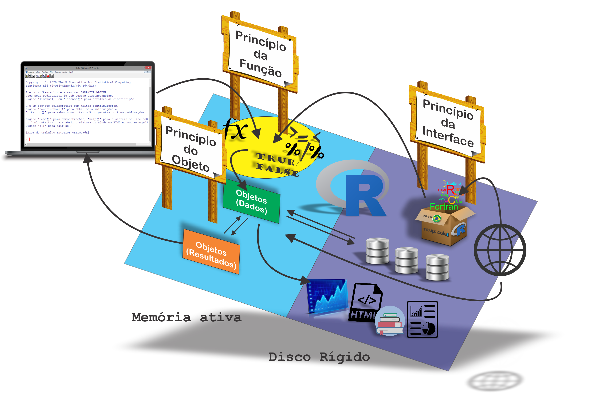

```{r setup, include=FALSE}
knitr::opts_chunk$set(echo = FALSE)
```

# Sumário 

- Em construção...

##

# <i class="fas fa-folder-open"></i> Materiais para este módulo {#materiais}


## Slides de Aulas {#slidesaulas}

 - Aula 00: [Apresentação do Curso](aulas/aula00.html)
 - Aula 01: [Revisão de como o R trabalha]()

## Scripts {#scripts}
 - Script 00: 


## Scripts via  [Shiny](https://shiny.rstudio.com/) {#shiny}

[Curso R via Shiny](https://bendeivide.shinyapps.io/Curso-R/)

# <i class="fas fa-book"></i> Apresentação do curso {#apresentacao}

# Revisão de como o R trabalha

```{r rworks, fig.cap = "Relembrando como o `R` funciona.", out.width="100%", fig.align='center'}

```

