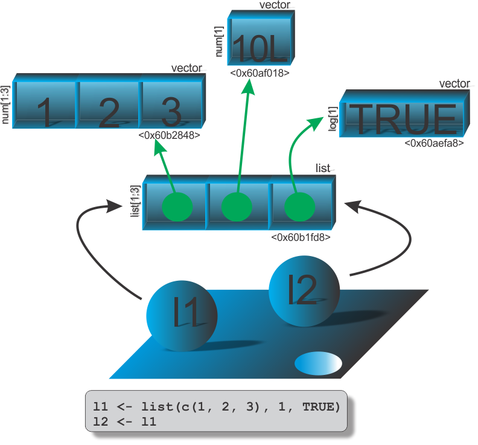

```{r setup, include=FALSE}
knitr::opts_chunk$set(echo = FALSE)
# Links
rlink <- "[R](http://r-project.org/){target='_blank'}"
rstudio <- "[RStudio](http://rstudio.org/){target='_blank'}"
cran <- "[CRAN](http://cran.r-project.org/){target='_blank'}"
github <- "[GitHub](http://github.com/){target='_blank'}"
```

```{r, echo=FALSE}
xaringanExtra::use_panelset()
```

::: {.panelset}
::: {.panel}
## Sumário

- [<i class="fab fa-r-project"></i> Caracterizando melhor o ambiente R](#caracteristasR)
- [<i class="fas fa-puzzle-piece"></i> Programação orientada a objetos](#poo)
  - [Nem tudo é orientado a objetos no R](#objetos-oo-base)
  - [Objetos base](#objetos-base)
  - [Sistemas de POO no `R`](#sistemas-poo)
  - [Sistema S3](#sistemaS3)
    - [Funções genéricas](#fgenericas)
    - [Entendendo melhor a chamada `UseMethod`](#UseMethod)
    - [Criando funções genéricas](#criando_fgenericas)
    - [Classe e classe implícita](#classeS3)
    - [Método S3](#metodoS3)
    - [Envio de método e mecanismo de herança](#envio-herança)
<!-- - [Estratégias para o sistema S3](#estrategiaS3) -->
<!-- - [Estilos de objetos POO S3](#est_obj_poo_s3) -->
- [ <i class="fas fa-arrow-circle-left"></i> Entendendo um pouco mais sobre objetos no `R`](#aprof-objetos)
  - [Estruturas atômicas e recursivas](#atomic-recursive)
  - [Usando `vector()`, `is.vector()` e `as.vector()`](#vectors) 
  - [Conhecendo outros objetos](#outros_obj)
    - [Objeto para datas, horas, tempo, durações e fusos horários](#datas_horas)
<!-- - [Mais manipulações com objetos e subconjuntos](#manip_obj_adicionais) -->
  - [Cópia ao modificar, modificação no local e tamanho de objetos](#copia_modif_tam_objetos)
  - [Coletor de lixo e desvinculação](#coletor_lixo_desvinc)
- [<i class="fas fa-align-justify"></i> Aprofundamento sobre ambientes](#aprof-ambientes)
- [<i class="fab fa-connectdevelop"></i> Programação Funcional](#prog_funcional)
  - [Composição de funções](#comp_funcoes)
  - [Operadores binários](#op_un-binarios)
  - [Avaliação preguiçosa dos argumentos de uma função](#promessas)
  - [Saídas implícitas, explícitas, invisíveis de funções](#saida_funcoes)
  - [Funções de substituição](#funcoes_substituicao)
  <!-- - Sintaxe da família de Pacotes *Tidyverse* -->
  <!-- - Evitando *loops* -->
  <!-- - Funções recursivas -->
<!-- Capítulo 8 - Conditions (Advanced R) -->
  - Programação defensiva 
  - Controle de fluxos usando paralelização

- [<i class="fas fa-database"></i> Banco de dados]()
- [<i class="fas fa-chart-bar"></i> Gráficos]()
- [<i class="fas fa-folder"></i> Projetos no RStudio]()  
- [<i class="fab fa-github-square"></i> Projetos R no GitHub]()
- [<i class="fas fa-box-open"></i> Introdução a desenvolvimento de pacotes]()
- [<i class="fas fa-file-alt"></i> Criação de documentações no R]()
  - Documentos *Web*
    - Páginas estatísticas
    - Páginas dinâmicas
  - Documentações de pacotes
    - Documentações de ajuda *.Rd*
    - Página *Web* de pacotes
  - Livros
  - *Blogs* e *websites*
  - Relatórios
    - Relatórios animados
    - Relatórios dinâmicos
  - Demais documentos (PDF, WORD, EPUB)
:::
::: {.panel}
## Slides de Aulas {#slidesaulas}

 - Aula 26: [Apresentação do Curso](aulas/aula26.html){target="_blank"}
 - Aula 27: [Caracterizando melhor o ambiente R](aulas/aula27.html){target="_blank"}
 - Aula 28: [Introdução a POO no ambiente R](aulas/aula28.html){target="_blank"}
 - Aula 29: [Tipos de objetos base](aulas/aula29.html){target="_blank"}
 - Aula 30: [Sistemas de POO no R](aulas/aula30.html){target="_blank"}
 - Aula 31: [Sistema S3](aulas/aula31.html){target="_blank"}
 - Aula 32: [Sistema S3: Funções genéricas (POO no R)](aulas/aula32.html){target="_blank"}
 - Aula 33: [Sistema S3:  Chamada *UseMethod* (POO no R)](aulas/aula33.html){target="_blank"}
 - Aula 34: [Sistema S3:  Criando funções genéricas (POO no R)](aulas/aula34.html){target="_blank"}
 - Aula 35: [Sistema S3:  Classes e classes implícitas (POO no R)](aulas/aula35.html){target="_blank"}
 - Aula 36: [Sistema S3:  Métodos (POO no R)](aulas/aula36.html){target="_blank"}
 - Aula 37: Revisão sobre as aulas 27 a 36 [Slide](aulas/aula37.html){target="_blank"} [Vídeo-aula](https://youtu.be/jEDoCWQZkdY){target="_blank"} [Script R](https://bendeivide.github.io/cursor/scripts/aula19/script19.R){target="_blank"}
 - Aula 38: [Sistema S3:  Envio (despacho) de métodos](aulas/aula38.html){target="_blank"}
 - Aula 39: [Sistema S3:  Mecanismo de herança](aulas/aula39.html){target="_blank"}
 <!-- - Aula 39: [Sistema S3:  Estratégias para o sistema S3](aulas/aula38.html){target="_blank"} -->
 <!-- - Aula 40: [Sistema S3:  Estilos de objetos](aulas/aula39.html){target="_blank"} -->
 - Aula 40: [Entendendo um pouco mais sobre objetos: estruturas atômicas ou recursivos](aulas/aula40.html){target="_blank"}
 - Aula 41: [Conhecendo outros objetos: Datas](aulas/aula41.html){target="_blank"}
 - Aula 42: [Conhecendo outros objetos: Datas, horas e fusos horários](aulas/aula42.html){target="_blank"}
 - Aula 43: [Cópia ao modificar, modificação no local de vetores](aulas/aula43.html){target="_blank"}
 - Aula 44: [Cópia ao modificar, modificação no local em funções](aulas/aula44.html){target="_blank"}
 - Aula 45: [Cópia ao modificar, modificação no local em listas](aulas/aula45.html){target="_blank"}
 - Aula 46: [Cópia ao modificar, modificação no local em quadro de dados (*Data frames*)](aulas/aula46.html){target="_blank"}
 - Aula 47: [Cópia ao modificar, modificação no local de vetores caracteres (*strings*)](aulas/aula47.html){target="_blank"}
 - Aula 48: [Tamanho de objetos](aulas/aula48.html){target="_blank"}
<!-- - Aula 49: [Coletor de lixo e desvinculação](aulas/aula49.html){target="_blank"} -->
 - Aula 49: [Ambientes: Introdução aprofundada](aulas/aula49.html){target="_blank"}
 - Aula 50: [Ambientes funcionais](aulas/aula50.html){target="_blank"}
 - Aula 51: [Ambientes em pacotes](aulas/aula51.html){target="_blank"}
 - Aula 52: [Programação funcional: Introdução](aulas/aula52.html){target="_blank"}
 - Aula 53: [Programação funcional: Composição de funções](aulas/aula53.html){target="_blank"}
 - Aula 54: [Programação funcional: Operadores unários e binários](aulas/aula54.html){target="_blank"}
 - Aula 55: [Programação funcional: Avaliação preguiçosa dos argumentos de uma função](aulas/aula55.html){target="_blank"}
 - Aula 56: [Programação funcional: Saídas implícitas, explícitas, invisíveis de funções](aulas/aula56.html){target="_blank"}
 - Aula 57: [Programação funcional: funções de substituição](aulas/aula57.html){target="_blank"}
 - Aula 58: [Programação funcional: Vetorização de funções](aulas/aula58.html){target="_blank"}
 - Aula 59: [Programação funcional: funções da família *apply*](aulas/aula59.html){target="_blank"}
 - Aula 60: [Programação funcional: funções recursivas](aulas/aula60.html){target="_blank"}
 - Aula 61: [Programação defensiva em funções](aulas/aula61.html){target="_blank"}
 - Aula 62: [Projetos no RStudio](aulas/aula62.html){target="_blank"}
 - Aula 63: [Projetos no Github](aulas/aula63.html){target="_blank"}
 - Aula 64: [Introdução a desenvolvimento de pacotes](aulas/aula64.html){target="_blank"}
 <!-- - Aula 65: [Introdução a criação de documentos no R](aulas/aula65.html){target="_blank"} -->
 <!-- - Aula 66: [Criações de livros](aulas/aula66.html){target="_blank"} -->
 <!-- - Aula 67: [Página *web* via pacote *distill*](aulas/aula67.html){target="_blank"} -->
 <!-- - Aula 68: [Página *web* via pacote *blogdown*](aulas/aula68.html){target="_blank"} -->
 <!-- - Aula 69: [Página *web* via pacote *pkgdown*](aulas/aula69.html){target="_blank"} -->
 <!-- - Aula 70: [Preparação para o módulo avançado](aulas/aula70.html){target="_blank"} -->
:::
::: {.panel}
## Scripts {#scripts}
 - Script 00: 
:::
::: {.panel}
## Exercícios e Scripts via  [Shiny](https://shiny.rstudio.com/) {#shiny}

[Curso R via Shiny](https://bendeivide.shinyapps.io/Curso-R/)
:::
:::
---


# <i class="fas fa-book"></i> Apresentação do curso {#apresentacao}

<iframe width="560" height="315" src="https://www.youtube.com/embed/tegLquZ1jsw" title="YouTube video player" frameborder="0" allow="accelerometer; autoplay; clipboard-write; encrypted-media; gyroscope; picture-in-picture" allowfullscreen></iframe>

O Curso `R` será todo aprensentado no formato online, sendo que as aulas terão vídeos como suporte, postados no canal [Youtube/Ben Dêivide](http://youtube.com/bendeivide){target="_blank"} divulgados ao longo do material. Os vídeos serão bem objetivos de curta duração para que usem como suporte com o material escrito. Como complemento  desse material, disponibilizaremos os [*scripts*](#scripts) com os comandos utilizados em cada aula e sua versão em [*Shiny*](#shiny) para os que não quiserem realizar inicialmente a instalação do R e do RStudio, poderão utilizar uma versão *online* do material juntamente com a linguagem `R`.

# <i class="fab fa-r-project"></i> Caracterizando melhor o ambiente R {#caracteristasR}

<iframe width="560" height="315" src="https://www.youtube.com/embed/mrJqW8yJLx0" title="YouTube video player" frameborder="0" allow="accelerometer; autoplay; clipboard-write; encrypted-media; gyroscope; picture-in-picture" allowfullscreen></iframe>

Ao estudarmos o [módulo básico](nbasico.html) do Curso R, conseguimos obter uma visão geral sobre o ambiente `R`, de modo que o aprofundamento sobre a linguagem se faz necessário, para quem deseja não apenas executar rotinas prontas, mas de fato, um contribuidor para a linguagem, como também um desenvolvedor de suas próprias funções. 

Na Figura \@ref(fig:rworks), apresentamos um resumo do que buscamos repassar no primeiro módulo. Agora, iremos no módulo intermediário, de fato, entender os dois princípios: Objeto e Função, para que fique claro que nem tudo no `R` é orientado a objetos, e que a rigor o `R` não é uma linguagem de programação funcional. Com essas informações, dentre outras, o programador poderá ter um maior controle sobre o desenvolvimento de suas próprias rotinas e funções.

```{r rworks, fig.cap = "Relembrando como o `R` funciona.", out.width="100%", fig.align='center'}
knitr::include_graphics("images/rworks2.png")
```

Vamos inicialmente caracterizar melhor o R. Por que usamos os termos **linguagem**, **software** ou **ambiente** para o `R`? Na página do `R`, na seção [*about*](https://www.r-project.org/about.html) se inicia com a primeira pergunta: O que é o R? Em resposta da própria página e utilizando também como resposta a nossa indagação inicial, o "R é uma linguagem e ambiente para computação estatística e gráficos", que ainda complementa que essa linguagem é uma implementação diferente da linguagem `S`, linguagem essa do qual inclui as principais implementações para análise estatística. Contudo, ocorrem algumas diferenças dentre as quais já apresentamos no [módulo básico](nbasico.html#rhistory), a presença do **escopo léxico** no `R`, que não ocorre na linguagem `S`. Desse modo, percebemos que o `R` é uma **linguagem interpretada**, pois além da linguagem `S` (o que fácil para os usuários a implementação do código), a sua base foi programada em `C` e `FORTRAN` (para computação mais intensiva). Mas também, adjetivamos o `R` como **ambiente de software** ao invés de apenas **software**, e aqui predominaremos esse termo, pois segundo ainda na própia página do `R` se "pretende caracterizá-lo como um sistema totalmente planejado e coerente, ao invés de um acréscimo incremental de ferramentas muito específicas e inflexíveis, como é frequentemente o caso com *outros softwares de análise de dados*". Assim, esse ambiente inclui:

- manipulação de dados;
- operações com matrizes;
- coleção de ferramentas para análise de dados;
- criação e apresentações gráficas, para apresentação dos dados;
- linguagem que inclui condicionais, fluxos de controle, funções recursivas definidas pelo usuário e recursos de entrada e saída;
- Documentação e relatórios de análises.

Existem linguagens como `C` e `FORTRAN`, por exemplo, que a execução do código nessas linguagem precisam de uma compilação, para depois serem executadas, isto é, as linhas de códigos programadas pelo usuário precisam ser convertidas na linguagem de máquina, para que depois seja executa. Porém, no `R`, quando escrevemos uma linha de comando no console, do tipo:

```{r echo=TRUE, include=TRUE}
(x <- 10)
```

Percebemos no `R` o código é automaticamente interpretado conforme o usuário executa. Desse modo, caracterizamos a linguagem de **programação dinâmica**.  A ideia se estende a avaliação de funções, a extensão da linguagem sem o uso de macros, e a manipulação com ambiente. Ainda mais, podemos afirmar também que essa dinamicidade está relacionada ao fato do `R` também ser uma **linguagem fortemente e dinamicamente tipada**. Nesse caso, os valores contidos nos objetos é que são tipados. Por exemplo, vetores atômicos apresentam sempre elementos com mesmo tipo. Porém, à medida que adicionamos elementos ao vetor, pode haver a coersão da tipagem dos elementos, quando esses elementos apresentam tipos diferentes, como foi abordado no módulo básico, na seção [coersão](nbasico.html#coersao). Vejamos um exemplo, a seguir.

```{r echo=TRUE, include=TRUE}
vetor <- TRUE; typeof(vetor)
vetor[2] <- 1; typeof(vetor)
vetor[3] <- "1"; typeof(vetor)
vetor
```
Observemos que o objeto associado ao nome `vetor` vai alterando a tipagem por coersão, é o comportamento dinâmico da linguagem. Observe que o nome `vetor` é um objeto de tipo *symbol* e o vetor `c("1", "1" "1")` é outro objeto, cujos os elementos foram coagidos a tipagem `character`. Claro, que o acesso ao vetor só é possível recuperar da memória ativa, se este estiver associado a algum nome, no caso `vetor`. Porém, não é o nome que altera o seu tipo, mas os elementos do objeto associado a este nome, em que, por ser um verto atômico, seus elementos devem apresentar o mesmo tipo.

A ideia do `R` como uma linguagem de programação com **estilo funcional**, se deve pelo fato da linguagem ter funções de primeira classe, `function()`, isto é, funções que se comportam como qualquer outro objeto no ambiente `R`. Por exemplo, podemos atribuir nomes as nossas funções, armazená-las em listas, serem criadas dentro de outras funções, serem argumentos de outras funções, ou até ser um resultado de uma função. Inclusive na versão do `R` 4.1, a função `function()` ganhou um novo formato, que também pode ser usado. Vejamos o exemplo:

```{r echo=TRUE, include=TRUE}
# Forma original
soma1 <- function(x) x + 1; soma1(1)
# Forma alternativa (>= R 4.1)
soma1 <- \(x) x + 1; soma1(1)
```

Para complementar atualizações dessa versão, uma outra importante foi implemento da função *pipe* (`%>%`). Originalmente, a função *pipe* (lê-se paipe) é do pacote [magrittr](https://magrittr.tidyverse.org/) da família de pacotes [tidyverse](https://www.tidyverse.org/), do qual é um operador binário em que o primeiro operando é um objeto para a entrada de dados, e o segundo é uma função. Nesse caso, o objeto no primeiro operando entrará no primeiro argumento da função no segundo operando. Vejamos um exemplo, a seguir.

```{r echo=TRUE, include=TRUE}
# install.packages(magrittr) # Instalando o pacote
library(magrittr) # anexando o pacote
1:10 %>% mean
```
Observe que calculamos a média do vetor `1:10`. Agora, a versão do *pipe* nativa no `R` (>= 4.1), sua sintaxe é `|>`. Vejamos o mesmo exemplo usado anteriormente, agora com a função nativa, isto é,

```{r echo=TRUE, include=TRUE}
1:10 |> mean()
```

A diferença no caso do *pipe* nativo é que no segundo argumento, além do nome da função, acrescemos o parênteses sem seus argumentos. **Lembrando que o primeiro operando entrará no primeiro argumento da função (segundo operando)**.

Retornando a programação funcional, sabemos que o `R` não é estritamente funcional. A definição de programação funcional apresenta algumas características, dentre elas, que a linguagem apresente:

- Composição de funções;
- Funções puras;
- Imutabilidade;
- Efeito colateral;

A ideia da **composição de funções** representa a criação de funções por meio de outras funções, e isso está dentro da linguagem `R`. Por exemplo, vamos criar uma função que calcula a média de um conjunto de dados, usando a função, `mean()`, já existente no pacote `base`, isto é,

```{r echo=TRUE, include=TRUE}
x <- 1:10
media <- function(x) mean(x)
media(x)
```

A caracterização de **funções puras**, significa que as funções sempre retornam o mesmo resultado, dados os mesmos parâmetros de entrada, isto significa que não existe **efeito colateral**. Um exemplo de função pura, pode ser como:

```{r echo=TRUE, include=TRUE}
fpura <- function(x) {
  if (!is.numeric(x)) stop("x deve ser numérico")
  x + 1
}
fpura(x = 2)
```
Observe que `fpura()` toda vez que a entrada for `x = 2`, o resultado sempre será o resultado `3`. Porém, o `R` se exclui dessa característica estritamente funcional, quando aprensentamos funções: `runif()`, `rnorm()`, `read.csv()`, dentre outras. Por exemplo, a função `rnorm()` representa um gerador de números aleatórios de uma distribuição normal, do qual se executarmos essa função, mais de uma vez, usando a mesma entrada para o argumento `n = 3`, o resultado não será sempre o mesmo, observe:

```{r echo=TRUE, include=TRUE}
rnorm(n = 3)
rnorm(n = 3)
```

A **imutabilidade** na programação funcional apresenta em uma linguagem na situação em que uma variável ou objeto é criado, e este não pode ser modificado. Esta é outra característica que ocorre no `R`, mas não para todos os objetos em que exitem nomes associados, é o caso da **modificação no local**. Por exemplo, vamos apresentar um contra-exemplo de que nem todos os objetos no `R` são imutáveis. Vejamos:

```{r echo=TRUE, include=TRUE, eval=FALSE}
# Criamos um vetor e associamos ao nome 'x'
x <- c(1, 2, 3)
# Vejamos o identificador de memória
lobstr::obj_addr(x)
# > "0xcf09be4708"
# Modificando no local
x[2] <- 4; x
# [1] 1 4 3
# Mesmo modificando o objeto, o identificador eh o mesmo
lobstr::obj_addr(x)
# > "0xcf09be4708"
```

Para a execução dessas linhas de comando, sugerimos que não utilizem diretamente o RStudio, porque a IDE sempre faz uma referência a cada objeto. Sugerimos que utilize a própria interface do `R`. Esse tema será aprodundado mais a frente, na seção [entendendo um pouco mais sobre objetos](#aprof-objetos).

Por fim, duas outras características importantes do estilo funcional da linguagem, é o **escopo léxico** das funções, assunto abordado no [módulo básico](nbasico.html), e a **execução preguiçosa**, do qual o argumentos das funções são avaliados apenas quando utilizados. Vejamos, o exemplo a seguir.

```{r echo=TRUE, include=TRUE}
preguicoso <- function(a, b = faux())  a * 100
preguicoso(4)
```
Observemos nesse caso, que o argumento `b` recebe uma função `aux()` que não existe. Contudo, ao executar a linha de comando seguindo, a função `preguicoso` retorna o resultado `400` sem erro. Isso porque como não foi necessário utilizar o argumento `b` no corpo da função, este não foi avaliado, e portanto, sem retorno de erro da função `preguicoso`. Iremos mais a frente, detalhar essa característica de modo mais aprofundado. 

O `R` não é uma linguagem totalmente orientada a objetos, como afirmado por alguns. Apesar, de um dos princípios do `R` que tudo é um objeto, não significa dizer que tudo é orientado a objetos. Isso se deve ao fato de que os primeiro objetos criados no `R`, que chamaremos de **objetos base**, foram desenvolvidos baseados na linguagem `S`. E nesse tempo não havia qualquer cogitação de que fosse necessário um sistema de programação orientada a objetos (POO). Veremos mais a frente, que a distinção básica entre objetos base e objetos baseados em sistemas orientados a objetos, chamaremos de **objetos POO**, é que estes últimos terão o atributo `class`, do qual podemos consultá-lo pela função `attr()`. Vejamos, alguns exemplos:

```{r echo=TRUE, include=TRUE}
# Objetos POO
attr(ggplot2::diamonds, "class")

# Objetos base
attr(1:10, "class")
```

Quando não há o atributo `class`, isto é, `NULL`, é objeto base. Contudo, iremos na seção [Programação orientada a objetos](#poo) saber em que sistemas esses objetos estão orientados, porque no `R`, diferentemente de outras linguagens,  existem vários sistemas POO, como: S3, S4 R5 (classes de referências), R6, dentre outros.

Por fim, como última caracterização do `R` abordada é como uma linguagem de programação metaparadigma ocorre porque pela própria linguagem, poderemos inspecioná-la, modificá-la, por ela mesma, como se fosse um objeto, o que acaba tornando uma ferramenta muito poderosa. E isso será tema abordado mais a frente.

Portanto, esclarecido isso, e ainda com as demais características apresentadas no [módulo básico](nbasico.html), dizemos que o `R` é:

- um ambiente de software livre e código aberto, com licença GNU;
- umalinguagem de programação interpretada;
- uma linguagem de programação dinâmica;
- uma linguagem de programação funcional; 
  - de escopo lêxico;
  - avaliação preguiçosa;
- uma linguagem de programação orientada a objetos;
- uma linguagem de tipagem forte e dinâmica; e
- uma linguagem de programação metaparadigma.

<!-- # Evolução do R -->

<!-- https://en.wikipedia.org/wiki/R_(programming_language) -->

# <i class="fas fa-puzzle-piece"></i> Programação orientada a objetos {#poo}

<iframe width="560" height="315" src="https://www.youtube.com/embed/x4gpW5Ip-uE" title="YouTube video player" frameborder="0" allow="accelerometer; autoplay; clipboard-write; encrypted-media; gyroscope; picture-in-picture" allowfullscreen></iframe>

Assim como no nosso dia a dia podemos realizar uma mesma tarefa de modos diferentes, isso ocorre também na programação. Nesse caso, dizemos que esses modos são os paradigmas da programação. E a programação orientada a objetos (POO) é um desses paradigmas que veio para contornar alguns problemas da programação estrutural, um outro paradigma.

Antes de apresentarmos outras diferenças entre os objetos base e objetos OO, se faz necessário entendermos alguns conceitos da POO, do qual tudo se desencadeará pelos termos **classe**, **objeto** e **método**. Para isso, vamos ilustrar alguns termos baseados no nosso cotidiano. Uma das grandes cobiças nessa era digital é ter um bom *smartphone* para que possamos estar conectados nessa era digital, bem não sei se foi bem esse objetivo do *smartphone*, mas consideremos que tenha sido. Essa escolha se deve a algumas *características* tamanho, cor, desempenho, câmera, dentre outras. Outro fator que pode ter sido o motido da sua escolha é o *comportamento* desse celular, como o seu desempenho do processador, a velocidade com o qual se desenvolve as atividades, a forma como os aplicativos reagem as suas ações, o sistema como o algoritmo baseado em inteligência artificial interage com todo o sistema operacional do aparelho, dentre outros. Nesse momento, fazendo uma relação com o ambiente `R`, dizemos que o celular que desejamos é o objeto, suas características são os atributos do objeto, e o comportamento será o método aplicado a este objeto na programação orientada a objetos. 

Mesmo que seu aparelho apresente um IMEI (Código de identificação do aparelho) único, nós sabemos que existem diversos aparelhos com essa mesma configuração, modelo e marca, alguns outros com pequenas características que o diferenciam, mas conseguimos identificar ainda assim, esse objeto como um celular. Portanto, podemos dizer que o celular é uma *classe* para o ambiente `R`, em que apesar de termos diversos objetos, estes são identificados dentro de um conjunto de características que o definem como celular. Nesse caso, dizemos ainda que o celular que escolhemos é uma *instância* dessa classe, que apesar de ter atributos próprios, ainda assim, é identificado como um celular. Desse modo, ao ser definidos as classes de determinados objetos, a linguagem saberá utilizar o método correto para tal objeto, isso significa que mesmo que não saibamos como ocorre, devemos confiar que ocorrerá. Isso é programação orientada a objetos.

Teríamos mais analogias para abordar, como **encapsulamento**, **hierarquias** , **envio (ou despacho) de método**, **polimorfismo**, **subclasses**, **superclasses**, dentre outras. Mas, vamos deixar para discutir ao longo das aplicações.

Assim, esse paradigma da programação permite associarmos o desenvolvimento do nosso código pra dentro de nossa realidade humana. Porém a ideia de POO dentro do `R` sai do escopo de implementações densenvolvidas em outras linguagens. Antes de entrarmos no tema propriamente dito, queremos ressaltar que não estamos interessados em repassar uma POO eficiente, devido a todo o cunho teórico exigido para o assunto. Mas, queremos repassar como os principais sistemas de POO foram desenvolvidos dentro do `R`.

## Nem tudo é orientado a objetos no R {#objetos-oo-base}

<iframe width="560" height="315" src="https://www.youtube.com/embed/npVwzYBIpZ0" title="YouTube video player" frameborder="0" allow="accelerometer; autoplay; clipboard-write; encrypted-media; gyroscope; picture-in-picture" allowfullscreen></iframe>

Uma primeira ideia que temos que saber é que apenas de um dos princípios que tudo no `R` é um objeto, mas nem tudo é orientado a objetos. Isso ocorre, porque discutimos anteriormente, que o `R` é um dialeto da linguagem `S`. No início do desenvolvimento da linguagem `S`, John Chambers e seus colaboradores nem cogitavam para a implementação do código a programação orientada a objetos, desse modo, o `R` quando começou a ser densevolvido, os primeiros objetos desenvolvidos foram vêm dessas primeiras versões da linguagem `S`, sem ainda a implementação de POO.

Dessa forma, vamos distinguir o `R` com dois tipos de objetos:

  - **Objetos POO** (Objetos para POO)
  - **Objetos base** (Objetos não voltados a POO)

A principal diferença técnica é que um **objeto POO** terá o atributo `class`, e o **objeto base**, não. Vejamos,

```{r echo=TRUE, include=TRUE}
# Objeto "data.frame"
objPOO <- data.frame(a = 1, b = "1", c = TRUE)
# Objeto "data.frame" eh um objeto POO?
is.object(objPOO)

# Vetor de comprimento 10
objBASE <- 1:10
# O vetor eh um objeto POO?
is.object(objBASE)
```

Pela função `is.object()`, sabemos se um objeto é de POO ou não. Entretanto, no `R` temos diversos sistemas POO, alguns da base de instalação do programa, e outros disponíveis no CRAN. Detalharemos os tipos, a seguir.

## Objetos base {#objetos-base}

Existem 24 tipos de objetos diferentes no `R` (antes eram 26, porém o objetos referentes a fatores e fatores ordenados foram retirados). A base de criação desses objetos foram a linguagem `C`, e que na realidade são ponteiros para uma estrutura com `typedef` `SEXPREC`. Os seus tipos estão representados por `SEXPTYPE`, que determina como as características da estrutura são usadas. Para mais detalhes, ler [R Language Definition](https://cran.r-project.org/doc/manuals/r-release/R-lang.html) e [R Internals](https://cran.r-project.org/doc/manuals/r-release/R-ints.html). Alguns tipos são importantes para o usuário `R`, outros apenas com importância interna ao ambiente `R`, dos quais esses tipos podem ser identificados pela função `typeof()`, que segue:

|Representação em `R`| Representação em `C` (`SEXPTYPE`)| Descrição|
|:-------------------|:--------------------|:---------|
|`NULL`              | `NILSXP`            |   Único vetor que tem comprimento zero e não pode ter atributo       |
| `logical`          |  `LGLSXP`           | Vetores lógicos |
|  `integer`         |   `INTSXP`          | Vetores inteiros |
| `double`           |    `REALSXP`        | Vetores reais |
|  `complex`         |    `CPLXSXP`        | Vetores complexos |
|  `character`       |     `STRSXP`        | Vetores caracteres (*strings*)|
|  `list`            |    `VECSXP`         | Listas |
|   `raw`            |      `RAWSXP`       | Vetores brutos|
|   `closure`        |   `CLOSXP`          | Funções criadas por meio de `function()`|
|    `special`     | `SPECIALSXP`          | Funções primitivas (funções básicas e operadores) que são escritas principalmente na linguagem `C`. Desse modo, essas funções não apresentam as três estruturas básicas de uma função do tipo `closure`, como `formals()`, `body()`, `environment()`, que são todas `NULL`. Aprofundaremos esse objeto no [módulo avançado](navancado.html) |
|    `bultin`     | `BUILTINSXP`          | Funções primitivas (funções básicas e operadores) que são escritas principalmente na linguagem `C`. Desse modo, essas funções não apresentam as três estruturas básicas de uma função do tipo `closure`, como `formals()`, `body()`, `environment()`, que são todas `NULL`. Aprofundaremos esse objeto no [módulo avançado](navancado.html) |
|  `environment`  |  `ENVSXP`             | Ambientes|
|   `S4`          |   `S4SXP`             | Objetos com sistema POO **S4**|
|     `symbol`    |  `SYMSXP`             | Nomes associados aos objetos|
|    `language`   |     `LANGSXP`         | Objetos de linguagem, que abordaremos na seção sobre metaprogramação|
|    `pairlist` |       `LISTSXP`         | Argumento das funções|
|  `expression` |     `EXPRESXP`          | Vetores de expressão|
|   `externalptr` |   `EXTPTRSXP`         | Ponteiro externo, são vetores exóticos que tem importância para a linguagem `C`|
| `weakref`  |         `WEAKREFSXP`       | Referência fraca, são vetores exóticos que tem importância para a linguagem `C`|
|  `bytecode` |         `BCODESXP`        | Código de byte, são vetores exóticos que tem importância para a linguagem `C`|
|  `promise` |         `PROMSXP`     |  Promessas, são objetos responsáveis pelo pelo carregamento preguiçoso dos argumentos de uma função|
|   `...`    | `DOTSXP`   | Objeto utilizado como um argumento da função,  após a criação de uma função, ainda assim, podem ser inseridos mais argumentos|
| `any` |  `ANYSXP`   | Objeto que representa qualquer tipo. Raramente utilizado em `R`, mas aparece por exemplo em `as.vector(x, mode = "any")`, considerando que `x` é um objeto `R`|
|  -  | `CHARSXP`  | Cadeia de caracteres internas, isto é, um tipo de escalar *string*, usado somente internamente|

Todas as funcões que usam esses **objetos base** e apresentam comportamento diferentes, não usam o sitema POO, porque foram implementadas em sua maioria na linguagem `C`, usando a instrução `switch`, em que também aprofundaremos no [módulo avançado](navancado.html).


## Sistemas de POO no `R` {#sistemas-poo}

<iframe width="560" height="315" src="https://www.youtube.com/embed/nvSuHOK5ZPE" title="YouTube video player" frameborder="0" allow="accelerometer; autoplay; clipboard-write; encrypted-media; gyroscope; picture-in-picture" allowfullscreen></iframe>

Usando as ideias de @chambers2016, complementadas por @hadley2019, dizemos que o paradigma da programação orientada a objetos pode ser dividida em dois ramos:

- **POO encapsulada**: os métodos são encapsulado em suas classes, isto é, os objetos nesse estilo de programação contém os seus comportamentos;
- **POO funcional**: os métodos pertencem as funções, das quais serão aplicadas aos objetos de determinada classe.

O `R` em sua base, apresenta três sistemas de POO: **S3**, **S4** e **CR** (classes de referência). No *CRAN*, existem diversas implementações de POO, das quais podemos citar: **R6** (pacote [R6](https://r6.r-lib.org/)), [R.oo](https://github.com/HenrikBengtsson/R.oo), [proto](https://github.com/hadley/proto), dentre outros.

Exploraremos para esse momento, apenas o sistema **S3** (POO funcional), em que o sitema **S4** também apresenta o paradigma POO funcional. Esses dois sistemas foram a evolução da implementação de POO na linguagem `S` implementadas no `R`. Contudo, os seus nomes geram a impressão de que também haviam os sistemas S1 e S2, mas não, os nomes **S3** e **S4** se devem as versões da linguagem `S`, como evolução da linguagem em si. Nesses momentos, foram o marco para a incorporação da programação orientada a objetos na linguagem, em que antes não existia, por isso, não haver sistemas S1 e S2. 

Para complementar a carcterização dos sistemas citados, os sistemas **RC** e **R6** apresentam o paradigma POO encapsulado. Os demais sistemas implementados nos pacotes disponíveis no CRAN, como [R.oo](https://github.com/HenrikBengtsson/R.oo) fornece algum formalismo em cima de S3 e torna possível ter objetos S3 mutáveis (@hadley2019), e [proto](https://github.com/hadley/proto) que implementa outro estilo de OOP baseado na ideia de protótipos , que confundem as distinções entre classes e instâncias de classes (objetos) (@hadley2019), do qual foi o sistema implementado para o pacote [ggplot2](https://ggplot2.tidyverse.org/). 

## Sistema S3 {#sistemaS3}

<iframe width="560" height="315" src="https://www.youtube.com/embed/aMTHWwYKiNQ" title="YouTube video player" frameborder="0" allow="accelerometer; autoplay; clipboard-write; encrypted-media; gyroscope; picture-in-picture" allowfullscreen></iframe>

<!-- Depois modificar esse parágrafo inicial, após descrever os demais métodos -->

Poderíamos descrever todos os sistemas, porém restringiremos ao sistema **S3**, por uma única razão, é o sistema amplamente empregado aos objetos dos pacotes **base** e **stats**, bem como na maioria dos pacotes disponíveis no *CRAN*. Mais detalhes sobre o sistema, sugerimos leituras em @chambers2016, @hadley2019, @chambers2008, @chambers1991, dentre outros materiais.

Como falado anteriormente, um objeto POO  terá sempre um atributo `class`, em que podemos utilizar a função `atributes` para verificar isso. Vejamos,

```{r echo=TRUE, include=TRUE}
quadro_dados <- data.frame(a = 1, b = TRUE, c = "A")
attributes(quadro_dados)
```

O fato do objeto `quadro_dados` ter o atributo `class=data.frame`, lhe dá um comportamento especial a determinadas funções genéricas. Vejamos como imprimos essa função pela funcão `print()`, isto é,

```{r echo=TRUE, include=TRUE}
print(quadro_dados)
```

Removendo esse atributo do objeto, por meio da função `unclass()`, voltamos ao tipo de objeto base subjascente. Dessa forma, a função `print` perde esse comportamento especial, apresentada a seguir.

```{r echo=TRUE, include=TRUE}
print(unclass(quadro_dados))
```

Isso significa, que o objeto `data.frame` perde seu comportamento especial e retorna ao mesmo comportamento de uma lista. Afinal, falamos no módulo básico que um objeto `data.frame` é uma lista.  

### Funções genéricas {#fgenericas}

<iframe width="560" height="315" src="https://www.youtube.com/embed/wQiwTa-s9Bw" title="YouTube video player" frameborder="0" allow="accelerometer; autoplay; clipboard-write; encrypted-media; gyroscope; picture-in-picture" allowfullscreen></iframe>

A base do sistema **S3** está nas **funções genéricas** ou também podemos chamar de **genéricos**, que buscam o método específico para determinada classe de um objeto. Esta função representa um intermediário do sistema **S3**, do qual define os argumentos de entrada, e na sequência, encontra o método certo, baseado na classe do objeto associado ao primeiro argumento da função genérica. Para sabermos se uma função é genérica, temos algumas funções: `utils::isS3stdGeneric()` e `sloop::ftype()`. Verificando esta última função, além de informar se é uma função genérica, informa também o sistema POO, além do que a função `utils::isS3stdGeneric()` apenas retorna `TRUE`, as funções genéricas **S3** que apresentam no corpo de sua função, a chamada `UseMethod`. Vale lembrar, que funções primitivas/internas não apresentam essa chamada de função. Dessa forma, usaremos, principalmente, a função `sloop::ftype()` como pesquisa por funções genéricas. Vejamos,

```{r echo=TRUE, include=TRUE}
# Funcoes do tipo "closure" que nao pertencem ao sistema S3
utils::isS3stdGeneric(data)
sloop::ftype(data)
# Funcao generica S3 em funcoes do tipo "closure"
utils::isS3stdGeneric(mean)
sloop::ftype(mean)
# funcoes primitivas e internas que nao pertencem ao sistema S3
utils::isS3stdGeneric(inherits)
sloop::ftype(inherits)
#-----
utils::isS3stdGeneric(unclass)
sloop::ftype(unclass)
# funcoes genericas do sistema S3 que sao primitivas e internas
utils::isS3stdGeneric(length)
sloop::ftype(length)
#--
utils::isS3stdGeneric(unlist)
sloop::ftype(unlist)
```

A função `sloop::ftype()` retorna um vetor de caracteres de comprimento 1 ou 2. Quando retorna apenas um valor, do qual não obtemos o resultado `generic`, significa que esta função não é genérica, como é o caso da função `data`. Quando há um retorno de dois valores, e um deles é `generic`, significa dizer que a função é genérica, em que o primeiro valor, representa o sistema POO, como é o caso da função `mean`. No caso, das funções primitivas/internas que estão no pacote `base`, o primeiro resultado da função `sloop::ftype()` para a referida função será `primitive` ou `internal`, e se houver o segundo valor de nome `generic`, se confirma que também é um função primitiva genérica do método **S3**.


As funções genéricas do tipo `closure` terão 
no corpo de sua função a chamada `UseMethod`, uma função primitiva . Essa é a identificação básica de uma função genérica. Podemos observar, como exemplo, a função `mean`:

```{r echo=TRUE, include=TRUE}
mean
```

Entretanto, funções primitivas e internas são escritas em linguagem `C`, mas também podem ser funções genéricas. Não há função no `r rlink` para acesso direto do código interno interno dessas funções, bem como de seus argumentos. O que na realidade deve ser feito é acessar código fonte. Para isso, podemos pesquisar sobre alguma função primitiva, por exemplo `'[['`, por `pryr::show_c_source(.Primitive("[["))`.

O que ocorre nesse caso, é que estas funções não usam a chamada `UseMethod`. Desse modo, as funções primitivas e internas podem ser identificadas, pelo objeto `.S3PrimitiveGenerics`, um vetor de caracteres, que seguem:

```{r echo=TRUE, include=TRUE}
.S3PrimitiveGenerics
# Outras funcoes primitivas
(outros_obj_S3_primitivos <- c("[", "[[", "$", "[<-", "[[<-", "$<-"))
# Outras funcoes internas nao primitivas
(outros_obj_S3_primitivos <- c("unlist", "cbind", "rbind", "as.vector"))
```
Algumas outras funções como `is.name` que é sinônimo da função `is.symbol`, assim como a função `as.numeric` é sinônimo da função `as.double`. Existem outras funções genéricas que também são primitivas/internas, são as funções genéricas do grupo **S3** que não estão descritos no objeto  `.S3PrimitiveGenerics`. Há quatro desses grupos para que os métodos **S3** podem ser escritos, denominados: grupo `Math`, grupo `Ops`, grupo `Summary` e grupo `Complex`. Detalhamos as funções:

- Grupo `Math`: 
  - `abs`, `sign`, `sqrt`, `floor`, `ceiling`, `trunc`, `round`, `signif`
  - `exp`, `log`, `expm1`, `log1p`, `cos`, `sin`, `tan`, `cospi`, `sinpi`, `tanpi`, `acos`, `asin`, `atan`, `cosh`, `sinh`, `tanh`, `acosh`, `asinh`, `atanh`
  - `lgamma`, `gamma`, `digamma`, `trigamma`
  - `cumsum`, `cumprod`, `cummax`, `cummin`

- Grupo `Ops`:
  - `"+"`, `"-"`, `"*"`, `"/"`, `"^"`, `"%%"`, `"%/%"`
  - `"&"`, `"|"`, `"!"`
  - `"=="`, `"!="`, `"<"`, `"<="`, `">="`, `">"`

- Grupo `Summary`:
  - `all`, `any`, `sum`, `prod`, `min`, `max`, `range`

- Grupo `Complex`:
  - Arg, `Conj`, `Im`, `Mod`, `Re`

Apesar não termos funções com nomes `Math`, `Ops`, `Summary` e `Complex` no pacote `base`, e portanto, também não serem objetos `R`, podemos fornecer métodos para estes, como por exemplo, no pacote `base`, temos métodos como:

- Métodos de `Math`: 

```{r echo=TRUE, include=TRUE}
methods("Math")
```

- Métodos de `Summary`: 

```{r echo=TRUE, include=TRUE}
methods("Summary")
```

- Métodos de `Complex`: 

```{r echo=TRUE, include=TRUE}
methods("Complex")
```

Os métodos que estão com asterisco é porque não são exportados do namespace dos pacotes em que essas funções foram criadas. Para isso, use `:::`, `getS3method` ou `getAnywhere`. Por exemplo, se tentarmos procurar pelo método `str.data.frame` no console, não iremos encontrar porque ela não foi exportada pelo *namespace* do pacote `utils`. Para acessar o referido método, segue:

```{r echo=TRUE, include=TRUE, collapse=TRUE}
# Primeira forma:
getAnywhere("str.data.frame")
# Segunda forma (Sistema S3 apenas):
getS3method("str", "data.frame")
# Terceira forma
utils:::str.data.frame
```

Os métodos desenvolvidos no pacote `base` com asterisco dos métodos genéricos de grupo não são acessados pelas funções anteriores. Por fim, vamos criar uma pequena rotina, adaptado de @chambers2016, para vermos quais e quantas funções genéricas primitivas existem no pacote `base`, a seguir.

```{r echo=TRUE, include=TRUE}
# Todos os objetos do pacote 'base'
todosobj <- objects(baseenv(), all.names = TRUE); 
# Mostre apenas os primeiros (ver todos remova 'head')
head(todosobj)
# Quantos objetos no pacote 'base'?
length(todosobj)
# Quais sao funcoes primitivas?
objprimitivos <- todosobj[sapply(todosobj,  function(x) is.primitive(get(x, envir = baseenv())))]
# Mostre os primeiros (ver todos remova 'head')
head(objprimitivos)
# Quantos primitivos ('buitin' ou 'special')?
length(objprimitivos)
# Quais sao primitivos genéricos (Sistema S3)?
ehPrimitivaGenerica <- function(primitiva) {
  fprimitiva <- getFunction(primitiva, mustFind = FALSE, where =asNamespace("base"))
  ehgenerica <- sloop::ftype(fprimitiva)
  if (any(ehgenerica == "generic")) {
    TRUE
  } else FALSE
}
# Mostre os primeiros (ver todos remova 'head')
head(sapply(objprimitivos, ehPrimitivaGenerica))
# Quantas sao primitivas genericas?
sum(sapply(objprimitivos, ehPrimitivaGenerica))
```

### Entendendo melhor a chamada `UseMethod` {#UseMethod}

<iframe width="560" height="315" src="https://www.youtube.com/embed/R0Ty5xjYDG4" title="YouTube video player" frameborder="0" allow="accelerometer; autoplay; clipboard-write; encrypted-media; gyroscope; picture-in-picture" allowfullscreen></iframe>

Na seção anterior, falamos que as funções genéricas do tipo `closure`, usam no corpo da função a chamada  `UseMethod`. Esta é uma função primitiva, desenvolvida em `C`, porém usa a correspondência padrão de argumentos, com sintaxe dada por:

```{r, echo=TRUE, eval=FALSE}
UseMethod(generic, object)
```
em que o argumento `generic` representa o nome da função genérica (obrigatório para utilizar na chamada de `UseMethod`), e o segundo argumento `object` é o objeto cuja classe determina o método a ser enviado para execução pela função genérica. O argumento `objeto` representa o primeiro argumento da função genérica, e portanto, na prática usamos apenas o argumento `generic`, uma vez que a função `UseMethod` se encarrega do resto. 

Uma outra coisa importante é que a chamada da função `UseMethod` deve ser usada apenas no corpo de uma função, isto é, `function(x) UseMethod("fgenerica")`. Caso contrário, ocorre o retorno de erro, isto é,

```{r echo=TRUE, include=TRUE, error=TRUE}
fgenerica <- function(x) print(x)
UseMethod("fgenerica")
```

Desse modo, a forma correta de declarar a chamada de função `Usemethod`, baseado no exemplo anterior, deve ser apresentado como segue,

```{r echo=TRUE, include=TRUE}
# Primeira sintaxe
fgenerica <- function(x) UseMethod("fgenerica")
# Segunda sintaxe
fgenerica <- function(x) {
  UseMethod("fgenerica")
}
# Terceira sintaxe
fgenerica <- \(x) UseMethod("fgenerica")
# Quarta sintaxe
fgenerica <- \(x) {
  UseMethod("fgenerica")
} 
```

Portanto, o objeto associado ao nome `fgenerica` é o que chamamos de função genérica. Nesse caso, o código interno de `UseMethod` examina o atributo `class` no objeto do primeiro argumento da função genérica, que no caso da função genérica `fgenerica` anterior, é o argumento `x`. 

A chamada `UseMethod` insere objetos especiais no ambiente de avaliação da função genérica, que são `.Class`, `.Generic` e `.Method`. Eles são responsáveis pelo despacho de método e os mecanismos de herança. O objeto `.Class` representa a classe do objeto (primeiro argumento da função genérica), `.Generic` é o nome da função genérica, e `.Method` é o nome do método usado. Poderá surgir também um outro objeto chamado `.Group`, quando funções genéricas são primitivas que se enquandram dentro das funções genéricas de grupo, visto mais a frente. De todo modo, isso é serviço para o `r rlink` internamente e o usuário não precisará se preocupar. Vejamos o código a seguir, para observamos como podemos obter informações desses objetos.

```{r echo=TRUE, include=TRUE}
generico <- function(x) UseMethod("generico")

generico.metodo <- function(x) cat("Imprima o valor dos objetos .Generic, .Class e .Method, respectivamente:\n", .Generic, "\n", .Class, "\n", .Method)

x <- 1; class(x) <- "metodo"
generico(x)
```


Uma coisa interessante, é que a função `UseMethod` por ser primitiva, não cria seu próprio ambiente, mas a sua chamada ocorre no ambiente de chamada, isto é, no ambiente de execução da função genérica. Além do mais, como o ambiente de chamada da função `UseMethod` é o ambiente de execução da função genérica, um código interno em `UseMethod` faz com que o ambiente de chamada seja finalizado após o método ter sido avaliado. Em outras palavras, o que for escrito no corpo da função genérica após a chamada `UseMethod`, não será executado nem avaliado. Vejamos um exemplo, para clarear o que estamos falando, que segue,

```{r echo=TRUE, include=TRUE}
# Funcao generica
quem <- function(x) {
  print("Isso pode ser impresso!")
  UseMethod("quem")
  ## Apos a Chamada UseMethod o ambiente eh encerrado!
  print("Isso nao sera impresso!")
}
## Metodo
quem.eh <- function(x) print("Sou eu! (arg x)")
# Aplicacao:
pessoa <- "ben" # objeto sem atributo 'class'
class(pessoa) <- "eh"
quem(pessoa)
```

Observemos nesse caso, que a linha de comando no corpo da função genérica `quem`, antes da chamada `UseMethod` é avaliada e executada, porém, o que ocorre após não é executado, uma vez, que não é impresso no console o resultado `"Isso nao sera impresso!"`. Logo, após a chamada de `UseMethod` e o envio de método para `quem.eh` e a ocorrência de sua execução, o ambiente de execução de `quem` é finalizado, do qual, `print("Isso nao sera impresso!")` não é executado.


### Criando funções genéricas {#criando_fgenericas}

<iframe width="560" height="315" src="https://www.youtube.com/embed/FSZhTSo7U-U" title="YouTube video player" frameborder="0" allow="accelerometer; autoplay; clipboard-write; encrypted-media; gyroscope; picture-in-picture" allowfullscreen></iframe>

Como já mostrado em alguns exemplos na seção anterior, a forma de criar uma função genérica é por meio da inserção no corpo da criação de uma função, a chamada `UseMethod`. A ideia da função genérica, é encontrar o método específico para uma determinada instância de classe (objeto). Desse modo, criamos uma função genérica da seguinte forma:

```{r echo=TRUE, include=TRUE}
# Funcao generica
quem <- function(x) {
  UseMethod("quem")
}
```

Assim, `quem` é uma função genérica. Esta função tem o objetivo, por meio de `UseMethod`, identificar a classe do objeto definido em `x`, e depois o envio de método, isto é, encontrar o método (objeto função) específico para a classe do objeto em `x`.

### Classe e classe implícita {#classeS3}

<iframe width="560" height="315" src="https://www.youtube.com/embed/du32MYwxbsg" title="YouTube video player" frameborder="0" allow="accelerometer; autoplay; clipboard-write; encrypted-media; gyroscope; picture-in-picture" allowfullscreen></iframe>

Usuário de outras linguagens que estudaram POO , por exemplo em *Java*, *C++*, *Python*, devem estar muito confusos, até esse momento, como o sistema **S3** não tem uma forma usual de definir uma classe. Para isso, basta usar o atributo `class` em um objeto. Desse modo, este se torna uma instância da classe.

Já vimos no módulo básico como verificar os atributos em um objeto, por meio da função `attributes()`. Vamos expandir um pouco mais, antes de passarmos para o atributo `class`. Vejamos a seguir, como inserir um ou mais de um atributo aos objetos, bem como eliminá-los.

```{r echo=TRUE, include=TRUE}
# Objeto
(x <- 1:10)

# Inserindo atributos em um objeto (1ª Forma)
attr(x,"dim") <- c(2, 5) # 1º Atributo 'dim'
attr(x,"class") <- "ben" # 2º Atributo 'ben'
attr(x,"nada") <- "1"  # 3º Atributo 'nada'

# Visualizar os atributos em x
attributes(x)

# Eliminando um determinado atributo ('nada')
attr(x,"nada") <- NULL # Remove atribuindo 'NULL'

# Visualizar os atributos em x, sem o atributo 'nada'
attributes(x)

# Eliminar todos os atributos
attributes(x) <- NULL

# Visualizando x sem atributos
attributes(x)

# Inserindo os atributos todos de uma vez
mostattributes(x) <- list(dim = c(2, 5), class = "ben", nada = "1")

# Verificando se um objeto apresenta determinado atributo, por exemplo, class='nada'
inherits(x, "nada")

# Outra forma de inserir mais de um atributo
x <- structure(1:10, dim = c(2, 5), class = "ben", nada = "1")

# Casos especificos, podem ter funcoes proprias
# para inserir atributos, por exemplo, 'class'
attr(x,"class") <- NULL; attributes(x) # removendo o atributo 'class'
class(x) <- "ben"; attributes(x)
```

Percebemos que alguns atributos têm funções próprias, além do atributo `class`, temos `dim`, `levels`, `names`, `dimnames`, dentre outros.

Para esse caso, iremos nos concentrar apenas no atributo `class`. Seguindo as próprias recomendações de @hadley2019, e com razão, podemos utilizar qualquer conjunto de caracteres para nominar a classe de interesse. Porém, evitemos utilizar o ponto (".") como parte dos caracteres para nominar a classe, porque na próxima seção, veremos que o ponto é parte sintática da criação de um método, em que nominamos o método pela junção do nome da função genérica mais o nome da classe, separados por um ponto. E para evitar confusão, seguiremos essa sugestão.

Desse modo, poderemos retirar um objeto como instância de uma classe, removendo o atributo `class`. Essa flexibilidade na prática, não apresenta grandes problemas, um vez que como afirmado por @hadley2019, o R não impede do programador atirar no próprio pé, desde que ele não aponte a arma para o pé e puxe o gatilho. Mais a frente, apresentaremos algumas sugestões propostas por @hadley2019, do qual adotaremos.

Uma outra característica do atributo `class` é que este pode ser um vetor de caracteres. Por exemplo, um vetor atômico do tipo fator é largamente utilizado na estatística, quando queremos representar os níveis de um tratamento, em que para usar a função `aov()`, função para a realização da análise de variância, um dos argumentos da função faz-se necessário ser um fator. Em algumas situações, além de ser um fator, é importante que os níveis sejam ordenados, na estatística descritiva, chamamos também de variáveis qualitativas ordinais.

Para criarmos um vetor do tipo fator, usamos a função `factor`, e a sua ordenação, ou usamos em `factor`, o argumento `ordered=TRUE`, ou criamos um fator ordenado pela função `ordered()`. Usando este último, e associando a um nome, vamos perceber que o atributo `class` desse objeto é um vetor de comprimento 2, isto é,

```{r echo=TRUE, include=TRUE}
# Objeto e sua classe
x <- ordered(1:5)
class(x)
# Observando os atributos do objeto
attributes(x)
```

Essa sequência será responsável pelo **mecanismo de herança** de métodos, que discutiremos mais a frente. No entanto, quando o objeto em `r rlink` não é objeto POO, a função `class` pode retornar resultados equivocados quanto ao despacho do método. Por exemplo, vamos criar um vetor multidimensional, do tipo `array`, e verificarmos o que a função `class` retorna,

```{r echo=TRUE, include=TRUE}
# Objeto e sua classe
y <- array(1:3, c(2,4))
class(y)
# Observando os atributos do objeto
attributes(y)
```
Porém, usando a função `sloop::s3_class()` ou `.class2`, perceberemos uma maior detalhamento, observemos:

```{r echo=TRUE, include=TRUE}
y <- array(1:3, c(2,4))
sloop::s3_class(y)
.class2(y)
```
Isso é o que chamamos de **classes implícitas** aos objetos base, que não tem o atributo `class` definido. Segundo @hadley2019, a **classe implícita**, obtida de objetos base, apresenta um vetor de três conjuntos de caracteres (*strings*):

- `array` ou `matrix`, se o objeto tiver dimensão;
- resultado de `typeof`, com algumas variações;
- `numeric`, se os valores forem `integer` (inteiro) ou `double` (real).

Para mostrarmos que a função `class` não retorna corretamente o **despacho de método** utilizado, isto é, para qual método a chamada da função genérica (`UseMethod`) foi executado, vamos utilizar a função `sloop::s3_dispatch()`. O despacho ocorrerá no método que contém (`=>`). Vejamos,

```{r echo=TRUE, include=TRUE}
# Imprimindo o despacho do objeto associado a 'y'
sloop::s3_dispatch(print(y))
```

Observe que o despacho ocorreu em `print.default`. O que fica mais claro, nesse segundo exemplo, o que queremos afirmar,

```{r echo=TRUE, include=TRUE}
# Objeto com classe implícita (sem atributo 'class')
w <- 1
# Imprimindo class
class(w)
# Verificando o despacho em 'print'
sloop::s3_dispatch(print(w))
```
Observemos nesse caso que `class` retorna `numeric`, e o despacho ocorre em `print.default`, e não em `print.numeric` como verificado por `class`, ficando mais evidente o que falamos anteriormente. Na seção [envio de método e mecanismos de herança](#envio-herança), detalharemos um pouco mais sobre o assunto.

Por fim, um último ponto que queríamos abordar são os termos técnicos como **subclasse** e **superclasse**. Anteriormente, vimos o objeto `x <- ordered(1:5)` que era um fator ordenado, e que o seu atributo `class` era um vetor de comprimento 2, isto é, `"ordered" "factor"`. Dizemos que `"ordered"` é uma subclasse de `"factor"` porque o antecede no vetor, assim como `"factor"` é considerada uma superclasse para `"ordered"` porque o precede. A rigor, o sistema **S3** não faz imposição nenhuma a estas classes, mas veremos na seção [envio de método e mecanismos de herança](#envio-herança), algumas estratégias para isso.


### Método S3 {#metodoS3}

<iframe width="560" height="315" src="https://www.youtube.com/embed/LLhaVWuYIoE" title="YouTube video player" frameborder="0" allow="accelerometer; autoplay; clipboard-write; encrypted-media; gyroscope; picture-in-picture" allowfullscreen></iframe>

O método no sistema S3 tem a seguinte estrutura no nome da função `'nome_funcao_generica'.'nome_classe'`. Vamos supor que criamos uma classe para o objeto `pessoa`, com atributo `class` sendo `eh`, isto é,

```{r echo=TRUE, include=TRUE}
# Objeto
pessoa <- "ben"
# Atribuindo classe ao objeto 'pessoa'
class(pessoa) <- "eh"
```

Como falado no [módulo básico](nbasico.html), os atributos não modificam os valores dos objetos. Então até aqui, nada de novo. Para criarmos o método, baseado na função genérica `quem`, criada anteriormente, e na classe `eh`, criamos um método (objeto de modo `function` no `R`, ou tipo `closure`) `quem.eh`, isto é,

```{r echo=TRUE, include=TRUE}
## Metodo
quem.eh <- function(x) print("Sou eu!")
```

Algo muito importante no método é que a função deve ter os mesmos argumentos da função genérica, a menos que seja utilizado o objeto `...` na função genérica. De um modo geral, apresentamos alguns aspectos e sugestões para a criação de um método, que destacamos:

- Um método deve ser criado considerando a existência de uma função genérica ou uma classe;
- O método deve apresentar os mesmos argumentos que a função genérica, e estes não se alteram no código interno da função genérica. Caso a função genérica apresente o objeto `'...'`, o número de argumentos entre a função genérica e o método podem ser diferentes;
- Reforçando, evitem nos nomes das funções genéricas ou classes o uso de pontos, porque o ponto é uma forma sintática de criarmos o nome do método, isso evitará problemas para o despacho correto. Um exemplo é a função `t.test`, que poderíamos imaginar que fosse um método, em que `t` é a função genérica e `test` a classe. Na realidade, `t.test` é uma função genérica, pois usa a chamada `UseMethod`. A criação desse objeto o `r rlink` deve ter ocorrido, muito provavelmente, antes da implementação do sistema S3 a base do `r rlink`;
- A chamada de função deve ser realizada, preferencialmente pela função genérica, porém nada impede de ser realizada pelo próprio método. Nesse caso, ocorrem alguns aspectos internos ao código, que chamaremos atenção mais a frente;
- Na criação de funções genéricas em pacotes, deem preferências ao nome das classes exatamente igual ao nome do pacote em desenvolvimento. Isso evitará possíveis conflitos de nomes de classes;

Finalizado a criação do método, o que ocorrerá agora é que não precisaremos chamar o método pelo próprio método, mas pela função genérica, é o que chamamos de **envio de método** (ou **despacho de método**). Essa é a caixa preta da POO, devemos acreditar que isso ocorrerá, claro, se todo o processo de criação estiver correto.

Um outro método que se sugere criar é o padrão (`default`), para que se a função genérica não encontrar o método específico, ela procurará pelo método padrão. Se não existir o método padrão, caso não encontre o método específico, a função genérica pode retornar uma mensagem de erro. Vejamos a implementação, a seguir.

```{r echo=TRUE, include=TRUE}
# Objeto
pessoa <- "ben"
# Atribuindo classe ao objeto 'pessoa'
class(pessoa) <- "eh"
## Metodo 'eh'
quem.eh <- function(x) print("Sou eu!")
## Metodo 'padrao'
quem.default <- function(x, y) print("??")
#-----------------------------------------
# Aplicacao:
pessoa <- "ben" # objeto sem atributo 'class'
# Usando a funcao generica
quem(pessoa) # Aplicando o metodo padrao
#--------
class(pessoa) <- "eh"
quem(pessoa) # Aplicando o metodo eh
```

Retornando sobre a função `UseMethod`, quando inserimos os dois argumentos `generic` e `object` no corpo da função genérica, e definimos em `object` qual o objeto que a função observará o atributo `class`, a chamada de função `UseMethod` desconsiderará o primeiro argumento da função genérica, independente de ter um atributo `class` ou não. Vejamos um exemplo,

```{r echo=TRUE, include=TRUE, error=TRUE}
# Funcao generica
quem <- function(y) UseMethod("quem", x)
# Metodos
quem.eh <- function(y) print("Sou eu!")
quem.outro <- function(y) print("Outro!")
quem.default <- function(y) print("Qualquer um!")
# Objeto em UseMethod sem o atributo 'class'
x <- "ben"
# Objeto no primeiro argument de fgenerica
y <- "ninguem"
class(y) <- "outro"
# O despacho ocorre em quem.default
quem(y)
# Removendo quem.defaul, a fgenerica retorna erro
rm("quem.default"); quem(y)
```

Contudo, se o objeto definido em `object` não tiver o atributo `class`, e não houver um despacho para o método `fgenerica.default`, a função genérica (`fgenerica`) retorna um erro. Vejamos outro exemplo,

```{r echo=TRUE, include=TRUE}
quem <- function(y) UseMethod("quem", x)
quem.eh <- function(y) print("Sou eu!")
quem.outro <- function(y) print("Outro!")
quem.default <- function(y) print("Qualquer um!")

# Objeto em UseMethod
x <- "ben"
class(x) <- "eh"
# Objeto no primeiro argument de fgenerica
y <- "ninguem"
class(y) <- "outro"
# Executando a funcao generica
quem(y)
```

Uma coisa interessante que ocorre com a chamada `UseMethod`, que foge a exceção do padrão de chamadas das funções. Vejamos o código a seguir.

```{r echo=TRUE, include=TRUE}
# Funcao (Primeiro caso)
h <- function(x, y) {
  x <- 10
  y <- 10
  c(x = x, y = y)
}
x <- 1
y <- 1
h(x, y)
#----------------------------------------
# Funcao generica e metodo (Segundo caso)
g <- function(x, y) {
  x <- 10
  y <- 10
  UseMethod("g")
}
# metodo padrao
g.default <- function(x, y) c(x = x, y = y)
# Avaliacao
x <- 1
y <- 1
g(x, y)
#----------------------------------------
# Funcao generica e metodo (Terceiro caso)
g <- function(x) {
  x <- 10
  y <- 10
  UseMethod("g")
}
# metodo padrao
g.default <- function(x) c(x = x, y = y)
# Avaliacao
x <- 1
y <- 1
g(x)
#-----------------------------------------
# Funcao generica e metodo (Quarto caso)
g.default <- function(x) c(x = x, y = y)
# Avaliacao
x <- 1
y <- 1
g.default(x)
```

Observemos no primeiro caso, em que definimos duas variáveis globais `x <- 1` e `y <- 1`, ao serem utilizadas como argumentos da função `h()`, percebemos que após a chamada de `h()`, o ambiente de execução é criado temporariamente, e lá existe três instâncias `x <- 10`, `y <- 10` e a chamada `c(x = x, y = y)`, em que esta última busca por `x` e `y`, que é encontrado nas duas instâncias anteriores, e que portanto, sobrepõe a entrada dos argumentos. Logo, o resultado de `h(x, y)` será um vetor de comprimento 2, com valores 10 e 10, respectivamente. 

No segundo caso, temos uma função genérica, e aqui surge algo meio inconsistente, aparentemente com a chamada `UseMethod` no corpo da função genérica. Mais vez, esta função nos surpreende, porque ela não permite a alteração dos argumentos definidos na função genérica com variáveis definidas no código interno dessa função, para posteriormente, seguir no despacho do método. Observemos na função genérica`g()`, que apesar de associado valores para os nomes `x` e `y`, todos iguais a `10`, ao chamarmos `g()`, definimos para os seus argumentos `x` e `y` valores iguais a `1`, e o que ocorre após a chamada dessa função é um vetor de `1s` (uns). Isto siginifica, que as instâncias internas da função genérica, não alteraram os argumentos da função, e o despacho de método segue para `g.default()`. 

No terceiro caso, a função genérica apresenta apenas um argumento, `x`. Observemos nesse caso, que o código interno do método `g.default()` procura por um objeto associado a `y`, que é encontrado primeiro no ambiente de execução da função genérica, cujo resultado é `10`. Porém, mesmo havendo um nome `x` associado ao valor `10`, no ambiente de execução da função genérica, a chamada `UseMethod` preserva o argumento `x = 1` definido em `g()`, que despacha para o método. Ao final, o resultado da função genérica é um vetor com valores `1` e `10`, respectivamente. 

Por fim, o quarto caso, cuja a chamada de função ocorre diretamente pelo método e não pela função genérica. Nesse caso, o resultado será igual ao que ocorre com a função `h()`, porque não há o despacho pela chamada `UseMethod`, e portanto, não se preserva os argumentos da função no código interno da função genérica.

Retornando a criação de métodos, uma forma de criar um método é por meio de **funções primitivas genéricas**. No fim da seção [Funções genéricas](#funcoes_genericas), mostramos um código como encontrar as funções primitivas genéricas. O procedimento será o mesmo, isto é, determinado a função genérica, por exemplo, `print`, e posteriormente, definir uma classe específica para um objeto. Vamos implementar um método para `print`, a seguir.

```{r echo=TRUE, include=TRUE}
# Objeto classe 'comp'
x <- 1:10; class(x) <- "comp"
# Metodo 'comp'
print.comp <- function(x) {
  x <- unclass(x)
  cat("O comprimento de ", x, " eh ", length(x))
}
# Aplicacao
print(x) # Metodo 'comp'
print(unclass(x)) # Metodo 'defaut'
```

Além de as funções internas/primitivas não terem a chamada `UseMethod`^[Funções primitivas chamam as funções em linguagem `C`, `DispatchGroup()` ou `DispatchOrEval()`.], que podem dificultar a identificação de uma função genérica, alguns de seus métodos não estão exportadas pelo *namespace* do pacote base. Para verificarmos o código interno (instruções) desses métodos, podemos usar três funções: `:::`, `getS3method` ou `getAnywhere`, já comentados na seção [Funções genéricas](#fgenericas).

Podemos usar a função `utils::methods()`, `sloop::s3_methods_generic()` ou `sloop::s3_methods_class()`. Com essas, funções podemos saber por meio do nome ou da função genérica ou pelo nome da classe, quais os métodos disponíveis. Vejamos pelo código a seguir, por exemplo usando a função genérica `print`, quais os métodos disponíveis, isto é,

```{r echo=TRUE, include=TRUE}
# Usando o nome da funcao generica
# utils::methods(print) 
##  [1] print.acf*                        
##  [2] print.AES*                        
##  [3] print.all_vars*                   
##  [4] print.anova*                      
##  [5] print.ansi_string*                
##  [6] print.ansi_style* 
##  ...
# Usando agora a funcao s3_methods_generic
sloop::s3_methods_generic("print")
```

Observamos, pelos pacotes instalados no computador do qual escrevemos esse material, apresenta para a função genérica `print`, 284 métodos. Porém, observamos que a última função `sloop::s3_methods_generic()` apresenta um maior detalhamento dos métodos, como por exemplo, a visibilidade de suas instruções no *console*, e ainda de qual pacote o método foi desenvolvido. Nesse caso, quando na coluna *visible*, um determinado método retorna `FALSE`, que é equivalente a um asterisco no resultado, por meio da função `methods()`, que significa que o método não é exportado do *namespace* do pacote, em que esse método foi desenvolvido. Contudo, mostramos anteriormente,  alternativas de como acessar esses métodos.

De outro modo, poderíamos está interessados em métodos baseados em uma determinada classe. Nesse caso, vejamos um exemplo para a classe `factor`, a seguir.

```{r echo=TRUE, include=TRUE}
# Usando o nome da funcao generica
utils::methods(class = factor) # Imprimindo os primeiros metodos para a classe 'factor'
# Usando agora a funcao s3_methods_generic
sloop::s3_methods_class("factor")
```

Para o caso dos **genéricos de grupo**, sabemos que os grupos `Math`, `Ops`, `Summary`, e `Complex` não são objetos `R`, porém esses nomes podem ser usados para a criação de métodos S3. Uma outra coisa interessante nessa situação é que os objetos `.Generic`, `.Class` e `.Methods`, sofrem uma pequena variação da forma convencional dos nomes da função genérica, da classe e do método, respectivamente. Vamos tomar como exemplo a função `sum()` que pertence ao grupo `Summary`, e vamos criar um método para o grupo `Summary`, a seguir.

```{r echo=TRUE, include=TRUE}
# Metodo ben
Summary.ben <- function(..., na.rm=FALSE) {
  c(.Generic, .Class, .Method)
}
# Vamos aplicar a funcao sum em um obj de classe 'ben'
x <- structure(1, class = "ben")
sum(x)
```

Observamos nesse primeiro exemplo que o objeto `.Generic` acaba recebendo o nome da função genérica do grupo e não o nome do grupo, como poderíamos pensar. Porém, o nome do método acaba sendo relacionado com o nome do grupo e não da função genérica aplicada, nesse caso. No que isso interfere na semântica do sistema S3? Tudo! Vejamos um outro exemplo, com o código a seguir.

```{r echo=TRUE, include=TRUE}
# Metodo
Summary.ben <- function(..., na.rm=FALSE) {
  "Eu sou do grupo 'Summary'"
}
# Objeto de classe 'ben'
x <- structure(2, class = "ben")
# Genericos do grupo 'Summary'
all(x); any(x); sum(x); prod(x); min(x); max(x); range(x) 
```

Como criamos o método a partir do nome do grupo, todas as funções genéricas desse grupo despacharão nesse método, e o resultado para todas as funções será o mesmo. Um outro recurso, seria utilizar a função `switch()` para diferenciar o despache de método, apesar desse envio ser no próprio `Summary.ben()`. Vejamos o próximo código para esse elucidar o que acabamos de falar.

```{r echo=TRUE, include=TRUE}
# Metodo
Summary.ben <- function(..., na.rm=FALSE) {
  switch(.Generic,
         all = paste0("Eu sou do grupo 'Summary', mas generico: ", .Generic),
         any = paste0("Eu sou do grupo 'Summary', mas generico: ", .Generic),
         sum = paste0("Eu sou do grupo 'Summary', mas generico: ", .Generic),
         prod = paste0("Eu sou do grupo 'Summary', mas generico: ", .Generic),
         min = paste0("Eu sou do grupo 'Summary', mas generico: ", .Generic),
         max = paste0("Eu sou do grupo 'Summary', mas generico: ", .Generic),
         range = paste0("Eu sou do grupo 'Summary', mas generico: ", .Generic))
  
}
# Objeto de classe 'ben'
x <- structure(2, class = "ben")
# Genericos do grupo 'Summary'
all(x); any(x); sum(x); prod(x); min(x); max(x); range(x) 
```

Ou ainda, poderíamos ter criado um método apenas para uma função genérica específica do grupo. Desse modo, não criamos o método a partir do nome do grupo, mas da própria função. Vejamos o próximo código.

```{r}
if (exists("Summary.ben"))
  rm("Summary.ben")
```

```{r echo=TRUE, include=TRUE}
# Metodo para o generico 'min'
min.ben <- function(..., na.rm = FALSE) paste0("Eu sou do grupo 'Summary', mas generico: ", .Generic)
# Objeto de classe 'ben'
x <- structure(2, class = "ben")
# Generico do grupo 'Summary': min()
min(x)
# Ja com um outro generico de 'Summary', o resultado eh diferente
max(x)
```

Uma vez entendido a criação de método, vamos entender na sequência, os detalhes que a chamada `UseMethod()` realiza para o envio de método e os mecanismos de herança  e como esse processo ocorre para as funções genéricas primitivas e os grupos genéricos, que não apresentam a chamada `UseMethod()` en seu código interno.


### Envio de método e mecanismo de herança {#envio-herança}


Como falado anteriormente, o atributo `class` em um objeto, pode ser um vetor de `strings`, e ter diversos nomes. Já comentamos anteriormente sobre o **envio de método** ou também podemos chamar como **despacho de método**.

#### Envio ou despacho de método

<iframe width="560" height="315" src="https://www.youtube.com/embed/FjXLC_hwSUA" title="YouTube video player" frameborder="0" allow="accelerometer; autoplay; clipboard-write; encrypted-media; gyroscope; picture-in-picture" allowfullscreen></iframe>

A ideia do envio de método e a criação de um vetor de potenciais nomes de métodos, como por exemplo esse:

```{r echo=TRUE, include=TRUE}
x <- 1:10
paste0("generic", ".", c(class(x), "default"))
```

E desse modo a chamada `UseMethod` se encarregará de verificar quais os métodos que existem. Pode haver mais de uma existência de método, será chamado o primeiro método na sequência de métodos existentes. Para verificar isso, podemos usar a função `sloop::s3_dispatch()`, isto é,

```{r echo=TRUE, include=TRUE}
# Objeto de classe 'data.frame'
x <- data.frame() 
# Despacho (envio) do generico 'print'
sloop::s3_dispatch(print(x))
```
O resultado da chamada `sloop::s3_dispatch()` pode apresentar três símbolos antes dos potenciais nomes de métodos:

- `=>`: este símbolo indica que a função genérica  despachou no referido método;
- `*`: este símbolo indica que  este método existe, mas a função genérica  não despachou nele;
- `->`: indica o método chamado subjacente, após o método com o símbolo `=>` ter sido chamado. Isso ocorre, por no método representado por `"=>"` existe uma função nominada por `NextMethod` que faz o serviço de chamar o próximo método. Veremos esse ponto mais a frente.

No código anterior, vimos os dois símbolos `=>` e `*`. Interpretamos que a função genérica `print(x)` despachou em `print.data.frame()`, mas que o método `print.default` existia, porém não foi utilizado.

Vejamos o próximo código para entendermos o que significa o símbolo (`->`) na saída da função `sloop::s3_dispatch()`.

```{r echo=TRUE, include=TRUE}
# Funcao generica
quem_sou_eu <- function(x, ...){
  UseMethod("quem_sou_eu")
}

# Metodo numero natural
quem_sou_eu.numero_natural <- function(x, ...){
  message("Eu sou um numero natural")
  NextMethod("quem_sou_eu")
}

# Metodo numerico
quem_sou_eu.numerico <- function(x, ...){
  message("Eu sou numerico")
}

x <- 1:10

class(x) <- c("numero_complexo","numero_natural","numerico")

sloop::s3_dispatch(quem_sou_eu(x))

```

Observemos que a função genérica `quem_sou_eu()` despachou no método `quem_sou_eu.numero_natural`, símbolo (`=>`), mas internamente nesse método, nós temos a chamada `NextMethod()` que invoca o próximo método. Nesse caso foi `quem_sou_eu.numerico`, com o símbolo (`->`). Os demais métodos não existem, pois não apresentam o asterisco (`*`). Entenderemos um pouco mais sobre a chamada `NextMethod()` mais a frente.

#### Funções primitivas genéricas e genéricos de grupo

Anteriormente falamos sobre as funções primitivas genéricas. Dissemos que eram funções escritas em linguagem `C`, não apresentavam as três composições básicas de uma função: `formals()`, `body()`, `environment()`, e que não apresentavam internamente a chamada `UseMethod`. Então, se o objeto inserido no primeiro argumento dessas funções não tiverem o atributo `class` (objeto base), o despacho para métodos não ocorrerá, isto é, as funções primitivas genéricas não usarão as classes implícitas. Isso porque, as funções que se comportam de modo diferente para diferentes tipos de objetos base, apresentam essa característica não porque formam um sistema POO, mas porque estas funções primitivas usam instruções da linguagem `C` do tipo `switch`. Nós temos a versão da função `switch()` em `r rlink`, e foi comentada no [módulo Básico](nbasico.html). Vejamos a função primitiva genérica `cbind()`, como exemplo a seguir.

```{r echo=TRUE, include=TRUE}
# Eh primitiva generica?
sloop::is_s3_generic("cbind")
# Onde ocorre o despacho?
sloop::s3_dispatch(cbind(1:10))
```

<!-- Entretanto, quando uso um atributo no argumento em cbind, o processo não ocorre quando faço o mesmo com a funcao length. Estudar depois essa ideia! Mandei essa duvida para o pacote sloop: -->

<!-- cbind.default <- function(x, ...) "Test!" -->

<!-- x <- 1:10 -->
<!-- sloop::s3_dispatch(cbind(structure(x, class = "numeric"))) -->
<!-- cbind(structure(x, class = "numeric")) -->
<!-- ##### -->
<!-- x <- matrix(1:6, nrow = 2) -->
<!-- sloop::s3_dispatch(print(x)) -->

<!-- length.default <- function(x) 10 -->
<!-- sloop::s3_dispatch(length(x)) -->
<!-- sloop::s3_dispatch(length(structure(x, class = "numeric"))) -->

Percebemos nesse caso, como o objeto `1:10` não apresenta o atributo `class`, a função interna foi a chamada, e nenhuma das classes implícitas são utilizadas. Nesse caso, apenas função primitiva/interna é utilizada.

No caso dos **genéricos de grupo**, sabemos que o nome dos grupos podem fazer parte da criação do método e o despacho de todos os genéricos serão realizados nesse método. Mas também, podemos criar métodos específicos para um determinado genérico de um grupo, sem influenciar no despacho dos demais genéricos. Nesses casos, os genéricos de grupo procurarão inicialmente pelos métodos relacionados as funções primitivas genéricas (`fpgenerica.classe`), e não achando, procurará pelos métodos relacioado aos nomes dos grupos (`grupo.classe`), não achando, despachará na função primitiva. Pode haver também o mecanismo de herança, por meio da chamada `NextMethod()`. Vejamos o código a seguir para o primeiro caso.

```{r echo=TRUE, include=TRUE}
# Objeto de classe factor
x <- factor(1:5)
# Verificando o despacho de sqrt() do grupo 'Math'
sloop::s3_dispatch(sqrt(x))
# Verificando o metodo Math.factor()
Math.factor
```

Observamos nessa situação que o objeto do tipo *factor*, apesar de ser um resultado numérico, não se comporta como numérico. Nesse caso, calcular a raiz quadrado de cada elemento não será possível, ou qualquer outra operação do grupo `'Math'`, e assim, uma proteção para esse caso é assegurado logo no método `Math.factor()` (`=>`) com a chamada `stop()`. A ideia da função `gettextf()`^[Função similar `sprintf()`.] no ambiente `r rlink`é similar a `printf()` para a linguagem `C`. No despacho, percebemos que existe a função primitiva (*) `sqrt()`, porém nesse caso, não foi utilizada.

Para os demais casos, podemos observar o código na sequência, para entendermos o que falamos anteriormente.

```{r echo=TRUE, include=TRUE}
# Primeira situacao:
# ------------------
# Metodo de grupo
Summary.ben <- function(..., na.rm=FALSE) {
  "Eu despacho em todo grupo 'Summary'"
}
# Objeto de classe 'ben'
x <- structure(TRUE, class = "ben")
# Despacho para funcao 'all'
sloop::s3_dispatch(all(x))
####################
# Segunda situacao:
# ------------------
# Metodo apenas para a funcao 'all'
all.ben <- function(..., na.rm=FALSE) {
  "Eu despacho apenas para 'all.ben'"
}
# Metodo de grupo
Summary.ben <- function(..., na.rm=FALSE) {
  NextMethod(.Generic)
}
# Objeto de classe 'ben'
x <- structure(TRUE, class = "ben")
# Despacho para funcao 'all'
sloop::s3_dispatch(all(x))
###################
# Terceira situacao:
# ------------------
# Metodo apenas para a funcao 'all'
all.ben <- function(..., na.rm=FALSE) {
  NextMethod(.Generic)
}
# Metodo de grupo
Summary.ben <- function(..., na.rm=FALSE) {
  "Eu passei por 'all.ben', mas terminei em 'Summary.ben'"
}
# Objeto de classe 'ben'
x <- structure(TRUE, class = "ben")
# Despacho para funcao 'all'
sloop::s3_dispatch(all(x))
###################
# Quarta situacao:
# ------------------
# Metodo apenas para a funcao 'all'
all.ben <- function(..., na.rm=FALSE) {
  NextMethod(.Generic)
}
# Metodo de grupo
Summary.ben <- function(..., na.rm=FALSE) {
  NextMethod(.Generic)
}
# Objeto de classe 'ben'
x <- structure(TRUE, class = "ben")
# Despacho para funcao 'all'
sloop::s3_dispatch(all(x))
```

A primeira situação o envio de método ocorre para `Summary.ben()` (`=>`), se verifica a função primita `all()` (`*`), porém não executada. Na segunda situação, observamos a existência do método `Summary.ben()` (`*`) e a função primitiva `all()` (`*`), porém o descpacho ocorre em `all.ben()` (`=>`). Na terceira situação, o despacho ocorre em `all.ben()` (`=>`), que intermanente chama `NextMethod()`, delegando para `Summary.ben()` (`->`). Por fim, na quarta situação o envio de método ocorre em `all.ben()` (`=>`) que delega para `Summary.ben` (`->`), que delega para a função primitiva `all()` (`->`).

<!-- #### Cuidado com as anomalias -->

<!-- Pela flexibilidade do sistema S3, devemos tomar alguns cuidados na cria.... -->

<!-- # Metodo para o generico 'min' (genericos de grupo) -->
<!-- max.ben <- function(x, ..., na.rm = FALSE) { -->
<!--   print(x) # O problema eh que print despacha em print.default -->
<!-- } -->

<!-- # Com isso resolve -->
<!-- # print.ben <- function(x) { -->
<!-- #   "Despachou em print.ben" -->
<!-- # } -->

<!-- # Objeto de classe 'ben' -->
<!-- x <- structure(2:5, class = "ben") -->
<!-- # Despacho -->
<!-- sloop::s3_dispatch(print(x)) -->
<!-- # Executando -->
<!-- max(x) # Problema -->

<!-- ### -->
<!-- # Generico -->
<!-- fgenerica <- function(x) UseMethod("fgenerica") -->
<!-- # Metodo -->
<!-- fgenerica.ben <- function(..., na.rm = FALSE) print("Test") -->

<!-- # Objeto de classe 'ben' -->
<!-- x <- structure(2:5, class = "ben") -->
<!-- # Despacho -->
<!-- sloop::s3_dispatch(fgenerica(x)) -->
<!-- # Executando -->
<!-- fgenerica(x) # Sem problemas -->

#### Chamada `NextMethod()`

Vimos anteriormente que a chamada `UseMethod()` é responsável pelo envio de método, isto é, dado um objeto com um atributo `class` inserido no primeiro argumento do genérico, a chamada `UseMethod()` procurará pelo método específico dessa classe. Contudo, falamos anteriormente, que o atributo `class` pode ser um vetor de caracteres. Dessa forma é que entra a chamada `NextMethod()`. A ideia é aplicar o genérico para o próximo método. Já mostramos anteriormente essa semântica, e vamos reforçar com o código a seguir.

```{r echo=TRUE, include=TRUE}
# Generico
fgenerica <- function(x) UseMethod("fgenerica")
# Metodo 1
fgenerica.clas1 <- function(x) {
  print("Despache para o metodo 1")
  NextMethod("fgenerica")
}
# Metodo 2
fgenerica.clas2 <- function(x) print("Despache para o metodo 2")
############
# Avaliacao:
# Objeto clas1 e clas2
fgenerica(structure(2, class = c("clas1", "clas2")))
# Objeto clas2
fgenerica(structure(2, class = c("clas2")))
# Despacho
sloop::s3_dispatch(fgenerica(structure(2, class = c("clas1", "clas2"))))
```

O que caracteriza a chamada `NextMethod()` é a ocorrência do símbolo (`->`) na saída em `sloop::s3_dispatch()`. O que essa chamada de função faz é executar o próximo método.

De modo formal, apresentamos a sintaxe como `NextMethod(generic, object, ...)`. Se nenhum argumento for adionado em `NextMethod()`, os argumentos serão os mesmos em quantidade, ordem e nome do método corrente, e por consequência também dos argumentos do genérico. Outra coisa interessante é que por meio de `'...'`, podemos inserir mais argumentos para essa chamada, do qual todos os argumentos são anexados em uma lista como promessas, isto é, os argumentos não são avaliados. Porém se foram avaliados no ambiente atual ou no ambiente anterior, permanecerão avaliados. Vejamos alguns outros aspectos, dos quais alguns foram citados por @chambers1993:

1) Os argumentos são transmitidos do método corrente para o método herdado com seus valores atuais no momento em que `NextMethod()` é chamado;
2) Um objeto com mesmo nome de um dos argumentos (até mesmo o primeiro argumento) do método corrente, definido no ambiente de chamada de `NextMethod()`, pode ser passado para o método herdado, sendo um valor diferente definido no  argumento do método corrente. No caso da chamada `UseMethod()`, é preservado o valor definido  nos argumentos do genérico;
3) Alterar o primeiro argumento do genérico em uma chamada `NextMethod()` afeta os argumentos recebidos no método herdado, mas não na escolha desse método.
4) A avaliação preguiçosa dos argumentos continuam. Se um argumento não foi avaliado, continua não avaliado;
5) Argumentos ausentes permanecem ausentes no método herdado;
6) Alguns objetos definidos no método atual, se informados em `NextMethod()`, passarão para o método herdado, desde esse objeto seja um argumento do método herdado;
7) O ambiente de chamada de `NextMethod()` não é encerrado após finalizado a chamado do método herdado, como ocorre com `UseMethod()`;
8) A chamada `NextMethod()` é importante em algumas situações para evitar um *loop* infinito.

Apresentaremos a seguir, um código para exemplificar esses pontos. E um código seguinte será específico para o último ponto.

```{r echo=TRUE, include=TRUE}
# Generico
fgenerica <- function(x, ...) UseMethod("fgenerica")
# Metodo 1
fgenerica.clas1 <- function(x, z = faux(), ...) {
  x <- 3
  y <- 5
  NextMethod(generic = .Generic, object = x, y, z)
  cat("Passei pelo metodo 1")
}
# Metodo 2
fgenerica.clas2 <- function(x, y, ...) {
  cat("Chegando no metodo 2, consigo imprimir x:", x, "e y:", y, "\n")
  cat("Existe classe em x? ", print(attr(x, "class")), "\n")
  
}
############
# Avaliacao:
# Chamada do generico com objeto  de classe: clas1 e clas2
fgenerica(structure(2, class = c("clas1", "clas2")))
```

Observemos no momento da chamada `NextMethod()` no método `fgenerica.clas1()` que o objeto do primeiro argumento `x` do genérico foi alterado [(1), (2) e (3)]. Inicialmente tinha o valor `2` com  atributo `class`, porém no ambiente de execução do método `fgenerica.clas1()`, um objeto associado ao mesmo nome `x <- 3` foi criado e passado para `NextMethod()`. Nesse caso, esse novo objeto não apresenta mais o atributo `class` (Observe a saída: `Existe classe em x?  NULL`), e desse modo é repassado para o método herdado, porém observemos que o fato de não ter o atributo `class` não prejudicou nas escolhas dos métodos (3). 

Ainda no método `fgenerica.clas1()` surge um argumento `z` que apresenta uma função `faux()` não existente, isso é a característica de avaliação preguiçosa dos argumentos por parte das funções (4), isso significa, que enquanto esse argumento não for chamado internamente, ele não será avaliado. E isso pode ser verificado, pois o genérico retorna o resultado esperado, sem mensagem de erros.

Um outro ponto importante é o objeto `y` definido no corpo do método `fgenerica.clas1()`, que não definido como seu argumento, mas sim como argumento na chamada `NextMethod()`, do qual pode ser repassada para o método herdado (6). Isso foi possível também porque `y` também entrou como argumento para o método `fgenerica.clas2()`.

Diferentemente de `UseMethod()`, a chamada `NextMethod()` não encerra o ambiente de chamada (7). Isso pode ser verificado com o resultado do genérico imprimindo `Passei pelo metodo 1`, isto é, o genérico despacha em `fgenerica.clas1()` que herda o método `fgenerica.clas2()`, por meio de `NextMethod()`. Após o fechamento de `fgenerica.clas2()` e posteriormente da chamada `NextMethod()`, o ambiente de execução de `fgenerica.clas1()` continua a executar as suas instruções, do qual segue com a execução de ` cat("Passei pelo metodo 1")`, e posteriormente ocorre o seu fechamento.

Por fim, a justificativa do último ponto, vamos apresentar uma aplicação muito importante que ocorre com a função primitiva genérica `[`. Por exemplo, se tivermos um vetor associado ao nome `x` com um atributo `class` e desejarmos o segundo elemento, isto é, `x[2]`. Este resultado não preserva a classe de `x`. Para isto, precisamos criar um método para esse genérico, apresentado a seguir.

```{r echo=TRUE, include=TRUE}
# Criando um objeto de classe 'cpf'
new_cpf <- function(x) {
  structure(x, class = "cpf")
}
# Metodo print para 'cpf'
print.cpf <- function(x, ...) {
  x <- as.character(x)
  substr(x, 3, 9) <- "*******"
  print(x)
}
# Criando e imprimindo x
x <- new_cpf(c(12345678912,
               78945612323,
               98765432112)); x
# Selecionando o segundo cpf
x[2]
```

Observamos nesse exemplo que a função primitiva `[` é um genérico mas que não tem o método para classe *cpf*, e por isso retorno o valor do *cpf* na íntegra, algo que não queríamos como resultado. Nesse caso, precisamos criar um método para tal, sendo apresentado três soluções a seguir.

```{r echo=TRUE, include=TRUE, error=TRUE}
# Primeira solucao (menos eficiente pq cria copia de x)
`[.cpf` <- function(x, i) {
  x <- unclass(x)
  new_cpf(x[i])
}
x[2]

# Segunda solucao
`[.cpf` <- function(x, i) {
  class(x) <- NULL
  new_cpf(x[i])
}
x[2]

# Terceira solucao
`[.cpf` <- function(x, i) {
  new_cpf(NextMethod())
}
x[2]
# Quarta solucao: Loop infinito
`[.cpf` <- function(x, i) {
  new_cpf(x[i])
}
x[2]
```

Uma primeira tentativa, resolve o problema, porém perdemos eficiência por fazer uma cópia do objeto `x`. A segunda e terceira tentativas, são mais eficientes, sendo que a última usa a chamada `NextMethod()`. Essa chamada procura pelo próximo método que é a própria função primitiva, que ao ser executada retorna o resultado, e este entra como um argumento da função `new_cpf()`.  Então, o ocorre a chamada `new_cpf()` que retorna novamente um objeto de classe *cpf*. Por fim, a quarta tentativa gera um *loop* infinito, porque ao criar o método `[.cpf()`, percebemos que internamente usamos a função primitiva genérica `[`, e como o objeto `x` tem o atributo `class` igual a `cpf`, este procurará novamente o método, e assim por diante.

Na sequência, veremos em detalhes o mecanismo de herança de modo como o `UseMethod()` despacha para um determinado método, como também a chamada `NextMethod()` é usada para a busca do método herdado.

#### Mecanismo de herança

<iframe width="560" height="315" src="https://www.youtube.com/embed/GF2VpDIblhY" title="YouTube video player" frameborder="0" allow="accelerometer; autoplay; clipboard-write; encrypted-media; gyroscope; picture-in-picture" allowfullscreen></iframe>

O mecanismo de herança ocorre de acordo com os elementos do vetor de atributo `class` pela função genérica. Esse vetor pode ter qualquer comprimento. Além desses elementos, temos ainda uma pseudoclasse chamada `default` que não aparece no atributo `class`.  O genérico procurará inicialmente pelo método para o primeiro elemento do vetor do atributo `class`, se o método para essa classe não existir, procurará pelo método observando pelo segundo elemento, e assim por diante. Caso o genérico percorra por todo o vetor, e não encontre o método para a classe desejada, o despacho ocorre no método `default`. E por fim, se este método não existir, o genérico retornará uma mensagem de erro erro.

O mecanismo de herança, ocorre por meio da chamada `NextMethod()`. Vejamos o código a seguir.

```{r echo=TRUE, include=TRUE}
# Construtor
new_intparord <- function(x, ..., inteiro = FALSE, ordenado = FALSE) {
  stopifnot(is.numeric(x))
  classe = c("par", "ordenado", "inteiro")
  if (inteiro) {
    classe <- c("inteiro")
  }
  if (ordenado) {
    classe = c("ordenado", "inteiro")
  }
  structure(x, class = classe)
}

# Método inteiro para o generico print
print.par <- function(x, ...) {
  NextMethod(.Generic, x = x[!as.logical(trunc(x) %% 2)])
}

# Método ordenado para o generico print
print.ordenado <- function(x, ...) {
  NextMethod(.Generic, x = sort(x))
}

# Método inteiro para o generico print
print.inteiro <- function(x, ...) {
  attributes(x) <- NULL
  print(as.integer(x))
  invisible(x)
}

x <- new_intparord(x = 10:1); x
attributes(x)
```

Criamos uma função  chamada de `new_intparord`, que é um  *construtor* de instâncias de uma classe. Essa estratégia é importante principalmente quando temos classes com características mais complexas. O objeto criado desse construtor tem um atributo `class` de comprimento até de três classes: `"par"`, `"ordenado"` e `"inteiro"`. Isto é, a classe mais geral é `"inteiro"` e a chamamos no contexto de POO de *superclasse*, uma vez que é uma classe que abrange características mais gerais. Essa classe representa os números inteiros. A próxima classe é `"ordenada"`, que é uma organização dos números inteiros. Essa classe herda de `"inteiro"` a característica de que além de ordenado, esses elementos devem ser número inteiros. Essa herança ocorre por meio de `NextMethod()`. Por fim, a classe `"par"` que representa apenas os números pares, mas também, herda a sua ordenação da classe `"ordenado"`, que por sua vez, herda a condição dos número serem inteiros da classe `"inteiro"`. Nessa situação, fica claro que `"par"` é uma *subclasse* de `"inteiro"`, uma vez que representa um grupo mais restrito da classe mais abrangente. De um modo geral, dizemos que uma *subclasse* são as classes mais à esqueda no atributo `class` e a *superclasse* mais à direita. 

Esse exemplo nos mostra a importância da chamada `NextMethod()` para o mecanismo de herança. Mais ainda, a rigor o sistema S3 não impõe restrições nenhuma entre subclasses e superclasses. Porém, o desenvolver deve pensar nesse aspecto, uma vez que em termos práticos, a construção das ideias se tornam mais fáceis na criação de suas rotinas. Não estamos falando necessariamente que a implementação de subclasses e superclasses seja algo fácil. Para contextualizar, percebamos que o objeto `x` do código anterior, desejássemo a impressão do segundo elemento, usaríamos `x[2]`. Retornaríamos o valor correto, porém a sua classe não seria presevada. Por quê? Porque a função primitiva genérica `[` não tem esses métodos implementados, isto é, `[.par`, `[.ordenado` e `[.inteiro`. Assim, também vale a aplicação do objeto `x` para os demais genéricos. Vejamos em código o que acabamos de falar.

```{r echo=TRUE, include=TRUE}
x <- new_intparord(x = 10:1); class(x); x[2]; class(x[2])
```

Cada subclasse que for inserida no objeto `x` irá exigir sempre mais trabalho para que o desenvolve, porque necessita garantir teoricamente a herança.

<!-- Um outro contexto para a discussão é a ideia de classes públicas e privadas.  -->

<!-- - falar que geralmente se resolve adicionando mais atributos as subclasses -->

<!-- Voltando ao problema de `[.par`, `[.ordenado` e `[.inteiro` ... -->


<!-- Falar sobre o mecanismo de herança dos genéricos de grupo... -->


<!-- ### Estratégias para o sistema S3 {#estrategiaS3} -->

<!-- https://adv-r.hadley.nz/s3.html#s3-constructor -->
<!-- https://adv-r.hadley.nz/s3.html#validators -->
<!-- https://adv-r.hadley.nz/s3.html#helpers -->
<!-- http://adv-r.had.co.nz/S3.html#undefined -->

<!-- Constutor, validador e ajudante.... -->

<!-- ### Subclasses e superclasses -->

<!-- https://adv-r.hadley.nz/s3.html#s3-subclassing -->

<!-- ### Métodos públicos e privados -->

<!-- - Statistical Methodos in S, pag. 466-467 -->

<!-- ### Métodos para o genérico print -->

<!-- - Observar algumas peculiaridades: -->
<!--   - a execução do console quando imprime o valor associado a um nome, usa a funcao print; -->
<!--   - percebi que se deve ter cautela ao utilizar a função print internamente dos seus métodos; -->
<!--   - verifiquei um possível bug na função print quando se cria métodos em funções primitivas -->

<!-- ### Estilos de objetos POO S3 {#est_obj_poo_s3} -->

<!-- https://adv-r.hadley.nz/s3.html#object-styles -->

# Entendendo um pouco mais sobre objetos {#aprof-objetos}

Depois de termos abordado a ideia de objetos no sentido de programação orientada a objetos, retornamos a ideia inicial abordada no [módulo básico](nbasico.html), do tipo do objeto no sentido da forma de como seus valores são organizados. Afirmamos que tínhamos a estrutura mais de objeto é um vetor, conhecidos como estruturas atômicas pois os seus valores são de mesmo modo (`character`, `logical`, `numeric`, `complex` e `raw`). Falamos também dos objetos do tipo lista, que armazenam outros objetos que podem ter modos diferentes.

## Estruturas atômicas e recursivas {#atomic-recursive}

<iframe width="560" height="315" src="https://www.youtube.com/embed/jvJhihv_JOI" title="YouTube video player" frameborder="0" allow="accelerometer; autoplay; clipboard-write; encrypted-media; gyroscope; picture-in-picture" allowfullscreen></iframe>

A ideia de *estrutura atômica* ficou bem claro. Temos agora uma outra ideia que é a *estrutura recursiva*, que representa a condição dos objetos conterem elementos de sua própria estrutura. Por exemplo, uma lista pode ter um objeto que é uma lista, uma função também é uma estrutura recursiva, porque seus argumentos podem ser uma função, e assim por diante.

Para sabermos se um objeto é atômico ou recursivo, usamos as funções respectivamente, `is.atomic()` e `is.recursive()`. Assim, vejamos o código a seguir.

```{r echo=TRUE, include=TRUE}
# Funcao auxiliar
eh_atom_ou_recur <- function(x) c(atomico = is.atomic(x), recursivo = is.recursive(x))
# Testando alguns objetos
eh_atom_ou_recur(c(a = 1, d = 3)) # TRUE FALSE
eh_atom_ou_recur(list())          # FALSE TRUE 
eh_atom_ou_recur(list(2))         # FALSE TRUE
eh_atom_ou_recur(mean)              # FALSE TRUE
eh_atom_ou_recur(y ~ x)           # FALSE TRUE
eh_atom_ou_recur(expression(x^2 + 2)) # FALSE TRUE
eh_atom_ou_recur(quote(sqrt))      # FALSE FALSE
```

Na última execução, percebemos que a função `quote`, apesar de função ela é primitiva. Nesse caso, esse objeto fugirá a regra de atomicidade e recursividade, porque em seu único argumento `expr`, tudo que for inserido nele será uma expressão, e não será avaliado. O resultado de `quote()`, apesar de `mode()` retornar `call` ou `name`, este último quando remos uma constante, o seu resultado pode ser qualquer tipo.

Por que uma lista é uma lista, por exemplo? Podemos escrever uma lista da seguinte forma:

```{r echo=TRUE, include=TRUE}
lista <- list(x = 2, y = list(z = 3)); lista
```

Um outro caso é o objeto função. Podemos escrever uma função dentro de outra função, isto é,

```{r echo=TRUE, include=TRUE}
fun1 <- function(x) {
  fun2 <- function(y) x + y
  fun2(x)
}
fun1(2)
```

A maioria dos objetos `r rlink` são recursivos, exceções para os atômicos, `NULL`, objetos tipo `"symbols"`, objetos `"S4"`, objetos `"externalptr"`, objetos `"bytecode"` e `"weakref"`. Esses últimos raramente vísiveis ao usuário.


## Usando `vector()`, `is.vector()` e `as.vector()` {#vectors}

Apesar de conhecermos vetores como vetores atômicos, observemos que um objeto pode ser atômico mas não um vetor. Observemos o código a seguir.

```{r echo=TRUE, include=TRUE}
# Objeto NULL
is.vector(NULL); is.atomic(NULL)
```

A criação de vetores pode ser denvolvida pela função `vector(mode, length)`, cujos argumentos são `mode` tipagem de acordo com a linguagem `S` (`"logical"`, `"numeric"`, `"complex"`, `"character"` e `"raw"`). O argumento `mode` permite também `"integer"` e `"double"` de acordo com a tipagem da linguagem `C`. O argumento `length` representa o comprimento do vetor. Desse modo, criando um vetor de modo `"logical"` e de comprimento 5, temos:

```{r echo=TRUE, include=TRUE}
vector(mode = "logical", length = 5)
```

A identificação de um vetor é realizada por `is.vector()`, resultando em `TRUE` para um objeto tipo vetor, e `FALSE`, caso contrário. A afirmação anterior de que um objeto pode ser atômico mas não um vetor, ocorre porque quando usamos atributos aos vetores, exceto *nomes*, o retorno de `is.vector()` é `FALSE`. Vejamos o próximo código para essa confirmação.

```{r echo=TRUE, include=TRUE}
x <- structure(1:10, atrib1 = "atributo 1")
is.atomic(x); is.vector(x); as.vector(x)
```

Como esperado, `is.vector(x)` retorna `FALSE` por causa do atributo `atrib1`. Porém, quando coagimos `x` a um vetor, usando `as.vector()`, esse novo objeto retorna os valores sem seus atributos. A exceção ocorre apenas para o atributo `name`, isto é,

```{r echo=TRUE, include=TRUE}
x <- c(arg1 = 1, arg2 = 2); x; attributes(x)
is.atomic(x); is.vector(x)
```

Sempre nos confundimos quando desejamos verificar a tipagem do vetor usando `typeof()` ou `mode()`, que já mencionamos também que o primeiro se relaciona com a tipagem `C` e o segundo com a tipagem `S`. Desse modo, a condição de equivalência ocorre, apesar de nomes diferentes entre algumas tipagens das linguagens, isto é,

```{r echo=TRUE, include=TRUE}
# Objeto tipo 'integer' e 'numeric'
x <- 1L
# Vericando
is.vector(x, mode = "numeric")
is.vector(x, mode = "integer")
typeof(x)
mode(x)
```

Vimos na seção [objetos base](#objetos-base) os tipos de objeto baseados na tipagem `C`. Os objetos tipo `"integer"` e `"double"` são equivalentes a `"numeric"` para a linguagem `S`, assim como o objeto `"symbol"` tem seu equivalente `"name"`. Isso significa, que também poderemos usar `is.vector()` e `as.vector()` para saber se os objetos são desses tipos ou coagi-los, respectivamente, sendo monstrado exemplos a seguir.

```{r echo=TRUE, include=TRUE}
# Criando um objeto "symbol" ou "name"
x <- as.vector(1, mode = "symbol")
# Verificando
is.vector(x, mode = "symbol")
is.vector(x, mode = "name")
# Criando um objeto "pairlist"
fxy <- function(x, y) c(x, y)
argumentos <- formals(fxy) 
# Verificando
is.vector(argumentos, mode = "pairlist")
```

Se `mode = any` representa um objeto do tipo `any`, isto é, pode ser qualquer um dos tipos `"character"`, `"integer"`, `"double"`, `"numeric"`, `"complex"`, `"raw"`, `"list"` ou `"expression"`. Desse modo, a função `is.vector()` retornará `TRUE` para todos esses tipos de objetos, porém quando usado a função `mode()` ou `typeof()`, esta retornará os seus tipos de origem e não `"any"`, vejamos o código seguinte.

```{r echo=TRUE, include=TRUE}
# Criando um objeto "any"
x <- as.vector(1, mode = "any")
# Verificando o tipo
is.vector(x, mode = "any")
is.vector(x, mode = "numeric")
mode(x)
typeof(x)
```

Por fim, se o argumento `mode` em `is.vector` for um tipo desconhecido, então o retorno será `FALSE`, ao invés de mensagem de erro.

## Conhecendo outros objetos {#outros_obj}

No [módulo básico](nbasico.html), discutimos sobre alguns objetos que não demos detalhes adicionais ou não foram comentados. 

<!-- ### Objetos tipo `"complex"` -->

<!-- ### Objeto tipo `"raw"` -->

<!-- - https://stat.ethz.ch/R-manual/R-devel/library/base/html/raw.html -->
<!-- - https://docs.tibco.com/pub/enterprise-runtime-for-R/4.0.2/doc/html/Language_Reference/base/raw.html -->
<!-- - https://stackoverflow.com/questions/36119753/convert-raw-vector-to-r-object -->
<!-- - pacote base64enc -->
<!-- - funcao serialize -->

<!-- ### Objeto tipo `"S4"` -->

<!-- ### Objeto tipo `"language"` -->

<!-- ### Objeto tipo `"pairlist"` -->

<!-- ### Objeto tipo `"promise"` -->

<!-- - Usar o pacote `promises` -->

### Objeto para datas, horas, tempo, durações e fusos horários {#datas_horas}

O tempo intrínseco ao nosso dia a dia, e muitas vezes passamos despercebido em muitos aspectos. Vejamos, devido ao ano bissexto, alguns anos não têm 365 dias, nem 24 horas para um dia, muito menos 60 segundo para um minuto. Devido aos fenômenos de rotação e translação da terra, essas variáveis passam por alguns ajustes. Dessa forma, podemos perceber a complexidade de trabalhar com esses tipos de dados. Vamos aqui apresentar o básico para objetos que armazenam essas informações.

#### Datas {#datas}

O objeto que armazena esses tipos de dados são vetores tipo `"double"`, com classe `Date`, e portanto, um objeto POO do sistema S3. Para sabermos a data de hoje, usamos a função `Sys.time()`, isto é,

```{r echo=TRUE, include=TRUE}
# Qual a data de hoje?
hoje <- Sys.Date()
# Qual o tipo de objeto?
typeof(hoje)
# Eh um vetor?
is.vector(hoje)
# Eh 'double'?
is.vector(hoje, mode = "double")
# Qual a sua classe?
class(hoje)
```
Calma que as execuções para `is.vector()` retornaram `FALSE`, devido o atributo `class`. Se excluirmos verificaremos a sua confirmação, apresentado a seguir.

```{r echo=TRUE, include=TRUE}
# Eh um vetor?
is.vector(unclass(hoje))
# Eh 'double'?
is.vector(unclass(hoje), mode = "double")
# Qual a sua classe?
class(hoje)
```

Quando retornamos a classe implícita desse objeto, recebemos o seguinte resultado:

```{r echo=TRUE, include=TRUE}
unclass(hoje)
```

O resultado `r Sys.Date() - as.Date("1970-01-01")` coagido a `double` se refere ao número de dias desde a data "1970-01-01". Essa data é em homenagem ao marco zero do sistema de calendário utilizado pelo sistema UNIX.

Podemos criar um objeto data com o construtor (gerador de instâncias de classe) chamado `.Date()`. O argumento de entrada será o número de dias após o marco "1970-01-01", isto é,

```{r echo=TRUE, include=TRUE}
# O marco zero
.Date(0)
# Um dia apos o marco
.Date(1)
# Dez dias apos o marco
.Date(10)
```

A função de coerção para um objeto data é uma função genérica para as classes implícitas `"character"` e `"numeric"`, e para as classes `"POSIXct"`, e para mais detalhes da função, use `?as.Data()`. Vejamos alguns exemplos a seguir.

```{r echo=TRUE, include=TRUE}
# Objeto x tipo "character"
x <- "2017-08-02"
(data <- as.Date(x))
class(data)
# Objeto x tipo "numeric"
x <- 10
# Com o objeto numerico, precisamos informar
# a data inicial no argumento 'origin'. Nesse
# caso, o retorno sera a data x dias apos 
# 'origin'
# 
(data <- as.Date(x, origin = "2017-08-02")) 
# Objeto de classe 'POSIXct'
x <- as.POSIXct("2018-08-02 5:30")
(data <- as.Date(x))
class(data)
```

Explicaremos posteriormente os objetos da classe `"POSIXct"`. Podemos alterar o formato tanto da data como também da hora, que falaremos mais a frente, por meio da função `format()`, cuja sintaxe geral para essa função é dada por:

```{r echo=TRUE, eval=FALSE, include=TRUE}
format(x, format, ...),
```
em que `x` é o argumento que recebe um valor de data, e o argumento `format` é o argumento para informarmos o formato de apresentar essa data. O *default* é o formato `"%Y-%m-%d`. Porém, já vamos adiantar algumas siglas importantes na Tabela \@ref(tab:siglas-datas), para a formatação das datas.

Table: (\#tab:siglas-datas) Siglas importantes para o formato de datas e horas.

|Sigla| Significado | Sigla | Significado|
|:---:|:-----------:|:-----:|:----------:|
|`%Y` |Todos os dígitos do ano | `%y` | Os dois últimos dígitos do ano|
| `%C` | Século (00-99) | `%c` | Data e hora específico do local, formado `"%a %b %e %H:%M:%S %Y"` |
| `%B`| Mês completo (Texto) | `%b` ou `%h` | Mês abreviado (Texto)|
|  `%m` | Mês (Número) | `%j` | Número de dias no ano |
|  `%A`| Dia da semana completa | `%a` | Dia da semana abreviada |
|  `%D`| Data completa no formato `%m/%d/%y`, padrão *C99*  | `%d` | Dia do mês |
| `%H` | Horas (24 horas) | `%l` | Horas (12 horas)|
| `%M` | Minutos | `%S` | Segundos |
| `%p` | inserção para as horas AM/PM| | |
| `%w` | Dia da semana (texto) | `%W` | Número da semana no ano () |
|  `%x` | Data específica de acordo com `Sys.setlocale()` | `%X` | Horário especificado de acordo com `Sys.setlocale()`|
| `%z`| Compensação em relação ao horário de Greenwich (`GMT`) | `%Z` | Fuso horário |

Mais detalhes dessas siglas, `?strptime()`. Vejamos alguns exemplos no código a seguir.

```{r echo=TRUE, include=TRUE}
# Dia de hoje
Sys.Date()
# Formatando
format(Sys.time(), "%d/%m/%Y")
format(Sys.time(), "%d de %B de %Y")
```

Para os objetos de classe `"Date"`, as siglas utilizadas para a função `format()` devem estar relacionadas a data, isto é, dia, mês e ano. Lembrando que o resultado desse genérico, bem como de `as.character()`, retornam vetores de tipo caractere, sem a classe `"Date"`. 

Algumas funções genéricas estão prontas para serem utilizados nesses objetos, como `+`, `-`, `seq()`, `rep()`, etc. Para saber mais quais métodos para essa classe, use `methods(class = "Date")`. 

#### Datas, horas e fusos horários {#datas}

Se observarmos os métodos disponíveis para o genérico `as.Date()`, usando `methods(as.Date)`, direto ou indiretamente, internamente ao código há uma chamada `as.POSIXlt()` ou `as.POSIXct()`. Nesse caso, nas base do R a forma de armazenar a data e hora segue uma família de padrões especificados pela [IEEE Computer Society](https://en.wikipedia.org/wiki/IEEE_Computer_Society) chamado *POSIX* (do inglês, Portable Operating System Interface). O objetivo é manter um padrão para que haja uma compatibilidade entre os sistemas operacionais. Assim, os objetos contrutores para armazernar além das datas também as horas são respectivamente, `.POSIXct()` e `.POSIXlt()`. O primeiro se refere a data e hora do calendário (*ct* - calendar time), e o segundo a data e hora local (*lt* - *local time*).

O construtor `.POSIXct()` é um vetor tipo `double`, em que seu primeiro argumento de entrada representa o número de segundos desde "1970-01-01". Assim, esse construtor gera uma instância para as classes `"POSIXct"` e `"POSIXt"`, que podemos observar a seguir.

```{r echo=TRUE, include=TRUE}
# Marco zero
(mzero <- .POSIXct(0))
# Classe
class(mzero)
```

Percebemos que o resultado `mzero` não representa a data "1970-01-01". Quando investigamos a função `.POSIXct()`, percebemos que um dos argumentos é `tz` que representa o fuso horário. Por *default* `tz = NULL`, e nesse caso será buscado o fuso horário do calendário do sistema operacional. Vejamos,

```{r echo=TRUE, include=TRUE}
# Marco zero, baseado no calendario SO
.POSIXct(0)
# Marco zero, fuso Horario de Greenwich (GMT) ou Tempo Universal Coordenado (UTC)
.POSIXct(0, tz = "GMT")
.POSIXct(0, tz = "UTC")
```
Nesse caso, o resultado da chamada `.POSIXct(0)`, foi executado de um sistema operacional (SO) com fuso horário no Brasil, horário de Brasília, com fuso *-3GMT* em relação ao fuso horário *UTC* ou *GMT* (do inglês, Greenwich Mean Time e Coordinated Universal Time, respectivamente), que representa o fuso horário de Greenwich e o Tempo Universal Coordenado, respectivamente. Para se alterar o fuso horário, o argumento `tz` deve ser usado. Para saber, acesse a lista de fusos horários chamando `OlsonNames()`.

A coersão para um objeto *POSIXct*, a função usada é `as.POSIXct()`, que pode coagir a partir de vetores caracteres e numéricos. Seguem as mesmas ideias que comentamos para `as.Date()`, porém agora acrescentamos as horas. O fuso horário pode ser captado pelo calendário do sistema operacional, ou pode ser inserido.

```{r echo=TRUE, include=TRUE}
# Objeto caractere
x <- "2021-09-02 22:46:30"
data_hora1 <- as.POSIXct(x)
class(data_hora1)
# Objeto numerico
data_hora2 <- as.POSIXct(100, origin = "1955-09-13")
class(data_hora2)
```

A saída padrão é `"%Y-%m-%d %H:%M:%S"`, seguido do fuso horário. Essa configuração é realizada pelo genérico `format` que despacha para o método apropriado. 

O outro contrutor é algo mais complicado de se trabalhar, porque ao invés de um vetor `double`, é uma lista com no mínimo 9 componentes que segue:

Table: (\#tab:comp-POSIXlt) Componentes do objeto *POSIXlt*.

|Componente| Descrição |
|:--------:|:---------:|
|`sec`     | Segundos  |
| `min`    | Minutos   |
| `hour`   | Horas     |
| `mon`    |  Mês       |
|  `zone`  |   Fuso horário |
|  `wday`  |  Dias da semana|
|   `mday` |  Dias do mês |
|    `year`    |  Anos  desde "1899-12-31".|
|     `isdst`  | O fuso horário é utilizado para configurar o `isdst`, que representa o horário de verão|
| `gmtoff` | Deslocamento em segundos do horário de Greenwich (GMT)|

Os dois últimos componenente basicamente é o fuso horário que configura. O construtor é `.POSIXlt()`, e de forma mais direta, podemos usar `stiptime()` para converter vetores caracteres nesse classe. A classe desse objeto é `"POSIXlt"` e `POSIXt`

Vejamos alguns exemplos para criação desse objeto, com o código a seguir.

```{r echo=TRUE, include=TRUE}
# Marco zero
xx <- list(sec = 0, min = 0, hour = 0, mday = 0,
           mon = 0, year = 0, wday = 0, yday = 0,
           isdst = 0, zone = "America/Sao_Paulo", gmtoff = "")
tempo1 <- .POSIXlt(xx)
class(tempo1)
# Objeto caractere -> POSIXlt
tempo2 <- strptime("2021-09-02 03:21 am UTC", "%Y-%m-%d"); tempo2; unlist(tempo2)
class(tempo2)
```

Muitas outras funções podem ser utilizadas para manipulação de datas, mas deixaremos para o leitor em realizar as suas consultas adicionais: `striftime()`, `Sys.setlocale()`, `Sys.getlocale()`, `.difftime()`, `as.difftime()`, `Sys.timezone()`, `Sys.time()`, etc.


<!-- # Para aprofundamento sobre data e tempo -->
<!-- https://www.r-bloggers.com/2020/04/a-comprehensive-introduction-to-handling-date-time-in-r-2/ -->
<!-- ?strptime -->
 <!-- ?locales -->
<!-- https://lubridate.tidyverse.org/index.html -->

<!-- Observações interessantes, fazendo testes: -->
<!-- - `Sys.timezone()`: observa o fuso horário do calendário -->
<!-- - `Sys.setlocale()` e `Sys.getlocale()` observa para as configurações do seu sistema operacional -->

Tanto para datas, horas e fusos horários existem pacotes alternativos que podem facilitar a utilização desses tipos de dados, como por exemplo o pacote [lubridate](https://lubridate.tidyverse.org/).


<!-- ### Objetos de classe `ts` -->

<!-- ### Objeto *tibble* -->

<!-- ## Objetos modo `raw` -->

<!-- ## Objetos modo `complex` -->


## Cópia ao modificar, modificação no local e tamanho de objetos {#copia_modif_tam_objetos}

<!-- https://developer.r-project.org/memory-profiling.html -->

<!-- - Posteriormente explorar o assunto: bit, byte, etc, similar a aula de aluno para aluno (Youtube), e pincelar sobre ponteiros ... -->

<!-- Pincelar sobre uso de memória no R: `gc()`, digitando `?mem` aparece uma quantidade de funções sobre memória; `?Memory`; `gc.time()` -->

<!-- https://msmith.de/2020/05/14/exploring-r-reference-counting.html -->
<!-- f <- function() { -->
<!--     x <- y <- integer(length = 10e7) -->
<!--     for(i in sample(length(x), size = 10)) {  -->
<!--         x[i] <- as.integer(i) -->
<!--         y[i] <- as.integer(length(x)-i) -->
<!--     } -->
<!-- } -->

<!-- bench::mark(f(), iterations = 10) -->

Muitos dos problemas de perda de desempenho do código `r rlink` pode estar envolvido a essa seção. Já abordamos no [módulo básico](nbasico.html) de modo superficial, e agora iremos aprofundar um pouco mais. Outro assunto importante dentro do **paradigma da programação funcional**, que é a **imutabilidade**. Veremos que em algumas situações os objetos podem ser **mutáveis**, e com isso podemos afirmar a linguagem `r rlink` **não é estritamente funcional**. Por fim, iremos perceber um grande equívoco que ocorre entre os programadores `r rlink` quando cria um objeto associado ao nome `x`, afirma que criou um objeto `x` cujo valor está dentro dele. Perceberemos que na verdade, temos dois objetos envolvidos, e o que faz retornar o valor associado ao nome `x` é o ambiente onde esses objetos foram criados, de modo que, poderemos associar mais de um nome ao mesmo objeto.

Sugerimos que quando buscarmos pelo identificador de memória de onde os objetos foram alocados na memória ativa do seu sistema operacional, seja usado o interpretador do `r rlink` ao invés do `r rstudio`, porque a IDE faz uma referência a cada objeto para exibir informações sobre ele.

Quando falamos dos tipos de **objeto base**, mencionamos os 24 tipos de objetos que existem no ambiente `r rlink`. Vejamos o código a seguir.

```{recho=TRUE, include=TRUE}
x <- 10
```


Falamos também que o objeto nome é do tipo `symbol`, como no caso de `x`, e o objeto `10` é um vetor numérico tipo `integer` de comprimento `1`. Ao criar esse objeto, a forma de recuperá-lo é associar um nome a ele, uma vez que o ambiente `R` não tem uma forma de recuperar o valor do objeto pelo identificador de memória onde ele foi reservado, pelo menos ainda limitados a compreensão de existência. As ligações desses objetos ficam armazenados como uma lista em um outro objeto, o ambiente. Nesse caso, essa ligação foi armazenada no ambiente global, `.GlobalEnv`. Na Figura \@ref(fig:ligacoes-obj), mostramos em detalhes essas ligações.

```{r ligacoes-obj, fig.cap = "Ligações entre objetos tipo `'symbol'` e `'integer'`.", out.width = "70%", fig.align='center'}
knitr::include_graphics("images/ligacoes_obj.png")
```

Diante disso, o que vem a ser a cópia de um objeto, nada mais é do que alocar um outro espaço de memória para armazenar o(s) valor(es) do objeto copiado. Isso significa, mais espaço de memória ativa. Há de se observar que o consumo de memória pelo `R` é um dos gargalos do ambiente, mas ao longo do tempo vem evoluindo bastante. Porém, muitas vezes é o mau uso na escrita das rotians desenvolvida pelos usuários que gera essas intempéries. Então, vamos lá para uma série de exemplos.

```{r echo=TRUE, include=TRUE}
# Exemplo 1
a <- b <- d <- 6
# identificador de memoria
lobstr::obj_addr(a)
lobstr::obj_addr(b)
lobstr::obj_addr(d)
```

Lembrando no [módulo básico](nbasico.html), que os identificadores de memória sempre se alteram, à medida que reiniciamos. Porém, percebam que ao chamar o objeto associado a esses nomes, todos retornam o valor `6`. Ainda mais, o identificador de memória é o mesmo. Portanto, aqui fica claro que não está havendo cópia do objeto, e sim, mais nomes se associando ao mesmo objeto, observemos a Figura \@ref(fig:lig-obj), é o que chamamos de **vinculação compartilhada**.

```{r lig-obj, fig.cap = "Ligações de nomes associados ao objeto numérico.", out.width = "70%", fig.align='center'}
knitr::include_graphics("images/a=b=d=6.png")
```
Vamos agora apresentar um próximo código, para entendermos a definição de **cópia ao modificar**.

```{r echo=TRUE, include=TRUE}
# Vetor caractere ligado a dois nomes
x <- y <- c("a", "b", "c"); y; x
# Identificador de memoria do obj associado aos nomes
lobstr::obj_addr(y); lobstr::obj_addr(x)
# Copia ao modificar
x[1] <- "f"
# Ident de mem do obj associado aos nomes apos a modificacao
lobstr::obj_addr(y); lobstr::obj_addr(x)
# Imprimindo novamente os objetos
y; x
```

Percebam que criamos um vetor caractere de comprimento 3, e vinculamos a dois nomes, `x` e `y`. Posteriormente, alteramos o primeiro elemento do vetor `x`, mas isso não modificou o vetor `y`. O que aconteceu? O ambiente `R` preservou o objeto `y`, e fez uma cópia de `r lobstr::obj_addr(y)` para `r lobstr::obj_addr(x)`, com o valor alterado, e religou o nome `x` a esse objeto, Figura \@ref(fig:copia-obj). Portanto, fazer uma cópia representa realocar um outro espaço de memória para armazenar os valores desse objeto, e assim, um outro identificador de memória será apresentado, diferente do objeto copiado.

```{r copia-obj, fig.cap = "Cópia de objetos.", out.width = "70%", fig.align='center'}

```

A função `tracemem()` do pocote *base*, pode auxiliar na verificação de cópias de objetos. Após a vinculação de um nome a um objeto, essa função pode ser acionada, e após as alterações de valores do objeto, se houver cópia, uma mensagem é impressa no console informando a referida cópia. Vejamos no código a seguir.

```{r echo=TRUE, include=TRUE, warning=FALSE}
# Vetor numerico de comprimento 3
w <- rnorm(3); w
# Acionando a funcao 'tracemem()' e imprimindo o id de memoria
cat(tracemem(w), "\n")
# Vinculacao de outro nome e copia
z <- w; z[2] <- 10
# Desativando o rastreamento
untracemem(w)
# Modificando novamente o obj z
z[1] <- 100; z
# Identificador de memoria
lobstr::obj_addr(z)
```

Após vinculado o nome `w` ao vetor numerico de comprimento 3, que é um gerador de números aleatórios de uma distribuição normal padrão, acionamos a chamada `tracemem()`, e após a criação de cópias, a função mostrará a ocorrência dessas cópias. Se desejarmos que essa mensagem não seja mais acionada, devemos usar a chamada `untracemem()`, que desativará o rastreameto de cópia. Lembrando que o rastreamento só ocorrerá o objeto informado na função `tracemem()`. Por fim, fizemos mais uma alteração no objeto `z`, e nesse caso como o objeto se associa apenas a um nome, ocorre a **modificação no local**, um processo de otimização do `r rlink`, em que usa a mesma alocação de memória, não havendo portanto, uma cópia de objeto.

Mas, fazendo alguns estudos e pesquisas, encontramos algumas funções primitivas, acessadas pela chamada `.Internals()`, denominada `inspect()`, `address()` e `refcnt()`, funções experimentais para imprimir informações de baixo nível dos objetos `r rlink`. Essa função não é exposta ao nível superior da linguagem, e segundo a própria documentação, é um recurso para depuração/inpeção. A documentação ainda afirma que nem todas as informações foram implementadas. Para esse momento, o que está implementado é suficiente para identificarmos os procedimentos de cópia dos objetos. Uma segunda informação é que a partir da versão `r rlink` 4.0.0, a decisão de cópia de objetos passaram a ser determinados pela contagem de referência, ao invés do mecanismo `NAMED`. Esse ponto realmente exige um entendimento de baixo nível na linguagem, isto é, a sua implementação em linguagem `C`. Vamos mostrar os resultados do código anterior, inspecionado por essas funções, a seguir.

<!-- https://github.com/wch/r-source/blob/cd22e5a0554b7fb73bb508a8ee2053c48a377c8d/src/main/inspect.c -->


```{r echo=TRUE, include=TRUE, eval=FALSE}
# Vetor numerico de comprimento 3
w <- rnorm(3); w
## [1]  0.2733585 -0.6819105 -0.1788905
# inspecionando em baixo nivel o objeto w
.Internal(inspect(w)); .Internal(address(w)); .Internal(refcnt(w))
## @0x000000000a046838 14 REALSXP g0c3 [REF(1)] (len=3, tl=0) 0.273359,-0.68191,-0.17889
## <pointer: 0x000000000a046838
## [1] 1
# Vinculacao de outro nome e copia
z <- w
# inspecionando em baixo nivel o objeto z
.Internal(inspect(z)); .Internal(address(z)); .Internal(refcnt(z))
## @0x000000000a046838 14 REALSXP g0c3 [REF(2)] (len=3, tl=0) 0.273359,-0.68191,-0.17889
## <pointer: 0x000000000a046838>
## [1] 2
# Alterando z
z[2] <- 10
# inspecionando em baixo nivel o objeto z
.Internal(inspect(z)); .Internal(address(z)); .Internal(refcnt(z))
## @0x000000000a046518 14 REALSXP g0c3 [REF(1)] (len=3, tl=0) 0.273359,10,-0.17889
## <pointer: 0x000000000a046518>
## [1] 1
# Modificando novamente o obj z
z[1] <- 100; z
## [1] 100.0000000  10.0000000  -0.1788905
# inspecionando em baixo nivel o objeto z
.Internal(inspect(z)); .Internal(address(z)); .Internal(refcnt(z))
## @0x000000000a046518 14 REALSXP g0c3 [REF(1)] (len=3, tl=0) 100,10,-0.17889
## <pointer: 0x000000000a046518>
## [1] 1
```

A função `inspect()` será melhor explorada no [módulo avançado](navancado.html). O que vamos precisar de sua saída é a estrutura `REF(#)`, que representa a contagem de referência, isto é, o símbolo `#` determina o número de nomes associados ao objeto inspecionado. Se `# = 1`, não ocorrerá cópia de objeto, e sim, uma modificação no local. Se `# > 1`, certamente ocorrerá uma cópia de objeto. Observemos que inicialmente, o objeto associado a `z` é inspecionado com `REF(1)`, cujo número pode ser obtido também por `.Internal(refcnt(w))`. A chamada ` .Internal(address(w))` informa o identificador de memória, o mesmo obtido por `lobstr::obj_addr(w)` ou `tracemem(w)`, este último com pequenas alterações. Na sequência, associamos um outro nome `z` ao objeto. Agora, observamos que a contagem de referência agora é `REF(2)`. Dessa forma, qualquer alteração nos valores de `w` ou `z`, haverá cópia de objeto. E isso acaba ocorrendo quando executamos `z[2] <- 10`, verificando que o identificador de memória de `z` se alterou. Um outro fato muito importante surge nesse momento. A alteração do objeto foi realizada por uma função primitiva, e funções primitivas, geralmente, têm um melhor controle da contagem de referência, e nesse caso, percebemos que o novo objeto associado a `z` só existe esse nome, e portanto, a contagem de referência retorna a 1, isto é, `REF(1)`. Por fim, alteramos novamente o objeto associado a `z`, porém a modificação ocorre no local, porque `REF(1)`.

Uma outra consequência de cópia de objeto é a coersão. Vejamos o código na sequência para ilustrar.

```{r echo=TRUE, include=TRUE, eval = FALSE}
# Vetor inteiro de comprimento 10
x <- integer(10)
# Inspecionando x
.Internal(inspect(x))
## @0x00000000066297e0 13 INTSXP g0c4 [REF(1)] (len=10, tl=0) 0,0,0,0,0,...
# Alterando x com um escalar tipo 'double'
x[1] <- 10 # 10 eh 'double', 10L seria 'integer'
# Inspecionando x
.Internal(inspect(x))
## @0x0000000008dfcf88 14 REALSXP g0c5 [REF(1)] (len=10, tl=0) 10,0,0,0,0,...
```

Falamos anteriormente que, geralmente, as funções primitivas têm um controle melhor da contagem de referência para decidir se um objeto será copiado ou não. Mas, nem todas. Vejamos o código a seguir.

```{r echo=TRUE, include=TRUE}
# funcao primitiva c() - REF(1)
b <- c(1, 2, 3, 4, 5)
# Inspecao de b
.Internal(inspect(b))
## @0x0000000006629620 14 REALSXP g0c4 [REF(1)] (len=5, tl=0) 1,2,3,4,5
# Funcao primitiva `:` - REF(65535)
b <- 1:10
# inspecao de b
.Internal(inspect(b))
## @0x000000000a060680 13 INTSXP g0c0 [REF(65535)]  1 : 10 (compact)
# Funcao primitiva seq() - REF(65535)
b <- seq(1L, 10L)
# inspecao de b
.Internal(inspect(b))
## @0x000000000a05f3e8 13 INTSXP g0c0 [REF(65535)]  1 : 10 (compact)
# Funcao primitiva rep() - REF(1)
b <- rep(1:10, 1) 
# Inspecao de b
.Internal(inspect(b))
## @0x00000000066295b0 13 INTSXP g0c4 [REF(1)] (len=10, tl=0) 1,2,3,4,5,...
```

Observemos que algumas funções são muito úteis para a implementação de nossas rotinas, porém estas geram cópias de objetos com a alteração de seus valores, ao invés de modificação no local. Por exemplo, as funções `:` e `seq()` são muito úteis para gerarmos uma sequência de valores espaçados igualmente, porém, observamos que suas contagens de referências são diferentes de 1. Isso significa que qualques alteração nos valores do objeto, criado por essas funções, geram cópias. Dependendo da implementação em um *loop*, por exemplo, o dispêndio de memória ativa pode ser muito alto, e por consequência, perda de desempenho.

No caso de funções tipo `closure`, isto é, criadas por `function()`, ocorre algo similar com a discussão anterior, porém, com algumas diferenças, vejamos o próximo código.

```{r echo=TRUE, include=TRUE, eval=FALSE}
f1 <- function(x) {
  print(.Internal(inspect(x)))
  x
}
f2 <- function(x) {
  print(.Internal(inspect(x)))
  x[1] <- 10
  print(.Internal(inspect(x)))
  x
} 
# Caso 1
a <- c(1, 2, 3)
.Internal(inspect(a))
## @0x000000000a426578 14 REALSXP g0c3 [REF(1)] (len=3, tl=0) 1,2,3
k1 <- f1(a)
## @0x000000000a426578 14 REALSXP g0c3 [REF(2)] (len=3, tl=0) 1,2,3
## [1] 1 2 3
.Internal(inspect(k1))
## @0x000000000a426578 14 REALSXP g0c3 [REF(2)] (len=3, tl=0) 1,2,3
# Caso 2
a <- c(1, 2, 3)
.Internal(inspect(a))
## @0x000000000a426398 14 REALSXP g0c3 [REF(1)] (len=3, tl=0) 1,2,3
k2 <- f2(a)
## @0x000000000a426398 14 REALSXP g0c3 [REF(2)] (len=3, tl=0) 1,2,3
## [1] 1 2 3
## @0x000000000a426258 14 REALSXP g0c3 [REF(1)] (len=3, tl=0) 10,2,3
## [1] 10  2  3
.Internal(inspect(k2))
## @0x000000000a426258 14 REALSXP g0c3 [REF(1)] (len=3, tl=0) 10,2,3
```

O objeto quando é vinculado em um argumento de um função, entra como promessa, isto significa que ele não é avaliado, apenas quando for chamado no corpo da função. Se nenhuma alteração for realizada a esse objeto, nenhuma cópia é realizada, porém a contagem de referência terá um nível superior. Observe o objeto `a`, o seu identificador de memória é o mesmo quando chamamos a primeira vez o argumento `x = a` na função `f1()`. Isso significa que como essa função é uma identidade, apenas imprime o próprio argumento, portanto, nada é alterado no argumento `x`. Porém, `REF(1)` passa para `REF(2)`, e o nome `k1` passa a se associar também com o objeto, ao invés de uma cópia de objeto, que pode ser representado pela Figura \@ref(fig:copy-mod-obj). No segundo caso, criamos novamente o objeto `a`, ao ser chamado inicialmente agora na função `f2`, a contagem de referência passa para `REF(2)`, porém sem cópia inicialmente. Quando a chamada `[<-` é executada ocorre uma cópia, por causa de `REF(2)`, Figura \@ref(fig:copy-mod-obj). Ao ser copiado, essa função primitiva retorna a contagem de referência para 1, e a saída da função ocorre para `REF(1)`. Nesse sentido, os objetos associados aos nomes `k1` e `k2`, posteriormente, se alterados terão comportamentos diferentes. O objeto associado a `k1` se alterado, será realizado uma cópia, e no caso de `k2` ocorrerá uma modificação no local, tudo por causa da contagem de referência em cada um dos casos.

```{r copy-mod-obj, fig.cap = "Cópia e modificação no local de objetos.", out.width = "70%", fig.align='center'}
knitr::include_graphics("images/copy-mod-obj.png")
```

Os objetos tipo listas, que na realidade vetores mais complexos, apresentam comportamento semelhante na cópia na modificação, e na modificação no local. A ideia seguirá a mesma com a contagem de referência, `REF(1)` ocorre a modificação no local, e valores superiores a 1, cópia na modificação. 

Como visto no [módulo básico](nbasico.html), os elementos de uma lista são vetores atômicos, e até mesmo listas. Desse modo, diferentemente dos vetores cuja estrutura armazena os próprios valores, as listas armazenam as identificações de memória em que os objetos foram alocados. Vejamos a estrutura de baixo nível desse tipo de objeto.

```{r echo=TRUE, include=TRUE, eval=FALSE}
# Objeto lista
l1 <- list(c(1, 2, 3), 10L, TRUE)
# Inspecao do objeto
.Internal(inspect(l1))
## @0x00000000060b27f8 19 VECSXP g0c3 [REF(1)] (len=3, tl=0)
##  @0x00000000060b2848 14 REALSXP g0c3 [REF(1)] (len=3, tl=0) 1,2,3
##  @0x00000000060af018 13 INTSXP g0c1 [REF(3)] (len=1, tl=0) 10
##  @0x00000000060aefa8 10 LGLSXP g0c1 [REF(3)] (len=1, tl=0) 1
# Associacao de outro nome l2 ao obj lista
l2 <- l1
# Inspecao
.Internal(inspect(l2))
## @0x00000000060b27f8 19 VECSXP g0c3 [REF(2)] (len=3, tl=0)
##  @0x00000000060b2848 14 REALSXP g0c3 [REF(1)] (len=3, tl=0) 1,2,3
##  @0x00000000060af018 13 INTSXP g0c1 [REF(3)] (len=1, tl=0) 10
##  @0x00000000060aefa8 10 LGLSXP g0c1 [REF(3)] (len=1, tl=0) 1
# Alterando l2
l2[[3]] <- 5
# Inspecao
.Internal(inspect(l2))
## @0x00000000064fc860 19 VECSXP g0c3 [REF(1)] (len=3, tl=0)
##  @0x00000000060b2848 14 REALSXP g0c3 [REF(2)] (len=3, tl=0) 1,2,3
##  @0x00000000060af018 13 INTSXP g0c1 [REF(4)] (len=1, tl=0) 10
##  @0x0000000007fc77e0 14 REALSXP g0c1 [REF(3)] (len=1, tl=0) 5
```

Nesse caso, podemos representar uma lista pela Figura \@ref(fig:lista-vinculacao). Observemos quando criamos mais de um nome associado ao objeto lista, e como os seus elementos apontam para os vetores.

```{r lista-vinculacao, fig.cap = "Vinculação de nomes ao objeto lista.", out.width = "60%", fig.align='center'}

```

A alteração do terceiro elemento da lista `l2`, proporciona uma cópia de `l1`, porém os dois primeiros elementos de `l2` apontam para os mesmos dois primeiros objetos de `l1`, não havendo cópia sobre esses vetores, Figura \@ref(fig:lista-copia). Para saber se determinado vetor de uma lista será copiado ou modificado no local, seguirá a mesma regra abordada em vetores com relação a contagem de referência dos vetores e não a contagem de referência da lista.

```{r lista-copia, fig.cap = "Cópias de listas.", out.width = "60%", fig.align='center'}

```

Aparentemente, os quadro de dados (*Data frames*) deveriam ter os mesmos comportamentos de uma lista na cópia ou modificação no local. Porém, apresentamos uma diferença marcante no quadro de dados, alterar uma coluna nesse objeto, modifica apenas essa coluna, contudo, modificar por linha, todo o objeto é copiado. Vejamos em código essa explicação.

```{r echo=TRUE, include=TRUE, collapse=TRUE, eval=FALSE}
qd1 <- data.frame(c1 = c(1, 2, 3), c2 = c(4, 5, 6)) 
# Inspecao
.Internal(inspect(qd1))
## @0x0000000007ff9e78 19 VECSXP g0c2 [OBJ,REF(1),ATT] (len=2, tl=0)
##  @0x0000000006382578 14 REALSXP g0c3 [REF(5)] (len=3, tl=0) 1,2,3
##  @0x0000000006382528 14 REALSXP g0c3 [REF(5)] (len=3, tl=0) 4,5,6
## ATTRIB:
## ...
# A primeira alteracao em copia
qd1$c1[2] <- 10
.Internal(inspect(qd1))
## @0x0000000007ffa178 19 VECSXP g0c2 [OBJ,REF(1),ATT] (len=2, tl=0)
##  @0x000000000985c8f8 14 REALSXP g0c3 [REF(1)] (len=3, tl=0) 1,10,3
##  @0x0000000006382528 14 REALSXP g0c3 [REF(6)] (len=3, tl=0) 4,5,6
## ATTRIB:
## ...
# Quando REF(1), a modificacao ocorre no local
qd1$c1[1] <- 99
.Internal(inspect(qd1))
## @0x0000000007ffa1b8 19 VECSXP g0c2 [OBJ,REF(1),ATT] (len=2, tl=0)
##  @0x000000000985c8f8 14 REALSXP g0c3 [REF(2)] (len=3, tl=0) 99,10,3
##  @0x0000000006382528 14 REALSXP g0c3 [REF(7)] (len=3, tl=0) 4,5,6
## ATTRIB:
## ...
# Porem, quando a alteracao ocorre em linha,
# sempre havera copia na modificacao
qd1[1,] <- c(00, 00)
.Internal(inspect(qd1))
## @0x0000000007c2f3c8 19 VECSXP g0c2 [OBJ,REF(1),ATT] (len=2, tl=0)
##  @0x00000000098c3550 14 REALSXP g0c3 [REF(1)] (len=3, tl=0) 0,10,3
##  @0x00000000098c3500 14 REALSXP g0c3 [REF(1)] (len=3, tl=0) 0,5,6
## ATTRIB:
## ...
# Porem, mesmo com REF(1) e alteracao em linha,
# havera copia na modificacao
qd1[2,] <- c(11, 11)
.Internal(inspect(qd1))
## @0x0000000007c0abe8 19 VECSXP g0c2 [OBJ,REF(1),ATT] (len=2, tl=0)
##  @0x00000000098c3230 14 REALSXP g0c3 [REF(1)] (len=3, tl=0) 0,11,3
##  @0x00000000098c31e0 14 REALSXP g0c3 [REF(1)] (len=3, tl=0) 0,11,6
## ATTRIB:
## ...
```

No caso das modificações realizadas em coluna, podemos também verificar por meio da Figura \@ref(fig:dfcopia). No caso das alterações realizadas em linha, sempre haverá cópia na modificação.

```{r dfcopia, fig.cap = "Cópia de quadro de dados (*data frames*).", out.width = "80%", fig.align='center'}
knitr::include_graphics("images/dfcopia.png")
```

Quando o objeto quadro de dados tem dois nomes associados, segue as mesmas ideias apresentadas nas listas, com a adição das características verificadas anteriormente para esse tipo de objeto, em que abaixo, apresentamos mais um código para análise.

```{r echo=TRUE, include=TRUE, collapse=TRUE, eval=FALSE}
# Quadro de dados 1
qd1 <- data.frame(c1 = c(1, 2, 3), c2 = c(4, 5, 6)) 
# Inspecao
.Internal(inspect(qd1))
## @0x00000000064d2db8 19 VECSXP g0c2 [OBJ,REF(1),ATT] (len=2, tl=0)
##  @0x00000000099a0448 14 REALSXP g0c3 [REF(5)] (len=3, tl=0) 1,2,3
##  @0x00000000099a03f8 14 REALSXP g0c3 [REF(5)] (len=3, tl=0) 4,5,6
## ATTRIB:
## ...
# Quadro de dados 2
qd2 <- qd1
# Inspecao
.Internal(inspect(qd2))
## @0x00000000064d2db8 19 VECSXP g0c2 [OBJ,REF(2),ATT] (len=2, tl=0)
##  @0x00000000099a0448 14 REALSXP g0c3 [REF(5)] (len=3, tl=0) 1,2,3
##  @0x00000000099a03f8 14 REALSXP g0c3 [REF(5)] (len=3, tl=0) 4,5,6
## ATTRIB:
##  ...
 
# A copia em coluna, o quadro de dado copia apenas a coluna
qd2$c1[2] <- 10
.Internal(inspect(qd2))
## @0x00000000064d3238 19 VECSXP g0c2 [OBJ,REF(1),ATT] (len=2, tl=0)
##  @0x00000000099cf960 14 REALSXP g0c3 [REF(1)] (len=3, tl=0) 1,10,3
##  @0x00000000099a03f8 14 REALSXP g0c3 [REF(7)] (len=3, tl=0) 4,5,6
## ATTRIB:
##  ...
qd2$c2 <- c(100, 100, 100)
.Internal(inspect(qd2))
## @0x00000000064d32b8 19 VECSXP g0c2 [OBJ,REF(1),ATT] (len=2, tl=0)
##  @0x00000000099cf960 14 REALSXP g0c3 [REF(2)] (len=3, tl=0) 1,10,3
##  @0x00000000099cf870 14 REALSXP g0c3 [REF(1)] (len=3, tl=0) 100,100,100
qd2[1,] <- c(100, 100)
.Internal(inspect(qd2))
## @0x00000000064d34b8 19 VECSXP g0c2 [OBJ,REF(1),ATT] (len=2, tl=0)
##  @0x00000000099cf5a0 14 REALSXP g0c3 [REF(1)] (len=3, tl=0) 100,10,3
##  @0x00000000099cf550 14 REALSXP g0c3 [REF(1)] (len=3, tl=0) 100,100,100
## ATTRIB:
## ...
```

Podemos perceber ao final algumas características para a modificação no local:

- contagem de referência;
- objetos associados a apenas um nome;
- objetos tipo `"Environment"`, ambientes. Será apresentado apenas nas seções seguintes, quando aprofundamentos as características desse tipo de objeto.

Por fim, não poderíamos de reforçar o exemplo apresentado na Figura \@ref(fig:copia-obj). Esses dois objetos são vetores tipo `character`, isto é *string*. Apesar de apresentarmos dessa forma: `x <- c("a", "b", "d")`, e parecer um objeto alocado em um mesmo espaço de memória para armazenar seus valores, o que temos na realizadade é um ponteiro para cada elemento do vetor, apontando para uma *string* única dentro do conjunto de caracteres (*strings*) global, que nesse caso é um objeto tipo `CHARSXP`, apresentada na seção [Objetos base](nintermediario.html#objetos-base), acessível apenas internamente ao ambiente `r rlink`. Vejamos alguns exemplos pelo código a seguir.

```{r echo=TRUE, include=TRUE, eval=FALSE}
# Criamos tres objetos tipo 'character'
x <- c("a", "b", "d")
y <- c("a", "abc", "e")
z <- c("f", "abc", "b")
# Inspecionando os objetos
.Internal(inspect(x))
## @0x0000000006f84908 16 STRSXP g0c3 [REF(1)] (len=3, tl=0)
##  @0x0000000006589e38 09 CHARSXP g0c1 [MARK,REF(10),gp=0x61] [ASCII] [cached] "a"
##  @0x0000000006c3d580 09 CHARSXP g0c1 [MARK,REF(14),gp=0x60] [ASCII] [cached] "b"
##  @0x0000000006a5ec00 09 CHARSXP g0c1 [MARK,REF(5),gp=0x61] [ASCII] [cached] "d"
.Internal(inspect(y))
## @0x0000000006f84868 16 STRSXP g0c3 [REF(1)] (len=3, tl=0)
##  @0x0000000006589e38 09 CHARSXP g0c1 [MARK,REF(10),gp=0x61] [ASCII] [cached] "a"
##  @0x0000000006984360 09 CHARSXP g0c1 [REF(7),gp=0x60] [ASCII] [cached] "abc"
##  @0x0000000000393188 09 CHARSXP g0c1 [MARK,REF(5),gp=0x61] [ASCII] [cached] "e"
.Internal(inspect(z))
## @0x0000000006f847c8 16 STRSXP g0c3 [REF(1)] (len=3, tl=0)
##  @0x000000000641d518 09 CHARSXP g0c1 [MARK,REF(6),gp=0x61] [ASCII] [cached] "f"
##  @0x0000000006984360 09 CHARSXP g0c1 [REF(7),gp=0x60] [ASCII] [cached] "abc"
##  @0x0000000006c3d580 09 CHARSXP g0c1 [MARK,REF(14),gp=0x60] [ASCII] [cached] "b"
# Se alterar apenas a 'string', ocorre apenas a mudanca do 
# apontamento com modificacao local
x[2] <- "f"
.Internal(inspect(x))
## @0x0000000006f84908 16 STRSXP g0c3 [REF(1)] (len=3, tl=0)
##  @0x0000000006589e38 09 CHARSXP g0c1 [MARK,REF(10),gp=0x61] [ASCII] [cached] "a"
##  @0x000000000641d518 09 CHARSXP g0c1 [MARK,REF(9),gp=0x61] [ASCII] [cached] "f"
##  @0x0000000006a5ec00 09 CHARSXP g0c1 [MARK,REF(5),gp=0x61] [ASCII] [cached] "d"
# Alterando os elementos, bem como sua dimensao, ocorrera a copia 
# do objeto STRSXP, porem os elementos continuam apontando para as suas 
# respectivas 'strings' globais
x[4] <- "f"
.Internal(inspect(x))
##@0x0000000006988190 16 STRSXP g0c3 [REF(1)] (len=4, tl=0)
##  @0x0000000006589e38 09 CHARSXP g0c1 [MARK,REF(11),gp=0x61] [ASCII] [cached] "a"
##  @0x000000000641d518 09 CHARSXP g0c1 [MARK,REF(13),gp=0x61] [ASCII] [cached] "f"
##  @0x0000000006a5ec00 09 CHARSXP g0c1 [MARK,REF(6),gp=0x61] [ASCII] [cached] "d"
##  @0x000000000641d518 09 CHARSXP g0c1 [MARK,REF(13),gp=0x61] [ASCII] [cached] "f"
```

Pela Figura \@ref(fig:stringcopia), podemos entender o que ocorrer nesses objetos. Para a situação de cópia, isso ocorrerá apenas se houver a alteração da dimensão do vetor. Caso, contrário a modificação ocorre no local.

```{r stringcopia, fig.cap = "Cópia de quadro de dados (*data frames*).", out.width = "80%", fig.align='center'}
knitr::include_graphics("images/copiastrings.png")
```

## Tamanho de objetos

Quando falamos sobre tamanho de objetos, estamos pensando no quanto de memória é preciso para armazenar o objeto em seu computador. Porém, em algumas situações pode ser questionável esse tamanho, quando temos objetos cujos elementos são referências para objetos já existentes ou objetos existentes propriamente dito. Outra forma, ocorre quando há o compartilhamento de objetos em objeto listas ou *data frames*. A forma de verificarmos esse tamanho, pode ser por meio das funções, `object.size()` e `lobstr::obj_size()`. A primeira função quando temos comportilhamento de objetos em listas ou quadro dados por exemplo, pode superestimar o tamanho de memória para o referido objeto. Vamos observar alguns casos como esses, a seguir.

O tamanho dos objeto está relacionado com a cópia ou modificação no local. Além do mais, devemos notar também que listas e quadro de dados apontam para objetos que podem estar compartilhados, e algumas funções podem apresentar uma superestimativa do tamanho, que é o caso da função `object.size()`. Vamos comparar o resultado dessa função com `lobstr::obj_size()` na Figura \@ref(fig:tamlista).

```{r tamlista, fig.cap = "Tamanho de memória de listas.", out.width = "80%", fig.align='center'}
knitr::include_graphics("images/tam_lista.png")
```

Observamos que o objeto `z` é uma lista com cinco elementos, em que as referências apontam para o mesmo objeto. A estimativa de `object.size()` considera que os elementos apontam para objetos diferentes, quando na realidade está havendo um compartilhamento. Desse modo, o resultado de `lobstr::obj_size()` é bem menor e mais próximo do tamanho real, aproximadamente cinco vezes menor que o tamanho encontrado por `object.size()`. 

No caso dos vetores tipo `character` como já falado anteriormente, iremos perceber que repetir uma *string* 1000 vezes, não significará multiplicar mil vezes o tamanho da memória reservada para essa *string* para armazenar esse objeto. O que ocorre é que o vetor armazena mil referências nos elementos para apontar para o mesmo objeto `CHARSXP`. Chamado uma vez uma determinada *string* em um objeto, poderemos observar que enquanto não fecharmos o nosso ambiente de trabalho, o espaço de memória alocada para essa *string* será sempre a mesma, seja usada nesse objeto ou em outros que possam ser de interesse. Nesse caso, percebamos que uma vez usada uma determinada *string* em um objeto, por ventura se for utilizada também em outros objetos, não estaremos ocupando mais memória específica para armazenar essa *string*, mas sim, se houver um acréscimo de memória para armazená-lo, será apenas para a referência que aponta para esse objeto (`CHARSXP`) no conjunto global de *strings*. Vejamos um exemplo para ilustrar.

```{r echo=TRUE, include=TRUE, eval=TRUE}
x <- "ben"
lobstr::obj_size(x)
object.size(x)
y <- rep(x, 1000); y
lobstr::obj_size(x)
object.size(x)
```

Uma outra situação que vale a pena discutirmos é quando armazenamos objetos em listas, cujos os objetos são existentes com a inicialização do ambiente `r rlink`, apresentado no código a seguir.

```{r echo=TRUE, include=TRUE, eval=TRUE}
# Objeto lista
l1 <- list(median, range)
# Quanto de memoria?
lobstr::obj_size(l1)
```

A pergunta é, será que estamos utilizando, aproximadamente, toda essa memória para o objeto `l1`? Sabemos que as funções `median()` e `range` são do pacote *base* e com a inicialização do ambiente `r rlink`, todos os objetos desse pacote são carregados, isto implica em um espaço de memória para alocar esses objetos. Podemos perceber também que o espaço de memória para armazenar esses objetos, são respectivamente, `r lobstr::obj_size(median)` e `r lobstr::obj_size(range)`, aproximadamente. O que os elementos de `l1` fizeram foi guardar a referência que aponta para esses objetos, e que muito provavelmente não precisaria de toda a memória para armazenar todo o objeto. De outro modo, percebemos que o tamanho real do objeto não é o que se apresenta, uma vez que os objetos apontados nas referências dos elementos das listas já existem, e desse modo, não foram necessários para armazenar todo o objeto, mas apenas o seu identificador de memória (referência). Vejamos o código a seguir, para confirmar o que acabamos de discutir.

```{r echo=TRUE, include=TRUE, eval=FALSE}
# Inspecionando as funcoes 'median' e 'range'
.Internal(inspect(median))
## @0x0000000006463210 03 CLOSXP g0c0 [MARK,REF(3)] 
## ...
.Internal(inspect(range))
## @0x0000000000368688 08 BUILTINSXP g0c0 [MARK,REF(65535)] 
# Inspecionando o objeto 'l1'
l1 <- list(median, range)
.Internal(inspect(l1))
## @0x000000000038f300 19 VECSXP g0c2 [REF(1)] (len=2, tl=0)
##  @0x0000000006463210 03 CLOSXP g0c0 [MARK,REF(4)] 
##   ...
##  @0x0000000000368688 08 BUILTINSXP g0c0 [MARK,REF(65535)] 
```

O identificadores de memória quando inspecionamos as funções `median` e `range`, são os mesmos identificadores para onde os elementos de `l1` apontam, confirmando assim, que esses espaços de memória já estavam reservados, e não foram alocados com a criação do objeto.


Por fim, como já mencionado no [módulo básico](nbasico.html), a **representação alternativa** (`ALTREP`) de uma sequência de elementos, por meio de "`:`", pode nos causar expanto, porque independente do comprimento, é armazenado apenas o primeiro e o último elemento da sequência. Isso significa que os vetores criados a partir de `:`, terão mesmo tamanho. Contudo, quando falos


<!-- ## Coletor de lixo e desvinculação {#coletor_lixo_desvinc} -->

<!-- ## Mais manipulações com objetos e subconjuntos {#manip_obj_adicionais} -->

<!-- ### Vetores em geral -->

<!-- - Subconjuntos -->
<!-- - Falar da relação de `[` com os métodos, e a perda do atributo `class` -->
<!-- - arredondamentos -->


<!-- ### Vetores caracteres ou *Strings* -->

<!-- https://www.gastonsanchez.com/r4strings/ -->
<!-- https://gomesfellipe.github.io/post/2017-12-17-string/string/ -->
<!-- http://www.botanicaamazonica.wiki.br/labotam/doku.php?id=bot89:precurso:1textfun:inicio -->
<!-- https://bookdown.org/davi_moreira/txt4cs/stringR.html -->

<!-- ### pacote stringr -->
<!-- ### pacote tidytext -->
<!-- https://juliasilge.com/blog/learn-tidytext-learnr/ -->
<!-- https://juliasilge.shinyapps.io/learntidytext/ -->


<!-- ### Matrizes e *arrays* -->

<!-- ### Quadro de dados e *tible* -->

<!--
- Aprofundar e detalhar a parte de objetos de modo geral, não restringindo apenas aos vetores
- Nos vetores de modo caractere, trabalhar bem sua utilização; ver o material da ecologia da USP
-->

<!-- Usar o manual https://cran.r-project.org/doc/manuals/r-release/R-lang.html para seguir a todos os tipos de objetos -->


## <i class="fas fa-align-justify"></i> Aprofundamento sobre ambientes {#aprof-ambientes}

<!-- Posteriormente pesquisar sobre o mecanismo hash table, que é um mescanismo otimizado para encontrar os objetos. -->

Antes de iniciarmos um aprofundamento sobre ambientes, sugerimos a revisão introdutório desse assunto, no módulo básico, na seção [Ambientes e Caminho de busca](https://bendeivide.github.io/cursor/nbasico.html#search_path). O que falaremos nessa seção, pressupomos o entendimento que foi estudado no módulo anterior.

A primeira ideia ilustrada que iremos abordar é a hierarquização de ambientes pelo caminho de busca, usando `search()`. Sabemos que todo ambiente tem um pai ou ambiente superior, e que a única excessão é o ambiente vazio, `emptyenv()`. A representação dessa hierarquização pode ser observada na Figura \@ref(fig:caminho-busca).

```{r caminho-busca, fig.cap = "Caminho por onde os objetos serão procurados.", out.width = "40%", fig.align='center'}
knitr::include_graphics("images/caminho_busca.png")
```
Para sabermos os parentais de um determinado ambiente, podemos recorrer ao pacote [rlang](https://rlang.r-lib.org/). Por exemplo, vamos criar um ambiente, e verificar seus parentais, a seguir.

```{r echo=TRUE, include=TRUE}
# Ambiente
amb1 <- new.env()
# Verificando os seus parentais
rlang::env_parents(amb1, last = emptyenv())
```

Observemos que os parentais presentes, apresentou alguns ambientes como `tools:rstudio`, `Autoloads`. O primeiro sempre aparece quando usamos a IDE `r rstudio`. O ambiente `Autoloads`, que pode ser acessado por `.AutoloadEnv`, é um ambiente que armazena promessas de ligações. Por exemplo, podemos estar interessados em usar a função `makeCluster` do pacote `parallel`, porém, ao invés de carregar o pacote e alocar memória para armazenar todos o seus objetos, podemos deixar a função `makeCluster` como promessa no ambiente `Autoloads`, e caso seja utilizado em alguma linha de comando, uma outra função `autoloader()` é acionada, carregando o pacote `parallel` e a função de interesse e reavaliada no ambiente do pacote `parallel`. Qual a vantagem disso? Enquanto a função não é chamada, é como se o pacote estivesse carregado, porém sem ocupar nenhuma memória. Vejamos o exemplo a seguir.

```{r echo=TRUE, include=TRUE}
# Promessa makeCluster
autoload("makeCluster", "parallel")
# Caminho de busca sem o pacote 'parallel'
search()
# Verificamos que 'makeCluster' esta como promessa
ls("Autoloads")
# Chamando a funcao
makeCluster
# Verificando novamente o Caminho de busca,
# agora com o pacote 'parallel'
search()
```

Quando a função de interesse, que estava como promessa, é chamada, observamos que o pacote que contempla essa função é carregado e passa a ser anexado ao caminho de busca. Uma outra situação interessante é que ao anexar um pacote, o ambiente de pacote (`package:nome_pacote`), será o pai do ambiente global. Daremos mais detalhes sobre ambiente de pacote mais a frente.

Sabemos que o ambiente global é o ambiente corrente quando executamos a maioria de nossas linhas de comando, mas podemos também usar a chamada `environment()` para tal. Pelo **caminho de busca** ou **caminho de pesquisa**, o ambiente `r rlink` procura pelos objetos. Assim, digitando alguma linha de comando no console, a primeira busca por um objeto, do qual um nome está associado a ele, se iniciará pelo ambiente global (`.GlobalEnv`), caso não encontre o nome específico no ambiente global, o ambiente `r rlink` procurará pelo nome no ambiente pai, que no caso da Figura \@ref(fig:caminho-busca), será o ambiente `package:stats`, e assim por diante. Não encontrando o nome específico em algum dos ambientes, a execução do comando retornará um erro informando que o objeto não foi encontrado. Vejamos o código a seguir.

```{r echo=TRUE, include=TRUE}
x <- c(1, 2, 4)
mean(x)
```
Observemos que três chamadas de funções foram realizadas, `<-`, `mean()` e `c()`. Essas funções não estão no ambiente global, que poderiam ser inspecionadas por `ls()`. Desse modo, o ambiente `r rlink` procurará por todo o caminho de busca, e os encontrará no ambiente `package:base`. Uma vez encontrado, as funções são chamadas e a execução das linhas ocorrem com sucesso, Figura \@ref(fig:caminho-busca2).

```{r caminho-busca2, fig.cap = "Procurando por funções.", out.width = "60%", fig.align='center'}
knitr::include_graphics("images/caminho_busca2.png")
```
O que é interessantes em ambientes é que eles podem se conter, e ainda mais, as modificações ocorridas nos ambientes, modificam no local e não ocorrem cópias, como ocorre na maioria das situações com outros objetos, e algumas vezes isso é chamado de semâtica de referência, porque mesmo alterando o objeto as suas ligações continuam com as mesmas referências. Vejamos a Figura \@ref(fig:ambiente2), como um exemplo, e seu respectivo código na sequência para inspeção do que acabamos de falar.

```{r ambiente2, fig.cap = "Criando ambientes.", out.width = "60%", fig.align='center'}
knitr::include_graphics("images/ambiente2.png")
```

```{r echo=TRUE, include=TRUE, eval=FALSE, collapse=TRUE}
# Ambiente
amb1 <- new.env(hash = FALSE)
# Inserindo objetos nesse ambiente
amb1$a <- c(1, 2, 4); amb1$b <- "a"; amb1$d <- TRUE
# Inspecao do objeto.
Internal(inspect(amb1))
## @0x000000000db22758 04 ENVSXP g0c0 [REF(1)] <0x000000000db22758>
## FRAME:
##  @0x000000000db213a8 02 LISTSXP g0c0 [REF(1)] 
##    TAG: @0x00000000078ebb28 01 SYMSXP g0c0 [MARK,REF(128)] "d"
##    @0x000000000db1fa38 10 LGLSXP g0c1 [REF(3)] (len=1, tl=0) 1
##    TAG: @0x000000000db1c4b8 01 SYMSXP g0c0 [REF(10)] "b"
##    @0x000000000db1fae0 16 STRSXP g0c1 [REF(3)] (len=1, tl=0)
##      @0x0000000006369e78 09 CHARSXP g0c1 [MARK,REF(14),gp=0x61] [ASCII] [cached] "a"
##    TAG: @0x0000000006483320 01 SYMSXP g0c0 [MARK,REF(60)] "a"
##    @0x000000000db186f8 14 REALSXP g0c3 [REF(1)] (len=3, tl=0) 1,2,4
ENCLOS:
##  @0x0000000005fda628 04 ENVSXP g0c0 [MARK,REF(65535),GL,gp=0x8000] <R_GlobalEnv>
amb1$a[2] <- 10
.Internal(inspect(amb1))
## @0x000000000db22758 04 ENVSXP g0c0 [REF(1)] <0x000000000db22758>
## FRAME:
##  @0x000000000db213a8 02 LISTSXP g0c0 [REF(1)] 
##    TAG: @0x00000000078ebb28 01 SYMSXP g0c0 [MARK,REF(128)] "d"
##    @0x000000000db1fa38 10 LGLSXP g0c1 [REF(3)] (len=1, tl=0) 1
##    TAG: @0x000000000db1c4b8 01 SYMSXP g0c0 [REF(10)] "b"
##    @0x000000000db1fae0 16 STRSXP g0c1 [REF(3)] (len=1, tl=0)
##      @0x0000000006369e78 09 CHARSXP g0c1 [MARK,REF(16),gp=0x61] [ASCII] [cached] "a"
##    TAG: @0x0000000006483320 01 SYMSXP g0c0 [MARK,REF(62)] "a"
##    @0x000000000db186f8 14 REALSXP g0c3 [REF(1)] (len=3, tl=0) 1,10,4
## ENCLOS:
##  @0x0000000005fda628 04 ENVSXP g0c0 [MARK,REF(65535),GL,gp=0x8000] <R_GlobalEnv>
parent.env(amb1)
## <environment: R_GlobalEnv>
```

De um modo geral, apresentamos a Tabela \@ref(tab:func-amb) para mostrar as principais funções para manipulações com ambientes

Table: (\#tab:func-amb) Funções para ambientes.

|Função| Objetivo|
|:----:|:-------:|
| `globalenv()` ou `.GlobalEnv` | Ambiente global|
| `baseenv()` | Ambiente do pacote *base*|
| `emptyenv()` | Ambiente vazio|
| `environment()` | Ambiente corrente|
|   `search()` | Lista o caminho de busca|
|    `new.env()` | Criando um ambiente|
|     `parent.env()` | Identificando o ambiente pai|
|     `parent.frame()` | Ambiente funcional de chamada|
|   `ls()` ou `ls.str()` | Descreve os objetos do ambiente|
|   `get()` | Acessa o(s) valor(es) dos objetos de um ambiente|
| `exists()` | Verificando a existência de um objeto em um ambiente|
| `identical()` | Verificando a equivalência de ambientes|


### Ambientes especiais

Precisamos apresentar alguns ambientes especiais, importantes para o entendimento do ambiente `r rlink`.

#### Ambientes funcionais

Distinguimos quatro tipos de ambientes funcionais, que são:

- Ambiente envolvente ou ambiente de função;
- Ambiente de ligação;
- Ambiente de execução;
- ambiente de chamada;

Esses ambientes são extremamente importantes, para o entendimento do escopo léxico do ambiente `r rlink`, uma vez que tudo no `r rlink` é uma chamada de função (Segundo princípio), de modo que, o ambiente envolvente, de execução e de chamada estarão relacionados a forma de como a função procurará pelos objetos, ao passo que o ambiente de ligação estará relacionado a forma de como os usuários procurarão pelas funções. 

Na Figura \@ref(fig:amb-lig-env), apresentamos o ambiente envolvente e o ambiente de ligação, para o seguinte código:

```{r echo=TRUE, include=TRUE}
# Criando o ambiente 'amb1'
amb1 <- new.env()
# Objeto x em 'amb1'
amb1$x <- 1
# Objeto x no ambiente global
x <- 2
# Criando a funcao 'h' em 'amb1'
amb1$h <- function() x
# chamando a funcao h()
amb1$h()
# vericando o id de memoria de amb1
amb1 # ou .Internal(address(amb1))
# Ambiente envolvente de 'h'
environment(amb1$h)
```

Nesse caso, observemos que para acessarmos a função `h`, precisamos saber qual o seu ambiente de ligação, por isso acessamos essa função por `amb1$h`. Ao chamarmos `amb1$h()`, foi retornado o valor `2`, Por quê? Esse resultado ocorre, porque ao ser criação o ambiente de execução para armazenar as ligações que ocorrerão no corpo da função, foi observado que não existia um nome `x` associado a algum objeto, nesse caso, a função passa a procurar no ambiente pai, que é o ambiente envolvente, e lá é encontrado o nome `x` associado ao valor `2`. Desse modo, conseguimos compreender que o ambiente de ligação serve apenas para nós usuários encontrarmos a função `h()`, mas em nada serve para que `h()` encontre os objetos.

```{r amb-lig-env, fig.cap = "Ambiente envolvente e ambiente de ligação.", out.width = "60%", fig.align='center'}
knitr::include_graphics("images/amb-lig-env.png")
```

A função vincula o ambiente corrente no momento de sua criação, e pode ser verificado por `environment()`. Vejamos o código a seguir.

```{r echo=TRUE, include=TRUE}
# Criando a funcao f1
f1 <- function() 1
# Verificando o ambiente envolvente de f1
environment(f1)
# Criando uma funcao f
f <- function() {
  # ambiente de execucao
  cat("Ambiente de execucao de f: \n")
  print(environment())
  # Criando uma funcao f2
  f2 <- function() 2
  # Verificando o ambiente envolvente de f2
  cat("Ambiente envolvente de f2:\n")
  print(environment(f2))
}
f()
```

Observamos que a função `f1` foi criada no ambiente global, e que a função `f2` foi criada no ambiente de execução da função `f`, por isso a distinção dos ambientes envolventes dessas duas funções. Cada função terá apenas um ambiente envolvente.

No módulo básico, falamos sobre o ambiente de execução. Este ambiente é criado quando fazemos uma chamada de função. Após finalizado  a chamada da referida função e retornado o valor desejado, este ambiente desaparece. O ambiente de execução tem como o pai o ambiente envolvente, e podemos representá-lo pela Figura \@ref(fig:amb-env-exec), para o código a seguir.


```{r amb-env-exec, fig.cap = "Ambiente envolvente e ambiente de execução.", out.width = "60%", fig.align='center'}
knitr::include_graphics("images/amb-env-exec.png")
```

Esse ambiente, apresenta muitas características como a máscara de nome e o novo começo, apresentados na seção [Escopo léxico](https://bendeivide.github.io/cursor/nbasico.html#esc_lexico), no módulo básico.

Por fim, surge o último ambiente que é o ambiente de chamada, e está relacionado ao escopo dinâmico das funções em `r rlink`, assunto também abordado na seção [Escopo léxico](https://bendeivide.github.io/cursor/nbasico.html#esc_lexico), no módulo básico. Na realidade, diremos que os pais do ambiente de execução são o ambiente envolvente e o ambiente de chamada. Daí surge o escopo dinâmico, do qual a busca por objetos não sendo encontrado no ambiente de execução, será procurado no ambiente de chamada ao invés do ambiente envolvente. Apesar, de termos apresentado um exemplo no módulo básico sobre essa característica, vamos reforçar com um outro exemplo, no código a seguir.

```{r echo=TRUE, include=TRUE}
# Fabrica de funcoes
h <- function() {
  x <- 1
  function() {
    amb_envolvente <- get("x", environment())
    amb_chamada <- get("x", parent.frame())
    list(envolvente = amb_envolvente, chamada = amb_chamada)
  }
}
# Funcao g
g <- h()
# Definindo 'x' no ambiente global
x <- 20
# Chamada de g(), e verificando 'x' no ambiente de envolvente e de chamada
g()
```

### Ambientes em pacotes

Um detalhamento sobre ambientes em pacotes, bem como o desenvolvimento de pacotes, sugerimos acessar o projeto [meupacoter](https://bendeivide.github.io/meupacoter/index.html), como também o livro [Desenvolvimento de pacotes R](https://bendeivide.github.io/books/dpr/). 

Existem dois ambientes em pacotes, quais sejam:

- Ambientes de pacotes,
- Ambientes *namespace*.

Dizemos que o ambiente de pacote é o local em que os usuários procuram pelos objetos. O ambiente de pacote estará disponível no ambiente de busca, e quando um pacote é anexado anexado, o ambiente de pacote do referido pacote, será o pai do ambiente global, e o pai do ambiente de pacote segue a hierarquia do caminho de busca. Vejamos o código a seguir.

```{r echo=TRUE, include=TRUE}
# Caminho de busca
search()
# Anexando o pacote 'parallel'
library(parallel)
# Verificando novamente o caminho de busca
search()
```

Verifiquemos que o ambiente de pacote `parallel` passa a ser o pai do ambiente global, após a anexação ao caminho de busca. Uma outra forma de acessar uma função de um pacote sem anexá-lo, é por meio da chamada "`::`". Contudo, vale salientar que nessa última situação houve apenas o carregamento de uma determinada função, sem anexo ao caminho de busca, e isto significa a disponibilidade do pacote na memória ativa. No caso, da anexação de um pacote ao caminho de busca, além do carregamento ocorre a anexação do referido pacote. Após isso, podemos acessar as suas funções, digitando os nomes das referidas funções sem precisar mencionar o pacote em que estas estão disponíveis.

O outro ambiente é fundamental para a procura interna dos objetos, e esse é o ambiente *namespace*. O ambiente de pacote é como uma cópia do ambiente *namespace*, porque as mesmas ligações encontradas em um ambiente, também está no outro. Por exemplo, vejamos o próximo código.

```{r echo=TRUE, include=TRUE}
# Veja como uma funcao capta a informacao do ambiente global
y <- 2
aux <- function() {
  return(y)
}
aux()

  
# Testando a funcao sd(x)
#------------------------
x <- 1:3 # o resultado de sd(x) de ser 1!
# Criar uma variavel no ambiente global, 'var = "Nada"'. 
# Isso, implica que se 'sd' usar essa informacao, devera retornar um erro, pq sd se baseia em um vetor numerico
var <- "Nada"

# Verificando a funcao 'sd()' internamente
sd
# Testando sd(x)
sd(x)


# Agora veja uma outa situacao:
x <- c(1, 2, 3)

# Funcao 'var' que criamos, que nao calcula variancia de dados
var <- function(x) return("Nada")

# Funcao que depende de 'var' do pacote stats, e calcula a variancia 
aux2 <- function(x) {
  vari <- var(x)
  return(vari)
}
# O resultado mostra, que a funcao aux como esta no ambiente global, ela não 
# tem um namespace porque nao esta em pacote algum. No caminho de busca, 
# o ambiente do pacote 'stats' estara na posicao 3, isso significa 
# que a funcao aux ao buscar por 'var', encontrarar primeiro no 
# ambiente global, que nao seria o objeto desejado.
aux2(x)
```

Antes de detalharmos a ideia do ambiente de *namespace*, precisamos entender uma estrutura do pacote que é um arquivo chamado *NAMESPACE*. Esse arquivo é responsável para definir quais os objetos de outros pacotes iremos importar, quais os objetos do pacote em desenvolvimento desejamos disponibilizar. Alguns outros objetos, principalmente funções, estão disponíveis apenas internamente, por decisão do desenvolvedor, muitas vezes por questão de futuras atualizações, ou outras finalidades. Desse modo, é o ambiente *namespace* que armazena todas as ligações dos objetos exportados, objetos importados ou objetos interno ao referido pacote. Assim, mostraremos que é por causa desse ambiente, que alguns outros objetos que não pertencem ao pacote e que podem estar no ambiente global, com o mesmo nome, e não entram em conflito. No código anterior, temos um exemplo típico para justificar essa situação. A função `var()` calcula a variância de um conjunto de dados, do qual a função `sd()`, que calcula o desvio padrão, depende da função `var()`. Ao passo que, também criamos uma função `var()` no ambiente global, que em nada tem a ver com o cálculo da variância. Assim, veremos que a função `sd()` acessará corretamente a função `var()` do pacote `stats`, o que não ocorrerá com a função `aux()`, uma vez que esta função tem como ambiente envolvente o ambiente global. A explicação para isso se deve ao fato que as funções desenvolvidos e importadas para um pacote, segue uma hierarquia de ambientes iniciada pelo ambiente *namespace*, que segue:

1. Ambiente *namespace* do referido pacote;
2. Ambiente de importações do referido pacote;
3. Ambiente *namespace* do pacote `base`;
4. Hierarquia de ambientes do caminho de busca.

Desse modo, conseguimos entender o porquê a função `sd()` encontrar `var()` de forma correta, pela Figura \@ref(fig:amb-namespace).

```{r amb-namespace, fig.cap = "Mecanismo do ambiente *namespace* de um determinado pacote.", out.width = "60%", fig.align='center'}
knitr::include_graphics("images/ambiente-namespace.png")
```

Observemos que quando a função `sd()` é chamada, esta função não foi criada no ambiente global, mas no ambiente `namespace:stats`, cujas ligações também estão no ambiente `package:stats`. Assim, após o ambiente de execução dessa função ser criada temporariamente, todos os seus objetos se não encontrados nesse ambiente, partirão à procura no ambiente *namespace* do pacote. Desse modo, até chegar a busca pelo objeto no ambiente global, a função ainda procurará pelo ambiente `imports:stats`, se não encontrar segue para o ambiente `namespace:base`, e por fim entra no caminho de busca. Portanto, a função `var()` criada no ambiente global, para ter sido usada, em todos os ambientes anteriores não poderia ter existido esse objeto. Porém, como o desenvolvedor do pacote planeja todas as suas funções, certamente, isso nunca ocorrerá. Desse modo, o ambiente `r rlink` evita que as funções desenvolvidas em um pacote tenham conflito com funções de outros pacotes. 


```{r, child="_nintermediario/prog_funcional.Rmd", warning=FALSE}
```

<!-- ## Metaprogramação -->

<!-- ## Depurando o Código R -->

<!-- https://rstats.wtf/debugging-r-code.html -->
<!-- https://adv-r.hadley.nz/debugging.html -->

<!-- ## Gráficos -->
<!--  - Dispositivo gráfico: -->
<!--         - ggplot -->
<!--         - tmap -->
<!--         - graficos interativos (animate):  -->
<!--            sites: https://mode.com/blog/r-data-visualization-packages/ -->
<!--            sites: https://towardsdatascience.com/animating-your-data-visualizations-like-a-boss-using-r-f94ae20843e3 -->


<!-- ## Traduzindo o Código R para outras linguagens -->

<!-- https://adv-r.hadley.nz/translation.html#translation -->

# Projetos no RStudio

# Projetos R no Github


# Introdução a desenvolvimento de pacotes


# Banco de dados e APIs, SQL

# Criação de documentações no R

## Documentos Web (estatística e dinâmica)

### Páginas de pacote (pkgdown)

### Livros (bookdown)

### Blogs e websites (distill, blogdown)

## Documentos (PDF, WORD, EPUB)

### Documentos estatísticos 

### Documentos animados

### Relatórios dinâmicos


<!-- Curso R <http://bendeivide.github.io/cursor> -->
<!-- Módulo: Programação em R (Nível Intermediário) -->

<!-- Ementa: -->

<!-- 1. Caracterizando melhor a linguagem R -->
<!--   1.1. Linguagem interpretada -->
<!--   1.2. Escopo léxico -->
<!--   1.3. Programação Funcional -->
<!--   1.4. Programação Meta-paradigma -->
<!--   1.5. Programação dinâmica -->
<!-- 2. Projetos no RStudio -->
<!-- 3. Projetos R no GitHub -->
<!-- 4. Entendendo um pouco mais sobre objetos -->
<!--   4.1. Manipulando strings -->
<!--   4.2. Objeto 'tibble' -->
<!--   4.3. manipulações com objetos -->
<!--   4.4. Cópias de objetos -->
<!-- 5. Programação orientada a objetos -->
<!--   5.1. Classes e métodos -->
<!--   5.2. ... -->
<!-- 6. Programação Funcional -->
<!--   6.1. Operadores binários -->
<!--   6.2. Sintaxe da família de Pacotes Tidyverse -->
<!--   6.3 Evitando loops -->
<!--   6.4. Funções recursivas -->
<!--   6.5. Programação defensiva -->
<!--   6.6. Controle de fluxos usando paralelização -->
<!-- 7. Gráficos -->
<!-- 8. Introdução a desenvolvimento de pacotes -->
<!-- 9. Aprofundamento sobre ambientes -->
<!-- 10. Banco de dados -->
<!-- 11. Criação de documentações no R -->
<!--   11.1. Documentos Web -->
<!--     11.1.1 Páginas estatísticas -->
<!--     11.1.2. Páginas dinâmicas -->
<!--   11.2. Documentações de pacotes -->
<!--      11.2.1. Documentações de ajuda .Rd -->
<!--      11.2.2.  Página Web de pacotes    -->
<!--   11.3. Livros -->
<!--   11.4. Blogs e websites -->
<!--   11.5. Relatórios -->
<!--     11.5.1. Relatórios animados -->
<!--     11.5.2. Relatórios dinâmicos -->
<!--   11.6. Demais documentos (PDF, WORD, EPUB) -->
  


